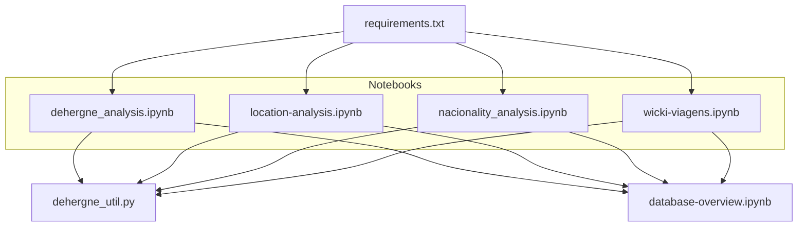
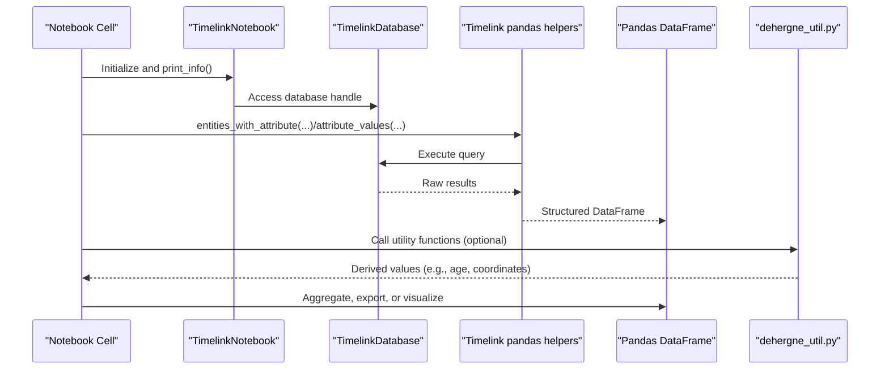
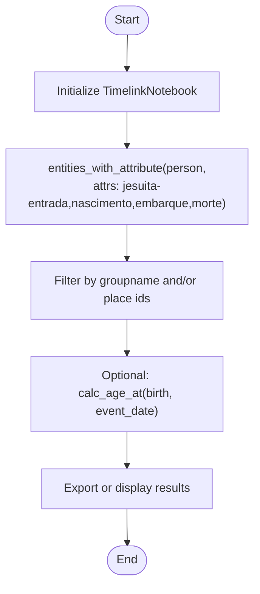
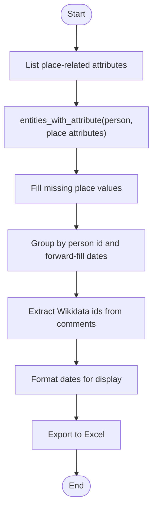
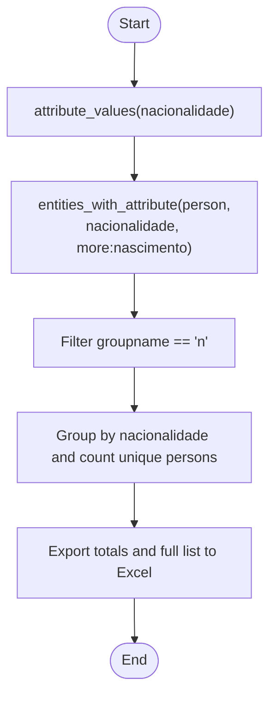
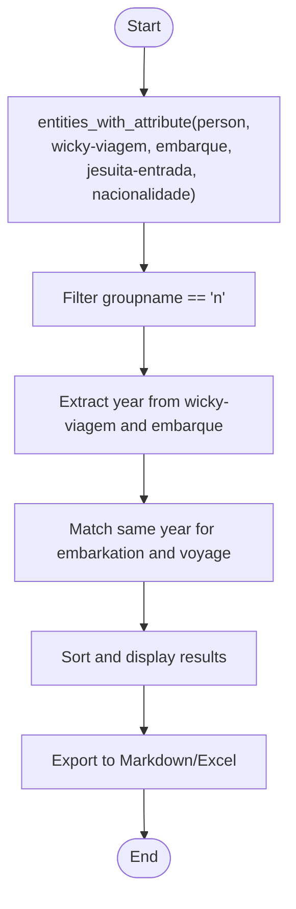
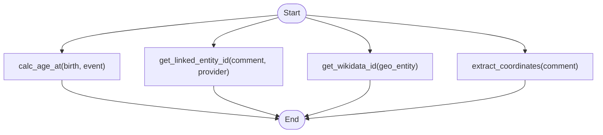
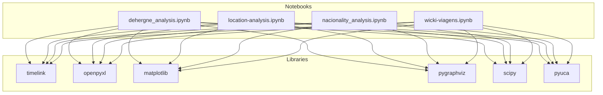

# Analysis Tools

<cite>
**Referenced Files in This Document**
- [dehergne_analysis.ipynb](file://notebooks/dehergne_analysis.ipynb)
- [location-analysis.ipynb](file://notebooks/location-analysis.ipynb)
- [nacionality_analysis.ipynb](file://notebooks/nacionality_analysis.ipynb)
- [wicki-viagens.ipynb](file://notebooks/wicki-viagens.ipynb)
- [dehergne_util.py](file://notebooks/dehergne_util.py)
- [database-overview.ipynb](file://notebooks/database-overview.ipynb)
- [README.md](file://notebooks/README.md)
- [requirements.txt](file://notebooks/requirements.txt)
</cite>

## Table of Contents
1. [Introduction](#introduction)
2. [Project Structure](#project-structure)
3. [Core Components](#core-components)
4. [Architecture Overview](#architecture-overview)
5. [Detailed Component Analysis](#detailed-component-analysis)
6. [Dependency Analysis](#dependency-analysis)
7. [Performance Considerations](#performance-considerations)
8. [Troubleshooting Guide](#troubleshooting-guide)
9. [Conclusion](#conclusion)
10. [Appendices](#appendices)

## Introduction
This document describes the analysis tools used to explore and visualize the dehergne dataset within the Jupyter notebook ecosystem. It focuses on four key notebooks:
- Biographical summaries: dehergne_analysis.ipynb
- Spatial patterns: location-analysis.ipynb
- Demographic breakdowns: nacionality_analysis.ipynb
- Voyage network reconstruction: wicki-viagens.ipynb

These notebooks connect to a Timelink-managed database, query entities and attributes, aggregate results with Pandas, and produce visualizations and reports. Utility functions in dehergne_util.py support common tasks such as age calculations and coordinate extraction.

## Project Structure
The analysis tools live under notebooks/, with each notebook dedicated to a specific analytical theme. They rely on:
- TimelinkNotebook to manage the database connection and metadata
- Timelink’s pandas helpers to query entities and attributes efficiently
- Pandas for aggregation and data manipulation
- Matplotlib and related libraries for visualization
- Utility modules for specialized parsing and computation

**Diagram sources**
- [dehergne_analysis.ipynb](file://notebooks/dehergne_analysis.ipynb#L1-L120)
- [location-analysis.ipynb](file://notebooks/location-analysis.ipynb#L1-L120)
- [nacionality_analysis.ipynb](file://notebooks/nacionality_analysis.ipynb#L1-L120)
- [wicki-viagens.ipynb](file://notebooks/wicki-viagens.ipynb#L1-L120)
- [dehergne_util.py](file://notebooks/dehergne_util.py#L1-L152)
- [requirements.txt](file://notebooks/requirements.txt#L1-L9)
- [database-overview.ipynb](file://notebooks/database-overview.ipynb#L1-L120)

**Section sources**
- [README.md](file://notebooks/README.md#L1-L19)
- [requirements.txt](file://notebooks/requirements.txt#L1-L9)

## Core Components
- TimelinkNotebook: Initializes and manages the database connection, prints status, and exposes the database handle for queries.
- Timelink pandas helpers: Provide efficient entity and attribute queries, returning structured DataFrames for downstream analysis.
- Pandas: Used extensively for filtering, grouping, sorting, and exporting results.
- Matplotlib and visualization libraries: Render charts and maps where applicable.
- dehergne_util.py: Supplies utility functions for age computations, extracting linked entity identifiers, and parsing coordinates from comments.

Practical usage patterns:
- Load data with entities_with_attribute and attribute_values
- Filter by groupname to exclude referents or family members
- Infer missing dates by forward-fill grouped by person id
- Export to Excel for further analysis or sharing
- Use utility functions for derived metrics and geolocation

**Section sources**
- [dehergne_analysis.ipynb](file://notebooks/dehergne_analysis.ipynb#L1-L120)
- [location-analysis.ipynb](file://notebooks/location-analysis.ipynb#L1-L120)
- [nacionality_analysis.ipynb](file://notebooks/nacionality_analysis.ipynb#L1-L120)
- [wicki-viagens.ipynb](file://notebooks/wicki-viagens.ipynb#L1-L120)
- [dehergne_util.py](file://notebooks/dehergne_util.py#L1-L152)

## Architecture Overview
The notebooks follow a consistent pipeline:
- Initialize TimelinkNotebook
- Query the database using Timelink’s pandas helpers
- Transform and aggregate with Pandas
- Export or visualize results
- Use dehergne_util for specialized computations

**Diagram sources**
- [dehergne_analysis.ipynb](file://notebooks/dehergne_analysis.ipynb#L1-L120)
- [location-analysis.ipynb](file://notebooks/location-analysis.ipynb#L1-L120)
- [nacionality_analysis.ipynb](file://notebooks/nacionality_analysis.ipynb#L1-L120)
- [wicki-viagens.ipynb](file://notebooks/wicki-viagens.ipynb#L1-L120)
- [dehergne_util.py](file://notebooks/dehergne_util.py#L1-L152)

## Detailed Component Analysis

### Biographical Summaries Notebook (dehergne_analysis.ipynb)
Purpose:
- Explore biographical attributes such as birthplace, entry place, departure, arrival, stay, ordination, death, and date ranges.
- Filter by place of entry and compute derived metrics.

Key steps:
- Initialize TimelinkNotebook and inspect database status
- Query persons with attributes like jesuita-entrada, nascimento, embarque, morte
- Optionally filter by place of entry ids
- Compute ages at specific events using calc_age_at
- Export filtered sets for further analysis

Common usage patterns:
- Use entities_with_attribute with show_elements and more_attributes to collect multiple related attributes
- Filter groupname to keep only primary individuals
- Use calc_age_at to derive chronological insights

Practical example paths:
- [Initialize and print info](file://notebooks/dehergne_analysis.ipynb#L31-L76)
- [Query persons with attributes](file://notebooks/dehergne_analysis.ipynb#L703-L721)
- [Compute ages with calc_age_at](file://notebooks/dehergne_analysis.ipynb#L703-L721)
- [Filter by place of entry ids](file://notebooks/dehergne_analysis.ipynb#L711-L719)

**Diagram sources**
- [dehergne_analysis.ipynb](file://notebooks/dehergne_analysis.ipynb#L31-L120)
- [dehergne_util.py](file://notebooks/dehergne_util.py#L12-L29)

**Section sources**
- [dehergne_analysis.ipynb](file://notebooks/dehergne_analysis.ipynb#L1-L200)
- [dehergne_util.py](file://notebooks/dehergne_util.py#L1-L61)

### Spatial Patterns Notebook (location-analysis.ipynb)
Purpose:
- Collect all places mentioned in biographies and enrich them with Wikidata identifiers and formatted dates.
- Infer missing dates when possible and export to Excel.

Key steps:
- Define attribute types that carry place names
- Query persons with those attributes
- Fill missing place values and infer dates using forward-fill grouped by person id
- Extract Wikidata ids from comments
- Format dates for readability
- Export to Excel for manual curation or LLM reasoning

Practical example paths:
- [Define place-related attributes](file://notebooks/location-analysis.ipynb#L109-L114)
- [Query places and infer dates](file://notebooks/location-analysis.ipynb#L507-L548)
- [Extract Wikidata ids](file://notebooks/location-analysis.ipynb#L549-L551)
- [Format dates](file://notebooks/location-analysis.ipynb#L552-L552)
- [Save to Excel](file://notebooks/location-analysis.ipynb#L577-L580)

**Diagram sources**
- [location-analysis.ipynb](file://notebooks/location-analysis.ipynb#L109-L120)
- [location-analysis.ipynb](file://notebooks/location-analysis.ipynb#L507-L560)
- [dehergne_util.py](file://notebooks/dehergne_util.py#L31-L61)

**Section sources**
- [location-analysis.ipynb](file://notebooks/location-analysis.ipynb#L1-L200)
- [dehergne_util.py](file://notebooks/dehergne_util.py#L31-L61)

### Demographic Breakdown Notebook (nacionality_analysis.ipynb)
Purpose:
- Analyze nationality distributions and export lists of individuals with nationality attributes.

Key steps:
- Query attribute values for nacionalidade to get totals
- Query persons with nacionalidade and optionally nascimento
- Filter to primary individuals (groupname == 'n')
- Group by nationality and count unique individuals
- Export to Excel for reporting

Practical example paths:
- [Get totals for nacionalidade](file://notebooks/nacionality_analysis.ipynb#L318-L325)
- [Query persons with nacionalidade and nascimento](file://notebooks/nacionality_analysis.ipynb#L405-L412)
- [Filter and info](file://notebooks/nacionality_analysis.ipynb#L413-L415)
- [Group by nationality and export](file://notebooks/nacionality_analysis.ipynb#L639-L651)

**Diagram sources**
- [nacionality_analysis.ipynb](file://notebooks/nacionality_analysis.ipynb#L318-L325)
- [nacionality_analysis.ipynb](file://notebooks/nacionality_analysis.ipynb#L405-L415)
- [nacionality_analysis.ipynb](file://notebooks/nacionality_analysis.ipynb#L639-L651)

**Section sources**
- [nacionality_analysis.ipynb](file://notebooks/nacionality_analysis.ipynb#L1-L200)

### Voyage Network Reconstruction Notebook (wicki-viagens.ipynb)
Purpose:
- Reconstruct voyages using the wicky-viagem attribute and related embarkation and entry data.
- Compare embarkation dates with voyage year to identify travelers on the same armada.

Key steps:
- Query persons with wicky-viagem and related attributes (embarque, jesuita-entrada, nacionalidade)
- Filter to primary individuals (groupname == 'n')
- Extract year components from dates and compare embarkation year with voyage year
- Display and export results for a given voyage number

Practical example paths:
- [Query travelers for a specific voyage](file://notebooks/wicki-viagens.ipynb#L141-L149)
- [Filter and compute year fields](file://notebooks/wicki-viagens.ipynb#L153-L158)
- [Display and export](file://notebooks/wicki-viagens.ipynb#L534-L575)

**Diagram sources**
- [wicki-viagens.ipynb](file://notebooks/wicki-viagens.ipynb#L141-L158)
- [wicki-viagens.ipynb](file://notebooks/wicki-viagens.ipynb#L534-L575)

**Section sources**
- [wicki-viagens.ipynb](file://notebooks/wicki-viagens.ipynb#L1-L200)

### Utility Functions (dehergne_util.py)
Purpose:
- Provide reusable helpers for age calculation, linked entity id extraction, and coordinate parsing.

Functions:
- calc_age_at(date_birth, today): Computes integer age from two dates
- get_linked_entity_id(comment_string, provider, if_missing): Extracts provider id from comment
- get_wikidata_id(geo_entity, if_missing): Extracts Wikidata id from geoentity extra_info
- extract_coordinates(comment): Parses multiple coordinate formats into (lat, lon)

Practical example paths:
- [Age calculation](file://notebooks/dehergne_util.py#L12-L29)
- [Linked entity id extraction](file://notebooks/dehergne_util.py#L31-L61)
- [Wikidata id extraction from geoentity](file://notebooks/dehergne_util.py#L63-L82)
- [Coordinate extraction](file://notebooks/dehergne_util.py#L85-L152)

**Diagram sources**
- [dehergne_util.py](file://notebooks/dehergne_util.py#L12-L152)

**Section sources**
- [dehergne_util.py](file://notebooks/dehergne_util.py#L1-L152)

## Dependency Analysis
External dependencies and their roles:
- timelink: Database abstraction and pandas helpers for querying
- openpyxl: Excel export/import
- matplotlib: Visualization
- pygraphviz, scipy, pyuca: Additional visualization and sorting utilities

**Diagram sources**
- [requirements.txt](file://notebooks/requirements.txt#L1-L9)
- [dehergne_analysis.ipynb](file://notebooks/dehergne_analysis.ipynb#L1-L120)
- [location-analysis.ipynb](file://notebooks/location-analysis.ipynb#L1-L120)
- [nacionality_analysis.ipynb](file://notebooks/nacionality_analysis.ipynb#L1-L120)
- [wicki-viagens.ipynb](file://notebooks/wicki-viagens.ipynb#L1-L120)

**Section sources**
- [requirements.txt](file://notebooks/requirements.txt#L1-L9)

## Performance Considerations
- Use Timelink’s pandas helpers to minimize ad-hoc SQL and leverage optimized queries.
- Limit result sets early with filters (e.g., groupname, place ids) to reduce memory usage.
- Forward-fill inferred dates grouped by person id to avoid repeated scans.
- Export to Excel in batches if datasets grow large.
- Prefer vectorized operations in Pandas (e.g., apply functions over columns) rather than row-wise loops.
- Cache intermediate DataFrames when iterating across multiple analyses.

[No sources needed since this section provides general guidance]

## Troubleshooting Guide
Common issues and strategies:
- Database connectivity: Ensure Docker is running and TimelinkNotebook initializes without errors. Use print_info to verify URLs and credentials.
- Missing or partial data: Many dates and places may be inferred or unknown; use forward-fill and filtering to handle gaps.
- Date formatting: Use Timelink utilities to normalize and format dates consistently.
- Export failures: Verify openpyxl installation and write permissions for target directories.
- Large exports: Consider chunking or saving subsets to avoid memory pressure.

**Section sources**
- [database-overview.ipynb](file://notebooks/database-overview.ipynb#L1-L120)
- [README.md](file://notebooks/README.md#L1-L19)

## Conclusion
The dehergne analysis notebooks provide a robust foundation for exploring biographical, spatial, demographic, and voyage-related aspects of the dataset. By leveraging Timelink’s database abstraction, Pandas for aggregation, and specialized utilities, researchers can efficiently transform raw historical records into insightful visualizations and reports. Extending these notebooks involves adding new queries, applying additional filters, and integrating new visualization libraries as needed.

[No sources needed since this section summarizes without analyzing specific files]

## Appendices

### Practical Example Paths
- Initialize and connect to database
  - [TimelinkNotebook initialization](file://notebooks/dehergne_analysis.ipynb#L31-L76)
  - [Database overview notebook](file://notebooks/database-overview.ipynb#L54-L81)
- Compute nationality distribution
  - [Totals and counts](file://notebooks/nacionality_analysis.ipynb#L318-L325)
  - [Group by nationality](file://notebooks/nacionality_analysis.ipynb#L639-L641)
- Map Jesuit movements over time
  - [Place collection and inference](file://notebooks/location-analysis.ipynb#L507-L548)
  - [Export for curation](file://notebooks/location-analysis.ipynb#L577-L580)
- Voyage network reconstruction
  - [Query and filter by voyage/year](file://notebooks/wicki-viagens.ipynb#L141-L158)
  - [Display results](file://notebooks/wicki-viagens.ipynb#L534-L575)

[No sources needed since this section aggregates previously cited paths]