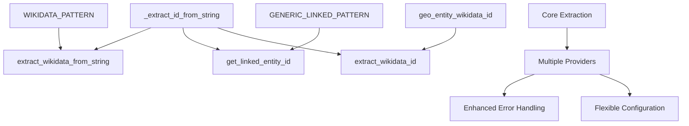

# Analysis Utilities

<cite>
**Referenced Files in This Document**
- [dehergne_util.py](file://notebooks/dehergne_util.py)
- [dehergne_analysis.ipynb](file://notebooks/dehergne_analysis.ipynb)
- [location-analysis.ipynb](file://notebooks/location-analysis.ipynb)
- [location-analysis-new.ipynb](file://notebooks/location-analysis-new.ipynb)
- [location-analysis-cleaned.ipynb](file://notebooks/location-analysis-cleaned.ipynb)
- [jesuit-entry.ipynb](file://notebooks/jesuit-entry.ipynb)
- [wikidata-linked-data.ipynb](file://notebooks/wikidata-linked-data.ipynb)
- [dehergne-locations-nodate.ipynb](file://notebooks/dehergne-locations-nodate.ipynb)
</cite>

## Update Summary
**Changes Made**
- Enhanced linked data extraction system with new generic `get_linked_entity_id` function
- Improved Wikidata extraction capabilities with dedicated functions
- Added `extract_wikidata_from_string` for string-based Wikidata ID extraction
- Added `geo_entity_wikidata_id` for processing geographic entity Wikidata links
- Updated `extract_wikidata_id` with enhanced dictionary-based extraction
- Modernized the linked data extraction infrastructure with better error handling

## Table of Contents
1. [Introduction](#introduction)
2. [Core Utility Functions](#core-utility-functions)
3. [Detailed Function Analysis](#detailed-function-analysis)
4. [Enhanced Linked Data Extraction System](#enhanced-linked-data-extraction-system)
5. [Integration with Analysis Notebooks](#integration-with-analysis-notebooks)
6. [Error Handling and Common Issues](#error-handling-and-common-issues)
7. [Performance Considerations](#performance-considerations)
8. [Best Practices and Extensions](#best-practices-and-extensions)
9. [Conclusion](#conclusion)

## Introduction
The `dehergne_util.py` module provides a comprehensive collection of utility functions designed to support data processing and enrichment in the analysis of historical Jesuit records. These utilities serve as the foundation for the enhanced linked data extraction system, enabling researchers to extract meaningful information from complex textual data, compute temporal relationships, and link entities to external knowledge bases. The module has been significantly enhanced with a new generic linked data extraction framework that supports multiple providers beyond Wikidata, while maintaining backward compatibility and improving error handling capabilities.

**Section sources**
- [dehergne_util.py:1-208](file://notebooks/dehergne_util.py#L1-L208)

## Core Utility Functions
The `dehergne_util.py` module contains six primary utility functions that address key data processing challenges in the analysis of historical records: `calc_age_at` for temporal calculations, `get_linked_entity_id` for extracting identifiers from structured comments, `extract_wikidata_from_string` for parsing Wikidata IDs from any text, `extract_wikidata_id` for extracting Wikidata IDs from structured dictionaries, `geo_entity_wikidata_id` for processing geographic entity links, and `extract_coordinates` for geolocation data extraction. These functions work together to transform unstructured textual data into structured, analyzable information with robust error handling and flexible configuration options.

**Section sources**
- [dehergne_util.py:12-208](file://notebooks/dehergne_util.py#L12-L208)

## Detailed Function Analysis

### calc_age_at Function
The `calc_age_at` function computes the number of years between two dates, primarily used to calculate the age of Jesuits at significant life events such as entry into the order, ordination, or death. The function accepts two date parameters and returns the integer difference in years. It first checks for `None` values and returns `None` if either date is missing. The function leverages the `timelink.kleio.utilities.convert_timelink_date` utility to convert Timelink date strings into Python `datetime` objects, ensuring compatibility with the project's date formatting conventions. The age calculation uses a 365.25-day year to account for leap years, providing a more accurate approximation than a simple 365-day calculation. This function is critical for demographic analysis, enabling researchers to study patterns in the ages of Jesuits at various career milestones.

**Section sources**
- [dehergne_util.py:12-28](file://notebooks/dehergne_util.py#L12-L28)
- [dehergne_analysis.ipynb](file://notebooks/dehergne_analysis.ipynb#L704)
- [jesuit-entry.ipynb](file://notebooks/jesuit-entry.ipynb#L4332)

### get_linked_entity_id Function
**Updated** Enhanced with new generic linked data extraction system

The `get_linked_entity_id` function provides a generic interface for extracting identifiers from structured comments that follow the pattern `@<provider>: <id>`, where `<provider>` is the name of a linked data provider (e.g., 'wikidata', 'geonames', 'viaf') and `<id>` is the identifier of the linked entity. This function uses a template-based approach with `GENERIC_LINKED_PATTERN` to dynamically generate regular expressions for different providers. The function accepts three parameters: the comment string, the linked data provider name, and an optional value to return if no link is found (defaulting to `None`). It handles `None` input gracefully and uses `re.escape()` to safely incorporate the provider name into the regular expression pattern. This utility enables flexible linking to multiple external knowledge bases beyond Wikidata, making it a cornerstone of the enhanced linked data extraction system.

**Section sources**
- [dehergne_util.py:52-78](file://notebooks/dehergne_util.py#L52-L78)
- [jesuit-entry.ipynb:799-802](file://notebooks/jesuit-entry.ipynb#L799-L802)

### extract_wikidata_from_string Function
**New** Dedicated Wikidata extraction from any text

The `extract_wikidata_from_string` function provides a focused interface for extracting Wikidata IDs from any text string. It uses the `_extract_id_from_string` core function with the `WIKIDATA_PATTERN` to identify Wikidata identifiers in the format `@wikidata: Q1234567` or `wikidata: Q1234567`. The function accepts an optional `if_missing` parameter that determines the return value when no Wikidata ID is found. This function simplifies Wikidata extraction from unstructured text and serves as a building block for more complex extraction scenarios.

**Section sources**
- [dehergne_util.py:46-49](file://notebooks/dehergne_util.py#L46-L49)

### extract_wikidata_id Function
**Updated** Enhanced with improved dictionary-based extraction

The `extract_wikidata_id` function specifically targets Wikidata links within structured dictionaries, returning Wikidata IDs parsed from the `extra_info` field of entities. The function searches across multiple common key paths in the dictionary structure, including `("the_value", "comment")`, `("the_value", "original")`, `("name", "comment")`, `("name", "original")`, `("id", "comment")`, and `("id", "original")`. It uses the `_extract_id_from_string` core function with `WIKIDATA_PATTERN` and `re.IGNORECASE` flags to capture all matching Wikidata IDs. The function prioritizes IDs found in earlier paths but falls back to later ones, increasing the likelihood of successful ID extraction across different data entry formats. This enhanced approach replaces older hardcoded implementations and provides more robust extraction capabilities.

**Section sources**
- [dehergne_util.py:103-139](file://notebooks/dehergne_util.py#L103-L139)
- [location-analysis.ipynb](file://notebooks/location-analysis.ipynb#L286)
- [location-analysis-new.ipynb](file://notebooks/location-analysis-new.ipynb#L321)

### geo_entity_wikidata_id Function
**New** Geographic entity Wikidata processing

The `geo_entity_wikidata_id` function processes geographic entities to extract Wikidata IDs while cleaning the associated comment text. It takes a geographic entity object and an optional `if_missing` parameter, extracts the `extra_info` attribute, and builds cleaned comment text by removing Wikidata references from both the `name.comment` and `name.original` fields. The function returns a tuple containing the cleaned comment and the extracted Wikidata ID. This function streamlines the process of preparing geographic data for Wikidata enrichment and mapping workflows.

**Section sources**
- [dehergne_util.py:81-99](file://notebooks/dehergne_util.py#L81-L99)

### extract_coordinates Function
The `extract_coordinates` function parses various coordinate formats from text comments and returns a tuple of latitude and longitude values. It supports four coordinate formats: explicit coordinate tags with directional indicators (e.g., 'coordinates: 40.7128N, 74.0060W'), labeled decimal degrees (e.g., 'latitude: 40.7128, longitude: -74.0060'), signed decimal degrees (e.g., '40.7128, -74.0060'), and degrees-minutes-seconds (DMS) format (e.g., '40°42'51"N 74°00'21"W'). The function uses a series of regular expression patterns to identify and extract coordinate information, converting DMS format to decimal degrees using a nested helper function. For directional formats, it applies appropriate sign multipliers based on the hemisphere indicator (N/S for latitude, E/W for longitude). The function returns `None` if no recognizable coordinate pattern is found, and raises a `ValueError` only after exhausting all parsing attempts, providing clear error messages for debugging.

**Section sources**
- [dehergne_util.py:143-207](file://notebooks/dehergne_util.py#L143-L207)
- [residences.ipynb](file://notebooks/residences.ipynb#L4367)

## Enhanced Linked Data Extraction System
**Updated** The linked data extraction system has been significantly enhanced with a modular architecture that supports multiple providers and improved error handling. The new system centers around the `_extract_id_from_string` core function, which provides a single source of truth for all ID extraction operations. The `WIKIDATA_PATTERN` constant defines the Wikidata extraction pattern, while `GENERIC_LINKED_PATTERN` enables dynamic pattern generation for other providers. The `get_linked_entity_id` function demonstrates the generic approach by formatting patterns with provider-specific escape sequences. This architecture enables easy extension to new providers while maintaining consistency and reliability across the extraction pipeline.

**Diagram sources**
- [dehergne_util.py:38-139](file://notebooks/dehergne_util.py#L38-L139)

**Section sources**
- [dehergne_util.py:31-139](file://notebooks/dehergne_util.py#L31-L139)

## Integration with Analysis Notebooks
**Updated** The utility functions in `dehergne_util.py` are extensively used across multiple analysis notebooks, demonstrating their role as foundational components of the research workflow. The enhanced linked data extraction system is particularly evident in `jesuit-entry.ipynb`, where `get_linked_entity_id` is applied to extract Wikidata IDs from place of entry and birth comments, replacing older hardcoded implementations. The `location-analysis.ipynb` and `location-analysis-new.ipynb` notebooks leverage `extract_wikidata_id` for systematic extraction from hierarchical geographical entities, while `location-analysis-cleaned.ipynb` demonstrates the evolution from custom extraction functions to the standardized utility functions. The `wikidata-linked-data.ipynb` notebook utilizes the enhanced system for collecting and processing Wikidata entities across multiple CSV files.

**Section sources**
- [dehergne_analysis.ipynb:837-868](file://notebooks/dehergne_analysis.ipynb#L837-L868)
- [location-analysis.ipynb](file://notebooks/location-analysis.ipynb#L286)
- [location-analysis-new.ipynb](file://notebooks/location-analysis-new.ipynb#L321)
- [location-analysis-cleaned.ipynb](file://notebooks/location-analysis-cleaned.ipynb#L257)
- [jesuit-entry.ipynb:799-802](file://notebooks/jesuit-entry.ipynb#L799-L802)
- [wikidata-linked-data.ipynb:1-200](file://notebooks/wikidata-linked-data.ipynb#L1-L200)

## Error Handling and Common Issues
**Updated** The utility functions implement robust error handling strategies to manage the inherent inconsistencies and missing data common in historical records. All functions accept `None` values for input parameters and return appropriate default values, preventing cascading failures in data processing pipelines. The enhanced linked data extraction system includes multiple safety checks, with the `_extract_id_from_string` core function serving as a unified error handling mechanism. The `calc_age_at` function includes comprehensive validation for date conversions, while the coordinate extraction function employs a defensive programming approach with detailed error messages. The new `geo_entity_wikidata_id` function handles missing `extra_info` attributes gracefully and provides fallback mechanisms for comment cleaning. Common issues addressed include malformed date strings, missing linked data, ambiguous coordinate formats, and inconsistent dictionary structures across different data sources.

**Section sources**
- [dehergne_util.py:1-208](file://notebooks/dehergne_util.py#L1-L208)

## Performance Considerations
**Updated** When applying these utilities to large datasets, several performance considerations should be taken into account. The enhanced linked data extraction system optimizes performance through shared core functions and pattern compilation. The functions are designed for individual record processing and should be applied using vectorized operations (e.g., `pandas.DataFrame.apply()`) rather than explicit loops to maximize efficiency. The regular expression operations in `get_linked_entity_id` and `extract_wikidata_id` benefit from the shared `_extract_id_from_string` core function, reducing code duplication and improving maintainability. The new `extract_wikidata_from_string` function provides optimized extraction for simple string-based scenarios. For extremely large datasets, the enhanced system's modular architecture allows for selective optimization of frequently used extraction patterns. Memory usage remains minimal as the functions process one record at a time without maintaining large internal data structures.

**Section sources**
- [dehergne_util.py:1-208](file://notebooks/dehergne_util.py#L1-L208)

## Best Practices and Extensions
**Updated** Best practices for using and extending the `dehergne_util.py` module include maintaining consistent error handling patterns, leveraging the new generic extraction framework, and documenting new functions with comprehensive docstrings. The enhanced modular design encourages the creation of specialized parsers while maintaining consistency with the core extraction patterns. When extending the module with new parsing functions, developers should follow the established pattern of using the `_extract_id_from_string` core function and implementing appropriate default value handling. The generic linked data extraction system provides a template for adding support for new providers beyond Wikidata. Future extensions could include enhanced coordinate parsing capabilities, integration with additional linked data providers, or improved dictionary traversal algorithms. The use of type hints and comprehensive unit tests would further improve the module's reliability and maintainability.

**Section sources**
- [dehergne_util.py:1-208](file://notebooks/dehergne_util.py#L1-L208)

## Conclusion
**Updated** The analysis utilities provided in `dehergne_util.py` play a crucial role in transforming raw historical data into structured, analyzable information. The enhanced linked data extraction system represents a significant advancement in the module's capabilities, providing a flexible, extensible framework for extracting identifiers from multiple sources while maintaining backward compatibility. The new generic `get_linked_entity_id` function, dedicated Wikidata extraction functions, and improved dictionary-based extraction capabilities demonstrate thoughtful design principles, including robust error handling, graceful degradation with missing data, and clear separation of concerns. The modular architecture ensures that the utilities can be extended and adapted to meet emerging research needs while maintaining the integrity of existing analyses. As the project evolves, these utilities can serve as a foundation for more sophisticated data processing pipelines, potentially incorporating machine learning techniques for entity recognition or natural language processing for semantic analysis.