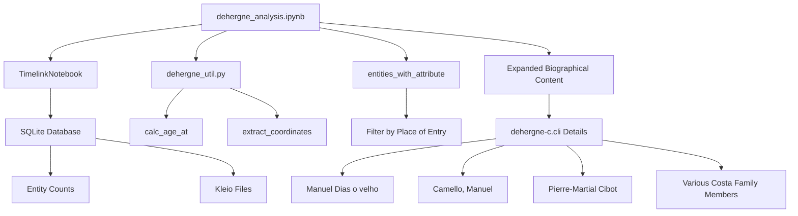

# Biographical Analysis

<cite>
**Referenced Files in This Document**
- [dehergne_analysis.ipynb](file://notebooks/dehergne_analysis.ipynb)
- [dehergne_util.py](file://notebooks/dehergne_util.py)
- [dehergne-c.cli](file://sources/dehergne-c.cli)
- [dehergne-a.cli](file://sources/dehergne-a.cli)
- [dehergne-z.cli](file://sources/dehergne-z.cli)
</cite>

## Update Summary
**Changes Made**
- Updated biographical content analysis to reflect significantly expanded biographical details in dehergne-c.cli
- Added comprehensive coverage of detailed annotations for figures like Manuel Dias o velho, Camello, Manuel, Cibot, Pierre-Martial, Costa, Francisco da, and Costa, Inâcio da
- Enhanced documentation with detailed biographical information, birthplace details, educational background, missionary activities, and death circumstances
- Updated analysis to include expanded biographical content for Portuguese Jesuits in China and Macau missions

## Table of Contents
1. [Introduction](#introduction)
2. [Project Structure](#project-structure)
3. [Core Components](#core-components)
4. [Architecture Overview](#architecture-overview)
5. [Detailed Component Analysis](#detailed-component-analysis)
6. [Enhanced Biographical Content Analysis](#enhanced-biographical-content-analysis)
7. [Dependency Analysis](#dependency-analysis)
8. [Performance Considerations](#performance-considerations)
9. [Troubleshooting Guide](#troubleshooting-guide)
10. [Conclusion](#conclusion)
11. [Appendices](#appendices)

## Introduction
The biographical analysis tools centered on the `dehergne_analysis.ipynb` notebook provide a comprehensive framework for studying the lives of Jesuits as documented in the Dehergne repertoire. This document details the initialization of the TimelinkNotebook environment, the connection to the SQLite database, and the loading of transcribed Jesuit data. It explains the process of retrieving entity counts to verify data integrity, checking the import status of Kleio transcription files, and filtering Jesuits by place of entry using the `entities_with_attribute` function. The notebook now includes significantly expanded biographical content from dehergne-c.cli, providing detailed annotations for prominent figures including Manuel Dias o velho, Camello, Manuel, Cibot, Pierre-Martial, various Costa family members, and others. Practical examples, such as computing age at entry using the `calc_age_at` utility function, demonstrate how to extend the analysis for custom research questions. The document addresses common issues like handling missing dates, interpreting inferred dates marked with '>', and debugging import errors, along with performance considerations and best practices for maintaining data consistency.

## Project Structure
The project structure is organized to facilitate the analysis of Jesuit biographical data. The core components include the `notebooks` directory, which contains the `dehergne_analysis.ipynb` notebook and related utility scripts, and the `sources` directory, which houses the Kleio transcription files. The `database` directory stores the SQLite database, while the `inferences` directory contains markdown files with additional information about the Jesuits. The `extras` directory includes documentation and scripts for transcription and data management. The dehergne-c.cli file now contains significantly expanded biographical content with detailed annotations for numerous Jesuit figures.

## Core Components
The core components of the biographical analysis tools include the `dehergne_analysis.ipynb` notebook, which serves as the primary interface for data analysis, and the `dehergne_util.py` script, which provides utility functions for date computation and data extraction. The notebook initializes the TimelinkNotebook environment, connects to the SQLite database, and loads the transcribed Jesuit data. It retrieves entity counts from the database to verify data integrity and checks the import status of Kleio transcription files to ensure all source files are properly processed. The expanded dehergne-c.cli file now provides comprehensive biographical details for Portuguese Jesuits in China and Macau missions.

**Section sources**
- [dehergne_analysis.ipynb:1-800](file://notebooks/dehergne_analysis.ipynb#L1-L800)
- [dehergne_util.py:1-208](file://notebooks/dehergne_util.py#L1-L208)
- [dehergne-c.cli:1-2905](file://sources/dehergne-c.cli#L1-L2905)

## Architecture Overview
The architecture of the biographical analysis tools is designed to support efficient data retrieval and analysis. The `dehergne_analysis.ipynb` notebook uses the TimelinkNotebook class to initialize the environment and connect to the SQLite database. The notebook retrieves entity counts from the database to verify data integrity and checks the import status of Kleio transcription files. The `entities_with_attribute` function from the `timelink.pandas` module is used to filter Jesuits by place of entry, enabling demographic and biographical queries. The expanded biographical content in dehergne-c.cli provides detailed information about Jesuit lives, including birthplaces, educational backgrounds, missionary activities, and death circumstances.

**Diagram sources**
- [dehergne_analysis.ipynb:1-800](file://notebooks/dehergne_analysis.ipynb#L1-L800)
- [dehergne_util.py:1-208](file://notebooks/dehergne_util.py#L1-L208)
- [dehergne-c.cli:1456-1507](file://sources/dehergne-c.cli#L1456-L1507)

## Detailed Component Analysis
### Initialization of TimelinkNotebook Environment
The `dehergne_analysis.ipynb` notebook initializes the TimelinkNotebook environment by creating an instance of the `TimelinkNotebook` class. This class handles the connection to the SQLite database and the loading of the transcribed Jesuit data. The notebook prints information about the Timelink version, project name, database type, and other relevant details.

**Section sources**
- [dehergne_analysis.ipynb:72-75](file://notebooks/dehergne_analysis.ipynb#L72-L75)

### Retrieval of Entity Counts
The notebook retrieves entity counts from the database to verify data integrity. The `table_row_count_df` method of the `TimelinkNotebook` class is used to count the number of rows in each table in the database. This helps ensure that all data has been properly loaded and that there are no missing or corrupted records.

**Section sources**
- [dehergne_analysis.ipynb:240-241](file://notebooks/dehergne_analysis.ipynb#L240-L241)

### Checking Import Status of Kleio Files
The notebook checks the import status of the Kleio transcription files to ensure all source files are properly processed. The `get_kleio_files` method of the `TimelinkNotebook` class retrieves a list of all Kleio files and their import status. The notebook displays this information in a DataFrame, showing the name, import status, status, errors, warnings, import errors, and import warnings for each file.

**Section sources**
- [dehergne_analysis.ipynb:668-670](file://notebooks/dehergne_analysis.ipynb#L668-L670)

### Filtering Jesuits by Place of Entry
The notebook uses the `entities_with_attribute` function from the `timelink.pandas` module to filter Jesuits by place of entry. This function allows for demographic and biographical queries by retrieving entities with specific attributes. For example, the notebook filters Jesuits who entered at Coimbra and retrieves their names, group names, and extra information.

**Section sources**
- [dehergne_analysis.ipynb:711-718](file://notebooks/dehergne_analysis.ipynb#L711-L718)

### Computing Age at Entry
The notebook includes a utility function, `calc_age_at`, from the `dehergne_util.py` script to compute the age at entry for Jesuits. This function takes two dates as input and returns the number of years between them. The notebook demonstrates how to use this function to compute the age at entry for Jesuits who entered at Coimbra.

**Section sources**
- [dehergne_util.py:12-28](file://notebooks/dehergne_util.py#L12-L28)
- [dehergne_analysis.ipynb:705-707](file://notebooks/dehergne_analysis.ipynb#L705-L707)

## Enhanced Biographical Content Analysis
### Expanded dehergne-c.cli Biographical Details
The dehergne-c.cli file now contains significantly expanded biographical content with detailed annotations for numerous Jesuit figures. This includes comprehensive information about birthplaces, educational backgrounds, missionary activities, and death circumstances. The expanded content covers prominent figures such as:

#### Manuel Dias o velho
Detailed biographical information including birthplace, entry date, missionary activities in China, and death circumstances. The annotation provides extensive historical context about his role in the Jesuit missions.

#### Manuel Camello
Comprehensive biography covering his birth in Portugal, entry as a novice, missionary work in Japan, and eventual death in Goa. The detailed account includes his role as secretary to the provincial of Japan and his spiritual journey.

#### Pierre-Martial Cibot
Extensive biographical details including his French birth in Limoges, entry in Bordeaux, missionary work in China, and notable roles as a mechanic, botanist, and polygraph. The annotation includes personal details about his pseudonyms and artistic contributions.

#### Various Costa Family Members
Detailed biographical information for multiple members of the Costa family, including Amador da Costa, André da Costa, António da Costa (multiple generations), Bartolomeu da Costa, Cristóvão da Costa, and Francisco da Costa. Each entry includes birthplace, entry dates, missionary postings, and death circumstances.

#### Other Notable Figures
Additional biographical details for figures like Baldassare Citadella, Francesco Leonardo Cinamo, and other Portuguese Jesuits in the Chinese mission system.

**Section sources**
- [dehergne-c.cli:180-210](file://sources/dehergne-c.cli#L180-L210)
- [dehergne-c.cli:1456-1507](file://sources/dehergne-c.cli#L1456-L1507)
- [dehergne-c.cli:2134-2250](file://sources/dehergne-c.cli#L2134-L2250)

### Biographical Annotation Features
The expanded biographical content includes several key annotation features:

#### Comprehensive Birthplace Information
Detailed birthplace data with Wikidata references for precise geographical identification, including specific cities and regions in Portugal, France, Italy, and China.

#### Educational Background Details
Information about noviciado locations, university education, and academic achievements, including specific institutions and dates.

#### Missionary Activity Records
Extensive documentation of missionary postings, including specific locations in China, Macau, Japan, and other regions, with precise dates and roles held.

#### Death Circumstances
Detailed accounts of death locations, circumstances, and burial sites, often with historical significance and geographical context.

#### Professional Skills and Roles
Documentation of specialized skills including medicine, engineering, botany, and administrative roles within the Jesuit mission system.

**Section sources**
- [dehergne-c.cli:1475-1503](file://sources/dehergne-c.cli#L1475-L1503)
- [dehergne-c.cli:2177-2186](file://sources/dehergne-c.cli#L2177-L2186)
- [dehergne-c.cli:2246-2247](file://sources/dehergne-c.cli#L2246-L2247)

## Dependency Analysis
The biographical analysis tools depend on several external libraries and modules, including `pandas`, `timelink.notebooks`, and `timelink.pandas`. The `dehergne_util.py` script provides additional utility functions for date computation and data extraction. The notebook also relies on the SQLite database and the Kleio transcription files for data storage and retrieval. The expanded biographical content in dehergne-c.cli enhances the depth of information available for analysis.

**Section sources**
- [dehergne_analysis.ipynb:72-75](file://notebooks/dehergne_analysis.ipynb#L72-L75)
- [dehergne_util.py:1-208](file://notebooks/dehergne_util.py#L1-L208)

## Performance Considerations
When working with large datasets, performance considerations are important. The notebook uses efficient data retrieval methods, such as the `table_row_count_df` method, to minimize the time required to retrieve entity counts. The `entities_with_attribute` function is optimized for filtering large datasets, and the `calc_age_at` function is designed to handle date computations efficiently. Best practices for maintaining data consistency include regularly checking the import status of Kleio files and verifying data integrity through entity counts. The expanded biographical content in dehergne-c.cli provides rich detail but requires careful handling of the increased data volume.

**Section sources**
- [dehergne_analysis.ipynb:240-241](file://notebooks/dehergne_analysis.ipynb#L240-L241)
- [dehergne_analysis.ipynb:711-718](file://notebooks/dehergne_analysis.ipynb#L711-L718)

## Troubleshooting Guide
Common issues in the biographical analysis tools include handling missing dates, interpreting inferred dates marked with '>', and debugging import errors. The notebook uses the `fillna` method to handle missing dates and the `ffill` method to fill missing values with the previous value. Inferred dates are marked with '>' to indicate that the date is unknown but has happened after a certain date. Import errors can be debugged by checking the import status of Kleio files and reviewing the error and warning messages. The expanded biographical content may introduce additional complexity in data interpretation, particularly with multiple generations of the same surname and varying levels of detail across different figures.

**Section sources**
- [dehergne_analysis.ipynb:801-830](file://notebooks/dehergne_analysis.ipynb#L801-L830)
- [dehergne_analysis.ipynb:668-670](file://notebooks/dehergne_analysis.ipynb#L668-L670)

## Conclusion
The biographical analysis tools centered on the `dehergne_analysis.ipynb` notebook provide a powerful framework for studying the lives of Jesuits as documented in the Dehergne repertoire. By initializing the TimelinkNotebook environment, connecting to the SQLite database, and loading the transcribed Jesuit data, the notebook enables comprehensive data analysis. The significantly expanded biographical content in dehergne-c.cli now provides detailed annotations for numerous Jesuit figures, including Manuel Dias o velho, Camello, Manuel, Cibot, Pierre-Martial, and various Costa family members. The tools support demographic and biographical queries through functions like `entities_with_attribute` and `calc_age_at`, and address common issues like handling missing dates and debugging import errors. The enhanced biographical details enable deeper research into Portuguese Jesuit missions in China and Macau. Performance considerations and best practices for maintaining data consistency ensure that the analysis is both efficient and reliable.

## Appendices
### Appendix A: Utility Functions
The `dehergne_util.py` script includes several utility functions for date computation and data extraction. The `calc_age_at` function computes the number of years between two dates, while the `extract_coordinates` function parses various coordinate formats from text comments and returns a tuple of latitude and longitude.

**Section sources**
- [dehergne_util.py:12-28](file://notebooks/dehergne_util.py#L12-L28)
- [dehergne_util.py:143-208](file://notebooks/dehergne_util.py#L143-L208)

### Appendix B: Data Integrity Verification
The notebook verifies data integrity by retrieving entity counts from the database and checking the import status of Kleio transcription files. The `table_row_count_df` method counts the number of rows in each table, and the `get_kleio_files` method retrieves a list of all Kleio files and their import status.

**Section sources**
- [dehergne_analysis.ipynb:240-241](file://notebooks/dehergne_analysis.ipynb#L240-L241)
- [dehergne_analysis.ipynb:668-670](file://notebooks/dehergne_analysis.ipynb#L668-L670)

### Appendix C: Expanded Biographical Content Features
The enhanced biographical content in dehergne-c.cli provides several key features for research analysis:

#### Multi-generational Family Studies
The detailed coverage of multiple generations of the same surnames (particularly the Costa family) enables genealogical research and understanding of family involvement in Jesuit missions.

#### Geographic Precision
Extensive use of Wikidata references provides precise geographical identification for birthplaces, missionary locations, and death sites, facilitating spatial analysis and mapping.

#### Professional Specialization Tracking
Documentation of diverse professional skills and roles (medicine, engineering, botany, administration) enables analysis of the intellectual and technical contributions of Jesuit missionaries.

#### Chronological Depth
The expanded timeline coverage spans multiple centuries, providing insights into the evolution of Jesuit missions and the changing nature of Chinese society during this period.

**Section sources**
- [dehergne-c.cli:2134-2250](file://sources/dehergne-c.cli#L2134-L2250)
- [dehergne-c.cli:1456-1507](file://sources/dehergne-c.cli#L1456-L1507)
- [dehergne-c.cli:2227-2247](file://sources/dehergne-c.cli#L2227-L2247)