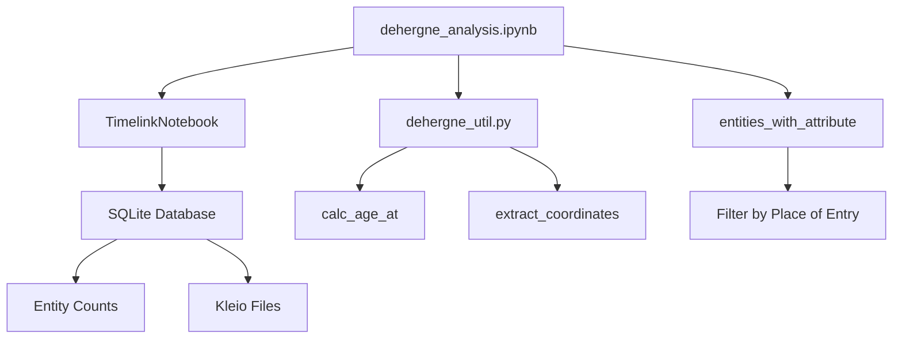

# Biographical Analysis

<cite>
**Referenced Files in This Document**   
- [dehergne_analysis.ipynb](file://notebooks/dehergne_analysis.ipynb)
- [dehergne_util.py](file://notebooks/dehergne_util.py)
- [dehergne-a.cli](file://sources/dehergne-a.cli)
- [dehergne-z.cli](file://sources/dehergne-z.cli)
</cite>

## Table of Contents
1. [Introduction](#introduction)
2. [Project Structure](#project-structure)
3. [Core Components](#core-components)
4. [Architecture Overview](#architecture-overview)
5. [Detailed Component Analysis](#detailed-component-analysis)
6. [Dependency Analysis](#dependency-analysis)
7. [Performance Considerations](#performance-considerations)
8. [Troubleshooting Guide](#troubleshooting-guide)
9. [Conclusion](#conclusion)
10. [Appendices](#appendices)

## Introduction
The biographical analysis tools centered on the `dehergne_analysis.ipynb` notebook provide a comprehensive framework for studying the lives of Jesuits as documented in the Dehergne repertoire. This document details the initialization of the TimelinkNotebook environment, the connection to the SQLite database, and the loading of transcribed Jesuit data. It explains the process of retrieving entity counts to verify data integrity, checking the import status of Kleio transcription files, and filtering Jesuits by place of entry using the `entities_with_attribute` function. Practical examples, such as computing age at entry using the `calc_age_at` utility function, are included to demonstrate how to extend the analysis for custom research questions. The document also addresses common issues like handling missing dates, interpreting inferred dates marked with '>', and debugging import errors, along with performance considerations and best practices for maintaining data consistency.

## Project Structure
The project structure is organized to facilitate the analysis of Jesuit biographical data. The core components include the `notebooks` directory, which contains the `dehergne_analysis.ipynb` notebook and related utility scripts, and the `sources` directory, which houses the Kleio transcription files. The `database` directory stores the SQLite database, while the `inferences` directory contains markdown files with additional information about the Jesuits. The `extras` directory includes documentation and scripts for transcription and data management.

## Core Components
The core components of the biographical analysis tools include the `dehergne_analysis.ipynb` notebook, which serves as the primary interface for data analysis, and the `dehergne_util.py` script, which provides utility functions for date computation and data extraction. The notebook initializes the TimelinkNotebook environment, connects to the SQLite database, and loads the transcribed Jesuit data. It retrieves entity counts from the database to verify data integrity and checks the import status of Kleio transcription files to ensure all source files are properly processed.

**Section sources**
- [dehergne_analysis.ipynb](file://notebooks/dehergne_analysis.ipynb#L1-L800)
- [dehergne_util.py](file://notebooks/dehergne_util.py#L1-L152)

## Architecture Overview
The architecture of the biographical analysis tools is designed to support efficient data retrieval and analysis. The `dehergne_analysis.ipynb` notebook uses the TimelinkNotebook class to initialize the environment and connect to the SQLite database. The notebook retrieves entity counts from the database to verify data integrity and checks the import status of Kleio transcription files. The `entities_with_attribute` function from the `timelink.pandas` module is used to filter Jesuits by place of entry, enabling demographic and biographical queries.

**Diagram sources**
- [dehergne_analysis.ipynb](file://notebooks/dehergne_analysis.ipynb#L1-L800)
- [dehergne_util.py](file://notebooks/dehergne_util.py#L1-L152)

## Detailed Component Analysis
### Initialization of TimelinkNotebook Environment
The `dehergne_analysis.ipynb` notebook initializes the TimelinkNotebook environment by creating an instance of the `TimelinkNotebook` class. This class handles the connection to the SQLite database and the loading of the transcribed Jesuit data. The notebook prints information about the Timelink version, project name, database type, and other relevant details.

**Section sources**
- [dehergne_analysis.ipynb](file://notebooks/dehergne_analysis.ipynb#L72-L75)

### Retrieval of Entity Counts
The notebook retrieves entity counts from the database to verify data integrity. The `table_row_count_df` method of the `TimelinkNotebook` class is used to count the number of rows in each table in the database. This helps ensure that all data has been properly loaded and that there are no missing or corrupted records.

**Section sources**
- [dehergne_analysis.ipynb](file://notebooks/dehergne_analysis.ipynb#L240-L241)

### Checking Import Status of Kleio Files
The notebook checks the import status of the Kleio transcription files to ensure all source files are properly processed. The `get_kleio_files` method of the `TimelinkNotebook` class retrieves a list of all Kleio files and their import status. The notebook displays this information in a DataFrame, showing the name, import status, status, errors, warnings, import errors, and import warnings for each file.

**Section sources**
- [dehergne_analysis.ipynb](file://notebooks/dehergne_analysis.ipynb#L668-L670)

### Filtering Jesuits by Place of Entry
The notebook uses the `entities_with_attribute` function from the `timelink.pandas` module to filter Jesuits by place of entry. This function allows for demographic and biographical queries by retrieving entities with specific attributes. For example, the notebook filters Jesuits who entered at Coimbra and retrieves their names, group names, and extra information.

**Section sources**
- [dehergne_analysis.ipynb](file://notebooks/dehergne_analysis.ipynb#L711-L718)

### Computing Age at Entry
The notebook includes a utility function, `calc_age_at`, from the `dehergne_util.py` script to compute the age at entry for Jesuits. This function takes two dates as input and returns the number of years between them. The notebook demonstrates how to use this function to compute the age at entry for Jesuits who entered at Coimbra.

**Section sources**
- [dehergne_util.py](file://notebooks/dehergne_util.py#L12-L28)
- [dehergne_analysis.ipynb](file://notebooks/dehergne_analysis.ipynb#L705-L707)

## Dependency Analysis
The biographical analysis tools depend on several external libraries and modules, including `pandas`, `timelink.notebooks`, and `timelink.pandas`. The `dehergne_util.py` script provides additional utility functions for date computation and data extraction. The notebook also relies on the SQLite database and the Kleio transcription files for data storage and retrieval.

**Section sources**
- [dehergne_analysis.ipynb](file://notebooks/dehergne_analysis.ipynb#L72-L75)
- [dehergne_util.py](file://notebooks/dehergne_util.py#L1-L152)

## Performance Considerations
When working with large datasets, performance considerations are important. The notebook uses efficient data retrieval methods, such as the `table_row_count_df` method, to minimize the time required to retrieve entity counts. The `entities_with_attribute` function is optimized for filtering large datasets, and the `calc_age_at` function is designed to handle date computations efficiently. Best practices for maintaining data consistency include regularly checking the import status of Kleio files and verifying data integrity through entity counts.

**Section sources**
- [dehergne_analysis.ipynb](file://notebooks/dehergne_analysis.ipynb#L240-L241)
- [dehergne_analysis.ipynb](file://notebooks/dehergne_analysis.ipynb#L711-L718)

## Troubleshooting Guide
Common issues in the biographical analysis tools include handling missing dates, interpreting inferred dates marked with '>', and debugging import errors. The notebook uses the `fillna` method to handle missing dates and the `ffill` method to fill missing values with the previous value. Inferred dates are marked with '>' to indicate that the date is unknown but has happened after a certain date. Import errors can be debugged by checking the import status of Kleio files and reviewing the error and warning messages.

**Section sources**
- [dehergne_analysis.ipynb](file://notebooks/dehergne_analysis.ipynb#L801-L830)
- [dehergne_analysis.ipynb](file://notebooks/dehergne_analysis.ipynb#L668-L670)

## Conclusion
The biographical analysis tools centered on the `dehergne_analysis.ipynb` notebook provide a powerful framework for studying the lives of Jesuits as documented in the Dehergne repertoire. By initializing the TimelinkNotebook environment, connecting to the SQLite database, and loading the transcribed Jesuit data, the notebook enables comprehensive data analysis. The tools support demographic and biographical queries through functions like `entities_with_attribute` and `calc_age_at`, and address common issues like handling missing dates and debugging import errors. Performance considerations and best practices for maintaining data consistency ensure that the analysis is both efficient and reliable.

## Appendices
### Appendix A: Utility Functions
The `dehergne_util.py` script includes several utility functions for date computation and data extraction. The `calc_age_at` function computes the number of years between two dates, while the `extract_coordinates` function parses various coordinate formats from text comments and returns a tuple of latitude and longitude.

**Section sources**
- [dehergne_util.py](file://notebooks/dehergne_util.py#L12-L28)
- [dehergne_util.py](file://notebooks/dehergne_util.py#L84-L151)

### Appendix B: Data Integrity Verification
The notebook verifies data integrity by retrieving entity counts from the database and checking the import status of Kleio transcription files. The `table_row_count_df` method counts the number of rows in each table, and the `get_kleio_files` method retrieves a list of all Kleio files and their import status.

**Section sources**
- [dehergne_analysis.ipynb](file://notebooks/dehergne_analysis.ipynb#L240-L241)
- [dehergne_analysis.ipynb](file://notebooks/dehergne_analysis.ipynb#L668-L670)