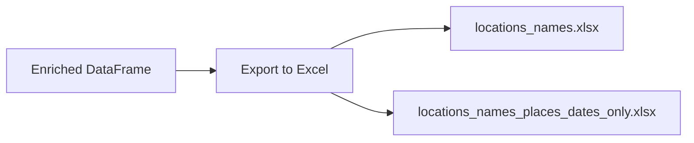

# Geographical Analysis

<cite>
**Referenced Files in This Document**   
- [location-analysis.ipynb](file://notebooks/location-analysis.ipynb)
- [dehergne_util.py](file://notebooks/dehergne_util.py)
- [locations_names_wikidata.csv](file://inferences/wikidata-references/locations_names_wikidata.csv)
</cite>

## Table of Contents
1. [Introduction](#introduction)
2. [Core Location Attributes](#core-location-attributes)
3. [Wikidata Integration](#wikidata-integration)
4. [Date Inference Methodology](#date-inference-methodology)
5. [Data Export and Research Prioritization](#data-export-and-research-prioritization)
6. [Ambiguity Resolution](#ambiguity-resolution)
7. [Performance Considerations](#performance-considerations)
8. [Best Practices](#best-practices)

## Introduction
The geographical analysis tools centered on the `location-analysis.ipynb` notebook provide a systematic framework for extracting, enriching, and analyzing location-based data from biographical records within the Dehergne dataset. This system transforms raw textual mentions of places into structured, geospatially enriched data by leveraging external knowledge bases, primarily Wikidata. The process begins by collecting all place-related attributes from individual biographies, such as birth, death, and movement events. These locations are then enhanced with modern names, geographic coordinates, and administrative hierarchies. The notebook also implements sophisticated data inference and cleaning techniques, including the forward-filling of missing dates and the identification of ambiguous or unlinked locations for further research. The final output is a comprehensive dataset ready for external analysis, enabling researchers to study Jesuit movements, missionary activities, and demographic patterns over time and space.

**Section sources**
- [location-analysis.ipynb](file://notebooks/location-analysis.ipynb#L1-L20)

## Core Location Attributes
The analysis begins by identifying a specific set of attribute types within the biographical records that contain place names as their values. These attributes represent key life events and movements of individuals, primarily Jesuit missionaries. The notebook explicitly defines and collects data from the following nine attribute types:

- `nascimento`: Place of birth
- `jesuita-entrada`: Entry into the Jesuit order
- `partida`: Departure from a location
- `chegada`: Arrival at a location
- `estadia`: Period of residence or stay
- `estadia-x`: An alternative or additional period of residence
- `jesuita-votos-local`: Location where local vows were taken
- `jesuita-ordenacao-padre`: Location of priestly ordination
- `morte`: Place of death

By focusing on these attributes, the notebook creates a comprehensive timeline of an individual's geographical journey. The data is extracted using the `entities_with_attribute` function from the `timelink.pandas` library, which queries the database for all person entities possessing any of these location-related attributes. This initial dataset forms the foundation for all subsequent enrichment and analysis processes.

**Section sources**
- [location-analysis.ipynb](file://notebooks/location-analysis.ipynb#L17-L26)
- [location-analysis.ipynb](file://notebooks/location-analysis.ipynb#L109-L113)

## Wikidata Integration
A core feature of the geographical analysis is the enrichment of raw location names with structured data from Wikidata, a free and open knowledge base. The process of linking locations to Wikidata is automated through the use of the `get_linked_entity_id` utility function, defined in the `dehergne_util.py` module.

This function operates by searching the `place.comment` field of each record for a specific pattern: `@wikidata:Q1234567`. When a match is found, it extracts the Wikidata identifier (e.g., Q2766547) and stores it in a new `wikidata_id` column. If no identifier is found, the function returns a default value of "no wikidata," flagging the location for manual review.

```mermaid
flowchart TD
A[Raw Location Record] --> B{Has @wikidata:<ID> in comment?}
B --> |Yes| C[Extract Wikidata ID]
B --> |No| D[Set wikidata_id = "no wikidata"]
C --> E[Enrich with Wikidata data]
D --> F[Flag for manual research]
```

**Diagram sources**
- [dehergne_util.py](file://notebooks/dehergne_util.py#L31-L60)
- [location-analysis.ipynb](file://notebooks/location-analysis.ipynb#L550-L551)

Once the Wikidata IDs are extracted, they can be used to programmatically retrieve current names, precise geographic coordinates (latitude and longitude), and present-day administrative information (such as country, region, and district). This transformation turns ambiguous historical place names into precise, modern geographical points, enabling accurate mapping and spatial analysis.

## Date Inference Methodology
A significant challenge in historical datasets is the presence of incomplete or missing dates. The `location-analysis.ipynb` notebook addresses this by implementing a date inference strategy based on the chronological order of events in an individual's life.

The methodology uses a forward-fill (`ffill`) technique on the `place.date` column. The process is as follows:
1.  The dataset is sorted by individual ID (`id_col`) and the line number of the record (`place.line`) to ensure chronological order.
2.  Missing dates (represented as '0') are replaced with `NaN`.
3.  The `fillna(method='ffill')` function is applied within each individual's group. This means that a missing date for a location event is filled with the date of the most recent previous event for that same individual.
4.  A boolean flag, `place.date_is_inferred`, is created to distinguish between original dates and inferred dates.

This approach is based on the logical assumption that a person's movements are sequential. For example, if a record states that a Jesuit arrived in "Acapulco, México" but does not specify a date, the system can infer that this arrival happened after their known departure from a previous location. The `place.date_is_inferred` flag is crucial for maintaining data integrity, as it allows researchers to differentiate between documented dates and those that have been logically deduced.

**Section sources**
- [location-analysis.ipynb](file://notebooks/location-analysis.ipynb#L521-L543)

## Data Export and Research Prioritization
The notebook facilitates external analysis by exporting the enriched location data to Excel files. Two primary files are generated:

1.  **`locations_names.xlsx`**: Contains the full enriched dataset, including the Wikidata ID, inferred dates, and other metadata. This file is used for comprehensive analysis.
2.  **`locations_names_places_dates_only.xlsx`**: Contains a simplified version with only the place name, formatted date, person's name, attribute type, and original name. This version is designed for unbiased analysis, such as by a Large Language Model (LLM), to prevent the model from being influenced by the pre-existing Wikidata links.



**Diagram sources**
- [location-analysis.ipynb](file://notebooks/location-analysis.ipynb#L577-L579)

A critical output of the analysis is the identification of locations that lack a Wikidata link. The notebook filters the dataset to show only records where `wikidata_id` is "no wikidata." This list serves as a prioritized research agenda, highlighting places that require manual investigation to resolve their modern equivalents. Examples from the data include "Aguiar," "Ilhas," and "Prisão," which are ambiguous and need contextual research to be accurately geocoded.

**Section sources**
- [location-analysis.ipynb](file://notebooks/location-analysis.ipynb#L591-L600)

## Ambiguity Resolution
The dataset contains numerous instances of ambiguous place names, which pose a significant challenge for accurate geographical analysis. The notebook's output and the structure of the data itself reveal common strategies for handling this ambiguity.

The most frequent issue is the existence of multiple locations with the same name. For example, the comment "existem vários" (there are several) appears for places like "Bellegarde" and "Aguiar." The `place.original` and `place.comment` fields often contain clarifying information, such as "diocese de Coimbra" or "diocese da Guarda," which are essential for disambiguation.

The analysis of the `locations_names_wikidata.csv` file shows that the project maintains a curated list of Wikidata IDs for known locations. When a new location is identified, it is added to this reference list, creating a growing knowledge base that improves the accuracy of future analyses. The presence of comments like "ILOC" (indicating a location that has been identified by the research team) suggests a collaborative process where ambiguous entries are flagged and resolved over time.

**Section sources**
- [location-analysis.ipynb](file://notebooks/location-analysis.ipynb#L650-L799)
- [locations_names_wikidata.csv](file://inferences/wikidata-references/locations_names_wikidata.csv#L1-L925)

## Performance Considerations
Processing large numbers of location records requires attention to performance. The notebook leverages the efficiency of the `pandas` library for data manipulation, which is optimized for handling large datasets in memory. The use of vectorized operations, such as the `apply` function to extract Wikidata IDs and the `fillna` method for date inference, ensures that these operations are performed efficiently across the entire dataset.

The primary performance bottleneck is likely the manual research required for locations without Wikidata links. Automating the disambiguation of names like "Aguiar" or "Lajes" is difficult, as it often requires deep historical and geographical context. Therefore, the system's design, which exports a clean list of unresolved locations, is a performance optimization in itself. It allows computational resources to focus on processing the well-defined data while directing human expertise to the most challenging cases.

**Section sources**
- [location-analysis.ipynb](file://notebooks/location-analysis.ipynb#L499-L558)

## Best Practices
To maintain data accuracy in geographical enrichment, the following best practices are evident from the code and data:

1.  **Explicit Linking**: Always use the `@wikidata:Q1234567` syntax in the `comment` field to create a clear, machine-readable link between a record and its external knowledge base entry.
2.  **Flag Inferred Data**: Use boolean flags like `place.date_is_inferred` to transparently distinguish between original and derived data, preserving the integrity of the historical record.
3.  **Document Ambiguity**: Use the `place.comment` and `place.original` fields to document uncertainties (e.g., "existem vários," "qual deles?") rather than making an arbitrary choice.
4.  **Maintain a Reference List**: Curate a central list of known locations and their Wikidata IDs (e.g., `locations_names_wikidata.csv`) to ensure consistency across the entire dataset.
5.  **Separate Raw and Processed Data**: Export both a fully enriched dataset and a simplified version without external links to support different types of analysis and prevent bias.

These practices ensure that the geographical analysis is both rigorous and transparent, providing a reliable foundation for historical research.

**Section sources**
- [location-analysis.ipynb](file://notebooks/location-analysis.ipynb)
- [dehergne_util.py](file://notebooks/dehergne_util.py)
- [locations_names_wikidata.csv](file://inferences/wikidata-references/locations_names_wikidata.csv)