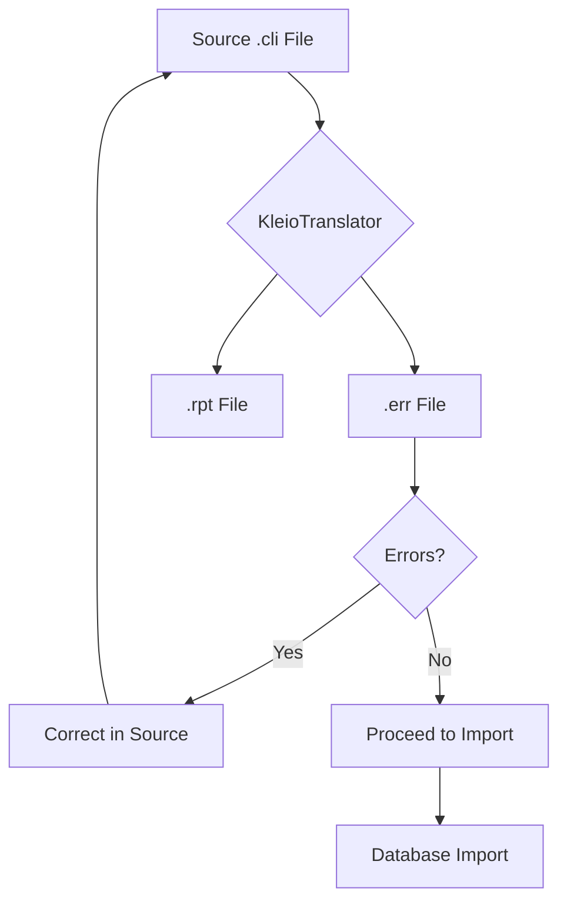
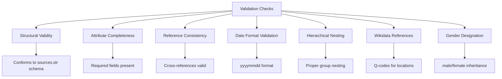
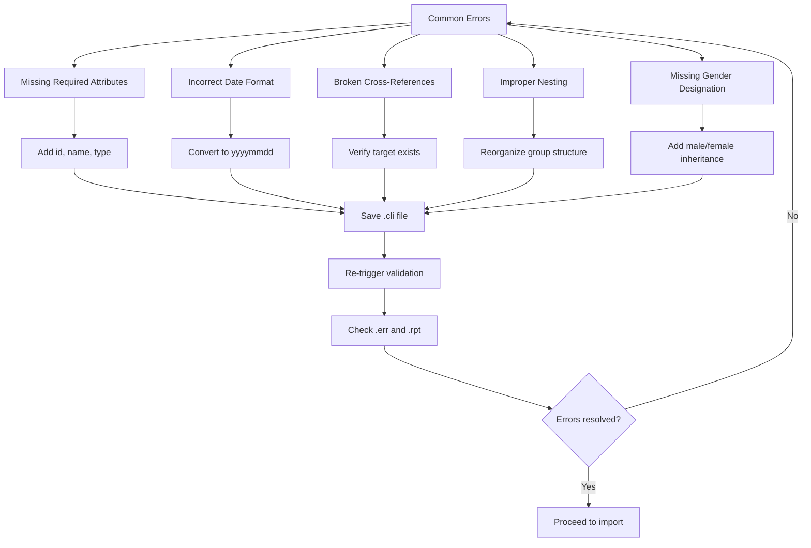
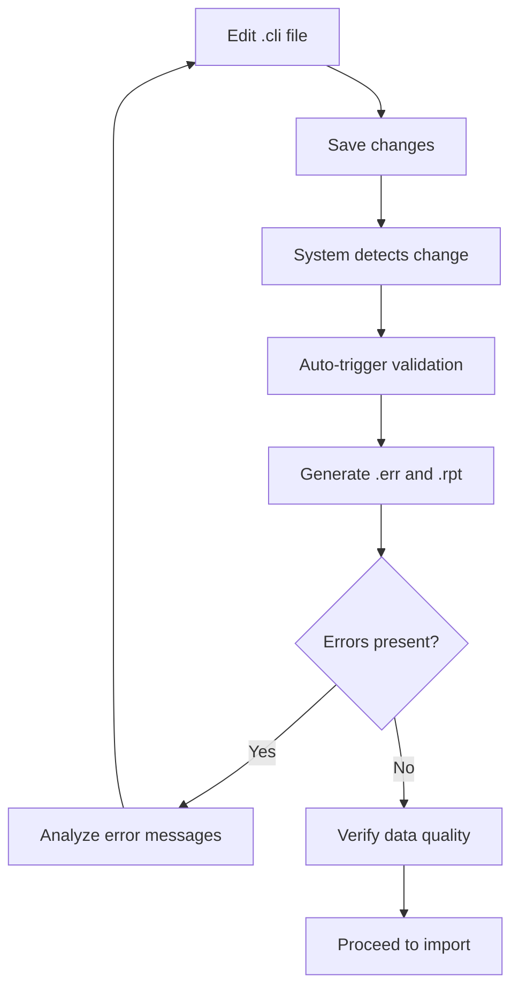

# Data Validation Workflow

<cite>
**Referenced Files in This Document**   
- [dehergne-a.cli](file://sources/dehergne-a.cli)
- [dehergne-a.err](file://sources/dehergne-a.err)
- [dehergne-a.rpt](file://sources/dehergne-a.rpt)
- [dehergne-0-abrev.err](file://sources/dehergne-0-abrev.err)
- [dehergne-0-abrev.rpt](file://sources/dehergne-0-abrev.rpt)
- [structures/sources.str](file://structures/sources.str)
- [notebooks/01-background-importer.ipynb](file://notebooks/01-background-importer.ipynb)
- [notebooks/dehergne_util.py](file://notebooks/dehergne_util.py)
</cite>

## Update Summary
**Changes Made**   
- Updated all file path references to reflect the removal of the 'repertoire' subdirectory in the processing pipeline
- Corrected file path examples and references throughout the document to use the current directory structure
- Verified and updated all file links to point to the correct locations in the sources directory
- Updated the validation process overview to reflect current file processing locations
- Ensured all diagram sources accurately reflect the current file structure

## Table of Contents
1. [Introduction](#introduction)
2. [Validation Process Overview](#validation-process-overview)
3. [Error and Report File Generation](#error-and-report-file-generation)
4. [Types of Validation Checks](#types-of-validation-checks)
5. [Interpreting Validation Output](#interpreting-validation-output)
6. [Common Error Patterns and Resolutions](#common-error-patterns-and-resolutions)
7. [Iterative Correction Workflow](#iterative-correction-workflow)
8. [Pre-Import Validation Importance](#pre-import-validation-importance)
9. [Notebook-Based Validation Scripts](#notebook-based-validation-scripts)
10. [Conclusion](#conclusion)

## Introduction

The dehergne project involves the transcription and validation of biographical data from Joseph Dehergne's "Répertoire des Jésuites de Chine de 1552 à 1800" into a structured digital format using the Kleio system. This documentation details the data validation workflow that ensures the integrity and accuracy of transcribed information before database import. The validation process generates two key output files for each source transcription: `.rpt` (report) files that document the translation process and any warnings, and `.err` (error) files that capture any critical issues preventing successful translation. Understanding this workflow is essential for maintaining data quality in the Timelink database system.

**Section sources**
- [README.md](file://README.md#L1-L87)

## Validation Process Overview

The validation workflow begins with Kleio-formatted `.cli` files containing transcribed biographical data from Dehergne's repertoire. These files are processed by the KleioTranslator server, which performs syntax checking, structural validation, and semantic consistency checks based on the defined structure in `sources.str`. The validation occurs during the Kleio-to-XML translation process, where the system verifies that all data conforms to the expected schema and relationships. Successful validation results in clean `.err` files with zero errors and `.rpt` files that document the translation process, while issues generate specific error messages and warnings that must be addressed before database import. The process is automated through notebook scripts that monitor file changes and trigger re-validation when transcriptions are modified.

**Diagram sources**
- [dehergne-a.cli](file://sources/dehergne-a.cli)
- [dehergne-a.err](file://sources/dehergne-a.err)
- [dehergne-a.rpt](file://sources/dehergne-a.rpt)

**Section sources**
- [dehergne-a.cli](file://sources/dehergne-a.cli#L1-L200)
- [dehergne-a.rpt](file://sources/dehergne-a.rpt#L1-L40)
- [01-background-importer.ipynb](file://notebooks/01-background-importer.ipynb#L1-L236)

## Error and Report File Generation

During the Kleio-to-XML translation process, the system generates two companion files for each `.cli` source file: a `.err` file that captures translation errors and a `.rpt` file that provides a detailed report of the translation process. The `.err` files contain critical information about syntax violations, structural inconsistencies, or semantic errors that prevent successful translation. When validation passes, these files contain only metadata about the translation process and confirm "0 errors" and "0 warnings." The `.rpt` files provide comprehensive information about the translation, including the structure file used, translation count, processing timestamps, and any non-critical warnings that require attention. Both file types are essential for quality assurance, with the `.err` file indicating whether a file is import-ready and the `.rpt` file providing context for any issues that need resolution.

**Section sources**
- [dehergne-a.err](file://sources/dehergne-a.err#L1-L5)
- [dehergne-a.rpt](file://sources/dehergne-a.rpt#L1-L40)
- [dehergne-0-abrev.err](file://sources/dehergne-0-abrev.err#L1-L5)
- [dehergne-0-abrev.rpt](file://sources/dehergne-0-abrev.rpt#L1-L33)

## Types of Validation Checks

The validation process performs several types of checks to ensure data integrity. Structural validity checks verify that all required fields and hierarchical relationships are present according to the `sources.str` schema. Attribute completeness validation ensures that mandatory attributes such as `id`, `name`, and `date` are provided for each entity. Reference consistency checks validate that all cross-references between entities (using `same_as` or `referido` relationships) point to existing identifiers within the dataset. The system also validates date formats, ensuring they conform to the yyyymmdd standard, and checks for proper nesting of hierarchical elements. Additionally, the validation process verifies that all geographical entities have proper Wikidata identifiers when available, and that all person records have appropriate gender designation through the `male` or `female` group inheritance.

**Diagram sources**
- [structures/sources.str](file://structures/sources.str#L1-L800)
- [dehergne-a.cli](file://sources/dehergne-a.cli#L1-L200)

**Section sources**
- [structures/sources.str](file://structures/sources.str#L1-L800)
- [dehergne-a.cli](file://sources/dehergne-a.cli#L1-L200)

## Interpreting Validation Output

Interpreting the validation output requires understanding both the `.err` and `.rpt` file contents. The `.err` file provides a definitive indication of translation success: files with "0 errors" can proceed to import, while any non-zero error count requires correction. The `.rpt` file contains more nuanced information, including warnings about "SAME AS" external references that need verification before import. These warnings appear in the report file with specific line numbers (e.g., "Line 628 'SAME AS' TO EXTERNAL REFERENCE EXPORTED") that correspond directly to lines in the source `.cli` file, enabling precise error location. The report also documents the translation count, structure file used, and processing timestamps, providing context for the validation process. Users should first check the `.err` file for critical errors, then examine the `.rpt` file for warnings and process details that may require attention even when no errors are present.

**Section sources**
- [dehergne-a.err](file://sources/dehergne-a.err#L1-L5)
- [dehergne-a.rpt](file://sources/dehergne-a.rpt#L1-L40)

## Common Error Patterns and Resolutions

Several common error patterns emerge during validation that can be systematically addressed. Missing required attributes such as `id` or `name` in person records generate structural errors that prevent translation. Incorrect date formatting (not in yyyymmdd format) triggers validation failures that require date standardization. Broken cross-references, where a `same_as` or `referido` points to a non-existent identifier, generate warnings in the `.rpt` file that must be resolved by verifying the target identifier exists. Improper hierarchical nesting, such as placing attributes at the wrong level in the structure, causes translation errors that require reorganization of the Kleio groups. Another common issue is missing gender designation, where person records fail to inherit from either the `male` or `female` group, requiring explicit group assignment. These errors are typically resolved by editing the source `.cli` file, saving the changes, and triggering re-validation through the automated monitoring system.

**Diagram sources**
- [dehergne-a.cli](file://sources/dehergne-a.cli#L1-L200)
- [dehergne-a.err](file://sources/dehergne-a.err#L1-L5)
- [dehergne-a.rpt](file://sources/dehergne-a.rpt#L1-L40)

**Section sources**
- [dehergne-a.cli](file://sources/dehergne-a.cli#L1-L200)
- [dehergne-a.err](file://sources/dehergne-a.err#L1-L5)
- [dehergne-a.rpt](file://sources/dehergne-a.rpt#L1-L40)

## Iterative Correction Workflow

The validation process follows an iterative correction cycle that emphasizes continuous improvement of data quality. When errors are detected, users edit the source `.cli` file in their preferred text editor, addressing the specific issues indicated in the `.err` and `.rpt` files. The automated monitoring system in `01-background-importer.ipynb` detects file changes and automatically triggers re-validation, generating updated `.err` and `.rpt` files. Users then review these updated validation outputs to determine if all issues have been resolved. This cycle continues until both files indicate successful validation with zero errors. The iterative nature of this workflow allows for incremental improvements, where users can address one type of error at a time and verify the impact of their corrections before proceeding to the next issue. This approach minimizes the risk of introducing new errors while fixing existing ones and ensures thorough validation before database import.

**Diagram sources**
- [01-background-importer.ipynb](file://notebooks/01-background-importer.ipynb#L1-L236)
- [dehergne-a.cli](file://sources/dehergne-a.cli)
- [dehergne-a.err](file://sources/dehergne-a.err)
- [dehergne-a.rpt](file://sources/dehergne-a.rpt)

**Section sources**
- [01-background-importer.ipynb](file://notebooks/01-background-importer.ipynb#L1-L236)
- [dehergne-a.cli](file://sources/dehergne-a.cli)
- [dehergne-a.err](file://sources/dehergne-a.err)
- [dehergne-a.rpt](file://sources/dehergne-a.rpt)

## Pre-Import Validation Importance

Validating data before database import is critical for maintaining data integrity and preventing cascading errors in the Timelink system. Importing unvalidated data risks introducing structural inconsistencies, broken relationships, and semantic errors that become increasingly difficult to correct after they enter the database. The validation process serves as a quality gate that ensures only clean, well-structured data is imported, preserving the reliability of the entire dataset. This is particularly important for the dehergne project, where accurate biographical information and proper entity relationships are essential for historical research. By catching errors early in the workflow, the validation process reduces the need for complex data cleanup operations later and ensures that the database remains a trustworthy source of information. The `.err` and `.rpt` files provide an audit trail of the validation process, documenting that each source file has been verified before import.

**Section sources**
- [README.md](file://README.md#L1-L87)
- [dehergne-a.err](file://sources/dehergne-a.err#L1-L5)
- [dehergne-a.rpt](file://sources/dehergne-a.rpt#L1-L40)

## Notebook-Based Validation Scripts

The dehergne project utilizes Jupyter notebooks to automate and streamline the validation workflow. The `01-background-importer.ipynb` notebook contains a monitoring system that watches for changes in the sources directory and automatically triggers validation and import processes. This script uses the TimelinkNotebook library to interface with the Kleio server, request translations, and import validated files into the database. The monitoring function recursively scans for `.cli` files and detects modifications based on file timestamps, ensuring that only changed files are re-processed. This automation reduces manual effort and ensures consistent application of the validation workflow across all source files. Additional notebooks like `kleio-to-doc.ipynb` provide supplementary functionality, such as converting Kleio files to Word documents for easier review, further supporting the validation and correction process.

**Section sources**
- [01-background-importer.ipynb](file://notebooks/01-background-importer.ipynb#L1-L236)
- [kleio-to-doc.ipynb](file://notebooks/kleio-to-doc.ipynb#L1-L120)

## Conclusion

The data validation workflow in the dehergne project is a systematic process that ensures the accuracy and integrity of transcribed biographical data before it enters the database. By generating `.err` and `.rpt` files during the Kleio-to-XML translation process, the system provides clear feedback on data quality, enabling users to identify and correct errors efficiently. The validation checks for structural validity, attribute completeness, and reference consistency, while the iterative correction workflow supported by automated notebook scripts ensures thorough quality assurance. Understanding how to interpret error messages and trace them back to specific lines in the source `.cli` files is essential for maintaining data integrity. By following this validation process rigorously, contributors to the dehergne project can ensure that the resulting database is a reliable and accurate resource for historical research on Jesuit missionaries in China.