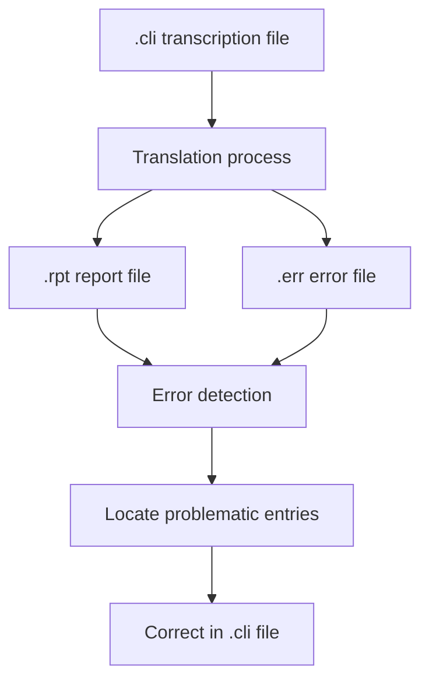
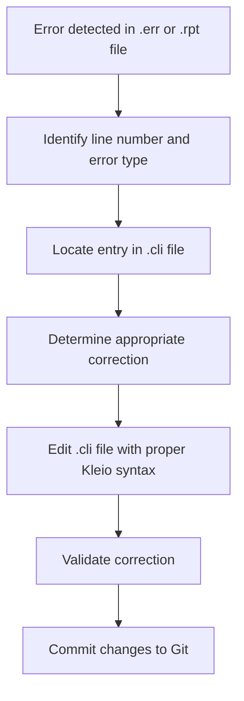
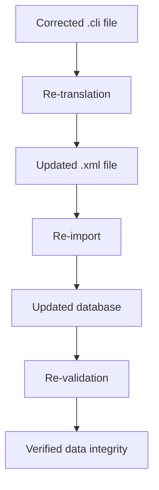

# Error Handling Procedures

<cite>
**Referenced Files in This Document**   
- [dehergne-a.err](file://sources/dehergne-a.err)
- [dehergne-b.err](file://sources/dehergne-b.err)
- [dehergne-a.cli](file://sources/dehergne-a.cli)
- [dehergne-b.cli](file://sources/dehergne-b.cli)
- [dehergne-a.rpt](file://sources/dehergne-a.rpt)
- [dehergne-b.rpt](file://sources/dehergne-b.rpt)
- [Dehergne_transcription_format.md](file://extras/doc/Dehergne_transcription_format.md)
- [Concepts.md](file://etc/doc/Concepts.md)
- [README.md](file://README.md)
</cite>

## Table of Contents
1. [Introduction](#introduction)
2. [Error Handling Principles](#error-handling-principles)
3. [Error Detection and Reporting](#error-detection-and-reporting)
4. [Common Error Categories](#common-error-categories)
5. [Correction Workflow](#correction-workflow)
6. [Reprocessing After Corrections](#reprocessing-after-corrections)
7. [Provenance and Traceability](#provenance-and-traceability)
8. [Best Practices](#best-practices)

## Introduction

The dehergne project involves the transcription and processing of biographical data from Joseph Dehergne's "Répertoire des Jésuites de Chine" using the Timelink framework. This documentation outlines the procedures for handling errors that occur during the translation and processing of `.cli` transcription files. The primary principle is that all corrections must be made at the source level by editing the original `.cli` files rather than altering derived data in databases or XML outputs.

The workflow follows a strict methodology where transcriptions in Kleio format serve as the authoritative source of truth. Any errors detected during translation or import processes must be traced back to their source in the `.cli` files, corrected there, and then reprocessed through the entire pipeline. This ensures data integrity, preserves provenance, and maintains a clear audit trail of all changes through Git version control.

**Section sources**
- [README.md](file://README.md#L1-L87)
- [Concepts.md](file://etc/doc/Concepts.md#L1-L126)

## Error Handling Principles

The dehergne project adheres to the fundamental principle that all corrections must be made at the source level by editing the original `.cli` transcription files. This approach ensures data integrity and traceability throughout the processing pipeline. According to the project documentation, when an error is detected in the database, the correction must be made in the original transcription, which is then re-translated and re-imported.

This principle is critical because the Timelink system treats imported information as immutable. There is no mechanism within the database interface to directly modify imported data. This design choice guarantees transparency and preserves the provenance of all information, ensuring that every piece of data can be traced back to its original source transcription.

The source-level correction approach also prevents inconsistencies that could arise from making changes at different stages of the processing pipeline. By maintaining the `.cli` files as the single source of truth, the project ensures that all derived outputs (XML, database entries, etc.) remain synchronized and consistent.

**Section sources**
- [Concepts.md](file://etc/doc/Concepts.md#L110-L113)
- [Dehergne_transcription_format.md](file://extras/doc/Dehergne_transcription_format.md#L1-L575)

## Error Detection and Reporting

Errors in the dehergne project are detected and reported through a systematic process involving multiple file types. The primary error reporting mechanism consists of `.err` and `.rpt` files generated during the translation process. For each `.cli` transcription file, corresponding `.err` (error) and `.rpt` (report) files are created to document the translation results.

The `.err` files contain a summary of errors and warnings encountered during translation. As shown in the example files, these typically include metadata about the translation process followed by counts of errors and warnings. When no errors are present, the file will indicate "0 errors" and "0 warnings" as seen in `dehergne-a.err` and `dehergne-b.err`.

The `.rpt` files provide more detailed information about the translation process. They include processing metadata, structure information, file paths, and specific warnings or notes about the translation. For instance, the `dehergne-a.rpt` file contains warnings about "SAME AS" external reference exports, advising to check if referenced entities exist before importing.

These error reports are essential for locating problematic entries in the transcription files. The reports typically include line numbers where issues were detected, allowing transcribers to quickly navigate to the exact location of errors in the `.cli` files. This precise error location information enables efficient correction of issues at the source level.

**Diagram sources**
- [dehergne-a.err](file://sources/dehergne-a.err#L1-L5)
- [dehergne-a.rpt](file://sources/dehergne-a.rpt#L1-L40)
- [dehergne-b.err](file://sources/dehergne-b.err#L1-L5)

**Section sources**
- [dehergne-a.err](file://sources/dehergne-a.err#L1-L5)
- [dehergne-a.rpt](file://sources/dehergne-a.rpt#L1-L40)
- [dehergne-b.err](file://sources/dehergne-b.err#L1-L5)

## Common Error Categories

The dehergne project encounters several common categories of errors that require correction at the source level. These error types are typically identified in the `.err` and `.rpt` files generated during translation.

### Malformed Dates

Date formatting errors are among the most common issues. According to the transcription guidelines, dates must be recorded in the format AAAAMMDD with zeros for unknown month or day components. Errors occur when this format is not followed, such as using incorrect separators, wrong digit counts, or non-numeric characters. For example, a date recorded as "1602-03-25" instead of "16020325" would trigger a parsing error during translation.

### Undefined Attributes

Undefined attributes occur when transcription fields use attribute names not recognized by the translation schema. The project uses a specific set of attribute prefixes like `ls$`, `n$`, `referido$`, and `rel$` with defined vocabulary for each. Errors arise when transcribers use non-standard attribute names or misspell existing ones. For instance, using `l$` instead of `ls$` or `jesuita-entrada` instead of the correct `jesuita-entrada` would be flagged as undefined attributes.

### Broken References

Broken references occur with the `xmesmo_que` attribute, which links entities across different `.cli` files. The error happens when an `xmesmo_que` reference points to an ID that doesn't exist in any file. The `.rpt` files explicitly warn about these issues with messages like "SAME AS TO EXTERNAL REFERENCE EXPORTED ... CHECK IF IT EXISTS BEFORE IMPORTING." This typically occurs when the target entity hasn't been imported yet or when there's a typo in the referenced ID.

### Structural Issues

Structural errors relate to the overall organization of the `.cli` files. These include missing required header information, incorrect nesting of elements, or violation of the defined transcription format. The structure is governed by the `gacto2.str` file, and any deviation from this structure will be reported during translation.

### Data Consistency Errors

These errors occur when related data elements contradict each other. For example, a person might be recorded as having taken vows before their entry into the Jesuit order, which would be chronologically impossible. The translation process checks for such logical inconsistencies and reports them for correction.

**Section sources**
- [Dehergne_transcription_format.md](file://extras/doc/Dehergne_transcription_format.md#L1-L575)
- [dehergne-a.rpt](file://sources/dehergne-a.rpt#L1-L40)

## Correction Workflow

The correction workflow for the dehergne project follows a systematic process that begins with error identification and ends with source-level fixes. When errors are detected in the `.err` or `.rpt` files, the first step is to locate the problematic entries using the line numbers and error descriptions provided in these reports.

For example, when the `.rpt` file indicates a "SAME AS TO EXTERNAL REFERENCE EXPORTED" warning, the specified line number directs the transcriber to the exact location in the `.cli` file where the `xmesmo_que` attribute is used. The transcriber must then verify whether the referenced ID exists in another `.cli` file and correct any typos or inaccuracies.

Corrections are made directly in the `.cli` transcription files using proper Kleio syntax. The transcriber must ensure that all changes adhere to the formatting rules specified in the project documentation. For date corrections, the AAAAMMDD format with appropriate zero padding must be used. For attribute corrections, the exact attribute names from the approved vocabulary must be applied.

When correcting broken references, the transcriber has two options: either correct the ID in the `xmesmo_que` attribute to match an existing entity, or create the missing entity in the appropriate `.cli` file if it legitimately should exist. The decision depends on whether the reference was erroneous or if the entity was simply missing from the transcription.

All corrections must preserve the semantic meaning of the original transcription while fixing the technical errors. When in doubt, transcribers should consult the original source material (Dehergne's "Répertoire des Jésuites de Chine") to ensure accuracy.

**Diagram sources**
- [Dehergne_transcription_format.md](file://extras/doc/Dehergne_transcription_format.md#L1-L575)
- [dehergne-a.rpt](file://sources/dehergne-a.rpt#L1-L40)

**Section sources**
- [Dehergne_transcription_format.md](file://extras/doc/Dehergne_transcription_format.md#L1-L575)
- [dehergne-a.rpt](file://sources/dehergne-a.rpt#L1-L40)

## Reprocessing After Corrections

After corrections have been made to the `.cli` transcription files, a complete reprocessing workflow must be executed to ensure that all derived data reflects the changes. This workflow consists of three sequential steps: re-translation, re-import, and re-validation.

The re-translation phase begins by processing the corrected `.cli` files through the Kleio translator. This generates updated `.xml` files containing the corrected data in a format suitable for database import. The translation process also produces new `.rpt` and `.err` files that should show zero errors if the corrections were successful.

Following successful translation, the re-import phase involves loading the updated `.xml` files into the database. This replaces the previously imported data with the corrected version. The import process generates `.xrpt` and `.xerr` files that document the import results and should be checked for any issues.

The final re-validation phase requires thorough checking of the imported data to ensure that the corrections have been properly applied and that no new issues have been introduced. This includes verifying that all references are now resolved, dates are correctly formatted, and attribute values are accurate.

The entire reprocessing workflow must be completed for each correction to maintain data consistency across all outputs. Partial processing (such as only updating the XML without re-importing) is strictly prohibited as it would create inconsistencies between different representations of the data.

**Diagram sources**
- [Concepts.md](file://etc/doc/Concepts.md#L1-L126)

**Section sources**
- [Concepts.md](file://etc/doc/Concepts.md#L1-L126)

## Provenance and Traceability

Preserving provenance and ensuring traceability are fundamental principles in the dehergne project's error handling procedures. Every change made to the transcription files is tracked through Git version control, creating an immutable audit trail of all modifications.

When corrections are made to `.cli` files, they are committed to the Git repository with descriptive commit messages that explain the nature of the fix. This practice ensures that future researchers can understand why specific changes were made and can trace the evolution of the data over time.

The project's reliance on source-level corrections rather than database modifications is specifically designed to maintain provenance. By keeping the `.cli` files as the authoritative source, all data can be traced back to its original transcription, with any corrections documented in the Git history. This approach aligns with the "Open Science" ideology mentioned in the project documentation, ensuring transparency and reproducibility.

The use of Git also enables collaboration among multiple transcribers while preventing conflicts. The master branch serves as the reference version, and all changes are made through controlled updates to this branch. This ensures that the database of reference remains consistent and reliable.

Traceability extends beyond just tracking changes—it also involves documenting the rationale behind corrections. When transcribers make changes based on external sources (such as Wicky's work for voyage information), these decisions are documented in comments within the `.cli` files or in the Git commit messages, providing context for future users.

**Section sources**
- [Concepts.md](file://etc/doc/Concepts.md#L23-L28)
- [Dehergne_transcription_format.md](file://extras/doc/Dehergne_transcription_format.md#L257-L265)

## Best Practices

To ensure effective error handling in the dehergne project, several best practices should be followed:

1. **Always work on the source**: Never attempt to modify data in the database or XML outputs. All corrections must be made in the original `.cli` transcription files.

2. **Use error reports systematically**: Regularly check `.err` and `.rpt` files after translation to identify and address issues promptly. Pay special attention to line numbers and specific error messages.

3. **Follow Kleio syntax precisely**: When making corrections, adhere strictly to the Kleio syntax and formatting rules documented in the project guidelines. This includes proper use of attribute prefixes, date formatting, and hierarchical structure.

4. **Verify external references**: Before using `xmesmo_que` to reference entities across files, confirm that the target ID exists and is correctly spelled. Check the relevant `.cli` file to ensure the entity is properly defined.

5. **Document corrections in Git**: Make small, focused commits with clear messages explaining the nature of each correction. This creates a transparent and searchable history of changes.

6. **Complete the full reprocessing cycle**: After corrections, always execute the complete workflow of re-translation, re-import, and re-validation. Never skip steps in this process.

7. **Cross-reference with original sources**: When uncertain about a correction, consult the original Dehergne publication or other authoritative sources to ensure accuracy.

8. **Coordinate with team members**: When working in a collaborative environment, communicate changes to avoid conflicts and ensure everyone is working with the most current version of the files.

9. **Regularly update from the master branch**: Keep local repositories synchronized with the reference master branch to incorporate corrections made by other team members.

10. **Validate data consistency**: After reprocessing, verify that relationships between entities remain intact and that no new inconsistencies have been introduced.

Following these best practices ensures the integrity, accuracy, and reliability of the dehergne project's data while maintaining the transparency and traceability that are essential for scholarly research.

**Section sources**
- [Concepts.md](file://etc/doc/Concepts.md#L1-L126)
- [Dehergne_transcription_format.md](file://extras/doc/Dehergne_transcription_format.md#L1-L575)
- [README.md](file://README.md#L1-L87)