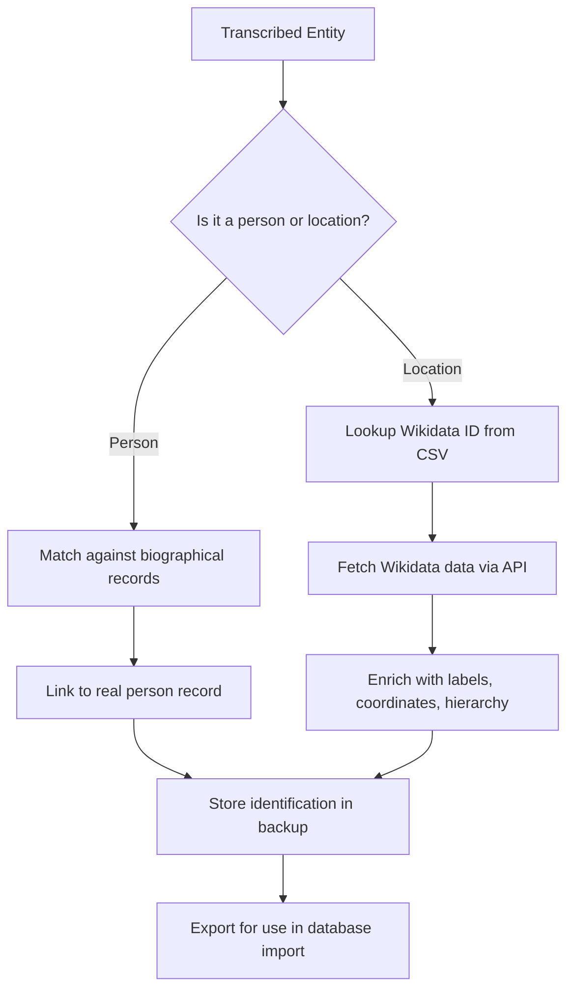

# Identification Best Practices

<cite>
**Referenced Files in This Document**   
- [mhk_identification_toliveira.cli.exclude](file://identifications/mhk_identification_toliveira.cli.exclude)
- [README.md](file://identifications/README.md)
- [README.md](file://inferences/README.md)
- [locations_names_wikidata.csv](file://inferences/wikidata-references/locations_names_wikidata.csv)
- [residences-1644-1701.csv](file://inferences/wikidata-references/residences-1644-1701.csv)
- [residences-1644.csv](file://inferences/wikidata-references/residences-1644.csv)
- [residences-1701.csv](file://inferences/wikidata-references/residences-1701.csv)
- [dehergne-a.cli](file://sources/dehergne-a.cli)
- [wikidata-linked-data.ipynb](file://notebooks/wikidata-linked-data.ipynb)
- [dehergne_util.py](file://notebooks/dehergne_util.py)
</cite>

## Table of Contents
1. [Introduction](#introduction)
2. [Entity Linking to Wikidata](#entity-linking-to-wikidata)
3. [Managing False Positives with Exclude Files](#managing-false-positives-with-exclude-files)
4. [Resolving Ambiguous Identifications](#resolving-ambiguous-identifications)
5. [Maintaining Identification Consistency](#maintaining-identification-consistency)
6. [Updating Identifications with New Reference Data](#updating-identifications-with-new-reference-data)
7. [Workflow Recommendations](#workflow-recommendations)
8. [Conclusion](#conclusion)

## Introduction

The dehergne project focuses on the systematic identification and linking of transcribed historical entities—primarily persons and locations—to authoritative external sources such as Wikidata. This documentation outlines best practices for ensuring accurate, consistent, and traceable entity identification across the dataset. The process involves automated matching, manual verification, exclusion of false positives, and integration of external reference data to enhance the reliability and scholarly value of the transcriptions.

The identification system is designed to support record linkage between transcribed entities and real-world individuals or places, using structured data formats and inference rules. The workflow leverages both automated tools and human expertise to resolve ambiguities and maintain data integrity over time.

**Section sources**
- [README.md](file://identifications/README.md#L1-L3)
- [README.md](file://inferences/README.md#L1-L3)

## Entity Linking to Wikidata

Entity linking in the dehergne project involves connecting transcribed persons and locations to their corresponding entries in Wikidata, a free and open knowledge base. This process enables enriched metadata, geographic coordinates, multilingual labels, and connections to other knowledge systems.

The primary mechanism for linking locations to Wikidata is through CSV files stored in the `inferences/wikidata-references/` directory. These files contain Wikidata identifiers (QIDs) that correspond to specific locations mentioned in the transcriptions. The key files include:

- `locations_names_wikidata.csv`: Contains Wikidata IDs for general locations referenced in the dataset.
- `residences-1644.csv` and `residences-1701.csv`: Contain location identifiers specific to Jesuit residences during those years.
- `residences-1644-1701.csv`: Aggregates residence data across the full period.

A Jupyter notebook, `wikidata-linked-data.ipynb`, automates the retrieval of structured data from Wikidata using these QIDs. It fetches multilingual labels, descriptions, coordinates, and administrative hierarchies, which are then compiled into an Excel file (`locations_wikidata_info.xlsx`) for use in downstream processing and analysis.

For persons, identification is performed by matching names and contextual attributes (such as nationality, dates, and roles) against known records. When a match is established, it is recorded in identification export files, such as those generated from the database and used for backup and restoration purposes.



**Diagram sources**
- [locations_names_wikidata.csv](file://inferences/wikidata-references/locations_names_wikidata.csv#L1-L925)
- [wikidata-linked-data.ipynb](file://notebooks/wikidata-linked-data.ipynb#L1-L1256)
- [dehergne_util.py](file://notebooks/dehergne_util.py)

## Managing False Positives with Exclude Files

False positive identifications—where a transcribed entity is incorrectly linked to a real-world individual—are managed using `.exclude` files. These files explicitly list identification matches that should be disregarded during automated processing.

The file `mhk_identification_toliveira.cli.exclude` serves as the primary example of this mechanism. It contains entries where multiple transcribed names have been manually determined to refer to the same real person, but some associations are erroneous and must be excluded.

Each entry in the exclude file follows a structured format:
- `rperson$`: Defines a real person with a unique ID and name.
- `m/status=N`: Indicates the identification is not confirmed.
- `obs=`: Provides a human-readable note explaining the reasoning, often citing sources or pointing out confusion with similar names.
- `occ$`: Lists occurrences (transcribed names) linked to this person, some of which may be false positives.

For example:
```
rperson$rp-26/Antonio Ferronus/m/status=N/obs=Dehergne considera que são o mesmo porque ambos morreram na mesma data
   occ$deh-antonio-ferronus/id=rp-26-occ1
   occ$deh-andre-ferrao/id=rp-26-occ2
```
This indicates that while "Antonio Ferronus" and "Andre Ferrao" were both matched to the same real person, the match for "Andre Ferrao" is likely incorrect and should be treated with caution.

The `.exclude` file acts as a curated blacklist, preventing the system from automatically accepting potentially misleading matches. This is critical in cases of name variants, homonyms, or transcription errors.

**Section sources**
- [mhk_identification_toliveira.cli.exclude](file://identifications/mhk_identification_toliveira.cli.exclude#L1-L514)
- [README.md](file://identifications/README.md#L1-L3)

## Resolving Ambiguous Identifications

Ambiguous identifications occur when a transcribed name could refer to multiple real individuals. The dehergne project employs a multi-step strategy to resolve these cases:

1. **Manual Verification**: Each ambiguous match is reviewed by domain experts who assess biographical details such as birth/death dates, nationality, religious status, and geographical context.

2. **Cross-Referencing with Complementary Sources**: Identifications are validated against external sources cited in the transcription files (e.g., Dehergne's dictionary, academic publications, archival records). For instance, the `dehergne-a.cli` file includes references to works by Swen, Espadinha, Franco, and Golvers, which provide additional context for disambiguation.

3. **Use of Observations (obs=)**: The `obs=` field in identification records documents the rationale for inclusion or exclusion. These notes often include URLs, book citations, or internal project references (e.g., "Dehergne 843") to support traceability.

4. **Temporal and Geographic Filtering**: When multiple candidates exist, the system filters based on known timelines and locations. For example, a person recorded as being in Goa in 1602 is unlikely to be the same individual who died in Batavia in 1624 unless corroborated by evidence.

5. **Hierarchical Confidence Levels**: Matches are tagged with confidence indicators (e.g., `m/status=N` for unconfirmed), allowing downstream processes to handle uncertain identifications appropriately.

This layered approach ensures that identifications are not based solely on name similarity but are grounded in historical and contextual evidence.

**Section sources**
- [dehergne-a.cli](file://sources/dehergne-a.cli#L1-L1599)
- [mhk_identification_toliveira.cli.exclude](file://identifications/mhk_identification_toliveira.cli.exclude#L1-L514)

## Maintaining Identification Consistency

Consistency in identification is essential when the same person appears across multiple transcriptions or contexts. The dehergne project maintains consistency through:

- **Centralized Real Person Records**: Each identified individual is assigned a unique `rperson$` ID (e.g., `rp-22` for Alessandro Valignano), which remains constant across all references.
  
- **Occurrence Tracking**: Every transcribed variant of a name (e.g., "Alessandro Valignano", "Alessandro Valignani") is linked as an `occ$` to the same real person ID, enabling traceability and aggregation.

- **Deduplication Rules**: The system applies rules to prevent duplicate entries. For example, if two transcriptions refer to "Matteo Ricci" and "Father Ricci", both are linked to `rp-66`.

- **Reference to Authoritative Sources**: Consistent use of Wikidata IDs ensures that location references (e.g., `@wikidata:Q956` for Beijing) are standardized across the dataset.

This approach allows researchers to query all mentions of a person regardless of naming variations, supporting comprehensive biographical and network analysis.

**Section sources**
- [mhk_identification_toliveira.cli.exclude](file://identifications/mhk_identification_toliveira.cli.exclude#L1-L514)
- [dehergne-a.cli](file://sources/dehergne-a.cli#L1-L1599)

## Updating Identifications with New Reference Data

As new reference data becomes available (e.g., newly discovered biographies, updated Wikidata entries), the identification system must be updated while preserving backward compatibility and traceability.

The recommended workflow includes:

1. **Versioned Reference Files**: Maintain versioned copies of CSV files in `inferences/wikidata-references/` to track changes over time.
2. **Incremental Updates**: Use the `wikidata-linked-data.ipynb` notebook to fetch updated data and merge it into the existing `locations_wikidata_info.xlsx` file, preserving historical mappings.
3. **Audit Trail**: Document all changes in identification logic or exclusions, ideally in a changelog or commit message, referencing the relevant `.exclude` file modifications.
4. **Reprocessing with Safeguards**: When reprocessing identifications, ensure that previously excluded matches (in `.exclude` files) are not reintroduced without manual review.
5. **Backup and Restore**: The identification directory is designed to export and restore linkages, enabling safe experimentation and rollback if needed.

This ensures that updates improve accuracy without compromising the integrity of prior work.

**Section sources**
- [wikidata-linked-data.ipynb](file://notebooks/wikidata-linked-data.ipynb#L1-L1256)
- [README.md](file://identifications/README.md#L1-L3)

## Workflow Recommendations

To ensure robust and sustainable identification practices, follow this recommended workflow:

1. **Initial Transcription**: Extract names and locations from source texts using standardized formats.
2. **Automated Matching**: Run initial matching against known databases and Wikidata using available scripts.
3. **Review Exclusions**: Consult `.exclude` files to avoid known false positives.
4. **Manual Verification**: For ambiguous or high-impact entities, conduct manual review using cited sources.
5. **Link to Wikidata**: For locations, confirm or assign Wikidata IDs using the reference CSVs.
6. **Document Rationale**: Add `obs=` notes explaining decisions, especially for disputed or uncertain matches.
7. **Export Identifications**: Save confirmed linkages in the identification directory for backup and sharing.
8. **Regular Updates**: Periodically refresh Wikidata-linked data and review exclusions as new information emerges.

This workflow balances automation with expert judgment, ensuring both efficiency and scholarly rigor.

## Conclusion

The dehergne project employs a sophisticated yet transparent system for identifying and linking transcribed historical entities to authoritative sources. By combining automated matching with manual verification, leveraging Wikidata for geographic precision, and using `.exclude` files to manage false positives, the project achieves high-quality, traceable identifications. Maintaining consistency across entries and updating identifications responsibly ensures the long-term reliability and scholarly value of the dataset. Following the best practices outlined here will support accurate, reproducible, and meaningful historical research.