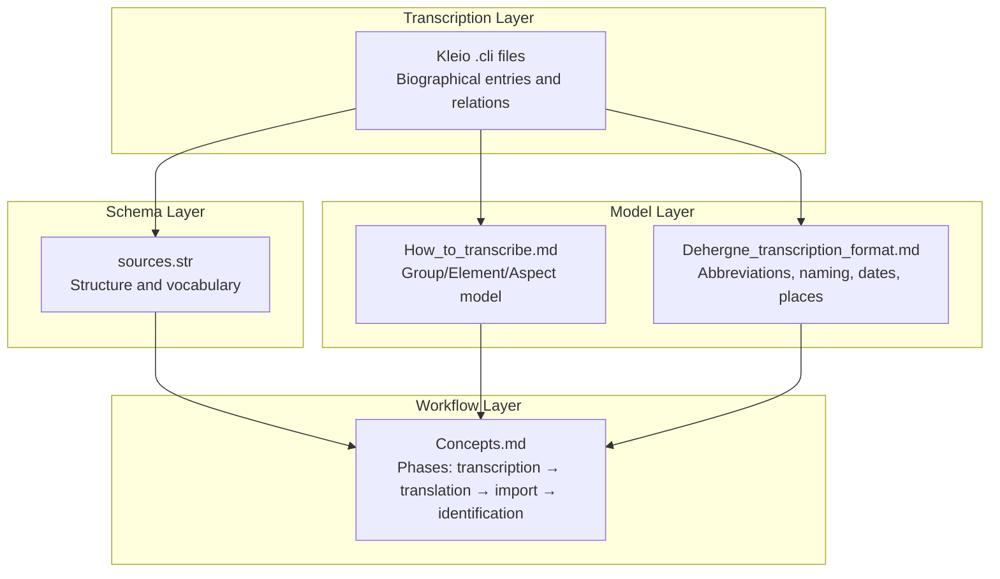
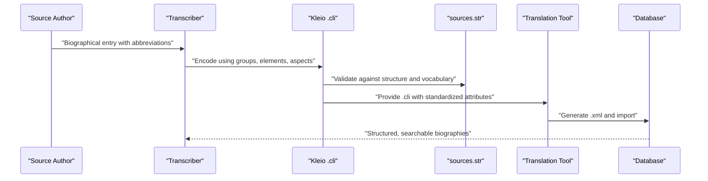
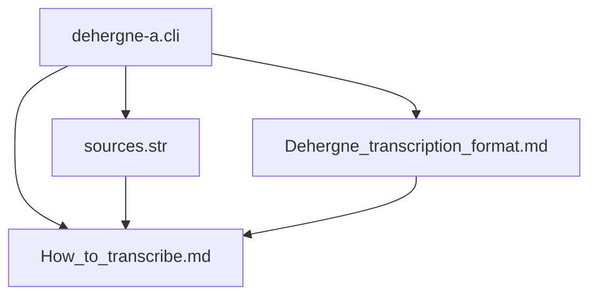

# Transcription Standards

<cite>
**Referenced Files in This Document**
- [Dehergne_transcription_format.md](file://extras/doc/Dehergne_transcription_format.md)
- [How_to_transcribe.md](file://extras/doc/How_to_transcribe.md)
- [sources.str](file://structures/sources.str)
- [Concepts.md](file://etc/doc/Concepts.md)
- [dehergne-a.cli](file://sources/dehergne-a.cli)
- [dehergne-b.cli](file://sources/dehergne-b.cli)
- [dehergne-c.cli](file://sources/dehergne-c.cli)
</cite>

## Table of Contents
1. [Introduction](#introduction)
2. [Project Structure](#project-structure)
3. [Core Components](#core-components)
4. [Architecture Overview](#architecture-overview)
5. [Detailed Component Analysis](#detailed-component-analysis)
6. [Dependency Analysis](#dependency-analysis)
7. [Performance Considerations](#performance-considerations)
8. [Troubleshooting Guide](#troubleshooting-guide)
9. [Conclusion](#conclusion)
10. [Appendices](#appendices)

## Introduction
This document defines transcription standards for the dehergne project using the Kleio formal notation system. It synthesizes the authoritative transcription guide, the source-oriented model, and the schema definition to ensure accurate, consistent, and reproducible biographical entries. The goal is to preserve semantic fidelity to the original source while adhering to the structured schema defined in sources.str, and to minimize ambiguity and errors during transcription and subsequent translation/import.

## Project Structure
The dehergne project organizes transcription artifacts around a source-oriented model:
- Transcription files (.cli) capture biographical entries and relationships in Kleio notation.
- The schema (sources.str) defines the structure, groups, elements, and allowed attributes for historical sources.
- The transcription guide (Dehergne_transcription_format.md) specifies how to interpret abbreviations, handle variant names, and encode temporal and geographic data.
- The conceptual guide (How_to_transcribe.md) explains Kleio’s group/element/aspects model and the source-act-person hierarchy.
- The process guide (Concepts.md) outlines the four-phase pipeline: transcription, translation, import, and identification.

**Diagram sources**
- [sources.str](file://structures/sources.str#L1-L120)
- [Dehergne_transcription_format.md](file://extras/doc/Dehergne_transcription_format.md#L1-L120)
- [How_to_transcribe.md](file://extras/doc/How_to_transcribe.md#L1-L100)
- [Concepts.md](file://etc/doc/Concepts.md#L1-L126)

**Section sources**
- [sources.str](file://structures/sources.str#L1-L120)
- [Dehergne_transcription_format.md](file://extras/doc/Dehergne_transcription_format.md#L1-L120)
- [How_to_transcribe.md](file://extras/doc/How_to_transcribe.md#L1-L100)
- [Concepts.md](file://etc/doc/Concepts.md#L1-L126)

## Core Components
- Kleio notation: Uses groups (entities), elements (fields), and aspects (core/comment/original) to represent historical facts.
- Source-oriented model: Historical sources are collections of acts; acts contain actors and objects; people have attributes and relations.
- Schema-driven structure: sources.str defines allowed groups, elements, and positions to ensure consistent encoding.
- Transcription guide: Provides rules for abbreviations, variant names, temporal precision, and place normalization.

Key implementation anchors:
- Kleio header and top-level groups: [kleio$gacto2.str](file://sources/dehergne-a.cli#L1-L10)
- Person and life-story attributes: [ls$ attributes](file://extras/doc/Dehergne_transcription_format.md#L106-L141)
- Temporal encoding (YYYYMMDD): [date format](file://extras/doc/Dehergne_transcription_format.md#L116-L120)
- Place normalization and linked data: [place registry](file://extras/doc/Dehergne_transcription_format.md#L369-L394)
- Relationship encoding: [rel$ and referido$](file://extras/doc/Dehergne_transcription_format.md#L424-L448)
- Same-as linkage: [mesmo_que and xmesmo_que](file://extras/doc/Dehergne_transcription_format.md#L486-L538)

**Section sources**
- [dehergne-a.cli](file://sources/dehergne-a.cli#L1-L20)
- [Dehergne_transcription_format.md](file://extras/doc/Dehergne_transcription_format.md#L106-L141)
- [Dehergne_transcription_format.md](file://extras/doc/Dehergne_transcription_format.md#L116-L120)
- [Dehergne_transcription_format.md](file://extras/doc/Dehergne_transcription_format.md#L369-L394)
- [Dehergne_transcription_format.md](file://extras/doc/Dehergne_transcription_format.md#L424-L448)
- [Dehergne_transcription_format.md](file://extras/doc/Dehergne_transcription_format.md#L486-L538)

## Architecture Overview
The transcription pipeline transforms source materials into a structured, machine-processable format aligned with sources.str. The schema governs the shape of the data, while the transcription guide ensures faithful representation of source content.

**Diagram sources**
- [How_to_transcribe.md](file://extras/doc/How_to_transcribe.md#L1-L100)
- [sources.str](file://structures/sources.str#L1-L120)
- [Concepts.md](file://etc/doc/Concepts.md#L69-L126)

**Section sources**
- [How_to_transcribe.md](file://extras/doc/How_to_transcribe.md#L1-L100)
- [sources.str](file://structures/sources.str#L1-L120)
- [Concepts.md](file://etc/doc/Concepts.md#L69-L126)

## Detailed Component Analysis

### Naming Conventions and Identity
- Unique identifiers: Prefix "deh-", lowercase, hyphenated names; append numeric suffixes for homonyms.
- Principal person entries: Group "n$" with "id" attribute; additional variants under "referido$" with distinct ids.
- Same-person linkage: Use "mesmo_que" within the same file or "xmesmo_que" across files to link occurrences.

Concrete examples:
- Principal identity: [n$António de Abreu/id=deh-antonio-de-abreu](file://sources/dehergne-a.cli#L25-L36)
- Variant identities: [referido$António de Abreu/id=deh-antonio-de-abreu-ref1](file://sources/dehergne-a.cli#L37-L48)
- Cross-file linkage: [xmesmo_que=deh-kangxi](file://extras/doc/Dehergne_transcription_format.md#L516-L521)

Best practices:
- Ensure uniqueness of ids; avoid spaces.
- Use "referido$" for additional people mentioned in the same entry.
- Prefer "mesmo_que" for repeated occurrences in the same file; reserve "xmesmo_que" for cross-file links.

Common pitfalls:
- Inconsistent capitalization in names and places.
- Missing or duplicated ids causing translation errors.
- Incorrect use of "referido$" versus "rel$" for relationships.

**Section sources**
- [Dehergne_transcription_format.md](file://extras/doc/Dehergne_transcription_format.md#L72-L88)
- [Dehergne_transcription_format.md](file://extras/doc/Dehergne_transcription_format.md#L395-L423)
- [Dehergne_transcription_format.md](file://extras/doc/Dehergne_transcription_format.md#L486-L538)
- [dehergne-a.cli](file://sources/dehergne-a.cli#L37-L48)

### Abbreviations and Semantic Interpretation
- The transcription guide documents the meaning of common abbreviations (E., P., V., Emb., A./arr., etc.) and how to encode them.
- Temporal precision: Use YYYYMMDD; zero-padding for unknown month/day.
- Variant names: Encode under "ls$nome" and "ls$nome-chines" as appropriate.
- Place normalization: Use commas to separate levels (locality, diocese, country) and add contextual qualifiers in parentheses when helpful.

Concrete examples:
- Variant names: [ls$nome/Gil d'Abreu](file://sources/dehergne-a.cli#L69-L74)
- Chinese names: [ls$nome-chines/Lou Lei-Sseu](file://sources/dehergne-a.cli#L104-L106)
- Date format: [ls$nascimento/Elvas%elvensis/16350000](file://sources/dehergne-a.cli#L84-L86)
- Place normalization: [ls$residencia/soure, diocese de Coimbra, Portugal](file://extras/doc/Dehergne_transcription_format.md#L373-L383)

Best practices:
- Translate abbreviations precisely according to the guide.
- Preserve original orthography in comments when relevant.
- Normalize place names consistently across entries.

Common pitfalls:
- Misinterpreting "A./arr." as arrival vs. a sequence of locations.
- Omitting date precision (missing zeros).
- Mixing place levels inconsistently.

**Section sources**
- [Dehergne_transcription_format.md](file://extras/doc/Dehergne_transcription_format.md#L141-L207)
- [Dehergne_transcription_format.md](file://extras/doc/Dehergne_transcription_format.md#L208-L314)
- [Dehergne_transcription_format.md](file://extras/doc/Dehergne_transcription_format.md#L369-L394)
- [dehergne-a.cli](file://sources/dehergne-a.cli#L69-L74)

### Temporal Data Encoding
- Dates must be encoded as eight-digit numbers (YYYYMMDD) with zeros for unknown parts.
- When multiple dates are provided, record the primary date and note alternatives in comments.
- For approximate or uncertain dates, use "?" and/or comments.

Concrete examples:
- Exact date: [ls$morte/Changchow, China#no rio, a caminho do Japão/16110000](file://sources/dehergne-a.cli#L33-L35)
- Approximate date: [ls$estadia-x/Coimbra# @wikidata:Q45412/16720400:16739100/obs=Golvers, 2019](file://sources/dehergne-a.cli#L171-L172)
- Alternative dates: [ls$nascimento/Penela, diocese de Coimbra# @wikidata:Q576924/17280918#ou 17280115](file://sources/dehergne-a.cli#L566-L568)

Best practices:
- Always encode dates in YYYYMMDD.
- Use comments to explain alternative or uncertain readings.
- Avoid mixing "unknown" placeholders with approximate ranges unless justified.

Common pitfalls:
- Using slashes or textual formats instead of numeric codes.
- Omitting comments for alternative dates.
- Confusing approximate ranges with precise ranges.

**Section sources**
- [Dehergne_transcription_format.md](file://extras/doc/Dehergne_transcription_format.md#L116-L120)
- [dehergne-a.cli](file://sources/dehergne-a.cli#L566-L568)
- [dehergne-a.cli](file://sources/dehergne-a.cli#L171-L172)

### Geographic Data and Linked Data
- Normalize place names with consistent ordering and contextual qualifiers.
- Use linked data references (@wikidata:...) to disambiguate places.
- Add comments to clarify place variants or corrections.

Concrete examples:
- Linked data: [ls$nascimento/Génova, Itália# @wikidata:Q1449/16550828](file://sources/dehergne-a.cli#L107-L108)
- Place normalization: [ls$residencia/soure (junto aos moinhos da comenda)](file://extras/doc/Dehergne_transcription_format.md#L379-L383)

Best practices:
- Prefer canonical names and regions when available.
- Include linked data URIs for unambiguous identification.
- Keep comments concise and focused on discrepancies or corrections.

Common pitfalls:
- Inconsistent place spelling across entries.
- Missing linked data URIs for ambiguous locations.
- Overuse of qualifiers that fragment place lists.

**Section sources**
- [Dehergne_transcription_format.md](file://extras/doc/Dehergne_transcription_format.md#L369-L394)
- [dehergne-a.cli](file://sources/dehergne-a.cli#L107-L108)

### Attributes and Relations
- Life story attributes: Use "ls$" for person attributes (e.g., nationality, status, birth/death, vows, titles).
- Institutional roles: Prefix institutional attributes with "jesuita-" (e.g., "jesuita-entrada", "jesuita-votos").
- Relationships: Use "rel$" with directional semantics; "referido$" for additional people with distinct ids.
- Cargo and tasks: Use "ls$cargo", "ls$tarefa" for non-institutional roles and "ls$jesuita-cargo", "ls$jesuita-tarefa" for institutional roles.

Concrete examples:
- Institutional roles: [ls$jesuita-entrada/Goa/15791200](file://sources/dehergne-a.cli#L28-L30)
- Vows and locations: [ls$jesuita-votos/4V/16040106](file://sources/dehergne-a.cli#L31-L33)
- Relationships: [rel$sociabilidade/Companheiro/Michele Ruggieri](file://sources/dehergne-b.cli#L161-L163)
- Additional people: [referido$Blaise Verbiest](file://sources/dehergne-b.cli#L199-L207)

Best practices:
- Use the appropriate prefix for institutional attributes.
- Encode relationships directionally and clearly.
- Avoid redundancy by leveraging inferred attributes where permitted.

Common pitfalls:
- Mixing institutional and non-institutional attributes without prefixes.
- Using "referido$" for every related person; reserve for additional individuals.
- Incorrect relationship directionality.

**Section sources**
- [Dehergne_transcription_format.md](file://extras/doc/Dehergne_transcription_format.md#L141-L207)
- [Dehergne_transcription_format.md](file://extras/doc/Dehergne_transcription_format.md#L315-L359)
- [Dehergne_transcription_format.md](file://extras/doc/Dehergne_transcription_format.md#L424-L448)
- [dehergne-a.cli](file://sources/dehergne-a.cli#L28-L35)
- [dehergne-b.cli](file://sources/dehergne-b.cli#L161-L163)
- [dehergne-b.cli](file://sources/dehergne-b.cli#L199-L207)

### Handling Ambiguous or Missing Data
- Unknown values: Use "?" for unknown places or approximate dates.
- Alternative readings: Record the primary date and note alternatives in comments.
- Corrections: When correcting source data, add comments explaining the change and source.

Concrete examples:
- Unknown place: [ls$embarque/?/16180416](file://sources/dehergne-a.cli#L74-L76)
- Alternative dates: [ls$nascimento/?/15230000#cerca de](file://sources/dehergne-a.cli#L321-L323)
- Correction note: [ls$embarque/Santa Marta% Dehergne tem "Santa Maria”, corrigido a partir de Wicky](file://extras/doc/Dehergne_transcription_format.md#L268-L269)

Best practices:
- Always annotate corrections and alternatives.
- Use "?" sparingly and only when truly unknown.
- Maintain transparency about the provenance of observations.

Common pitfalls:
- Omitting correction notes.
- Overusing "?" for data that can be approximated.
- Failing to distinguish primary vs. alternative dates.

**Section sources**
- [Dehergne_transcription_format.md](file://extras/doc/Dehergne_transcription_format.md#L253-L270)
- [dehergne-a.cli](file://sources/dehergne-a.cli#L74-L76)
- [dehergne-a.cli](file://sources/dehergne-a.cli#L321-L323)

### Structuring Biographical Entries
- Header: Kleio header and source declaration.
- Act: Single "act" per entry (e.g., "lista$dehergne-notices-...").
- Person: "n$" for the principal person; "referido$" for additional people.
- Attributes: Ordered under "ls$" following the schema.
- Relationships: Under "rel$" with destination id.
- Observations: Use "obs=" to preserve source text or explanations.

Concrete examples:
- Header and act: [kleio$gacto2.str](file://sources/dehergne-a.cli#L1-L10)
- Person and attributes: [n$António de Abreu](file://sources/dehergne-a.cli#L25-L36)
- Additional people: [referido$António de Abreu/ref1](file://sources/dehergne-a.cli#L37-L48)
- Observation: [ls$dehergne/1/obs=...](file://sources/dehergne-a.cli#L34-L36)

Best practices:
- Keep entries self-contained with all relevant attributes and relations.
- Use "obs=" to preserve source wording when necessary.
- Maintain consistent indentation and grouping.

Common pitfalls:
- Mixing unrelated people in the same "n$" block.
- Omitting "obs=" for source text preservation.
- Disrupting the prescribed group order.

**Section sources**
- [dehergne-a.cli](file://sources/dehergne-a.cli#L1-L10)
- [dehergne-a.cli](file://sources/dehergne-a.cli#L25-L36)
- [dehergne-a.cli](file://sources/dehergne-a.cli#L34-L36)

### Correct vs. Incorrect Patterns
Below are representative examples illustrating correct and incorrect transcription patterns. Replace the cited paths with your own file paths when applying these patterns.

- Correct: Use "ls$jesuita-entrada" with "YYYYMMDD" and optional linked data.
  - Example path: [ls$jesuita-entrada/Goa/15791200](file://sources/dehergne-a.cli#L28-L30)
- Incorrect: Using "E." without the corresponding "ls$jesuita-entrada".
  - Example path: [E. Goa, déc. 1579 (DI XII, 612 n. 54)](file://extras/doc/Dehergne_transcription_format.md#L148-L150)
- Correct: Encode variant names under "ls$nome" and "ls$nome-chines".
  - Example path: [ls$nome/Gil d'Abreu](file://sources/dehergne-a.cli#L69-L74)
- Incorrect: Mixing "E." with "ls$embarque" without proper date normalization.
  - Example path: [Emb. non prêtre, le 25 mars 1602, sur le S. Valentim (W 486)](file://extras/doc/Dehergne_transcription_format.md#L39-L41)
- Correct: Use "rel$" with directional semantics and destination ids.
  - Example path: [rel$sociabilidade/Companheiro/Michele Ruggieri](file://sources/dehergne-b.cli#L161-L163)
- Incorrect: Using "referido$" for every related person without distinct ids.
  - Example path: [referido$António de Abreu/ref1](file://sources/dehergne-a.cli#L37-L48) (correct when paired with distinct id)
- Correct: Preserve source text in "obs=" with triple quotes when needed.
  - Example path: [ls$dehergne/1/obs=...](file://sources/dehergne-a.cli#L34-L36)
- Incorrect: Omitting "obs=" for source text preservation.
  - Example path: [ls$dehergne/1](file://sources/dehergne-a.cli#L34-L36)

**Section sources**
- [dehergne-a.cli](file://sources/dehergne-a.cli#L28-L36)
- [dehergne-a.cli](file://sources/dehergne-a.cli#L69-L74)
- [dehergne-b.cli](file://sources/dehergne-b.cli#L161-L163)
- [dehergne-a.cli](file://sources/dehergne-a.cli#L34-L36)

## Dependency Analysis
The transcription depends on:
- Kleio header and schema alignment: [kleio$gacto2.str](file://sources/dehergne-a.cli#L1-L10)
- Schema vocabulary and positions: [sources.str](file://structures/sources.str#L1-L120)
- Transcription rules and abbreviations: [Dehergne_transcription_format.md](file://extras/doc/Dehergne_transcription_format.md#L1-L120)
- Model and notation: [How_to_transcribe.md](file://extras/doc/How_to_transcribe.md#L1-L100)

**Diagram sources**
- [dehergne-a.cli](file://sources/dehergne-a.cli#L1-L10)
- [sources.str](file://structures/sources.str#L1-L120)
- [Dehergne_transcription_format.md](file://extras/doc/Dehergne_transcription_format.md#L1-L120)
- [How_to_transcribe.md](file://extras/doc/How_to_transcribe.md#L1-L100)

**Section sources**
- [dehergne-a.cli](file://sources/dehergne-a.cli#L1-L10)
- [sources.str](file://structures/sources.str#L1-L120)
- [Dehergne_transcription_format.md](file://extras/doc/Dehergne_transcription_format.md#L1-L120)
- [How_to_transcribe.md](file://extras/doc/How_to_transcribe.md#L1-L100)

## Performance Considerations
- Consistent formatting improves readability and reduces translation errors.
- Minimal duplication: leverage inferred attributes where permitted by schema and rules.
- Use linked data to reduce ambiguity and improve searchability.
- Keep observation blocks concise and focused on discrepancies or corrections.

[No sources needed since this section provides general guidance]

## Troubleshooting Guide
Common issues and resolutions:
- Translation errors due to missing or invalid ids:
  - Ensure unique "id" under "n$" and distinct "id" under "referido$".
  - Example path: [n$António de Abreu/id=deh-antonio-de-abreu](file://sources/dehergne-a.cli#L25-L36)
- Incorrect date formats:
  - Use YYYYMMDD with zeros; avoid textual formats.
  - Example path: [ls$nascimento/Elvas%elvensis/16350000](file://sources/dehergne-a.cli#L84-L86)
- Ambiguous place names:
  - Normalize with commas and add linked data URIs.
  - Example path: [ls$nascimento/Génova, Itália# @wikidata:Q1449/16550828](file://sources/dehergne-a.cli#L107-L108)
- Missing or misplaced attributes:
  - Follow the schema-defined positions and vocabulary.
  - Example path: [ls$jesuita-entrada/Goa/15791200](file://sources/dehergne-a.cli#L28-L30)
- Cross-file identity mismatches:
  - Verify "xmesmo_que" destinations exist; otherwise, translation will fail.
  - Example path: [xmesmo_que=deh-kangxi](file://extras/doc/Dehergne_transcription_format.md#L516-L521)

**Section sources**
- [dehergne-a.cli](file://sources/dehergne-a.cli#L25-L36)
- [dehergne-a.cli](file://sources/dehergne-a.cli#L84-L86)
- [dehergne-a.cli](file://sources/dehergne-a.cli#L107-L108)
- [dehergne-a.cli](file://sources/dehergne-a.cli#L28-L30)
- [Dehergne_transcription_format.md](file://extras/doc/Dehergne_transcription_format.md#L516-L521)

## Conclusion
Accurate and consistent transcription in the dehergne project requires strict adherence to Kleio notation, the schema-defined structure, and the transcription guide’s rules for abbreviations, names, dates, places, and relationships. By preserving semantic fidelity, annotating corrections and alternatives, and using linked data, transcribers ensure reproducibility and clarity for future researchers. The four-phase workflow—transcription, translation, import, and identification—depends on rigorous standards at each stage.

[No sources needed since this section summarizes without analyzing specific files]

## Appendices
- Representative entries for reference:
  - [n$António de Abreu](file://sources/dehergne-a.cli#L25-L36)
  - [n$João de Abreu](file://sources/dehergne-a.cli#L82-L93)
  - [n$Gabriel Baborier](file://sources/dehergne-b.cli#L7-L33)
  - [n$João Baptista](file://sources/dehergne-b.cli#L235-L256)
  - [n$Francisco Cabral](file://sources/dehergne-c.cli#L21-L51)
  - [n$João Cabral](file://sources/dehergne-c.cli#L61-L90)

**Section sources**
- [dehergne-a.cli](file://sources/dehergne-a.cli#L25-L36)
- [dehergne-a.cli](file://sources/dehergne-a.cli#L82-L93)
- [dehergne-b.cli](file://sources/dehergne-b.cli#L7-L33)
- [dehergne-b.cli](file://sources/dehergne-b.cli#L235-L256)
- [dehergne-c.cli](file://sources/dehergne-c.cli#L21-L51)
- [dehergne-c.cli](file://sources/dehergne-c.cli#L61-L90)