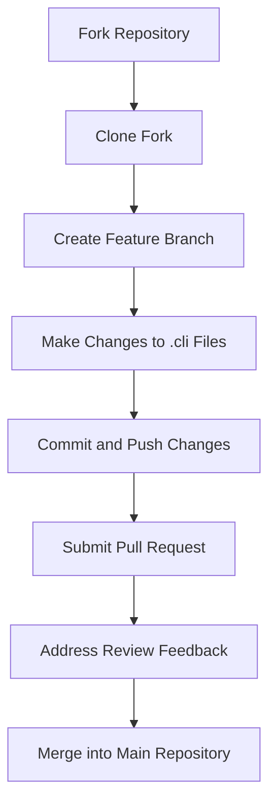
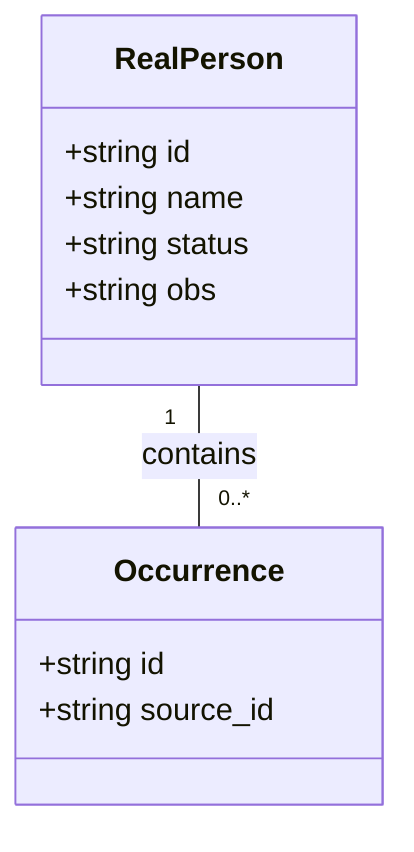
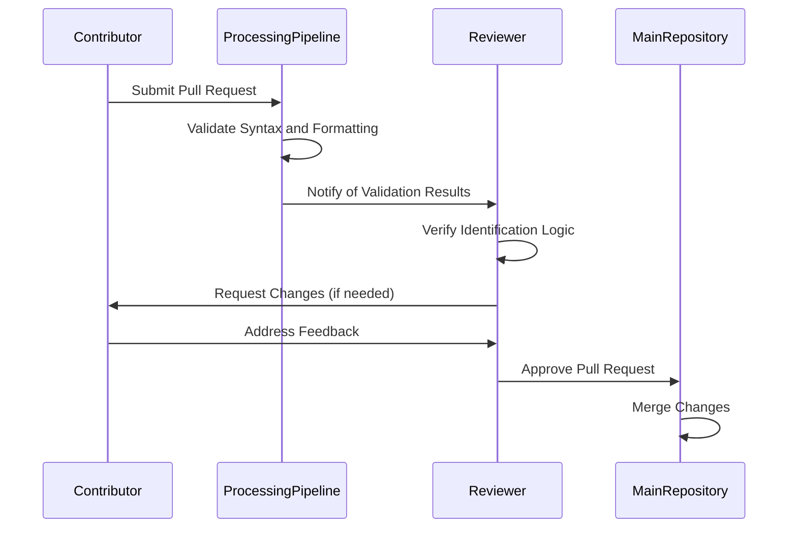

# Contribution Guidelines

<cite>
**Referenced Files in This Document**   
- [README.md](file://README.md)
- [extras/doc/Dehergne_transcription_format.md](file://extras/doc/Dehergne_transcription_format.md)
- [extras/doc/How_to_transcribe.md](file://extras/doc/How_to_transcribe.md)
- [identifications/mhk_identification_toliveira.cli.exclude](file://identifications/mhk_identification_toliveira.cli.exclude)
- [sources/dehergne-a.cli](file://sources/dehergne-a.cli)
- [notebooks/dehergne_util.py](file://notebooks/dehergne_util.py)
- [extras/scripts/updateFromTemplate.sh](file://extras/scripts/updateFromTemplate.sh)
</cite>

## Table of Contents
1. [Introduction](#introduction)
2. [Contribution Workflow](#contribution-workflow)
3. [Transcription Standards](#transcription-standards)
4. [Identification Rules and Exclusions](#identification-rules-and-exclusions)
5. [Review Process](#review-process)
6. [Contributing Utility Scripts and Analysis Notebooks](#contributing-utility-scripts-and-analysis-notebooks)
7. [Community Guidelines and Contact Information](#community-guidelines-and-contact-information)

## Introduction

The dehergne project is a collaborative effort to transcribe and analyze Joseph Dehergne's "Répertoire des Jésuites de Chine de 1552 à 1800," a biographical dictionary of Jesuit missionaries in China. This repository contains transcriptions of historical sources in the Kleio format, processed through the Timelink system for historical data management. The project aims to expand and improve the dataset by incorporating contributions from researchers and transcribers worldwide.

This document outlines the contribution guidelines for expanding and enhancing the dehergne dataset. It provides detailed instructions on how to participate in the project, covering the contribution workflow, transcription standards, identification rules, review processes, and community guidelines. The goal is to ensure consistency, accuracy, and collaboration in the transcription and analysis of historical data related to Jesuit missionaries in China.

**Section sources**
- [README.md](file://README.md#L1-L87)

## Contribution Workflow

To contribute to the dehergne project, follow these steps to ensure a smooth and organized workflow:

1. **Fork the Repository**: Begin by forking the dehergne repository on GitHub. This creates a personal copy of the project under your GitHub account, allowing you to make changes without affecting the main repository.

2. **Clone the Fork**: Clone your forked repository to your local machine using Git. This enables you to work on the files directly on your computer.

3. **Create a Feature Branch**: Create a new branch for your specific contribution. This branch should have a descriptive name that reflects the nature of your changes, such as `transcribe-new-entries` or `fix-identification-errors`. Working on a separate branch helps keep your changes organized and makes it easier to manage multiple contributions simultaneously.

4. **Make Changes**: Edit the `.cli` files or update identification rules as needed. Ensure that your changes adhere to the transcription standards and coding guidelines outlined in this document. Use the provided templates and examples to maintain consistency in formatting and structure.

5. **Commit and Push**: After making your changes, commit them with a clear and concise commit message that describes the modifications. Push your commits to your forked repository on GitHub.

6. **Submit a Pull Request**: Open a pull request (PR) from your feature branch to the main repository's `main` branch. In the PR description, provide a detailed explanation of your changes, including the rationale behind them and any relevant context. This helps reviewers understand your contribution and facilitates the review process.

7. **Address Feedback**: Reviewers may provide feedback or request changes to your PR. Address their comments promptly and make the necessary adjustments. Once your PR is approved, it will be merged into the main repository.

For contributors who need to update their fork with changes from the original repository, use the `updateFromTemplate.sh` script provided in the `extras/scripts/` directory. This script adds the original repository as a remote, pulls the latest changes, and removes the remote to prevent accidental pushes.



**Diagram sources**
- [extras/scripts/updateFromTemplate.sh](file://extras/scripts/updateFromTemplate.sh#L1-L23)

**Section sources**
- [extras/scripts/updateFromTemplate.sh](file://extras/scripts/updateFromTemplate.sh#L1-L23)

## Transcription Standards

Contributors must adhere to strict transcription standards to ensure the accuracy and consistency of the dehergne dataset. These standards are based on the Kleio notation system and are detailed in the `Dehergne_transcription_format.md` and `How_to_transcribe.md` documents.

### File Structure and Naming

Transcriptions are organized into separate `.cli` files for each letter of the alphabet to avoid overly large files. Each file follows a specific naming convention: `dehergne-a.cli`, `dehergne-b.cli`, etc. The header of each file includes metadata such as the source identifier, year, and type of source. For example:

```
kleio$gacto2.str
    fonte$dehergne-a/1973/Dicionário Biográfico
        /Online archive.org:details:bhsi37
        /obs=Dehergne, Joseph, Répertoire des Jésuites de Chine, de 1542 à 1800, 1973
      lista$dehergne-notices-a/0/0/0
```

### Biographical Entries

Each biographical entry begins with the `n$` group, followed by the person's name and a unique identifier (id). The id uses the prefix "deh-" followed by the name in lowercase with hyphens replacing spaces. In cases of homonyms, additional digits are appended to ensure uniqueness (e.g., `deh-antonio-de-abreu-2`).

Attributes such as nationality, Jesuit status, and Dehergne entry number are recorded using the `ls$` group. For example:

```
n$António de Abreu/id=deh-antonio-de-abreu
    ls$nacionalidade/Portugal
    ls$jesuita-estatuto/Padre
    ls$dehergne/1
```

### Date and Location Formatting

Dates are recorded in the format `AAAAMMDD`, with zeros for unknown month or day values. Locations are specified using modern names when possible, with historical names included as comments. For example:

```
ls$nascimento/Génova, Itália# @wikidata:Q1449/16550828
```

Linked data references, such as Wikidata IDs, are included to ensure unambiguous identification of locations. This practice is described in detail in the `locations_how_to.md` document.

### Handling Ambiguities and Corrections

When Dehergne's information is ambiguous or potentially incorrect, contributors should add comments to clarify the source of the information. For example, if a ship name is corrected based on Wicky's list, the comment should indicate the correction:

```
ls$embarque/Santa Marta% Dehergne tem "Santa Maria”, corrigido a partir de Wicky
```

This transparency ensures that future users of the dataset can understand the origin of the information and trust the transcription process.

**Section sources**
- [extras/doc/Dehergne_transcription_format.md](file://extras/doc/Dehergne_transcription_format.md#L1-L575)
- [extras/doc/How_to_transcribe.md](file://extras/doc/How_to_transcribe.md#L1-L100)
- [sources/dehergne-a.cli](file://sources/dehergne-a.cli#L1-L200)

## Identification Rules and Exclusions

The identification of people and other entities is a critical aspect of the dehergne project. The `identifications/` directory contains exports of the identification process, which can be used to restore identifications after importing sources into a new database.

### Identification Process

The identification process involves linking multiple occurrences of the same real person across different sources. This is achieved using the `mesmo_que` and `xmesmo_que` attributes in the Kleio notation. The `mesmo_que` attribute is used when linking occurrences within the same file, while `xmesmo_que` is used for cross-file identifications.

For example, in the `mhk_identification_toliveira.cli.exclude` file, multiple occurrences of the same person are linked using the `occ$` group:

```
rperson$rp-22/Alessandro Valignano/m/status=N/obs=Wikipedia
    occ$ivc-bio-antonio-de-almeida-per1-130-his1-131-per1-131/id=rp-22-occ1
    occ$bio-alessandro-valignano/id=rp-22-occ2
    occ$deh-luis-cerqueira-ref1/id=rp-22-occ3
    occ$deh-alessandro-valignano/id=rp-22-occ4
```

### Exclusion Rules

The `.exclude` files in the `identifications/` directory document cases where identifications are excluded or considered uncertain. These files provide valuable context for understanding the reasoning behind specific identification decisions.

For example, the `mhk_identification_toliveira.cli.exclude` file includes entries where Dehergne's information is ambiguous or potentially incorrect. One such example is the identification of Antoine Thomas:

```
rperson$rp-61/Antoine Thomas/m/status=N/obs=Dehergne 843
    occ$deh-adam-weidenfied-ref1/id=rp-61-occ1
    occ$deh-antoine-thomas/id=rp-61-occ2
    occ$deh-tome-pereira-ref1/id=rp-61-occ3
```

The comment `obs=Dehergne 843` indicates that the identification is based on Dehergne's entry number 843, but the status `N` suggests that the identification is not confirmed.

### Best Practices for Identification

When contributing to the identification process, follow these best practices:

1. **Use Linked Data**: Whenever possible, use linked data references such as Wikidata IDs to ensure unambiguous identification of entities.

2. **Document Uncertainties**: If an identification is uncertain, include a comment explaining the reasoning and any conflicting information.

3. **Avoid Over-Identification**: Only link occurrences when there is strong evidence that they refer to the same real person. Over-identification can lead to errors in the dataset.

4. **Review Existing Identifications**: Before making new identifications, review the existing `.exclude` files to understand previous decisions and avoid duplicating efforts.



**Diagram sources**
- [identifications/mhk_identification_toliveira.cli.exclude](file://identifications/mhk_identification_toliveira.cli.exclude#L1-L514)

**Section sources**
- [identifications/mhk_identification_toliveira.cli.exclude](file://identifications/mhk_identification_toliveira.cli.exclude#L1-L514)
- [identifications/README.md](file://identifications/README.md#L1-L3)

## Review Process

The review process for submitted changes is designed to ensure the accuracy, consistency, and quality of the dehergne dataset. All contributions undergo a thorough validation process before being merged into the main repository.

### Validation Through the Processing Pipeline

Submitted changes are validated through the Timelink processing pipeline, which checks for syntax errors, formatting issues, and logical inconsistencies. The pipeline uses the `timelink` Python library to parse and validate the `.cli` files. Contributors can run the validation locally using the Jupyter notebooks in the `notebooks/` directory.

For example, the `dehergne_util.py` script includes functions for extracting Wikidata IDs and calculating ages at specific dates. These utilities are used in the processing pipeline to enhance the dataset with additional information.

### Verification of Identification Logic

The identification logic in submitted changes is carefully verified to ensure that it aligns with the project's standards. Reviewers check that:

1. **Linked Data References**: All location and entity references include appropriate linked data identifiers, such as Wikidata IDs.

2. **Consistency with Existing Data**: New identifications are consistent with existing data in the repository. Reviewers cross-check new entries with the `.exclude` files to avoid conflicts.

3. **Transparency in Corrections**: Any corrections to Dehergne's information are clearly documented with comments explaining the source of the correction.

4. **Proper Use of Attributes**: The `mesmo_que` and `xmesmo_que` attributes are used correctly for linking occurrences within and across files.

### Community Review

In addition to automated validation, all pull requests are subject to community review. Project maintainers and experienced contributors review the changes, provide feedback, and suggest improvements. This collaborative approach ensures that the dataset benefits from diverse perspectives and expertise.

Reviewers may request additional information or changes to the submission. Contributors are expected to address these requests promptly and make the necessary adjustments. Once the changes are approved, the pull request is merged into the main repository.



**Diagram sources**
- [notebooks/dehergne_util.py](file://notebooks/dehergne_util.py#L1-L152)

**Section sources**
- [notebooks/dehergne_util.py](file://notebooks/dehergne_util.py#L1-L152)
- [notebooks/README.md](file://notebooks/README.md#L1-L19)
- [notebooks/requirements.txt](file://notebooks/requirements.txt#L1-L9)

## Contributing Utility Scripts and Analysis Notebooks

The dehergne project encourages contributions of new utility scripts and analysis notebooks to enhance the dataset and improve the transcription process. These contributions should be placed in the appropriate directories and follow the project's coding standards.

### Utility Scripts

Utility scripts should be added to the `extras/scripts/` directory. These scripts can automate repetitive tasks, such as updating a forked repository with changes from the original repository. For example, the `updateFromTemplate.sh` script automates the process of pulling updates from the original repository:

```bash
#!/bin/bash
git remote add template https://timelink-sources.visualstudio.com/timelink-sources-template/_git/timelink-sources-template
git pull template master
git remote rm template
```

When contributing a new utility script, ensure that it includes clear documentation and usage instructions. The script should be tested thoroughly to avoid introducing errors into the workflow.

### Analysis Notebooks

Analysis notebooks should be added to the `notebooks/` directory. These notebooks use Jupyter to interact with the `timelink` library and perform data analysis. For example, the `dehergne_util.py` script includes functions for extracting Wikidata IDs and calculating ages, which can be used in analysis notebooks.

When creating a new analysis notebook, follow these guidelines:

1. **Use Clear and Descriptive Names**: The notebook name should reflect its purpose, such as `location-analysis.ipynb` or `nacionality_analysis.ipynb`.

2. **Include Documentation**: Use Markdown cells to provide context and explanations for the analysis. This helps other contributors understand the notebook's purpose and methodology.

3. **Follow Coding Standards**: Use consistent formatting and adhere to Python best practices. Include comments to explain complex code sections.

4. **Test Thoroughly**: Ensure that the notebook runs without errors and produces accurate results. Test it with different datasets to verify its robustness.

5. **Update Requirements**: If the notebook requires additional libraries, update the `requirements.txt` file in the `notebooks/` directory.

By contributing utility scripts and analysis notebooks, you can help improve the efficiency and effectiveness of the dehergne project, making it easier for researchers and transcribers to work with the dataset.

**Section sources**
- [extras/scripts/updateFromTemplate.sh](file://extras/scripts/updateFromTemplate.sh#L1-L23)
- [notebooks/dehergne_util.py](file://notebooks/dehergne_util.py#L1-L152)
- [notebooks/README.md](file://notebooks/README.md#L1-L19)
- [notebooks/requirements.txt](file://notebooks/requirements.txt#L1-L9)

## Community Guidelines and Contact Information

The dehergne project thrives on collaboration and open communication. To foster a positive and productive community, contributors are expected to adhere to the following guidelines:

### Code of Conduct

1. **Be Respectful**: Treat all community members with respect and kindness. Avoid personal attacks, derogatory comments, and any form of harassment.

2. **Be Inclusive**: Welcome contributions from individuals of all backgrounds and expertise levels. Encourage diversity and inclusivity in all aspects of the project.

3. **Be Constructive**: Provide feedback that is helpful and constructive. Focus on the issue, not the person, and offer suggestions for improvement.

4. **Be Responsive**: Respond to comments and questions in a timely manner. If you are unable to respond immediately, acknowledge the message and provide an estimated response time.

### Contact Information

For questions, feedback, or assistance with contributions, please contact the project maintainers through the following channels:

- **GitHub Issues**: Create an issue on the dehergne repository to report bugs, request features, or ask questions.
- **GitHub Discussions**: Start a discussion to engage with the community on broader topics or seek advice.
- **Email**: For direct communication, email the project lead at [joaquim.carvalho@ieee.org](mailto:joaquim.carvalho@ieee.org).

The project is supported by Macao Polytechnic University through project RP/CIPFIC－01/2023. Additional information about the project and its contributors can be found in the `README.md` file.

By following these guidelines and engaging with the community, you can help ensure the success and sustainability of the dehergne project.

**Section sources**
- [README.md](file://README.md#L1-L87)