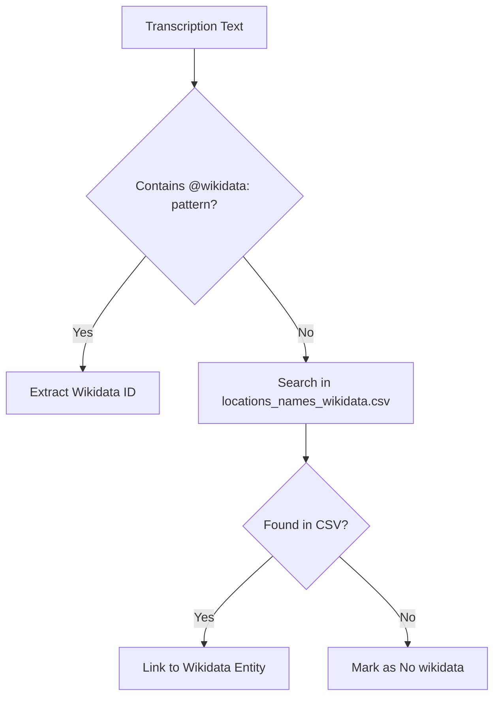
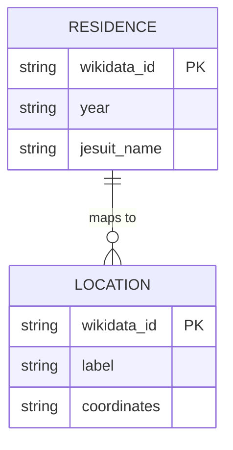
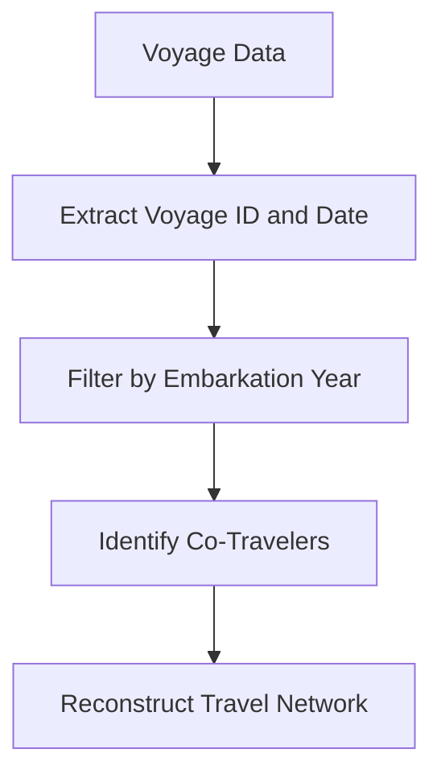
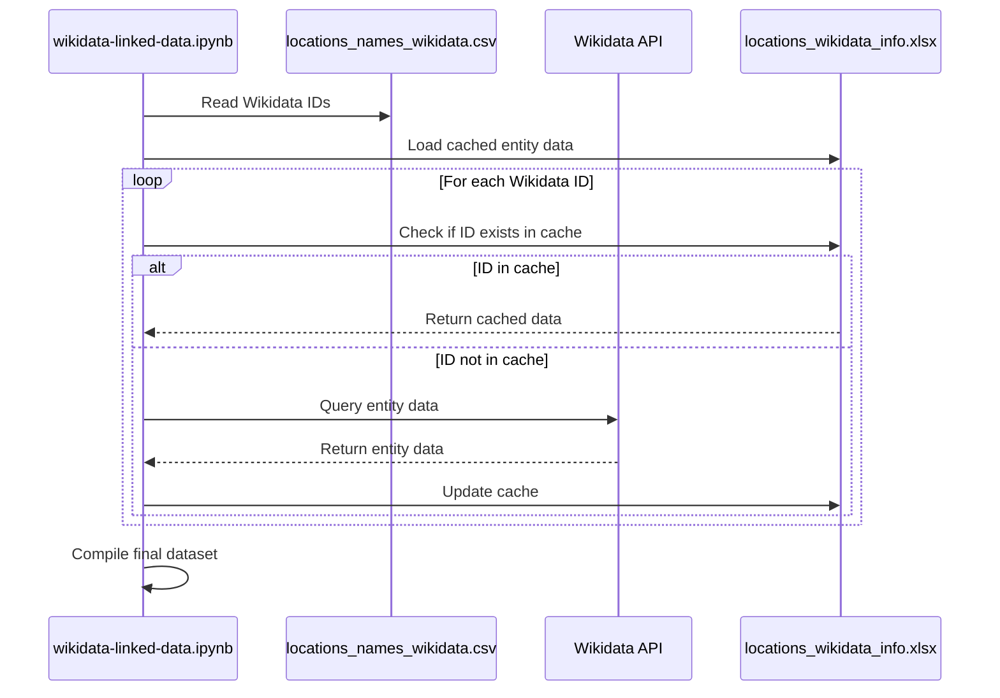

# Data Enrichment

<cite>
**Referenced Files in This Document**   
- [wikidata-linked-data.ipynb](file://notebooks/wikidata-linked-data.ipynb)
- [dehergne_util.py](file://notebooks/dehergne_util.py)
- [wicki-viagens.ipynb](file://notebooks/wicki-viagens.ipynb)
- [locations_names_wikidata.csv](file://inferences/wikidata-references/locations_names_wikidata.csv)
- [residences-1644-1701.csv](file://inferences/wikidata-references/residences-1644-1701.csv)
- [residences-1644.csv](file://inferences/wikidata-references/residences-1644.csv)
- [residences-1701.csv](file://inferences/wikidata-references/residences-1701.csv)
</cite>

## Table of Contents
1. [Introduction](#introduction)
2. [Wikidata Integration for Geographical Disambiguation](#wikidata-integration-for-geographical-disambiguation)
3. [Residence Reconstruction Using Historical CSV Files](#residence-reconstruction-using-historical-csv-files)
4. [Voyage Data Integration from Wicky's Lists](#voyage-data-integration-from-wickys-lists)
5. [SPARQL Queries and Entity Resolution Workflows](#sparql-queries-and-entity-resolution-workflows)
6. [Enrichment File Format and Structure](#enrichment-file-format-and-structure)
7. [Challenges in Data Enrichment](#challenges-in-data-enrichment)
8. [Best Practices for Curating and Validating Enriched Data](#best-practices-for-curating-and-validating-enriched-data)

## Introduction
The data enrichment component is designed to link historical data from transcriptions to external knowledge bases, primarily Wikidata, to enhance the accuracy and richness of geographical and biographical information. This document details the integration processes, file structures, and methodologies used to resolve ambiguous place names, reconstruct historical residences, and integrate voyage data. The system leverages CSV files and Jupyter notebooks to automate and validate the enrichment process, ensuring that entities such as Jesuits and locations are accurately represented and linked to canonical identifiers.

**Section sources**
- [wikidata-linked-data.ipynb](file://notebooks/wikidata-linked-data.ipynb)
- [dehergne_util.py](file://notebooks/dehergne_util.py)

## Wikidata Integration for Geographical Disambiguation
The integration with Wikidata enables the disambiguation of location names found in historical transcriptions. For example, the name "Goa" is annotated with `@wikidata:Q1171` to link it to the canonical entity representing Goa in Wikidata. This process involves extracting location names from transcriptions and matching them against a curated list of Wikidata identifiers stored in CSV files.

The `get_wikidata_id` function in `dehergne_util.py` is responsible for parsing comments and original names to extract Wikidata identifiers. It uses regular expressions to identify patterns such as `@wikidata: Q1234567`, where `Q1234567` is the Wikidata identifier. This function ensures that both the comment and original name fields are checked for Wikidata links, providing a robust mechanism for entity resolution.

**Diagram sources**
- [dehergne_util.py](file://notebooks/dehergne_util.py#L63-L81)
- [locations_names_wikidata.csv](file://inferences/wikidata-references/locations_names_wikidata.csv)

**Section sources**
- [dehergne_util.py](file://notebooks/dehergne_util.py#L63-L81)
- [wikidata-linked-data.ipynb](file://notebooks/wikidata-linked-data.ipynb)

## Residence Reconstruction Using Historical CSV Files
Residence reconstruction is achieved through the use of CSV files that map Jesuits to specific locations in the years 1644 and 1701. These files, `residences-1644.csv` and `residences-1701.csv`, contain Wikidata identifiers for each location, allowing for precise historical mapping. The combined file `residences-1644-1701.csv` provides a comprehensive view of residence data across both years.

Each row in these CSV files corresponds to a Jesuit and their associated location, identified by a Wikidata ID. The presence of "No wikidata" indicates that a location could not be matched to a Wikidata entity, highlighting areas where further research may be needed. This structured approach facilitates the reconstruction of historical residence patterns and supports longitudinal studies of Jesuit movements.

**Diagram sources**
- [residences-1644.csv](file://inferences/wikidata-references/residences-1644.csv)
- [residences-1701.csv](file://inferences/wikidata-references/residences-1701.csv)
- [residences-1644-1701.csv](file://inferences/wikidata-references/residences-1644-1701.csv)

**Section sources**
- [residences-1644.csv](file://inferences/wikidata-references/residences-1644.csv)
- [residences-1701.csv](file://inferences/wikidata-references/residences-1701.csv)

## Voyage Data Integration from Wicky's Lists
Voyage data is integrated from Wicky's lists, which document Jesuit voyages to India between 1541 and 1758. The `wicki-viagens.ipynb` notebook processes this data to reconstruct travel networks and identify co-travelers. Each voyage is assigned a unique identifier, and the notebook extracts information such as embarkation points, dates, and nationalities of the travelers.

The data is structured to include attributes like `wicky-viagem.date` and `embarque.date`, which are used to filter and analyze voyages by year. This integration allows for the visualization of travel patterns and the identification of key historical events, such as the 1657 voyage where multiple Jesuits embarked from Bom Jesus da Vidigueira.

**Diagram sources**
- [wicki-viagens.ipynb](file://notebooks/wicki-viagens.ipynb)

**Section sources**
- [wicki-viagens.ipynb](file://notebooks/wicki-viagens.ipynb)

## SPARQL Queries and Entity Resolution Workflows
The `wikidata-linked-data.ipynb` notebook demonstrates the use of SPARQL queries to fetch and resolve entities from Wikidata. The workflow begins by collecting all Wikidata IDs from the CSV files in the `inferences/wikidata-references` directory. These IDs are then used to query Wikidata for additional information such as labels, descriptions, coordinates, and administrative hierarchies.

The notebook uses the `pywikibot` library to interact with the Wikidata API, fetching data for each entity and storing it in a pandas DataFrame. This cached data is used to avoid redundant API calls and improve performance. The process includes handling exceptions and logging problems encountered during data retrieval, ensuring data integrity and completeness.

**Diagram sources**
- [wikidata-linked-data.ipynb](file://notebooks/wikidata-linked-data.ipynb)
- [locations_names_wikidata.csv](file://inferences/wikidata-references/locations_names_wikidata.csv)
- [locations_wikidata_info.xlsx](file://inferences/wikidata-references/locations_wikidata_info.xlsx)

**Section sources**
- [wikidata-linked-data.ipynb](file://notebooks/wikidata-linked-data.ipynb)

## Enrichment File Format and Structure
The enrichment files follow a consistent CSV format with a single column, `wikidata_id`, containing the Wikidata identifiers for locations. These files are used to map historical locations to their canonical representations in Wikidata. The structure is simple yet effective, allowing for easy integration and validation.

- **locations_names_wikidata.csv**: Contains all known location-to-Wikidata mappings.
- **residences-1644.csv** and **residences-1701.csv**: Contain residence data for Jesuits in the respective years.
- **residences-1644-1701.csv**: Combines residence data from both years for comprehensive analysis.

Each file may contain "No wikidata" entries, indicating locations that could not be resolved to a Wikidata entity. This flag helps identify gaps in the data and areas requiring further research.

**Section sources**
- [locations_names_wikidata.csv](file://inferences/wikidata-references/locations_names_wikidata.csv)
- [residences-1644.csv](file://inferences/wikidata-references/residences-1644.csv)
- [residences-1701.csv](file://inferences/wikidata-references/residences-1701.csv)

## Challenges in Data Enrichment
Several challenges arise in the data enrichment process:

1. **Ambiguous Place Names**: Historical documents often use variant spellings or outdated names, making it difficult to match locations to Wikidata entities.
2. **Historical Name Changes**: Locations may have changed names over time, requiring careful historical research to ensure accurate mapping.
3. **Missing Wikidata Entries**: Some locations, especially smaller or less-documented ones, may not have entries in Wikidata, necessitating manual creation or alternative data sources.
4. **Data Completeness**: The presence of "No wikidata" entries highlights gaps in the dataset, indicating areas where additional research or data collection is needed.

These challenges are addressed through a combination of automated matching, manual curation, and community contributions to Wikidata.

**Section sources**
- [wikidata-linked-data.ipynb](file://notebooks/wikidata-linked-data.ipynb)
- [dehergne_util.py](file://notebooks/dehergne_util.py)

## Best Practices for Curating and Validating Enriched Data
To ensure the quality and reliability of enriched data, the following best practices are recommended:

1. **Regular Updates**: Periodically update the Wikidata cache to include new entities and changes.
2. **Manual Verification**: Manually verify critical mappings, especially for ambiguous or historically significant locations.
3. **Community Collaboration**: Contribute new Wikidata entries for locations not already present, enhancing the global knowledge base.
4. **Error Logging**: Maintain logs of errors and issues encountered during data retrieval and resolution for troubleshooting and improvement.
5. **Version Control**: Use version control for enrichment files to track changes and maintain data integrity.

By adhering to these practices, the data enrichment process can produce accurate, reliable, and valuable historical insights.

**Section sources**
- [wikidata-linked-data.ipynb](file://notebooks/wikidata-linked-data.ipynb)
- [dehergne_util.py](file://notebooks/dehergne_util.py)