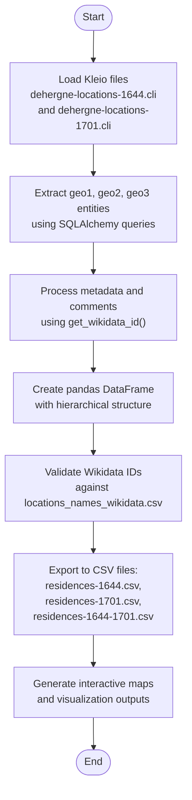
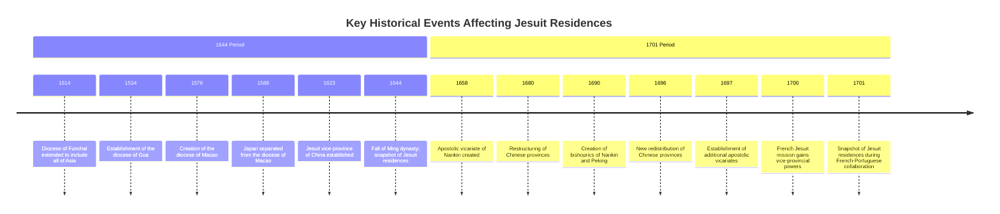
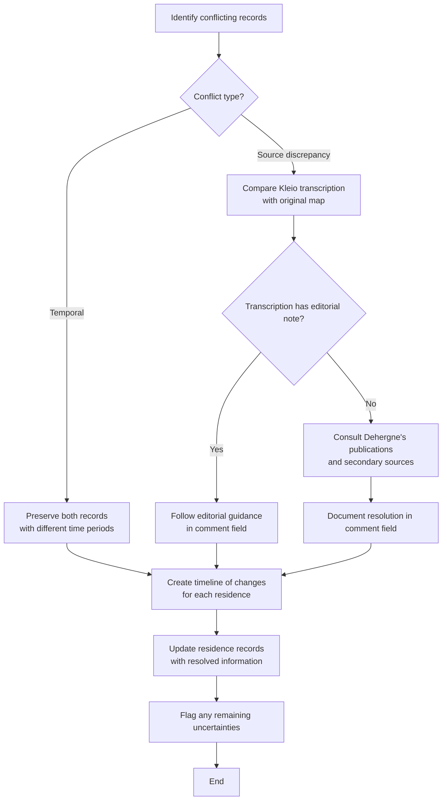
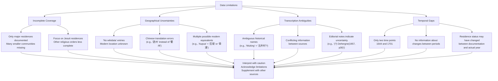
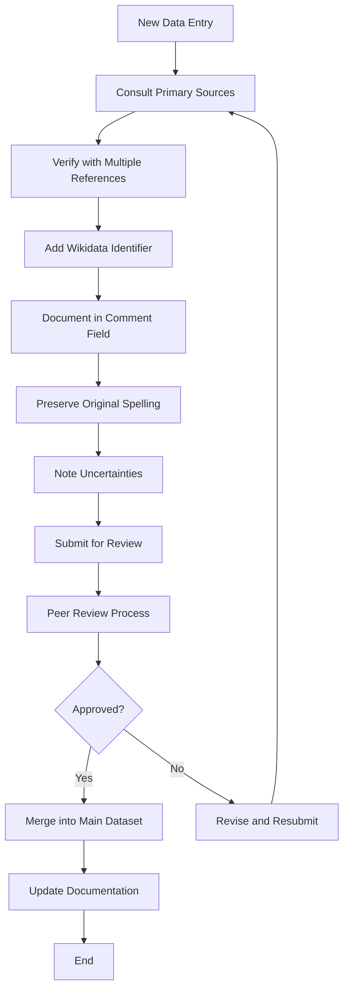

# Residence Reconstruction

<cite>
**Referenced Files in This Document**   
- [residences.ipynb](file://notebooks/residences.ipynb)
- [dehergne-locations-1644.cli](file://sources/dehergne-locations-1644.cli)
- [dehergne-locations-1701.cli](file://sources/dehergne-locations-1701.cli)
- [residences-1644.csv](file://inferences/wikidata-references/residences-1644.csv)
- [residences-1701.csv](file://inferences/wikidata-references/residences-1701.csv)
- [residences-1644-1701.csv](file://inferences/wikidata-references/residences-1644-1701.csv)
- [locations_names_wikidata.csv](file://inferences/wikidata-references/locations_names_wikidata.csv)
- [dehergne_util.py](file://notebooks/dehergne_util.py)
</cite>

## Table of Contents
1. [Introduction](#introduction)
2. [Residence Data Schema](#residence-data-schema)
3. [Data Loading and Processing](#data-loading-and-processing)
4. [Temporal Scope and Historical Context](#temporal-scope-and-historical-context)
5. [Geographical Accuracy and Validation](#geographical-accuracy-and-validation)
6. [Conflict Resolution and Data Validation](#conflict-resolution-and-data-validation)
7. [Data Limitations and Uncertainties](#data-limitations-and-uncertainties)
8. [Best Practices for Data Curation](#best-practices-for-data-curation)
9. [Spatial and Network Analysis Applications](#spatial-and-network-analysis-applications)
10. [Conclusion](#conclusion)

## Introduction

The residence reconstruction sub-feature enables the systematic mapping of Jesuit missionaries to their known residences in China during two key historical periods: 1644 and 1701. This system leverages structured datasets derived from Joseph Dehergne's seminal work, "Répertoire des Jésuites de Chine de 1552 à 1800" (1973), supplemented by his earlier research on Ming dynasty Christian communities (1957). The core of this system consists of CSV files that document the geographical distribution of Jesuit residences, providing a foundation for spatial and network analysis of missionary activities in imperial China.

The data originates from Dehergne's detailed maps of Jesuit communities ("Chrétientés") during the late Ming (1644) and early Qing (1701) periods. These maps have been transcribed into Kleio format files (`dehergne-locations-1644.cli` and `dehergne-locations-1701.cli`), which serve as the primary source for generating structured CSV datasets. The resulting residence files enable researchers to analyze the spatial distribution of Jesuit missions, track changes over time, and study the network of religious communities across China.

This documentation explains the schema of the residence datasets, demonstrates data processing techniques using the `residences.ipynb` notebook, addresses data validation and conflict resolution, and provides guidance for extending and curating the residence data for scholarly research.

**Section sources**
- [residences.ipynb](file://notebooks/residences.ipynb#L1-L800)
- [dehergne-locations-1644.cli](file://sources/dehergne-locations-1644.cli#L1-L100)
- [dehergne-locations-1701.cli](file://sources/dehergne-locations-1701.cli#L1-L100)

## Residence Data Schema

The residence datasets follow a consistent schema that captures essential information about each Jesuit residence, including its geographical hierarchy, temporal context, and metadata. The primary residence files—`residences-1644.csv`, `residences-1701.csv`, and the combined `residences-1644-1701.csv`—share a common structure with the following key fields:

- **person_id**: A unique identifier for the Jesuit missionary associated with the residence. This ID links to biographical records in the main database.
- **location_name**: The historical name of the residence location as recorded by Dehergne, often including multiple transliterations (e.g., "Hangchou#Hang-tcheou, today Hangzhou, 杭州").
- **wikidata_id**: The Wikidata identifier (Q-number) for the geographical location, enabling integration with modern geographical databases and mapping services.
- **time_period**: The year (1644 or 1701) indicating when the residence was documented, corresponding to the two historical snapshots.
- **province**: The provincial-level administrative division in which the residence was located (e.g., Chekiang, Fukien).
- **fou**: The prefectural-level administrative unit (fou), which represents a major city or administrative center.
- **level**: The administrative level of the location, categorized as "province", "fou", or "tcheou-hien" (county-level).
- **the_line**: A numerical identifier that preserves the original ordering of entries from the source Kleio files.
- **comment**: Additional contextual information, including modern Chinese characters, geographical coordinates, and editorial notes about name variations or uncertainties.

The schema reflects a hierarchical geographical structure, with provinces containing multiple fou, and fou containing multiple tcheou-hien. This hierarchy is preserved in the CSV files through the relationships between the province, fou, and level fields. For example, a residence at the county level will have both a province and fou value, while a prefectural-level residence will have a province value but no fou value.

The `locations_names_wikidata.csv` file serves as a reference dataset that maps Wikidata identifiers to their corresponding geographical entities, facilitating data validation and integration with external knowledge bases. This file contains only the wikidata_id column and is used to verify the consistency of geographical identifiers across different datasets.

**Section sources**
- [residences-1644.csv](file://inferences/wikidata-references/residences-1644.csv#L1-L169)
- [residences-1701.csv](file://inferences/wikidata-references/residences-1701.csv#L1-L146)
- [residences-1644-1701.csv](file://inferences/wikidata-references/residences-1644-1701.csv#L1-L313)
- [locations_names_wikidata.csv](file://inferences/wikidata-references/locations_names_wikidata.csv#L1-L800)

## Data Loading and Processing

The `residences.ipynb` notebook provides a comprehensive workflow for loading, processing, and analyzing the residence data. The process begins by extracting geographical information from the Kleio transcription files (`dehergne-locations-1644.cli` and `dehergne-locations-1701.cli`) using the Timelink database interface. The notebook establishes a connection to the database and retrieves geographical entities at three hierarchical levels: geo1 (province), geo2 (fou), and geo3 (tcheou-hien).

The data loading process involves querying the database for all geographical entities associated with the 1644 and 1701 residence lists. For each entity, the system extracts the name, administrative level, and any associated metadata, including Wikidata identifiers and editorial comments. The `get_wikidata_id` function from `dehergne_util.py` plays a crucial role in this process, parsing the comment field to extract Wikidata identifiers in the format `@wikidata:Q1234567`.



**Diagram sources**
- [residences.ipynb](file://notebooks/residences.ipynb#L80-L200)
- [dehergne_util.py](file://notebooks/dehergne_util.py#L63-L81)

The notebook creates a comprehensive DataFrame that includes all residences from both time periods, preserving the hierarchical relationships between provinces, prefectures, and counties. Each row in the DataFrame represents a specific residence, with columns for the location name, Wikidata identifier, administrative level, and any associated comments or notes. The resulting data structure enables flexible filtering and analysis, allowing researchers to examine residences at different geographical scales or focus on specific regions of interest.

The processing pipeline also includes data validation steps to ensure the accuracy and consistency of Wikidata identifiers. The system cross-references the extracted Wikidata IDs with the `locations_names_wikidata.csv` file to verify their validity and detect any potential errors or inconsistencies. This validation process helps maintain data quality and ensures that geographical references are accurate and up-to-date.

**Section sources**
- [residences.ipynb](file://notebooks/residences.ipynb#L80-L800)
- [dehergne_util.py](file://notebooks/dehergne_util.py#L63-L81)

## Temporal Scope and Historical Context

The residence reconstruction system focuses on two pivotal moments in the history of Jesuit missions in China: 1644 and 1701. These years represent significant historical transitions that shaped the development and distribution of Christian communities in China. The year 1644 marks the fall of the Ming dynasty and the establishment of Qing rule, a period of political upheaval that had profound implications for foreign missionaries and their activities. The residence data for this year reflects the geographical distribution of Jesuit communities at the end of the Ming dynasty, capturing the extent of missionary work during a period of relative openness to foreign influence.

The 1701 dataset represents a later phase of Jesuit activity during the early Qing dynasty, a period characterized by both expansion and increasing restrictions on missionary work. By 1701, the Jesuit mission in China had evolved significantly, with the establishment of new administrative structures and the division of responsibilities between different missionary groups. The notebook notes that since November 30, 1700, the French Jesuit mission had been sharing responsibilities with the Portuguese vice-province, reflecting the growing internationalization of the Jesuit presence in China.



**Diagram sources**
- [residences.ipynb](file://notebooks/residences.ipynb#L1-L50)
- [dehergne-locations-1644.cli](file://sources/dehergne-locations-1644.cli#L6-L18)
- [dehergne-locations-1701.cli](file://sources/dehergne-locations-1701.cli#L6-L18)

The temporal scope of these datasets allows researchers to analyze changes in the geographical distribution of Jesuit residences over a 57-year period. This comparative analysis can reveal patterns of expansion, contraction, or relocation of missionary activities in response to political, social, and religious factors. The data shows how Jesuit communities adapted to changing circumstances, with some residences being maintained continuously while others were abandoned or transferred to different religious orders.

The historical context documented in the source Kleio files provides valuable insights into the administrative and ecclesiastical structures that governed Jesuit activities during these periods. For example, the 1644 file explains that the diocese of Macao theoretically encompassed the entire Chinese empire, while the 1701 file describes the creation of new apostolic vicariates that reorganized the territorial responsibilities of missionary groups. These administrative changes are reflected in the residence data, with shifts in the distribution and management of Jesuit communities across different regions of China.

**Section sources**
- [dehergne-locations-1644.cli](file://sources/dehergne-locations-1644.cli#L6-L18)
- [dehergne-locations-1701.cli](file://sources/dehergne-locations-1701.cli#L6-L18)

## Geographical Accuracy and Validation

The residence reconstruction system employs a multi-layered approach to ensure geographical accuracy and validate the location data. The primary method involves linking historical place names to modern geographical entities through Wikidata identifiers, which provide standardized references to contemporary locations. This linkage enables the integration of historical data with modern mapping technologies and geographical databases, facilitating spatial analysis and visualization.

The validation process begins with the extraction of Wikidata identifiers from the comment fields of the Kleio transcription files. These identifiers are typically embedded in the format `@wikidata:Q1234567` and are parsed using the `get_wikidata_id` function from `dehergne_util.py`. The function carefully processes the comment text to extract the Wikidata ID while preserving the surrounding contextual information. When a Wikidata identifier is not available, the system records "No wikidata" as the value, clearly indicating cases of geographical uncertainty.

For locations with Wikidata identifiers, the system cross-references the IDs with the `locations_names_wikidata.csv` file to verify their validity and consistency. This reference file serves as a master list of geographical entities, ensuring that the same location is consistently identified across different datasets and time periods. The validation process also checks for potential errors in the transcription process, such as incorrect characters or misinterpretations of historical names.

```mermaid
flowchart TD
A[Start] --> B[Extract location names and comments\nfrom Kleio files]
B --> C{Wikidata ID present\nin comment?}
C --> |Yes| D[Parse Wikidata ID\nusing get_wikidata_id()]
C --> |No| E[Record "No wikidata"\nand flag for review]
D --> F[Validate against\nlocations_names_wikidata.csv]
F --> G{Valid ID?}
G --> |Yes| H[Confirm geographical accuracy]
G --> |No| I[Flag as potential error\nfor manual review]
H --> J[Use coordinates for mapping\nand spatial analysis]
I --> K[Research alternative sources\nor historical records]
J --> L[End]
K --> L
```

**Diagram sources**
- [dehergne_util.py](file://notebooks/dehergne_util.py#L63-L81)
- [locations_names_wikidata.csv](file://inferences/wikidata-references/locations_names_wikidata.csv#L1-L100)

The system also incorporates additional geographical information when available, such as explicit coordinates provided in the comment fields. The `extract_coordinates` function in `dehergne_util.py` can parse various coordinate formats, including decimal degrees, signed decimal degrees, and degrees-minutes-seconds (DMS) notation. This capability allows the system to incorporate precise geographical data when it is available in the source materials, enhancing the accuracy of spatial analyses and visualizations.

Despite these validation measures, some geographical uncertainties remain, particularly for locations with ambiguous or conflicting historical records. The system transparently documents these uncertainties by preserving the original comment text and clearly indicating cases where Wikidata identifiers are missing or unverified. This approach ensures that researchers can assess the reliability of geographical data and make informed decisions about its use in their analyses.

**Section sources**
- [dehergne_util.py](file://notebooks/dehergne_util.py#L84-L152)
- [locations_names_wikidata.csv](file://inferences/wikidata-references/locations_names_wikidata.csv#L1-L100)

## Conflict Resolution and Data Validation

The residence reconstruction system implements a systematic approach to resolving conflicts and validating data, particularly when dealing with overlapping or contradictory records from different sources. The primary source of potential conflicts is the comparison between the 1644 and 1701 datasets, which may show different statuses or affiliations for the same residence. For example, a residence that was occupied by Jesuits in 1644 might be listed as occupied by Dominicans (OP) or Franciscans (OFM) in 1701, reflecting changes in religious administration over time.

The system resolves these conflicts by preserving the historical context and documenting the changes explicitly in the data. Rather than attempting to create a single "correct" version of events, the system maintains separate records for each time period, allowing researchers to trace the evolution of each residence over time. This approach respects the historical accuracy of the source materials and provides a more nuanced understanding of the dynamic nature of missionary activities in China.

When conflicts arise within the same time period, such as discrepancies between the Kleio transcription and the original map, the system follows a hierarchical validation process. The primary source is considered to be the Kleio transcription, which has been carefully prepared by experts. However, when the transcription contains uncertainties or ambiguities, the system refers back to the original map and Dehergne's published work for clarification. Editorial notes in the comment field often provide guidance on resolving these conflicts, such as noting when a place name in the Chinese translation is likely incorrect.



**Diagram sources**
- [dehergne-locations-1644.cli](file://sources/dehergne-locations-1644.cli#L100-L200)
- [dehergne-locations-1701.cli](file://sources/dehergne-locations-1701.cli#L100-L200)

The validation process also involves cross-referencing the residence data with other sources, such as Dehergne's 1957 article on Ming dynasty Christian communities and the Gazetteer of Chinese Geographic Names (Gaimushō, 1943). These secondary sources provide additional context and can help resolve ambiguities in the primary data. For example, when a place name in the Chinese translation appears to be incorrect, the system may consult these sources to identify the most likely modern equivalent.

The system maintains a transparent record of all validation and conflict resolution decisions in the comment field of each residence record. This documentation includes references to the sources consulted, the reasoning behind specific decisions, and any remaining uncertainties. This approach ensures that the data is not only accurate but also interpretable, allowing future researchers to understand the provenance and reliability of each piece of information.

**Section sources**
- [dehergne-locations-1644.cli](file://sources/dehergne-locations-1644.cli#L100-L200)
- [dehergne-locations-1701.cli](file://sources/dehergne-locations-1701.cli#L100-L200)

## Data Limitations and Uncertainties

The residence reconstruction data, while comprehensive, contains several important limitations and uncertainties that researchers should be aware of when interpreting the results. These limitations stem from the nature of the historical sources, the transcription process, and the inherent challenges of mapping historical geographical data to modern standards.

One significant limitation is the incomplete coverage of residences, particularly for the 1701 period. As noted in the source documentation, the 1701 list is described as "incomplet" with the acknowledgment that "multa sunt templa et sacella in pagis et oppidis, quae non recensui" (many temples and chapels in villages and towns which I have not recorded). This incompleteness reflects the practical challenges of documenting all missionary activities across a vast geographical area and should be considered when analyzing the distribution and density of Jesuit communities.

Another major source of uncertainty is the geographical identification of some locations, particularly smaller towns and villages. While major cities like Hangchou (Hangzhou) and Foochow (Fuzhou) have clear modern equivalents and Wikidata identifiers, many smaller locations are identified with less certainty. The data includes numerous entries with "No wikidata" as the identifier, indicating that the modern location could not be definitively established. In some cases, the Chinese translation of a place name may be incorrect or ambiguous, as noted in editorial comments (e.g., "in the Chinese translation it is recognized as '遂州', which is wrong, both phonetically and geographically").



**Diagram sources**
- [residences-1644.csv](file://inferences/wikidata-references/residences-1644.csv#L1-L169)
- [residences-1701.csv](file://inferences/wikidata-references/residences-1701.csv#L1-L146)
- [dehergne-locations-1644.cli](file://sources/dehergne-locations-1644.cli#L100-L200)

The temporal scope of the data is also limited to two specific years, 1644 and 1701, which creates gaps in understanding how residences evolved between these periods. While these snapshots provide valuable insights into the geographical distribution of Jesuit communities at key historical moments, they do not capture the dynamic changes that occurred in the intervening years. The status of a residence in 1644 may have changed significantly by 1701, but the data does not document the intermediate developments.

Transcription ambiguities further contribute to the uncertainties in the data. Some place names are recorded with multiple possible interpretations or with editorial notes indicating uncertainty. For example, the residence "Niensien" is noted as "A côté de Hai keu on cite, en 1639, une chrétienté 'Nien sien', dont nous ignorons tout" (near Hai keu, a Christian community 'Nien sien' is mentioned in 1639, about which we know nothing). These uncertainties are preserved in the data rather than being resolved arbitrarily, maintaining the integrity of the historical record while acknowledging its limitations.

**Section sources**
- [residences-1644.csv](file://inferences/wikidata-references/residences-1644.csv#L1-L169)
- [residences-1701.csv](file://inferences/wikidata-references/residences-1701.csv#L1-L146)
- [dehergne-locations-1644.cli](file://sources/dehergne-locations-1644.cli#L100-L200)

## Best Practices for Data Curation

To ensure the long-term accuracy, consistency, and usability of the residence data, researchers should follow established best practices for data curation and extension. These practices focus on maintaining data integrity, documenting changes transparently, and leveraging external resources to enhance the quality and reliability of the information.

When extending the residence data, researchers should prioritize the use of primary sources, particularly Dehergne's original publications and maps. Any new entries should be accompanied by clear references to the source material, including page numbers and figure references where applicable. When adding Wikidata identifiers, curators should verify the accuracy of the geographical match by consulting multiple sources, including historical maps, geographical databases, and scholarly publications on Chinese historical geography.



**Diagram sources**
- [dehergne-locations-1644.cli](file://sources/dehergne-locations-1644.cli#L70-L89)
- [dehergne-locations-1701.cli](file://sources/dehergne-locations-1701.cli#L69-L88)

A critical best practice is to preserve the original spelling and transliteration of place names while adding modern equivalents and clarifications in the comment field. This approach maintains the historical authenticity of the data while making it more accessible to contemporary researchers. For example, the name "Hangchou#Hang-tcheou, today Hangzhou, 杭州" preserves the historical forms while providing the modern standard name.

When encountering uncertainties or ambiguities, curators should document these explicitly in the comment field rather than making arbitrary decisions. The use of clear notation such as "(?)" or "probably" helps future researchers understand the level of confidence in each piece of information. Editorial notes should also explain the reasoning behind any interpretations or corrections, such as noting when a Chinese translation is likely incorrect based on phonetic or geographical evidence.

Regular validation against external datasets, such as the `locations_names_wikidata.csv` file, helps maintain consistency across the residence data. Curators should check for duplicate entries, conflicting information, and missing Wikidata identifiers as part of routine maintenance. When discrepancies are found, they should be investigated and resolved following the conflict resolution procedures documented in this guide.

Finally, all changes to the residence data should be version-controlled and documented, with clear records of who made each change and when. This transparency ensures accountability and allows researchers to track the evolution of the dataset over time. The use of a peer review process for significant additions or modifications helps maintain high standards of quality and accuracy.

**Section sources**
- [dehergne-locations-1644.cli](file://sources/dehergne-locations-1644.cli#L70-L89)
- [dehergne-locations-1701.cli](file://sources/dehergne-locations-1701.cli#L69-L88)

## Spatial and Network Analysis Applications

The residence reconstruction data provides a robust foundation for spatial and network analysis of Jesuit distribution in China during the 17th and early 18th centuries. The structured CSV files, with their hierarchical geographical information and Wikidata identifiers, enable researchers to create detailed maps, analyze spatial patterns, and study the network of missionary communities across different regions of China.

One primary application is the creation of interactive maps that visualize the geographical distribution of Jesuit residences in 1644 and 1701. The `residences.ipynb` notebook generates an HTML map (`residences_1644_map.html`) that displays the locations of residences using the Wikidata identifiers to position them accurately on a modern basemap. This visualization allows researchers to identify clusters of missionary activity, trace the expansion of Jesuit communities along major transportation routes, and compare the geographical reach of the mission at different historical moments.

```mermaid
graph TD
A[Jesuit Residence Data] --> B[Spatial Analysis]
A --> C[Network Analysis]
A --> D[Temporal Analysis]
B --> B1[Create heat maps of\nmissionary density]
B --> B2[Analyze proximity to\nmajor cities and rivers]
B --> B3[Identify geographical clusters\nand isolated communities]
B --> B4[Calculate travel distances\nbetween residences]
C --> C1[Map affiliation networks\n(Jesuit, Dominican, Franciscan)]
C --> C2[Analyze hierarchical structure\n(province-fou-tcheou-hien)]
C --> C3[Study collaboration patterns\nbetween French and Portuguese missions]
C --> C4[Identify central nodes in\nthe missionary network]
D --> D1[Compare 1644 and 1701 distributions]
D --> D2[Track changes in residence status\n(active, inactive, transferred)]
D --> D3[Analyze expansion or contraction\nof missionary activities]
D --> D4[Study impact of political changes\non missionary distribution]
B1 --> E[Research Insights]
B2 --> E
B3 --> E
B4 --> E
C1 --> E
C2 --> E
C3 --> E
C4 --> E
D1 --> E
D2 --> E
D3 --> E
D4 --> E
E[Understanding of Jesuit\nmissionary strategies\nand historical dynamics]
```

**Diagram sources**
- [residences.ipynb](file://notebooks/residences.ipynb#L1-L50)
- [residences-1644.csv](file://inferences/wikidata-references/residences-1644.csv#L1-L169)
- [residences-1701.csv](file://inferences/wikidata-references/residences-1701.csv#L1-L146)

Network analysis can reveal the organizational structure of the Jesuit mission and the relationships between different residences. By treating each residence as a node and connections between residences as edges (based on administrative hierarchy or geographical proximity), researchers can identify central hubs of missionary activity, analyze the flow of personnel and resources, and study the resilience of the network to disruptions. The hierarchical structure of provinces, prefectures, and counties provides a natural framework for analyzing the administrative organization of the mission.

Temporal analysis comparing the 1644 and 1701 datasets allows researchers to study the evolution of the Jesuit presence in China over a 57-year period. This analysis can identify patterns of expansion into new regions, contraction in areas of increased persecution, and shifts in the geographical focus of missionary activities. The data shows how the mission adapted to changing political circumstances, with some residences being maintained continuously while others were abandoned or transferred to different religious orders.

The integration of Wikidata identifiers enables linkage with other datasets, facilitating more comprehensive analyses. Researchers can combine the residence data with information on individual missionaries, historical events, and socio-economic conditions to create multidimensional studies of Jesuit activities in China. This integrative approach allows for a deeper understanding of the factors that influenced the success and challenges of missionary work during this period.

**Section sources**
- [residences.ipynb](file://notebooks/residences.ipynb#L1-L50)
- [residences-1644.csv](file://inferences/wikidata-references/residences-1644.csv#L1-L169)
- [residences-1701.csv](file://inferences/wikidata-references/residences-1701.csv#L1-L146)

## Conclusion

The residence reconstruction sub-feature provides a powerful tool for studying the geographical distribution and historical development of Jesuit missions in China during two critical periods: 1644 and 1701. By leveraging structured CSV files derived from Joseph Dehergne's authoritative work, the system enables detailed spatial and network analysis of missionary communities across imperial China. The data schema, with its hierarchical geographical structure and integration of Wikidata identifiers, supports sophisticated analyses while maintaining close ties to the original historical sources.

The process of data loading and processing, as demonstrated in the `residences.ipynb` notebook, showcases a robust workflow for transforming Kleio transcription files into structured datasets suitable for scholarly research. The system's emphasis on data validation, conflict resolution, and transparent documentation of uncertainties ensures the reliability and interpretability of the results. Researchers can confidently use this data to explore patterns of missionary activity, analyze the impact of historical events on religious communities, and study the network of Jesuit residences across different regions of China.

While the data has certain limitations, including incomplete coverage and geographical uncertainties, these are openly documented and can be addressed through careful curation and the integration of additional sources. The best practices outlined in this documentation provide guidance for extending and maintaining the residence data, ensuring its continued value for future research. As a foundation for spatial and network analysis, the residence reconstruction system offers valuable insights into the complex dynamics of Jesuit missionary work in China during a period of significant historical transformation.

**Section sources**
- [residences.ipynb](file://notebooks/residences.ipynb#L1-L30597)
- [dehergne-locations-1644.cli](file://sources/dehergne-locations-1644.cli#L1-L758)
- [dehergne-locations-1701.cli](file://sources/dehergne-locations-1701.cli#L1-L574)