# Voyage Reconstruction

<cite>
**Referenced Files in This Document**   
- [wicki-viagens.ipynb](file://notebooks/wicki-viagens.ipynb)
- [Dehergne_transcription_format.md](file://extras/doc/Dehergne_transcription_format.md)
- [dehergne_util.py](file://notebooks/dehergne_util.py)
</cite>

## Table of Contents
1. [Introduction](#introduction)
2. [Data Sources and Methodology](#data-sources-and-methodology)
3. [Voyage Data Model](#voyage-data-model)
4. [Data Alignment Process](#data-alignment-process)
5. [Timeline Construction](#timeline-construction)
6. [Network Graph Generation](#network-graph-generation)
7. [Challenges in Voyage Reconstruction](#challenges-in-voyage-reconstruction)
8. [Best Practices for Validation](#best-practices-for-validation)
9. [Conclusion](#conclusion)

## Introduction
The voyage reconstruction sub-feature enables the systematic reconstruction of travel itineraries for Jesuit missionaries by integrating data from Wicky's voyage lists with biographical transcriptions from Dehergne's dictionary. This documentation details the methodology for parsing and aligning voyage records with individual entries in the database, including departure and arrival dates, ports, and routes. The system leverages Josef Wicky's comprehensive list of Jesuit voyages to India (1541-1758) as a primary source for voyage data, which is then aligned with biographical information from Joseph Dehergne's biographical dictionary of Jesuits in China.

The reconstruction process involves several key components: data extraction from primary sources, alignment of voyage records with individual biographies, timeline construction, and network graph generation. This integrated approach allows researchers to visualize and analyze the complex travel patterns of Jesuit missionaries across centuries, providing insights into their journeys, companions, and the historical context of their travels.

The system is implemented through Jupyter notebooks that utilize the TimeLink framework for data management and analysis. The primary notebook for voyage reconstruction, `wicki-viagens.ipynb`, contains the core functionality for extracting, aligning, and visualizing voyage data. This documentation will explore the technical implementation, data model, and analytical capabilities of the voyage reconstruction system.

**Section sources**
- [wicki-viagens.ipynb](file://notebooks/wicki-viagens.ipynb#L1-L50)

## Data Sources and Methodology
The voyage reconstruction system integrates two primary data sources: Josef Wicky's "Liste der Jesuiten-Indienfahrer 1541-1758" and Joseph Dehergne's "Répertoire des Jésuites de Chine, de 1542 à 1800." Wicky's work provides a comprehensive list of Jesuit voyages to India, assigning sequential numbers to each armada and individual missionaries. Dehergne's biographical dictionary contains detailed information about Jesuit missionaries, including their nationalities, dates of entry into the Society of Jesus, and voyage information.

The methodology for data integration involves several steps. First, biographical data is extracted from Dehergne's dictionary using the Kleio transcription format, which structures biographical information in a machine-readable format. Each biographical entry includes attributes such as nationality, entry into the Society of Jesus, and voyage information. The voyage data from Dehergne's work is then enhanced with additional information from Wicky's lists to reconstruct complete travel itineraries.

The integration process addresses a key limitation in Dehergne's original work: while he records the sequential number of each missionary in Wicky's lists, he does not include the armada number. This omission prevents the reconstruction of which missionaries traveled together. To overcome this limitation, the system supplements Dehergne's data with the armada numbers from Wicky's original work, enabling the identification of travel companions and the reconstruction of complete voyage groups.

The data processing is implemented in Python using pandas for data manipulation and the TimeLink framework for database operations. The `entities_with_attribute` function is used to extract individuals with specific voyage attributes, allowing for the filtering and analysis of voyage data. This approach enables researchers to query the database for specific voyages, identify all missionaries who traveled on a particular armada, and analyze temporal patterns in Jesuit voyages.

**Section sources**
- [wicki-viagens.ipynb](file://notebooks/wicki-viagens.ipynb#L1-L150)
- [Dehergne_transcription_format.md](file://extras/doc/Dehergne_transcription_format.md#L209-L255)

## Voyage Data Model
The voyage reconstruction system implements a structured data model that represents voyages as attributes linked to individual person entities. The data model is based on the Kleio transcription format, which uses a hierarchical structure to organize biographical information. Each person entity can have multiple voyage-related attributes that capture different aspects of their travel history.

The core components of the voyage data model include:

- **wicky-viagem**: This attribute records the armada number and date of a missionary's voyage to India. It enables the identification of which armada a missionary traveled on and when the voyage occurred.
- **embarque**: This attribute captures the name of the ship and the date of embarkation. It provides specific details about the vessel used for the voyage.
- **wicky**: This attribute records the sequential number of the missionary within Wicky's list for a particular armada. It serves as a unique identifier for the missionary within the context of a specific voyage.
- **jesuita-entrada**: This attribute documents the location and date when a missionary entered the Society of Jesus. It provides context for the missionary's background and training before their voyage.
- **nacionalidade**: This attribute records the nationality of the missionary, which is important for understanding the international composition of Jesuit missions.

The data model also includes attributes for tracking the missionary's journey after arrival in Asia, such as **estadia** (residence), **chegada** (arrival), and **partida** (departure). These attributes allow for the reconstruction of the complete travel itinerary, from departure from Europe to final destinations in Asia.

The implementation of the data model follows the principles of linked data, with each attribute potentially containing references to external databases such as Wikidata. This approach enables the integration of additional contextual information about locations and historical events. The use of standardized attribute names and structured data formats ensures consistency across the dataset and facilitates automated analysis and visualization.

**Section sources**
- [Dehergne_transcription_format.md](file://extras/doc/Dehergne_transcription_format.md#L209-L255)
- [wicki-viagens.ipynb](file://notebooks/wicki-viagens.ipynb#L80-L126)

## Data Alignment Process
The data alignment process is a critical component of the voyage reconstruction system, enabling the integration of voyage records from Wicky's lists with biographical entries in the database. The process involves several steps to ensure accurate matching and temporal consistency between the different data sources.

The alignment begins with the extraction of individuals who have voyage attributes in the database. Using the `entities_with_attribute` function, the system queries for all person entities with a 'wicky-viagem' attribute, retrieving their associated data including name, nationality, embarkation details, and entry into the Society of Jesus. This initial extraction creates a comprehensive dataset of missionaries with recorded voyages.

To ensure temporal consistency, the system performs a year-based alignment between the voyage date and the embarkation date. This is implemented by extracting the year from both dates and filtering for records where the years match:

```python
travellers['wicky-viagem.date.year'] = travellers['wicky-viagem.date'].str[:4]
travellers['embarque.date.year'] = travellers['embarque.date'].str[:4]
travellers = travellers[travellers['wicky-viagem.date.year'] == travellers['embarque.date.year']]
```

This alignment step addresses potential discrepancies in the recorded dates and ensures that only voyages with consistent temporal information are included in the analysis. The process also filters for individuals with a groupname of 'n', which excludes references to parents, mothers, and other secondary mentions that are not the primary subject of the biographical entry.

The alignment process also involves the integration of additional voyage information from Wicky's original work. As noted in the documentation, Dehergne's work only records the sequential number of each missionary in Wicky's lists, not the armada number. To reconstruct complete voyage groups, the system supplements this information with the armada numbers from Wicky's original publication. This enhancement allows researchers to identify all missionaries who traveled on the same armada, even if they embarked on different ships.

The aligned data is then organized and sorted to facilitate analysis and visualization. The system sorts the data by embarkation point, name, entry location, nationality, and voyage year, creating a structured dataset that can be easily queried and analyzed. This organized dataset serves as the foundation for subsequent timeline construction and network graph generation.

**Section sources**
- [wicki-viagens.ipynb](file://notebooks/wicki-viagens.ipynb#L139-L158)
- [Dehergne_transcription_format.md](file://extras/doc/Dehergne_transcription_format.md#L209-L255)

## Timeline Construction
The timeline construction process transforms the aligned voyage data into chronological sequences that visualize the travel patterns of Jesuit missionaries over time. This process enables researchers to analyze temporal trends in Jesuit voyages and understand the historical context of missionary activities.

The timeline construction begins with the extraction of all missionaries with voyage records from the database. The system uses the `entities_with_attribute` function to retrieve a comprehensive dataset of individuals with 'wicky-viagem' attributes, including their names, nationalities, embarkation details, and entry into the Society of Jesus. This dataset is then processed to extract the year of each voyage, creating a time series of Jesuit voyages.

The temporal analysis reveals patterns in the frequency and timing of Jesuit voyages to India. By grouping the data by voyage year and counting the number of missionaries for each year, the system generates a time series that shows the evolution of Jesuit missionary activities over more than two centuries. This analysis reveals periods of increased missionary activity, such as the surge in voyages during the 1650s and 1660s, as well as periods of reduced activity.

The timeline construction process also enables the analysis of individual missionary careers and their temporal relationships with other missionaries. By aligning the dates of entry into the Society of Jesus with the dates of voyages, researchers can study the typical career progression of Jesuit missionaries and identify patterns in the timing of their overseas assignments. This temporal analysis provides insights into the training and preparation periods for missionaries before their voyages to Asia.

The constructed timelines serve as the foundation for further analysis and visualization, including network graphs that show the relationships between missionaries who traveled together. The chronological data is also used to create interactive visualizations that allow researchers to explore the temporal dimensions of Jesuit missionary activities, identifying key periods of expansion, contraction, and transformation in the Jesuit mission to Asia.

**Section sources**
- [wicki-viagens.ipynb](file://notebooks/wicki-viagens.ipynb#L623-L716)

## Network Graph Generation
The network graph generation component of the voyage reconstruction system visualizes the relationships between Jesuit missionaries who traveled together on the same armadas. This visualization technique transforms the aligned voyage data into a network structure that reveals patterns of association and collaboration among missionaries.

The network graph is constructed by identifying all missionaries who traveled on the same voyage, as indicated by their shared 'wicky-viagem' number. Each missionary is represented as a node in the network, and edges are created between nodes when missionaries traveled together on the same armada. The resulting graph reveals clusters of missionaries who were part of the same voyage, with the size and density of clusters indicating the scale of different armadas.

The implementation of network graph generation leverages the structured data model and aligned voyage records. For a specific voyage of interest, such as voyage number '89' in 1657, the system extracts all missionaries associated with that voyage and creates a network representation of their relationships. The graph includes attributes such as embarkation point, nationality, and entry location, which can be used to color-code or size the nodes, providing additional dimensions of information.

The network visualization reveals several important patterns in Jesuit missionary activities. First, it shows the international composition of the missions, with missionaries from Portugal, Belgium, Austria, Germany, France, and Italy traveling together on the same armadas. This diversity reflects the global nature of the Jesuit order and the international recruitment of missionaries for the Asian missions.

Second, the network graph reveals patterns of clustering based on embarkation points. Missionaries often embarked from specific locations, such as "Bom Jesus da Vidigueira" or "S. Lourenço das Almas," creating distinct clusters within the larger network. These clusters may reflect regional recruitment patterns or organizational structures within the Jesuit order.

Third, the network visualization enables the identification of key individuals who may have played leadership roles in specific voyages. By analyzing the position and connections of individuals within the network, researchers can identify potential leaders or central figures in the missionary groups.

The generated network graphs serve as powerful analytical tools for understanding the social and organizational dynamics of Jesuit missions. They complement the timeline analysis by providing a spatial representation of relationships that existed at specific points in time, offering a more comprehensive understanding of the missionary networks.

```mermaid
graph TD
A[Voyage 89, 1657] --> B[Afonso Aires]
A --> C[Albert le Comte Dorville]
A --> D[Amador Fernandes]
A --> E[André Ferrão]
A --> F[António Preto]
A --> G[Christian Wolfgang Henriques Herdtrich]
A --> H[Ferdinand Verbiest]
A --> I[Franz Xaver Scheffelmayr]
A --> J[Franz Xavier]
A --> K[François Clément]
A --> L[Giovanni Gregorio Parisi]
A --> M[Giovanni Maria Guicciardi]
A --> N[Jakob Dimer]
A --> O[Jean Brandi]
A --> P[João Couceiro]
A --> Q[João de Figueiredo]
A --> R[Martino Martini]
A --> S[Prospero Intorcetta]
A --> T[António Veloso]
A --> U[José de Magalhães]
B --> Portugal
C --> Belgium
D --> Portugal
E --> Portugal
F --> Portugal
G --> Austria
H --> Belgium
I --> Germany
J --> Germany
K --> France
L --> Italy
M --> Italy
N --> Germany
O --> France
P --> Portugal
Q --> Portugal
R --> Italy
S --> Italy
T --> Portugal
U --> Portugal
style A fill:#f9f,stroke:#333
style Portugal fill:#bbf,stroke:#333
style Belgium fill:#bbf,stroke:#333
style Austria fill:#bbf,stroke:#333
style Germany fill:#bbf,stroke:#333
style France fill:#bbf,stroke:#333
style Italy fill:#bbf,stroke:#333
```



**Diagram sources**
- [wicki-viagens.ipynb](file://notebooks/wicki-viagens.ipynb#L208-L386)

**Section sources**
- [wicki-viagens.ipynb](file://notebooks/wicki-viagens.ipynb#L139-L158)

## Challenges in Voyage Reconstruction
The voyage reconstruction process faces several significant challenges that impact the accuracy and completeness of the reconstructed travel itineraries. These challenges stem from limitations in the source materials, inconsistencies in historical records, and gaps in the available data.

One of the primary challenges is the incomplete nature of voyage records in Dehergne's biographical dictionary. As noted in the documentation, Dehergne records only the sequential number of each missionary in Wicky's lists, not the armada number. This omission prevents the direct reconstruction of which missionaries traveled together, requiring researchers to consult Wicky's original work to supplement this information. This limitation highlights the importance of cross-referencing multiple sources to achieve a more complete understanding of historical events.

Another challenge is the inconsistent naming of individuals and locations across different sources. Missionaries may be known by different names in various records, and locations may be referred to using different spellings or translations. This inconsistency complicates the process of linking records across different sources and requires careful disambiguation to ensure accurate matching. The system addresses this challenge by allowing for multiple name variants and using standardized location identifiers where possible.

Temporal gaps in the records present another significant challenge. Some missionaries may have made multiple voyages between Europe and Asia, but the records may not capture all of these journeys. Additionally, the dates of voyages may be recorded with varying levels of precision, with some records specifying only the year while others include the full date. This variability in temporal precision complicates the construction of accurate timelines and requires careful handling during data alignment.

The challenge of distinguishing between individuals with the same name (homonyms) is also significant. The system addresses this issue by using unique identifiers for each person, with suffixes added to distinguish between individuals with the same name. However, this approach requires careful manual verification to ensure that records are correctly attributed to the appropriate individual.

Finally, the process of reconstructing routes and itineraries is complicated by the limited information about intermediate stops and the specific paths taken by voyages. While the system can identify departure and arrival points, the exact routes taken and any intermediate ports of call may not be fully documented in the available sources. This limitation affects the completeness of the reconstructed itineraries and requires researchers to make inferences based on historical knowledge of typical voyage routes.

**Section sources**
- [Dehergne_transcription_format.md](file://extras/doc/Dehergne_transcription_format.md#L255-L270)
- [wicki-viagens.ipynb](file://notebooks/wicki-viagens.ipynb#L213-L226)

## Best Practices for Validation
To ensure the accuracy and reliability of reconstructed voyages, several best practices should be followed when validating the data and integrating complementary sources. These practices are essential for maintaining the integrity of the historical record and producing trustworthy research results.

First, it is crucial to maintain clear provenance of all information by distinguishing between original data from Dehergne's work and supplementary information added from other sources. When correcting or completing information from Wicky's lists, these additions should be clearly marked in the observation fields to maintain transparency about the source of each piece of information. This practice aligns with the principles of "Open Science" and allows future researchers to understand the origin of the data.

Second, validation should involve cross-referencing multiple independent sources whenever possible. For example, when a date or ship name appears to be inconsistent between Dehergne's record and Wicky's list, researchers should consult additional archival sources such as the "Documenta Indica" series or mission correspondence to resolve the discrepancy. This triangulation of sources helps to establish the most accurate information.

Third, the use of standardized identifiers for locations and individuals should be prioritized to ensure consistency across the dataset. The system's integration with linked data sources like Wikidata provides a mechanism for disambiguating locations and connecting to additional contextual information. When adding new location references, researchers should check for existing identifiers before creating new ones to avoid duplication.

Fourth, temporal consistency should be rigorously checked by comparing the sequence of events in a missionary's life. For example, the date of embarkation should logically follow the date of entry into the Society of Jesus, and return voyages should occur after the initial journey to Asia. Automated checks can be implemented to flag potential temporal inconsistencies for manual review.

Fifth, peer review and collaborative validation should be encouraged, particularly for complex cases involving homonyms or incomplete records. The system's design allows for the aggregation of information from multiple occurrences of the same historical person, facilitating collaborative refinement of biographical records over time.

Finally, documentation of all validation decisions and corrections is essential. The observation fields in the data model should be used to record the reasoning behind any corrections or additions to the original data, providing a transparent audit trail for future researchers. This documentation ensures that the validation process is reproducible and that the rationale for any changes to the original records is preserved.

**Section sources**
- [Dehergne_transcription_format.md](file://extras/doc/Dehergne_transcription_format.md#L255-L270)

## Conclusion
The voyage reconstruction system provides a comprehensive framework for integrating and analyzing historical data on Jesuit missionaries' travels to Asia. By combining Wicky's voyage lists with Dehergne's biographical transcriptions, the system enables the reconstruction of detailed travel itineraries, including departure and arrival dates, ports, and routes. The implementation leverages the TimeLink framework and Jupyter notebooks to create a flexible and extensible platform for historical research.

The system's data model, based on the Kleio transcription format, provides a structured approach to representing voyage information and linking it to individual biographies. The data alignment process ensures temporal consistency between different sources, while the timeline construction and network graph generation components provide powerful visualization tools for analyzing patterns in missionary activities.

Despite challenges related to incomplete records, inconsistent naming, and temporal gaps, the system incorporates best practices for validation and data integration that enhance the accuracy and reliability of the reconstructed voyages. The emphasis on clear provenance, cross-referencing of sources, and transparent documentation supports the principles of open science and ensures that the research is reproducible and trustworthy.

The voyage reconstruction system not only facilitates the study of individual missionary careers but also enables broader analyses of the social, organizational, and geographical dimensions of Jesuit missions. By revealing patterns of association, international composition, and temporal trends, the system provides valuable insights into the historical dynamics of Jesuit missionary activities in Asia. Future enhancements could include the integration of additional sources, the development of more sophisticated visualization tools, and the expansion of the linked data connections to provide richer contextual information.

**Section sources**
- [wicki-viagens.ipynb](file://notebooks/wicki-viagens.ipynb#L1-L50)
- [Dehergne_transcription_format.md](file://extras/doc/Dehergne_transcription_format.md#L1-L50)