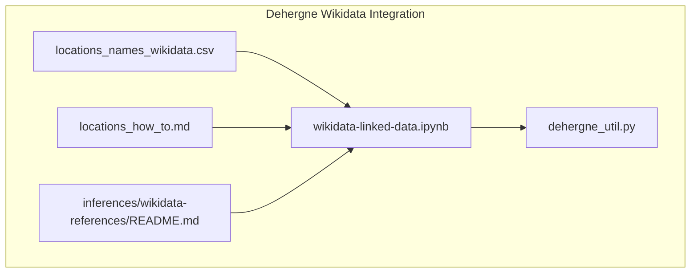
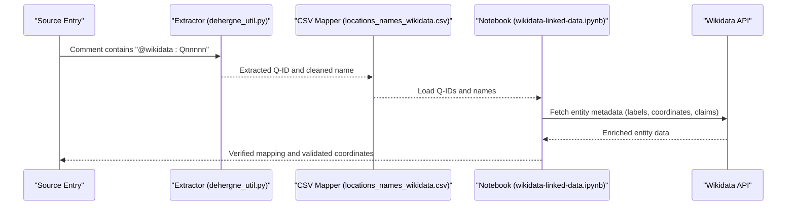
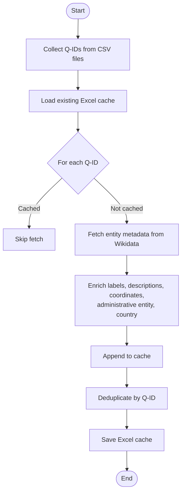
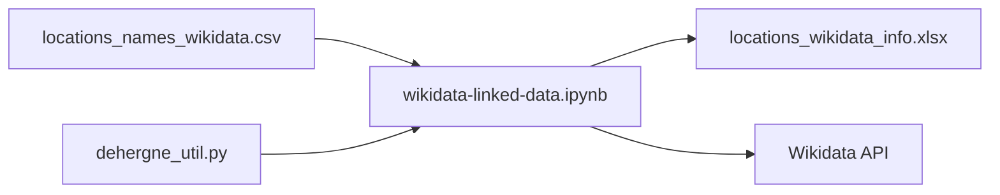

# Wikidata Integration

<cite>
**Referenced Files in This Document**
- [locations_names_wikidata.csv](file://inferences/wikidata-references/locations_names_wikidata.csv)
- [wikidata-linked-data.ipynb](file://notebooks/wikidata-linked-data.ipynb)
- [dehergne_util.py](file://notebooks/dehergne_util.py)
- [locations_how_to.md](file://extras/doc/locations_how_to.md)
- [README.md](file://inferences/wikidata-references/README.md)
</cite>

## Table of Contents
1. [Introduction](#introduction)
2. [Project Structure](#project-structure)
3. [Core Components](#core-components)
4. [Architecture Overview](#architecture-overview)
5. [Detailed Component Analysis](#detailed-component-analysis)
6. [Dependency Analysis](#dependency-analysis)
7. [Performance Considerations](#performance-considerations)
8. [Troubleshooting Guide](#troubleshooting-guide)
9. [Conclusion](#conclusion)

## Introduction
This document explains the Wikidata integration sub-feature used to disambiguate and link location names from Dehergne’s biographical entries to canonical Wikidata entities. It describes how original place names are mapped to standardized forms and Q-identifiers, documents the structure and purpose of the locations_names_wikidata.csv file, and illustrates the SPARQL-driven validation workflows shown in the notebook. It also covers handling ambiguous or obsolete place names, curation and verification procedures, and step-by-step guidance for adding new mappings.

## Project Structure
The Wikidata integration spans:
- A curated CSV of location name mappings to Wikidata Q-identifiers
- A notebook that validates and enriches these mappings using Wikidata APIs and SPARQL-like queries
- Utility functions that extract Wikidata identifiers from source comments and parse coordinates
- Documentation that prescribes how to annotate sources with linked data identifiers

**Diagram sources**
- [locations_names_wikidata.csv](file://inferences/wikidata-references/locations_names_wikidata.csv#L1-L20)
- [wikidata-linked-data.ipynb](file://notebooks/wikidata-linked-data.ipynb#L1-L60)
- [dehergne_util.py](file://notebooks/dehergne_util.py#L1-L20)
- [locations_how_to.md](file://extras/doc/locations_how_to.md#L42-L66)
- [README.md](file://inferences/wikidata-references/README.md#L1-L5)

**Section sources**
- [locations_names_wikidata.csv](file://inferences/wikidata-references/locations_names_wikidata.csv#L1-L20)
- [wikidata-linked-data.ipynb](file://notebooks/wikidata-linked-data.ipynb#L1-L60)
- [dehergne_util.py](file://notebooks/dehergne_util.py#L1-L20)
- [locations_how_to.md](file://extras/doc/locations_how_to.md#L42-L66)
- [README.md](file://inferences/wikidata-references/README.md#L1-L5)

## Core Components
- locations_names_wikidata.csv: A curated mapping of original place names to standardized names and Wikidata Q-identifiers, with optional notes.
- wikidata-linked-data.ipynb: A notebook that:
  - Collects Wikidata IDs from CSV files
  - Fetches entity metadata from Wikidata (labels, descriptions, coordinates, administrative and country relationships)
  - Builds and saves an enriched Excel cache for validation and visualization
- dehergne_util.py: Utilities to:
  - Extract Wikidata identifiers from source comments
  - Parse coordinates from comments
- locations_how_to.md: Guidance on annotating sources with @wikidata:Qnnnnn and handling ambiguity with ILOC.

**Section sources**
- [locations_names_wikidata.csv](file://inferences/wikidata-references/locations_names_wikidata.csv#L1-L20)
- [wikidata-linked-data.ipynb](file://notebooks/wikidata-linked-data.ipynb#L1-L120)
- [dehergne_util.py](file://notebooks/dehergne_util.py#L31-L81)
- [locations_how_to.md](file://extras/doc/locations_how_to.md#L42-L66)

## Architecture Overview
The integration follows a pipeline:
- Source annotation: Place names in sources are annotated with @wikidata:Qnnnnn when known.
- Extraction: Utilities extract Q-IDs from comments and clean the textual name.
- Mapping: Original names are matched to standardized names and Q-IDs via locations_names_wikidata.csv.
- Validation: The notebook validates and enriches mappings using Wikidata APIs and SPARQL-like queries, caching results in an Excel file.

**Diagram sources**
- [dehergne_util.py](file://notebooks/dehergne_util.py#L63-L81)
- [locations_names_wikidata.csv](file://inferences/wikidata-references/locations_names_wikidata.csv#L1-L20)
- [wikidata-linked-data.ipynb](file://notebooks/wikidata-linked-data.ipynb#L100-L200)

## Detailed Component Analysis

### locations_names_wikidata.csv
Purpose:
- Maintain a curated mapping from original place names to standardized names and Wikidata Q-identifiers.
- Include optional notes for disambiguation or provenance.

Structure:
- Columns:
  - original_name: The original place name as recorded in sources.
  - standardized_name: The standardized form used for consistent indexing and linking.
  - wikidata_id: The Q-identifier for the canonical Wikidata entity.
  - notes: Optional field for editorial notes (e.g., variant forms, historical context, or caveats).

Usage:
- The notebook reads all CSV files in the Wikidata references directory and collects unique Q-IDs to fetch metadata.
- The CSV is the authoritative source for mapping original names to Q-IDs prior to enrichment.

Validation:
- The notebook enriches the dataset with labels, descriptions, coordinates, and administrative/country relationships, saving the result to an Excel cache for review.

Common issues:
- Missing entries: Some original names may lack a Q-ID; annotate with ILOC in sources until a mapping is established.
- Conflicting identifiers: Discrepancies between proposed Q-IDs and canonical entities should be resolved by reviewing Wikidata claims and choosing the most appropriate entity.
- Historical name variations: Use notes to capture variant forms and historical context; prefer the Q-ID of the entity that best represents the intended location.

**Section sources**
- [locations_names_wikidata.csv](file://inferences/wikidata-references/locations_names_wikidata.csv#L1-L20)
- [wikidata-linked-data.ipynb](file://notebooks/wikidata-linked-data.ipynb#L1-L60)
- [locations_how_to.md](file://extras/doc/locations_how_to.md#L42-L66)

### Wikidata Notebook Workflows
Key steps:
- Collect Wikidata IDs from CSV files and count totals.
- Preload an existing Excel cache of Wikidata entity metadata.
- Iterate over unique Q-IDs, skipping those already cached, and fetch entity data from Wikidata (labels, descriptions, coordinates, administrative entity, country).
- Append new entities to the cache and deduplicate.
- Save the updated cache to Excel for downstream validation and visualization.

SPARQL-like validation:
- The notebook demonstrates fetching entity metadata via property-based claims (e.g., coordinates, administrative entity, country) rather than raw SPARQL queries. This approach leverages the Wikidata API client to retrieve structured data for validation and enrichment.

**Diagram sources**
- [wikidata-linked-data.ipynb](file://notebooks/wikidata-linked-data.ipynb#L1-L120)
- [wikidata-linked-data.ipynb](file://notebooks/wikidata-linked-data.ipynb#L500-L700)
- [wikidata-linked-data.ipynb](file://notebooks/wikidata-linked-data.ipynb#L1120-L1140)

**Section sources**
- [wikidata-linked-data.ipynb](file://notebooks/wikidata-linked-data.ipynb#L1-L120)
- [wikidata-linked-data.ipynb](file://notebooks/wikidata-linked-data.ipynb#L500-L700)
- [wikidata-linked-data.ipynb](file://notebooks/wikidata-linked-data.ipynb#L1120-L1140)

### Extraction Utilities
- get_wikidata_id: Extracts @wikidata:Qnnnnn from comments and original name fields, returning a cleaned name and the extracted Q-ID.
- get_linked_entity_id: Generic extractor for any linked data provider.
- extract_coordinates: Parses coordinates from comments using multiple supported formats.

These utilities support:
- Automated extraction of Q-IDs from source annotations.
- Cleaning of place names by removing embedded identifiers.
- Parsing of coordinate hints for manual verification.

**Section sources**
- [dehergne_util.py](file://notebooks/dehergne_util.py#L31-L81)
- [dehergne_util.py](file://notebooks/dehergne_util.py#L84-L152)

### Annotation Guidelines
- Prefer Wikidata identifiers for place names.
- Annotate with @wikidata:Qnnnnn immediately after the place name in comments.
- If the identifier is unavailable or ambiguous, add ILOC to mark the entry for manual review.

**Section sources**
- [locations_how_to.md](file://extras/doc/locations_how_to.md#L42-L66)

## Dependency Analysis
- The notebook depends on:
  - CSV files containing Q-IDs and mappings
  - The dehergne_util module for extraction and coordinate parsing
  - The Wikidata API client for entity retrieval
- The CSV acts as the primary dependency for mapping original names to Q-IDs.
- The Excel cache serves as a persistent dependency for validation and visualization.

**Diagram sources**
- [wikidata-linked-data.ipynb](file://notebooks/wikidata-linked-data.ipynb#L1-L120)
- [dehergne_util.py](file://notebooks/dehergne_util.py#L1-L20)
- [README.md](file://inferences/wikidata-references/README.md#L1-L5)

**Section sources**
- [wikidata-linked-data.ipynb](file://notebooks/wikidata-linked-data.ipynb#L1-L120)
- [dehergne_util.py](file://notebooks/dehergne_util.py#L1-L20)
- [README.md](file://inferences/wikidata-references/README.md#L1-L5)

## Performance Considerations
- Rate limiting: The notebook includes a small delay between API calls to avoid throttling.
- Caching: An Excel cache is used to avoid repeated fetches for previously resolved entities.
- Deduplication: Ensures the cache remains consistent and avoids redundant processing.

[No sources needed since this section provides general guidance]

## Troubleshooting Guide
Common issues and resolutions:
- Missing entries:
  - If a place lacks a Q-ID, annotate the source with ILOC and add a mapping to locations_names_wikidata.csv once resolved.
- Conflicting identifiers:
  - Review Wikidata claims and choose the entity that best represents the intended location; update the CSV accordingly.
- Historical name variations:
  - Use notes to record variant forms and historical context; ensure standardized_name reflects the preferred modern or canonical form.
- Network connectivity:
  - The notebook demonstrates network errors when resolving hostnames; ensure network access is available or retry later.

Validation steps:
- Run the notebook to fetch and enrich entities, then inspect the Excel cache for missing or inconsistent fields.
- Use the coordinate extraction utility to verify coordinate hints in comments.

**Section sources**
- [locations_how_to.md](file://extras/doc/locations_how_to.md#L42-L66)
- [wikidata-linked-data.ipynb](file://notebooks/wikidata-linked-data.ipynb#L500-L700)
- [dehergne_util.py](file://notebooks/dehergne_util.py#L84-L152)

## Conclusion
The Wikidata integration ensures that location names in Dehergne’s biographical entries are consistently disambiguated and linked to canonical Wikidata entities. The locations_names_wikidata.csv file provides the authoritative mapping, while the notebook validates and enriches these mappings using Wikidata APIs. Extraction utilities automate the process of pulling Q-IDs from source comments and cleaning names. By following the annotation guidelines and validation workflows, contributors can reliably curate and verify location mappings, addressing ambiguities and historical variations.