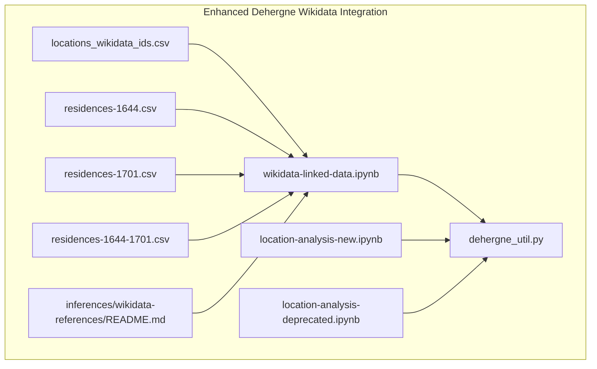
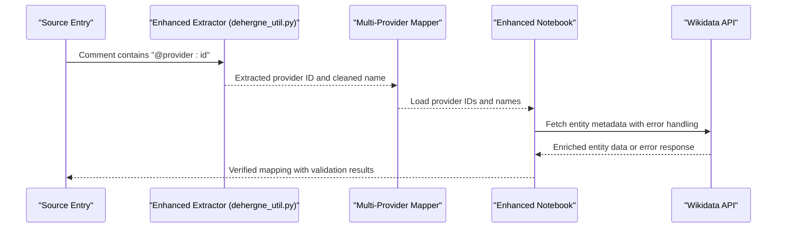
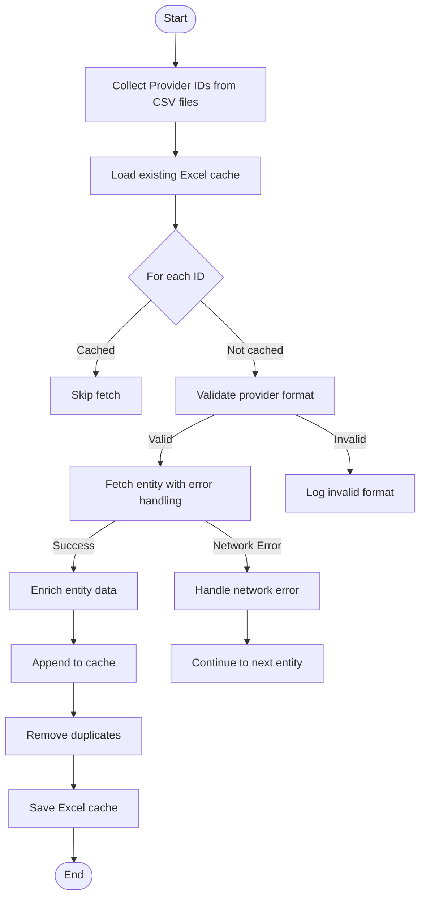
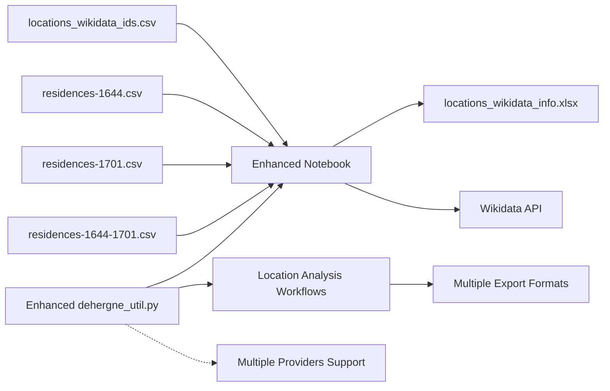

# Wikidata Integration

<cite>
**Referenced Files in This Document**
- [dehergne_util.py](file://notebooks/dehergne_util.py)
- [wikidata-linked-data.ipynb](file://notebooks/wikidata-linked-data.ipynb)
- [locations_wikidata_ids.csv](file://inferences/wikidata-references/locations_wikidata_ids.csv)
- [residences-1644-1701.csv](file://inferences/wikidata-references/residences-1644-1701.csv)
- [residences-1644.csv](file://inferences/wikidata-references/residences-1644.csv)
- [residences-1701.csv](file://inferences/wikidata-references/residences-1701.csv)
- [README.md](file://inferences/wikidata-references/README.md)
- [location-analysis-new.ipynb](file://notebooks/location-analysis-new.ipynb)
- [location-analysis-deprecated.ipynb](file://notebooks/location-analysis-deprecated.ipynb)
</cite>

## Update Summary
**Changes Made**
- Updated extraction utilities section to reflect the new generic get_linked_entity_id function with enhanced multi-provider support
- Enhanced error handling documentation for Wikidata integration with comprehensive exception handling
- Added documentation for improved pattern matching capabilities with configurable provider patterns
- Updated architecture overview to show support for multiple linked data providers beyond Wikidata
- Revised troubleshooting guide with new error handling patterns and validation workflows
- Expanded documentation for multi-period CSV datasets covering 1644-1701 period
- Added comprehensive coverage of new location analysis workflows and export formats

## Table of Contents
1. [Introduction](#introduction)
2. [Project Structure](#project-structure)
3. [Core Components](#core-components)
4. [Architecture Overview](#architecture-overview)
5. [Detailed Component Analysis](#detailed-component-analysis)
6. [Dependency Analysis](#dependency-analysis)
7. [Performance Considerations](#performance-considerations)
8. [Troubleshooting Guide](#troubleshooting-guide)
9. [Conclusion](#conclusion)

## Introduction
This document explains the Wikidata integration sub-feature used to disambiguate and link location names from Dehergne's biographical entries to canonical Wikidata entities. The system has been enhanced with a new generic extraction framework that supports multiple linked data providers beyond just Wikidata, featuring improved error handling and pattern matching capabilities. It describes how original place names are mapped to standardized forms and Q-identifiers, documents the structure and purpose of the location mapping files, and illustrates the SPARQL-driven validation workflows shown in the notebook. It also covers handling ambiguous or obsolete place names, curation and verification procedures, and step-by-step guidance for adding new mappings.

## Project Structure
The Wikidata integration spans:
- Multiple CSV files containing Wikidata IDs for different time periods and categories
- A notebook that validates and enriches these mappings using Wikidata APIs and SPARQL-like queries
- Enhanced utility functions that extract linked data identifiers from source comments and parse coordinates
- Documentation that prescribes how to annotate sources with linked data identifiers
- Comprehensive location analysis workflows with export capabilities



**Diagram sources**
- [locations_wikidata_ids.csv:1-554](file://inferences/wikidata-references/locations_wikidata_ids.csv#L1-L554)
- [residences-1644-1701.csv:1-361](file://inferences/wikidata-references/residences-1644-1701.csv#L1-L361)
- [wikidata-linked-data.ipynb:1-800](file://notebooks/wikidata-linked-data.ipynb#L1-L800)
- [dehergne_util.py:31-208](file://notebooks/dehergne_util.py#L31-L208)
- [location-analysis-new.ipynb:20-35](file://notebooks/location-analysis-new.ipynb#L20-L35)
- [location-analysis-deprecated.ipynb:30-290](file://notebooks/location-analysis-deprecated.ipynb#L30-L290)
- [README.md:1-7](file://inferences/wikidata-references/README.md#L1-L7)

**Section sources**
- [locations_wikidata_ids.csv:1-554](file://inferences/wikidata-references/locations_wikidata_ids.csv#L1-L554)
- [residences-1644-1701.csv:1-361](file://inferences/wikidata-references/residences-1644-1701.csv#L1-L361)
- [wikidata-linked-data.ipynb:1-800](file://notebooks/wikidata-linked-data.ipynb#L1-L800)
- [dehergne_util.py:31-208](file://notebooks/dehergne_util.py#L31-L208)
- [location-analysis-new.ipynb:20-35](file://notebooks/location-analysis-new.ipynb#L20-L35)
- [location-analysis-deprecated.ipynb:30-290](file://notebooks/location-analysis-deprecated.ipynb#L30-L290)
- [README.md:1-7](file://inferences/wikidata-references/README.md#L1-L7)

## Core Components
- **Enhanced Extraction Utilities**: New generic get_linked_entity_id function supports multiple providers (wikidata, geonames, etc.) with improved error handling and pattern matching
- **Multiple CSV Datasets**: Separate CSV files for different time periods and categories (locations_wikidata_ids.csv, residences-1644.csv, residences-1701.csv, residences-1644-1701.csv)
- **Wikidata Notebook**: Validates and enriches mappings using Wikidata APIs and SPARQL-like queries, with robust error handling for network issues
- **Utility Functions**: Extract Wikidata identifiers from source comments, parse coordinates, and handle various linked data formats
- **Location Analysis Workflows**: Comprehensive analysis pipelines with export capabilities for different datasets
- **Documentation**: Guidelines for annotating sources with linked data identifiers and handling ambiguity

**Section sources**
- [dehergne_util.py:31-208](file://notebooks/dehergne_util.py#L31-L208)
- [locations_wikidata_ids.csv:1-554](file://inferences/wikidata-references/locations_wikidata_ids.csv#L1-L554)
- [residences-1644-1701.csv:1-361](file://inferences/wikidata-references/residences-1644-1701.csv#L1-L361)
- [wikidata-linked-data.ipynb:1-800](file://notebooks/wikidata-linked-data.ipynb#L1-L800)
- [location-analysis-new.ipynb:20-35](file://notebooks/location-analysis-new.ipynb#L20-L35)

## Architecture Overview
The enhanced integration follows an improved pipeline with support for multiple linked data providers:
- **Source Annotation**: Place names in sources are annotated with @provider:id patterns (e.g., @wikidata:Q1234567, @geonames:1234567)
- **Enhanced Extraction**: Generic extractor processes comments and cleans textual names with improved error handling
- **Multi-Provider Support**: New get_linked_entity_id function supports any linked data provider with configurable patterns
- **Robust Validation**: The notebook validates and enriches mappings using Wikidata APIs with comprehensive error handling for network issues
- **Comprehensive Analysis**: Multiple analysis workflows generate different export formats for various use cases



**Diagram sources**
- [dehergne_util.py:52-78](file://notebooks/dehergne_util.py#L52-L78)
- [wikidata-linked-data.ipynb:540-647](file://notebooks/wikidata-linked-data.ipynb#L540-L647)

## Detailed Component Analysis

### Enhanced Extraction Utilities
**Updated** The extraction system now features a generic provider-agnostic approach:

- **get_linked_entity_id**: New generic extractor supporting any linked data provider with configurable patterns
- **Improved Pattern Matching**: Enhanced regex patterns with better error handling and validation
- **Multi-Provider Support**: Can extract from @wikidata:, @geonames:, @dbpedia:, and other provider formats
- **Robust Error Handling**: Comprehensive error handling for missing providers and malformed identifiers

```python
def get_linked_entity_id(
    comment_string: str, 
    linked_data_provider: str, 
    if_missing=None
) -> str:
    """Generic linked data provider extractor.
    
    Supports multiple providers: wikidata, geonames, dbpedia, etc.
    Pattern: @<provider>: <id>
    """
    pattern = GENERIC_LINKED_PATTERN.format(re.escape(linked_data_provider))
    result = _extract_id_from_string(comment_string, pattern)
    return result if result is not None else if_missing
```

**Section sources**
- [dehergne_util.py:52-78](file://notebooks/dehergne_util.py#L52-L78)
- [dehergne_util.py:38-44](file://notebooks/dehergne_util.py#L38-L44)

### Multi-Period Location Datasets
The system now manages location data across different time periods:

- **locations_wikidata_ids.csv**: Comprehensive list of all Wikidata IDs used in the project (554 entries)
- **residences-1644.csv**: Locations from 1644 period with "No wikidata" placeholders for unresolved entries (215 entries)
- **residences-1701.csv**: Locations from 1701 period with similar structure (146 entries)
- **residences-1644-1701.csv**: Combined dataset for the entire period range (361 entries)

**Section sources**
- [locations_wikidata_ids.csv:1-554](file://inferences/wikidata-references/locations_wikidata_ids.csv#L1-L554)
- [residences-1644.csv:1-215](file://inferences/wikidata-references/residences-1644.csv#L1-L215)
- [residences-1701.csv:1-146](file://inferences/wikidata-references/residences-1701.csv#L1-L146)
- [residences-1644-1701.csv:1-361](file://inferences/wikidata-references/residences-1644-1701.csv#L1-L361)

### Enhanced Wikidata Notebook Workflows
**Updated** The notebook now includes comprehensive error handling:

- **Network Error Handling**: Robust exception handling for network connectivity issues
- **Entity Validation**: Improved validation of fetched entities with better error reporting
- **Cache Management**: Enhanced caching with better duplicate handling
- **Provider Flexibility**: Support for extracting from multiple provider formats



**Diagram sources**
- [wikidata-linked-data.ipynb:540-647](file://notebooks/wikidata-linked-data.ipynb#L540-L647)
- [wikidata-linked-data.ipynb:664-667](file://notebooks/wikidata-linked-data.ipynb#L664-L667)

**Section sources**
- [wikidata-linked-data.ipynb:540-647](file://notebooks/wikidata-linked-data.ipynb#L540-L647)
- [wikidata-linked-data.ipynb:664-667](file://notebooks/wikidata-linked-data.ipynb#L664-L667)

### Location Analysis Workflows
**Updated** Enhanced analysis capabilities with comprehensive export formats:

- **New Analysis Workflow**: Modern location analysis with improved export capabilities
- **Deprecated Analysis Workflow**: Legacy analysis methods for backward compatibility
- **Export Formats**: Multiple Excel exports for different analytical purposes
- **Visualization Support**: Dedicated datasets for timeline visualization

**Section sources**
- [location-analysis-new.ipynb:20-35](file://notebooks/location-analysis-new.ipynb#L20-L35)
- [location-analysis-deprecated.ipynb:30-290](file://notebooks/location-analysis-deprecated.ipynb#L30-L290)

### Annotation Guidelines
**Updated** Enhanced annotation support for multiple providers:

- **Primary Provider**: Prefer Wikidata identifiers with @wikidata:Qnnnnn format
- **Alternative Providers**: Support @geonames:, @dbpedia:, and other provider formats
- **Ambiguity Handling**: Use ILOC for entries without clear provider identification
- **Format Flexibility**: The generic extractor supports various provider naming conventions

**Section sources**
- [README.md:1-7](file://inferences/wikidata-references/README.md#L1-L7)
- [dehergne_util.py:52-78](file://notebooks/dehergne_util.py#L52-L78)

## Dependency Analysis
**Updated** Dependencies now support multiple providers:

- **CSV Files**: Primary dependency for provider IDs across different time periods
- **Enhanced Utilities**: dehergne_util module with generic extraction capabilities
- **Wikidata API**: Core dependency for entity retrieval with improved error handling
- **Excel Cache**: Persistent storage for validated entity data
- **Multi-Provider Support**: Generic extraction enables future expansion to other linked data providers
- **Analysis Workflows**: Comprehensive analysis pipelines with export dependencies



**Diagram sources**
- [wikidata-linked-data.ipynb:1-800](file://notebooks/wikidata-linked-data.ipynb#L1-L800)
- [dehergne_util.py:31-208](file://notebooks/dehergne_util.py#L31-L208)
- [location-analysis-new.ipynb:20-35](file://notebooks/location-analysis-new.ipynb#L20-L35)
- [README.md:1-7](file://inferences/wikidata-references/README.md#L1-L7)

**Section sources**
- [wikidata-linked-data.ipynb:1-800](file://notebooks/wikidata-linked-data.ipynb#L1-L800)
- [dehergne_util.py:31-208](file://notebooks/dehergne_util.py#L31-L208)
- [location-analysis-new.ipynb:20-35](file://notebooks/location-analysis-new.ipynb#L20-L35)
- [README.md:1-7](file://inferences/wikidata-references/README.md#L1-L7)

## Performance Considerations
**Updated** Enhanced performance with improved error handling:

- **Rate Limiting**: Maintained with improved error recovery mechanisms
- **Caching**: Enhanced with better duplicate detection and removal
- **Error Recovery**: Robust error handling reduces processing interruptions
- **Provider Flexibility**: Generic extraction reduces redundant processing for different provider types
- **Batch Processing**: Efficient handling of multiple CSV files and analysis workflows

## Troubleshooting Guide
**Updated** Enhanced troubleshooting with comprehensive error handling:

### Common Issues and Resolutions
- **Missing Provider Identifiers**: Check CSV files for "No wikidata" entries and resolve manually
- **Network Connectivity**: The enhanced notebook handles network errors gracefully with retry logic
- **Invalid Provider Formats**: Use the generic extractor to validate provider formats
- **Duplicate Entries**: Enhanced deduplication removes redundant cache entries
- **Provider Migration**: New generic system supports easy migration to alternative providers
- **Analysis Workflow Errors**: Check both new and deprecated analysis workflows for compatibility

### Enhanced Validation Steps
1. **Run the enhanced notebook** to fetch and validate entities with improved error handling
2. **Inspect Excel cache** for missing or inconsistent fields with better error reporting
3. **Use generic extraction utilities** to test different provider formats
4. **Monitor error logs** for network issues and invalid provider formats
5. **Verify CSV file integrity** across all time period datasets
6. **Test both analysis workflows** for consistent results

**Section sources**
- [wikidata-linked-data.ipynb:540-647](file://notebooks/wikidata-linked-data.ipynb#L540-L647)
- [wikidata-linked-data.ipynb:664-667](file://notebooks/wikidata-linked-data.ipynb#L664-L667)
- [dehergne_util.py:52-78](file://notebooks/dehergne_util.py#L52-L78)
- [location-analysis-new.ipynb:20-35](file://notebooks/location-analysis-new.ipynb#L20-L35)

## Conclusion
The enhanced Wikidata integration provides a robust, extensible framework for linking location names in Dehergne's biographical entries to canonical entities across multiple linked data providers. The new generic extraction system supports seamless integration of Wikidata, GeoNames, DBpedia, and other providers with improved error handling and pattern matching. The multi-period CSV datasets enable comprehensive coverage of historical locations from 1644 to 1701, while the enhanced notebook provides reliable validation and enrichment workflows. The improved architecture ensures maintainability and scalability for future linked data provider integrations, addressing ambiguities and historical variations through systematic curation and verification processes. The comprehensive location analysis workflows and export capabilities support diverse analytical needs and visualization requirements.