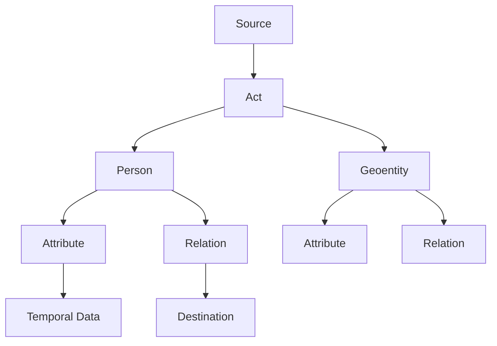
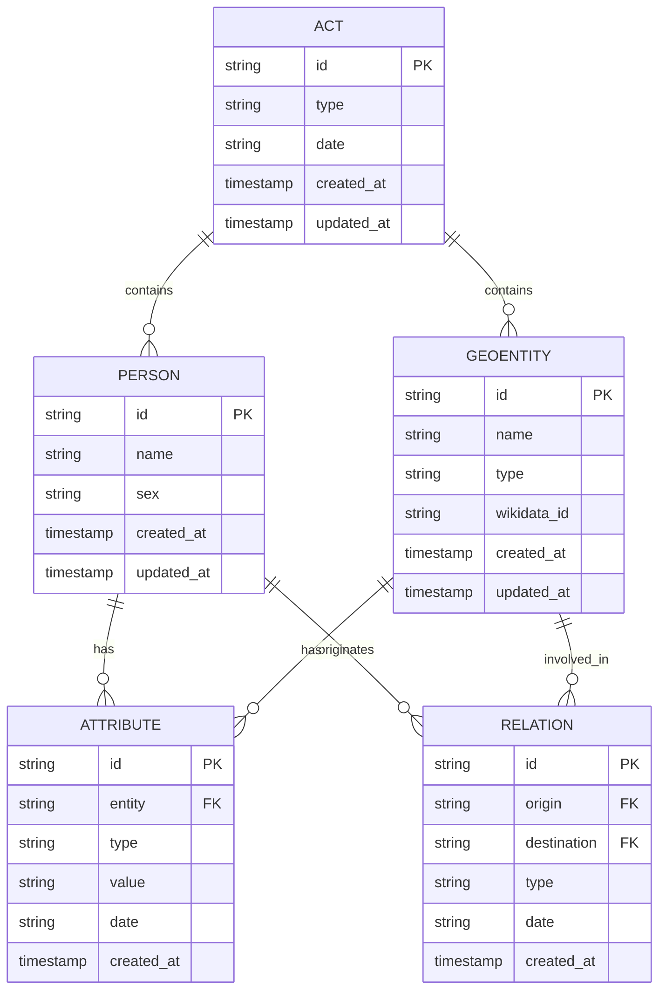

# Data Model

<cite>
**Referenced Files in This Document**   
- [sources.str](file://structures/sources.str)
- [sources.str.yaml](file://structures/sources.str.yaml)
- [dehergne-locations-1644.xml](file://sources/dehergne-locations-1644.xml)
- [dehergne-locations-1701.xml](file://sources/dehergne-locations-1701.xml)
- [residences-1644.csv](file://inferences/wikidata-references/residences-1644.csv)
- [residences-1701.csv](file://inferences/wikidata-references/residences-1701.csv)
- [residences-1644-1701.csv](file://inferences/wikidata-references/residences-1644-1701.csv)
- [dehergne_util.py](file://notebooks/dehergne_util.py)
- [database-overview.ipynb](file://notebooks/database-overview.ipynb)
- [Concepts.md](file://etc/doc/Concepts.md)
</cite>

## Table of Contents
1. [Introduction](#introduction)
2. [Hierarchical Data Model Structure](#hierarchical-data-model-structure)
3. [Core Entity Types](#core-entity-types)
4. [Temporal Data Modeling](#temporal-data-modeling)
5. [Relationships and Relations](#relationships-and-relations)
6. [Database Schema and XML Import Structure](#database-schema-and-xml-import-structure)
7. [Data Access and Querying](#data-access-and-querying)
8. [Data Lifecycle and Versioning](#data-lifecycle-and-versioning)
9. [Conclusion](#conclusion)

## Introduction

The dehergne project implements a comprehensive data model for historical biographical and geographical information, centered on Jesuit missionaries in China during the Ming and Qing dynasties. The model is built on the Timelink/Kleio framework, which follows a source/act/actor-object/attributes-relations paradigm. This documentation details the core entity types—Person, Location, Voyage, and Residence—and explains how they are structured, related, and managed within the system. The data model leverages Kleio's timeline capabilities for temporal data, integrates with Wikidata through Q-IDs, and supports complex queries on large biographical datasets. The system is version-controlled via Git, ensuring data integrity and traceability throughout its lifecycle.

**Section sources**
- [Concepts.md](file://etc/doc/Concepts.md#L1-L126)

## Hierarchical Data Model Structure

The data model is organized hierarchically based on the source/act/actor-object/attributes-relations paradigm. At the top level, a **source** represents a historical document or dataset, such as the geographical information from Dehergne's work. Each source contains one or more **acts**, which are discrete historical events or records. Acts can contain **actors** (persons or objects) and **geoentities** (locations), each of which can have attributes and relations. Attributes capture properties of entities (e.g., birth date, nationality), while relations define connections between entities (e.g., residence, voyage). This hierarchical structure allows for a rich representation of historical data, where each entity is contextualized within its source and temporal framework.

**Diagram sources **
- [sources.str](file://structures/sources.str#L1-L800)
- [sources.str.yaml](file://structures/sources.str.yaml#L1-L800)

**Section sources**
- [sources.str](file://structures/sources.str#L1-L800)
- [sources.str.yaml](file://structures/sources.str.yaml#L1-L800)

## Core Entity Types

The model defines four core entity types: Person, Location, Voyage, and Residence. **Person** entities represent individuals, with attributes such as birth date, nationality, and entry date into the Jesuit order. **Location** entities are spatial representations, including provinces, cities, and counties, integrated with Wikidata via Q-IDs. **Voyage** entities are reconstructed from Wicky’s lists, capturing the movement of individuals between locations. **Residence** entities represent temporal stays, linking persons to locations with start and end dates. Each entity type is implemented as a class in the Kleio structure file, with specific attributes and relations that define its behavior and connections within the model.

**Section sources**
- [sources.str](file://structures/sources.str#L1-L800)
- [dehergne-locations-1644.xml](file://sources/dehergne-locations-1644.xml#L1-L800)
- [dehergne-locations-1701.xml](file://sources/dehergne-locations-1701.xml#L1-L800)

## Temporal Data Modeling

Temporal data is modeled using Kleio’s timeline capabilities, which support precise date representations and temporal reasoning. Dates are encoded as eight-digit numbers in the format yyyymmdd, allowing for flexible querying and analysis. Attributes such as birth date and entry date into the Jesuit order are stored with their associated dates, enabling the reconstruction of biographical timelines. The model also supports temporal attributes for relations, such as the start and end dates of a residence. This temporal framework allows for the analysis of historical events and movements over time, providing a dynamic view of the data.

**Section sources**
- [sources.str](file://structures/sources.str#L272-L275)
- [dehergne-locations-1644.xml](file://sources/dehergne-locations-1644.xml#L1-L800)

## Relationships and Relations

Relationships in the model are encoded as **relations**, which connect entities and define their interactions. For example, the 'estadia' (residence) relation links a person to a location for a specific period. Relations are defined with a type, value, destination, and date, allowing for rich semantic descriptions. The model also supports hierarchical relations, such as a province containing cities, which are represented through parent-child relationships in the geoentity hierarchy. These relations are crucial for reconstructing networks of movement and association, enabling complex queries about the spatial and temporal dynamics of the Jesuit missions.

**Section sources**
- [sources.str](file://structures/sources.str#L233-L236)
- [dehergne-locations-1644.xml](file://sources/dehergne-locations-1644.xml#L1-L800)

## Database Schema and XML Import Structure

The database schema is derived from the XML import structure, which translates Kleio source files into relational tables. Key tables include `persons`, `geoentities`, `attributes`, `relations`, and `acts`. The `persons` table stores biographical data, while `geoentities` contains geographical information with Wikidata integration. Attributes and relations are stored in separate tables, linked to their respective entities via foreign keys. The XML import process ensures that all hierarchical and temporal data is preserved, creating a normalized relational schema that supports efficient querying and analysis.

**Diagram sources **
- [dehergne-locations-1644.xml](file://sources/dehergne-locations-1644.xml#L1-L800)
- [dehergne-locations-1701.xml](file://sources/dehergne-locations-1701.xml#L1-L800)

**Section sources**
- [dehergne-locations-1644.xml](file://sources/dehergne-locations-1644.xml#L1-L800)
- [dehergne-locations-1701.xml](file://sources/dehergne-locations-1701.xml#L1-L800)

## Data Access and Querying

Data access patterns in the dehergne project are primarily implemented through Jupyter notebooks, which use the Timelink API to query the database. The notebooks provide a flexible environment for exploring and analyzing the data, with functions for calculating ages, extracting Wikidata IDs, and parsing coordinates. Performance considerations for querying large biographical datasets include indexing on key fields such as person ID and date, and using efficient query patterns to minimize load times. The `dehergne_util.py` module contains utility functions that streamline common data access tasks, enhancing productivity and consistency across analyses.

**Section sources**
- [dehergne_util.py](file://notebooks/dehergne_util.py#L1-L152)
- [database-overview.ipynb](file://notebooks/database-overview.ipynb#L1-L200)

## Data Lifecycle and Versioning

The data lifecycle in the dehergne project is managed through Git, ensuring version control and archival policies are strictly followed. Each phase of the data process—transcription, translation, importation, and identification—is tracked in the repository, with the master branch serving as the reference version. This approach allows for reproducible research and facilitates collaboration among multiple contributors. Archival policies ensure that all data and metadata are preserved, with regular backups and documentation of changes. The use of Git also enables the creation of variants and forks for experimental analyses, while maintaining the integrity of the primary dataset.

**Section sources**
- [Concepts.md](file://etc/doc/Concepts.md#L1-L126)

## Conclusion

The dehergne project's data model provides a robust framework for managing and analyzing historical biographical and geographical data. By leveraging the Timelink/Kleio system, the model supports a hierarchical, temporal, and relational representation of entities, enabling detailed reconstructions of Jesuit missions in China. The integration with Wikidata, use of Kleio's timeline capabilities, and implementation of Git-based version control ensure that the data is both richly interconnected and rigorously maintained. This documentation serves as a comprehensive guide to the model's structure, usage, and management, supporting ongoing research and analysis.