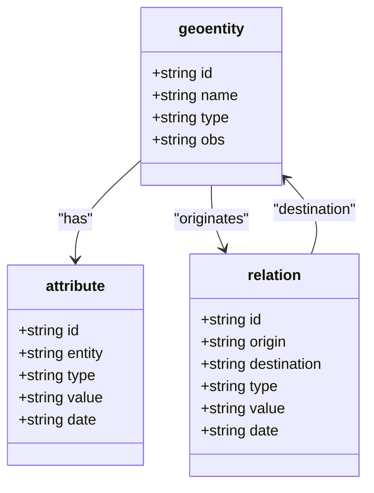
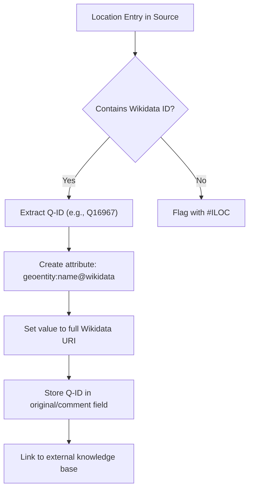
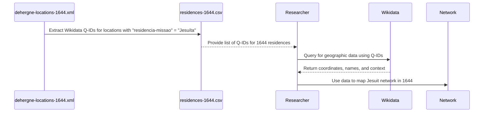
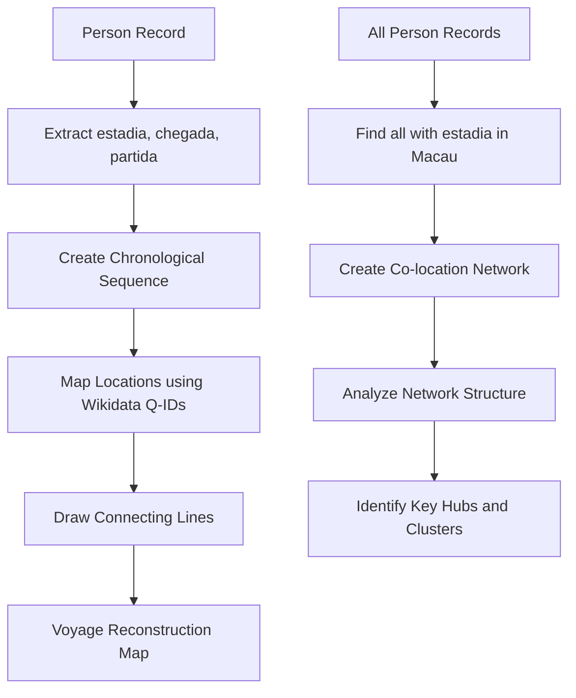

# Location Entity

<cite>
**Referenced Files in This Document**   
- [sources.str](file://structures/sources.str)
- [locations_how_to.md](file://extras/doc/locations_how_to.md)
- [locations_names_wikidata.csv](file://inferences/wikidata-references/locations_names_wikidata.csv)
- [residences-1644.csv](file://inferences/wikidata-references/residences-1644.csv)
- [residences-1701.csv](file://inferences/wikidata-references/residences-1701.csv)
- [residences-1644-1701.csv](file://inferences/wikidata-references/residences-1644-1701.csv)
- [dehergne-locations-1644.xml](file://sources/dehergne-locations-1644.xml)
- [dehergne-locations-1701.xml](file://sources/dehergne-locations-1701.xml)
- [dehergne_util.py](file://notebooks/dehergne_util.py)
</cite>

## Table of Contents
1. [Introduction](#introduction)
2. [Geoentity Structure](#geoentity-structure)
3. [Wikidata Integration](#wikidata-integration)
4. [Temporal Aspects and Residence Records](#temporal-aspects-and-residence-records)
5. [Conceptual Spaces and Hierarchical Organization](#conceptual-spaces-and-hierarchical-organization)
6. [Relationship with Persons: The 'estadia' Relation](#relationship-with-persons-the-estadia-relation)
7. [Usage in Network Analysis and Voyage Reconstruction](#usage-in-network-analysis-and-voyage-reconstruction)
8. [Best Practices for Adding Locations](#best-practices-for-adding-locations)
9. [Conclusion](#conclusion)

## Introduction
This document provides comprehensive documentation for the Location entity within the dehergne project, which focuses on reconstructing historical networks and itineraries between Europe and China through Macao. The location model is a core component of the data structure, designed to represent geographical entities with precision and flexibility. The model supports both specific geographical locations and broader conceptual spaces, enabling detailed historical analysis. Locations are linked to external knowledge bases through Wikidata identifiers (Q-IDs) and are temporally contextualized through residence records from 1644 and 1701. The model facilitates the analysis of person-location relationships, particularly through the 'estadia' (residence) relation, and is instrumental in network analysis and voyage reconstruction.

**Section sources**
- [sources.str](file://structures/sources.str#L53-L70)
- [locations_how_to.md](file://extras/doc/locations_how_to.md#L1-L66)

## Geoentity Structure
The Location entity is formally defined in the project as a `geoentity`, a fundamental data structure within the Kleio-based source model. This structure is declared in the `sources.str` file, which serves as the master schema for the entire project. A `geoentity` is designed as a conceptual representation of space, not merely a physical point on a map. It can represent a wide range of spatial concepts, from a specific building to an entire province.

The core attributes of a `geoentity` are defined as follows:
- **name**: The primary identifier for the location, which can include historical names, modern equivalents, and contextual information (e.g., "Navalafuente, diocese de Toledo").
- **type**: A classification for the location, such as "província" (province), "fou" (prefecture), "tcheou-hien" (county), or "capital provincial". This field allows for hierarchical organization and categorization.
- **id**: A unique identifier within the dehergne system, typically following the pattern `deh-rYYYY-name`, where YYYY is the reference year (e.g., 1644 or 1701).

The `geoentity` structure is designed to be extensible, allowing for additional attributes and relationships. It is a child of the top-level `kleio` group and can be related to other entities through the `relation` group. The structure supports a hierarchical organization, where a province (geo1) contains prefectures (geo2), which in turn contain counties or towns (geo3). This hierarchy is evident in the XML data files, where locations are nested within their parent geographical entities.

**Diagram sources**
- [sources.str](file://structures/sources.str#L66-L70)
- [dehergne-locations-1644.xml](file://sources/dehergne-locations-1644.xml#L174-L179)

**Section sources**
- [sources.str](file://structures/sources.str#L53-L70)
- [dehergne-locations-1644.xml](file://sources/dehergne-locations-1644.xml#L181-L196)

## Wikidata Integration
The dehergne project employs a robust linked data strategy to ensure unambiguous identification of locations by integrating with Wikidata. Each `geoentity` is linked to a corresponding Wikidata entry using its unique Q-ID. This integration is a critical component of the data model, providing a standardized, globally recognized identifier that connects the project's data to a vast network of external information, including geographic coordinates, alternate names in multiple languages, administrative hierarchies, and links to library catalogs.

The linkage is implemented through a specific attribute pattern within the `geoentity`. An `attribute` of type `geoentity:name@wikidata` is added to the location, with its `value` set to the full Wikidata URI (e.g., `https://www.wikidata.org/wiki/Q16967`). The Q-ID itself is also stored in the `original` field of the name element or as a comment. This dual storage ensures both human readability and machine processability.

The primary source for these Q-IDs is the `locations_names_wikidata.csv` file, which contains a single column of Wikidata identifiers. This file is used by the `wikidata-linked-data.ipynb` notebook to fetch comprehensive data from Wikidata and update an Excel file. The `get_wikidata_id` function in `dehergne_util.py` is responsible for parsing comments and extracting Q-IDs, demonstrating the programmatic integration of this linked data approach. When a Wikidata identifier is not available or there is ambiguity, the comment `#ILOC` is used to flag the location for manual review.

**Diagram sources**
- [locations_names_wikidata.csv](file://inferences/wikidata-references/locations_names_wikidata.csv)
- [dehergne_util.py](file://notebooks/dehergne_util.py#L63-L81)

**Section sources**
- [locations_how_to.md](file://extras/doc/locations_how_to.md#L42-L63)
- [locations_names_wikidata.csv](file://inferences/wikidata-references/locations_names_wikidata.csv)
- [dehergne_util.py](file://notebooks/dehergne_util.py#L63-L81)

## Temporal Aspects and Residence Records
The location model in the dehergne project is inherently temporal, capturing the dynamic nature of historical presence and activity. This is primarily achieved through residence records, which document the presence of Jesuit missionaries and other individuals at specific locations over time. The key temporal datasets are the `residences-1644.csv` and `residences-1701.csv` files, which contain lists of Wikidata Q-IDs representing locations where Jesuits were known to reside in those respective years.

These CSV files are not standalone datasets but are derived from and linked to the more detailed XML source files (`dehergne-locations-1644.xml` and `dehergne-locations-1701.xml`). The XML files contain rich, structured data that includes not only the location but also the type of residence (e.g., Jesuit, Dominican, Franciscan) and the specific year of activity. For example, the 1644 data shows that Hangchou had an active Jesuit residence starting in 1611, while the 1701 data indicates a more complex situation with both active and inactive residences, including a Franciscan presence.

The temporal aspect is encoded within the `attribute` group of a `geoentity`. Attributes of type `residencia-missao` (mission residence) and `activa` (active) are used with a `date` field to specify the year of the event. This allows for a detailed timeline of a location's history. The `residences-1644-1701.csv` file combines both years, providing a comprehensive view of the temporal evolution of Jesuit residences. This temporal data is crucial for reconstructing the movement of individuals and the expansion or contraction of missionary networks over time.

**Diagram sources**
- [residences-1644.csv](file://inferences/wikidata-references/residences-1644.csv)
- [residences-1701.csv](file://inferences/wikidata-references/residences-1701.csv)
- [dehergne-locations-1644.xml](file://sources/dehergne-locations-1644.xml)

**Section sources**
- [residences-1644.csv](file://inferences/wikidata-references/residences-1644.csv)
- [residences-1701.csv](file://inferences/wikidata-references/residences-1701.csv)
- [dehergne-locations-1644.xml](file://sources/dehergne-locations-1644.xml#L309-L318)
- [dehergne-locations-1701.xml](file://sources/dehergne-locations-1701.xml#L278-L296)

## Conceptual Spaces and Hierarchical Organization
The `geoentity` model is explicitly designed to accommodate both precise geographical entities and broader conceptual spaces, reflecting the nature of historical sources. As defined in the `sources.str` file, a geo-entity is "a conceptual representation of space" and is not limited to a specific point on a map. This allows the model to represent entities like "the parish of X" or "the region W," which are common in historical documents but lack precise coordinates.

The model supports this conceptual flexibility through its hierarchical structure and descriptive attributes. A location's name can include contextual information separated by commas, following a postal address format from specific to general (e.g., "Tusculum, Itália"). For even more specific locations, such as a building within a city, the model uses parentheses (e.g., "Macau (Colégio de S. Paulo)"). This ensures that all variations of a location are grouped together in alphabetical listings.

The hierarchy is formally defined by the `geo1`, `geo2`, and `geo3` prefixes, which represent different levels of geographical granularity:
- **geo1**: Provinces or major regions.
- **geo2**: Prefectures (fou) or independent cities.
- **geo3**: Counties (tcheou-hien), towns, or specific sites.

This three-tier hierarchy is clearly visible in the XML data, where a `geo1` entity (e.g., Chekiang) contains `geo2` entities (e.g., Hangchou), which in turn contain `geo3` entities (e.g., Fuyang). This structure enables powerful queries, such as finding all residences within a specific province, and supports the creation of detailed historical maps that show the administrative and ecclesiastical organization of the time.

**Section sources**
- [sources.str](file://structures/sources.str#L57-L63)
- [locations_how_to.md](file://extras/doc/locations_how_to.md#L28-L39)
- [dehergne-locations-1644.xml](file://sources/dehergne-locations-1644.xml#L181-L196)

## Relationship with Persons: The 'estadia' Relation
The primary mechanism for linking persons to locations in the dehergne project is through the `estadia` (residence) relation, which is one of several location-based attributes defined for people in the sources. Other related attributes include `nascimento` (birth), `morte` (death), `baptizado` (baptism), and `chegada` (arrival). These attributes are recorded as `ls` (location-specific) entries in the source data.

The `estadia` relation is a critical data point for reconstructing individual itineraries and social networks. When a person's record includes `ls$estadia/macau#@wikidata:Q14773`, it establishes a direct link between that person and the location of Macau, with the Wikidata Q-ID ensuring the location is unambiguously identified. This allows researchers to answer questions like "Where did this Jesuit live during his time in China?" or "Which missionaries were present in Hangchou in 1644?"

The relationship is bidirectional. While a person's record contains the `estadia` attribute, the location's record in the `dehergne-locations-*.xml` files contains `residencia-missao` attributes that list the presence of Jesuits. This dual recording creates a robust network of person-location interactions. The temporal data associated with these relations (e.g., the year 1611 for a residence in Hangchou) allows for the creation of dynamic timelines and movement maps, showing how individuals moved between locations over their lifetimes.

**Section sources**
- [locations_how_to.md](file://extras/doc/locations_how_to.md#L7-L23)
- [dehergne-locations-1644.xml](file://sources/dehergne-locations-1644.xml#L309-L318)

## Usage in Network Analysis and Voyage Reconstruction
The location data model is a foundational element for advanced analytical tasks within the dehergne project, particularly network analysis and voyage reconstruction. By combining the unambiguous identification of locations via Wikidata Q-IDs with the temporal data from residence records, researchers can build detailed social and spatial networks.

For **network analysis**, the location data allows for the creation of co-location networks. By querying all individuals who had an `estadia` relation with a specific location (e.g., Macau), researchers can identify clusters of people who lived in the same place at the same time, suggesting potential collaborations, mentorships, or conflicts. The `residences-1644-1701.csv` file provides a ready-made dataset for comparing the Jesuit network at two key points in time, revealing patterns of expansion, contraction, or reorganization.

For **voyage reconstruction**, the location and temporal data are used to trace the itineraries of individual Jesuits. By compiling all the `estadia`, `chegada` (arrival), and `partida` (departure) attributes for a single person, a chronological sequence of their movements can be established. This sequence can then be visualized on a map, with lines connecting the locations in temporal order. The hierarchical structure of the `geoentity` model is invaluable here, as it allows for analysis at different scales—e.g., examining a voyage within a single province (Chekiang) or across the entire Chinese empire.

**Diagram sources**
- [residences-1644-1701.csv](file://inferences/wikidata-references/residences-1644-1701.csv)
- [locations_how_to.md](file://extras/doc/locations_how_to.md#L7-L23)

**Section sources**
- [residences-1644-1701.csv](file://inferences/wikidata-references/residences-1644-1701.csv)
- [locations_how_to.md](file://extras/doc/locations_how_to.md#L7-L23)

## Best Practices for Adding Locations
To maintain data integrity and consistency, the project follows specific best practices for adding new locations, as documented in the `locations_how_to.md` file.

1.  **Standardize the Name Format**: Always use commas to separate different levels of a location name, from specific to general (e.g., "Navalafuente, diocese de Toledo"). For locations with a specific building or point of interest, use parentheses (e.g., "Macau (Colégio de S. Paulo)"). This ensures consistent sorting and grouping.

2.  **Link to Wikidata**: Every location must be linked to a Wikidata identifier using the `#wikidata:QXXXXX` comment syntax. This is the primary method for disambiguation. If a location cannot be confidently identified in Wikidata, use the `#ILOC` comment to flag it for further research.

3.  **Use the Correct Hierarchy**: Assign the appropriate `geo1`, `geo2`, or `geo3` prefix based on the location's administrative level. This ensures the location is correctly placed within the geographical hierarchy.

4.  **Provide Context in Observations**: Use the `obs` (observation) field to include any clarifying information, such as historical name variations, spelling corrections, or notes on the source's reliability (e.g., "in the Chinese translation it is recognized as “遂州”, which is wrong").

5.  **Record Temporal Data**: When a location is associated with a person or event, record the relevant date (year) as part of the attribute. This is essential for temporal analysis.

**Section sources**
- [locations_how_to.md](file://extras/doc/locations_how_to.md#L24-L63)

## Conclusion
The Location entity in the dehergne project is a sophisticated and well-structured data model designed for rigorous historical research. By defining locations as `geoentities` with a flexible hierarchical structure, the model can accurately represent both precise geographical points and broader conceptual spaces found in historical sources. The integration with Wikidata through Q-IDs provides a powerful mechanism for disambiguation and linked data enrichment, connecting the project to a global knowledge base. The temporal dimension, captured through residence records in 1644 and 1701, allows for dynamic analysis of movement and network evolution. The relationship between persons and locations, primarily through the 'estadia' relation, forms the backbone of individual itinerary reconstruction. This comprehensive model enables advanced applications in network analysis and voyage reconstruction, making it an indispensable tool for understanding the complex historical networks between Europe and China.