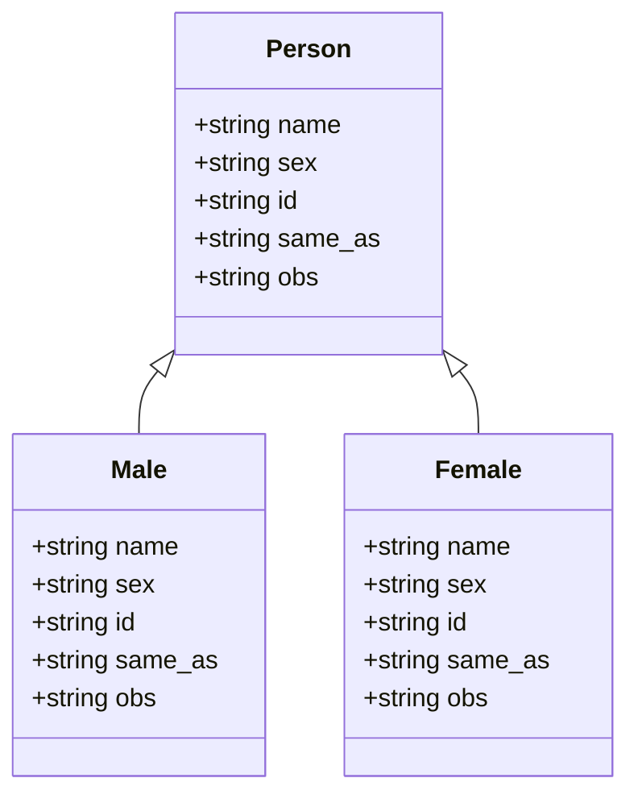
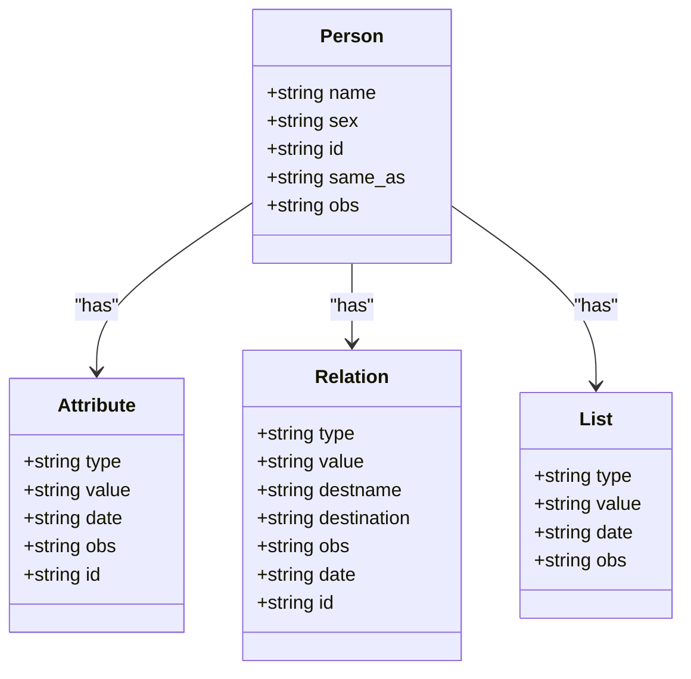
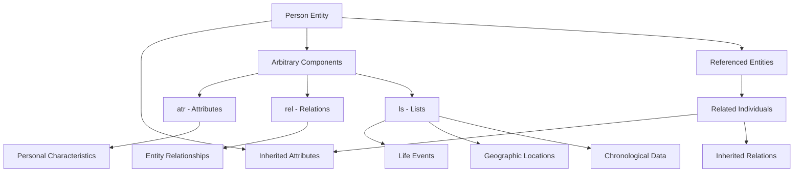

# Person Entity

<cite>
**Referenced Files in This Document**   
- [sources.str](file://structures/sources.str)
- [dehergne-a.cli](file://sources/dehergne-a.cli)
- [entity_default_markdown.j2](file://templates/markdown/base/entity_default_markdown.j2)
- [entity_default_narrative.j2](file://templates/markdown/base/entity_default_narrative.j2)
- [bio_item_attribute.j2](file://templates/markdown/base/bio_item_attribute.j2)
- [sources.str.yaml](file://structures/sources.str.yaml)
</cite>

## Table of Contents
1. [Introduction](#introduction)
2. [Core Attributes of the Person Entity](#core-attributes-of-the-person-entity)
3. [Inheritance Model and Gender Specialization](#inheritance-model-and-gender-specialization)
4. [Arbitrary Components (atr, rel, ls)](#arbitrary-components-atr-rel-ls)
5. [Biographical Data Structure](#biographical-data-structure)
6. [Entity Resolution with 'same_as'](#entity-resolution-with-same_as)
7. [Data Extraction from Kleio Transcriptions](#data-extraction-from-kleio-transcriptions)
8. [Best Practices for Encoding Uncertain Information](#best-practices-for-encoding-uncertain-information)
9. [Conclusion](#conclusion)

## Introduction
The Person entity in the dehergne project serves as the foundational data model for representing individuals within a historical database focused on Jesuit missionaries. This documentation provides a comprehensive overview of the Person entity's structure, attributes, and functionality within the Kleio transcription system. The model is designed to capture detailed biographical information while supporting complex relationships, entity resolution, and data provenance. The Person entity forms the core of a sophisticated data architecture that enables rich historical analysis of missionary activities, particularly those related to Coimbra and global Jesuit missions.

**Section sources**
- [sources.str](file://structures/sources.str#L170-L175)

## Core Attributes of the Person Entity
The Person entity is defined with a set of core attributes that establish the fundamental characteristics of individuals in the database. The primary attributes include name and sex, which are designated as guaranteed elements, meaning they must be present for every Person instance. The name attribute stores the individual's primary identifier, while sex captures gender information essential for demographic analysis and historical context.

Additional attributes include id, which provides a unique identifier for each person in the system, and obs (observation), which allows for supplementary notes and commentary. The structure is defined in the sources.str file, where the person group specifies these attributes and their relationships. The position directive establishes the display order of attributes, with name and sex appearing first, followed by id and same_as. This core structure enables consistent data entry and retrieval across the system while maintaining flexibility for additional information through arbitrary components.

```mermaid
classDiagram
class Person {
+string name
+string sex
+string id
+string same_as
+string obs
}
Person : +name : string
Person : +sex : string
Person : +id : string
Person : +same_as : string
Person : +obs : string
```

**Diagram sources **
- [sources.str](file://structures/sources.str#L170-L175)

**Section sources**
- [sources.str](file://structures/sources.str#L170-L175)

## Inheritance Model and Gender Specialization
The Person entity implements an inheritance model where specialized classes extend the base Person class to represent gender-specific categories. The male and female entities inherit from the person base class, creating a hierarchical structure that maintains data consistency while allowing for gender-specific processing. This inheritance pattern is implemented through the source directive in the structure definition, where both male and female groups specify person as their source.

The male entity inherits all attributes from the person class but modifies the guaranteed attributes to include only name, reflecting the specialized nature of this subclass. Similarly, the female entity follows the same inheritance pattern with identical attribute requirements. This design allows the system to automatically infer gender when processing records, as the presence of male or female in the data stream signals the sex of the individual. The inheritance model supports the source/act/actor-object framework, enabling sophisticated data processing and analysis of gender-specific patterns in missionary activities.



**Diagram sources **
- [sources.str](file://structures/sources.str#L170-L198)

**Section sources**
- [sources.str](file://structures/sources.str#L170-L198)

## Arbitrary Components (atr, rel, ls)
The Person entity incorporates three arbitrary components—atr, rel, and ls—that provide flexible mechanisms for attaching additional information to person records. These components enable the system to capture complex biographical data beyond the core attributes. The atr (attribute) component allows for the addition of named-value pairs with optional dates and observations, supporting detailed characterization of individuals. The rel (relation) component establishes connections between persons and other entities, including destination references and descriptive values.

The ls (list) component serves as a versatile container for chronological information and categorical data, often used to record events such as embarkations, deaths, and other significant life events with associated dates. Each component follows a standardized structure with guaranteed fields and optional elements for enhanced documentation. For example, the attribute group requires type and value fields, while the relation group mandates type, value, destname, and destination. This flexible architecture enables the representation of complex biographical narratives while maintaining data integrity and consistency across the system.



**Diagram sources **
- [sources.str](file://structures/sources.str#L174-L236)

**Section sources**
- [sources.str](file://structures/sources.str#L174-L236)

## Biographical Data Structure
The biographical data structure in the dehergne project employs nested attributes and relations to create rich, detailed profiles of individuals, particularly Jesuit missionaries. This structure is exemplified in entries like Adam Algenler, where multiple ls (list) elements capture chronological events such as embarkation dates, deaths, and professional milestones. Each ls entry can include location data with Wikidata references, creating a geospatial dimension to the biographical narrative.

The data model supports complex hierarchies through the use of referido (referenced) entities, which allow for the inclusion of related individuals and their attributes within a primary person's record. For instance, Prospero Intorcetta is referenced within Adam Algenler's record, establishing their companionship during a voyage to China. The structure also incorporates nested observations (obs) that provide scholarly commentary, source citations, and interpretive notes, creating a layered documentation approach that separates factual data from analytical content.



**Diagram sources **
- [dehergne-a.cli](file://sources/dehergne-a.cli#L161-L209)

**Section sources**
- [dehergne-a.cli](file://sources/dehergne-a.cli#L161-L209)

## Entity Resolution with 'same_as'
The 'same_as' attribute plays a critical role in entity resolution and disambiguation within the dehergne project, addressing the challenge of identifying the same individual across different records and sources. This attribute enables the system to link multiple entries that refer to the same person, even when names or details vary across documents. The functionality is particularly important for historical research where individuals may be recorded with different name variations, titles, or in different languages.

In practice, the same_as attribute creates explicit connections between person records, allowing the system to aggregate information from multiple sources into a unified profile. For example, when conflicting information exists about a person's birth date or place of death, the same_as attribute helps researchers identify these as references to the same individual rather than distinct persons. This capability supports more accurate historical analysis by preventing the duplication of individuals in statistical analyses and enabling comprehensive biographical reconstructions from fragmented source materials.

**Section sources**
- [sources.str](file://structures/sources.str#L172-L173)
- [sources.str](file://structures/sources.str#L294-L295)

## Data Extraction from Kleio Transcriptions
Person data is extracted from Kleio transcriptions (.cli files) through a structured parsing process that converts the hierarchical text format into structured data records. The extraction process begins with the identification of person markers (n$) in the .cli files, which signal the start of a new person record. Each person entry is then processed to extract core attributes and arbitrary components according to the schema defined in sources.str.

The rendering process transforms these structured records into markdown outputs using Jinja2 templates, such as entity_default_markdown.j2 and entity_default_narrative.j2. These templates systematically present the person's information, including ID, description, and detailed attributes in a tabular format. The bio_item_attribute.j2 template specifically handles the rendering of ls elements, converting them into hyperlinked entries that maintain the semantic relationships between data points. This extraction and rendering pipeline ensures consistent presentation of person data across the system while preserving the rich contextual information captured in the original transcriptions.

**Section sources**
- [dehergne-a.cli](file://sources/dehergne-a.cli#L25-L600)
- [entity_default_markdown.j2](file://templates/markdown/base/entity_default_markdown.j2)
- [entity_default_narrative.j2](file://templates/markdown/base/entity_default_narrative.j2)
- [bio_item_attribute.j2](file://templates/markdown/base/bio_item_attribute.j2)

## Best Practices for Encoding Uncertain Information
The dehergne project employs specific conventions for encoding uncertain or conflicting biographical information, ensuring transparency in data representation. When dates are approximate, the system uses qualifiers like "cerca de" (around) or provides date ranges to indicate uncertainty. Conflicting information from different sources is preserved through the use of referido (referenced) entities, which allow alternative interpretations to coexist within the database.

The obs (observation) field plays a crucial role in documenting uncertainty, providing space for researchers to explain discrepancies, cite sources, and offer interpretive commentary. For example, when multiple sources provide different dates for a person's death, each date is recorded with its source, and the obs field explains the conflict and potential resolutions. The system also uses qualifiers like "ou" (or) to present alternative possibilities, maintaining the integrity of the original data while acknowledging uncertainty in historical records.

**Section sources**
- [dehergne-a.cli](file://sources/dehergne-a.cli#L25-L600)

## Conclusion
The Person entity in the dehergne project represents a sophisticated data model designed to capture the complex biographical details of historical figures, particularly Jesuit missionaries. Through its inheritance structure, arbitrary components, and entity resolution capabilities, the model provides a flexible yet rigorous framework for historical research. The integration of Kleio transcriptions with structured data extraction and markdown rendering creates a powerful system for preserving and analyzing biographical information. By implementing best practices for handling uncertain data, the system maintains scholarly rigor while accommodating the inherent ambiguities of historical research. This comprehensive approach enables researchers to construct detailed, accurate, and nuanced portraits of individuals within their historical context.