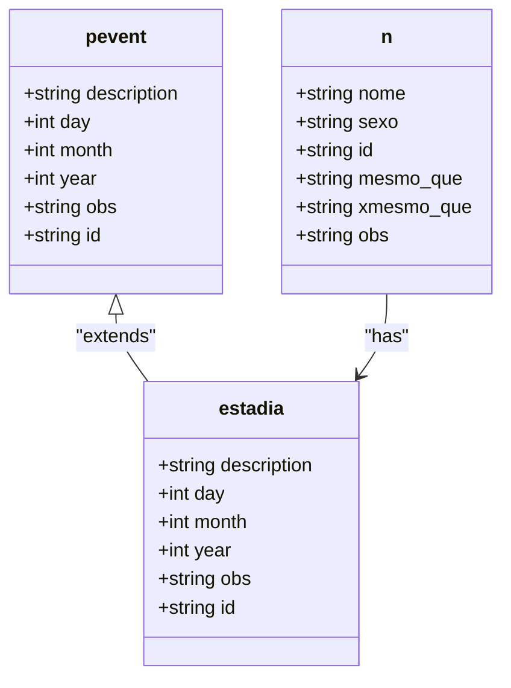
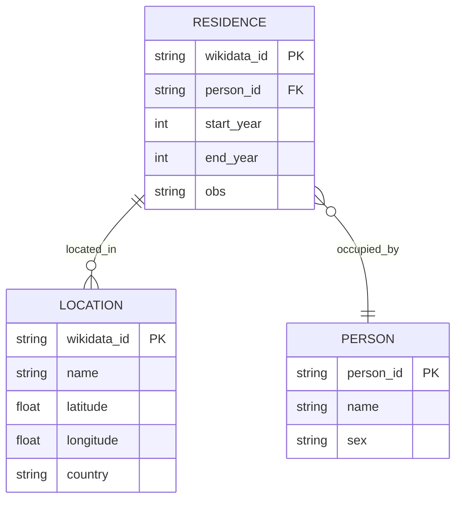

# Residence Entity

<cite>
**Referenced Files in This Document**   
- [sources.str](file://structures/sources.str)
- [residences-1644-1701.csv](file://inferences/wikidata-references/residences-1644-1701.csv)
- [residences-1644.csv](file://inferences/wikidata-references/residences-1644.csv)
- [residences-1701.csv](file://inferences/wikidata-references/residences-1701.csv)
- [locations_names_wikidata.csv](file://inferences/wikidata-references/locations_names_wikidata.csv)
- [Concepts.md](file://extras/doc/Concepts.md)
</cite>

## Table of Contents
1. [Introduction](#introduction)
2. [Residence Data Structure](#residence-data-structure)
3. [The Estadia Relation Type](#the-estadia-relation-type)
4. [Temporal Span and Date Handling](#temporal-span-and-date-handling)
5. [Wikidata Integration](#wikidata-integration)
6. [Prosopographical and Institutional Analysis](#prosopographical-and-institutional-analysis)
7. [Complex Residence Patterns](#complex-residence-patterns)
8. [Best Practices for Encoding](#best-practices-for-encoding)
9. [Integration with Voyage Data](#integration-with-voyage-data)
10. [Conclusion](#conclusion)

## Introduction

The Residence entity in the dehergne project is a fundamental component for modeling the geographical mobility of individuals, particularly Jesuit missionaries, during the 17th and 18th centuries. This documentation provides a comprehensive overview of how residence records are structured, linked to external knowledge bases, and used for historical analysis. The data model captures temporal spans of residence, connects persons to locations through the 'estadia' relation type, and supports sophisticated prosopographical and institutional history research. The residence data is designed to work in conjunction with voyage data to reconstruct complete mobility trajectories of individuals across time and space.

**Section sources**
- [sources.str](file://structures/sources.str#L1147-L1149)
- [Concepts.md](file://extras/doc/Concepts.md#L72-L95)

## Residence Data Structure

The residence data in the dehergne project is structured around CSV files that capture the temporal and spatial aspects of individuals' stays in various locations. The primary residence data is stored in three key CSV files: `residences-1644.csv`, `residences-1701.csv`, and `residences-1644-1701.csv`. These files contain records of individuals' residences during specific temporal spans, with the combined file covering the entire period from 1644 to 1701.

The residence records are structured to capture the essential information about a person's stay in a location, including the temporal span of the residence and the specific location. The data model is designed to support the analysis of mobility patterns, institutional affiliations, and the geographical distribution of individuals over time. The CSV format allows for straightforward data management and integration with other data sources, while the temporal span approach enables the analysis of residence patterns across different historical periods.

**Section sources**
- [residences-1644-1701.csv](file://inferences/wikidata-references/residences-1644-1701.csv#L1-L313)
- [residences-1644.csv](file://inferences/wikidata-references/residences-1644.csv#L1-L169)
- [residences-1701.csv](file://inferences/wikidata-references/residences-1701.csv#L1-L146)

## The Estadia Relation Type

The 'estadia' relation type is a core component of the dehergne data model, defined in the `sources.str` file as a specialized form of personal event. It is used to connect persons to locations for specific time periods, capturing the essence of a residence. The 'estadia' relation is derived from the more general 'pevent' (personal event) type, which allows it to inherit properties related to temporal and descriptive information.

In the data model, 'estadia' is defined as a part of the 'n' (generic actor) group, which means it can be associated with any person in the dataset. This design allows for the flexible recording of residence information for any individual, regardless of their role or status in the historical records. The 'estadia' relation includes elements for description, date (day, month, year), and observation, providing a comprehensive framework for documenting residence events.

**Diagram sources**
- [sources.str](file://structures/sources.str#L1147-L1149)
- [sources.str](file://structures/sources.str#L1691-L1692)

**Section sources**
- [sources.str](file://structures/sources.str#L1147-L1149)
- [sources.str](file://structures/sources.str#L1691-L1692)

## Temporal Span and Date Handling

The residence data model in the dehergne project handles temporal spans through a combination of specific date elements and flexible date handling mechanisms. The 'estadia' relation type includes day, month, and year elements, allowing for precise dating of residence events when such information is available. However, the model also accommodates uncertain or approximate dates, which are common in historical records.

For dates that are uncertain or approximate, the data model relies on the observation (obs) field to document the nature of the uncertainty. This approach allows researchers to record their interpretations and the evidence supporting their dating decisions. The temporal span of 1644 to 1701 covered by the residence data is managed through separate CSV files for the beginning and end of the period, as well as a combined file for the entire span. This structure enables researchers to analyze residence patterns at different temporal resolutions, from specific years to the entire period.

The handling of dates in the residence data is consistent with the broader Timelink methodology, which emphasizes the importance of capturing the uncertainty and ambiguity inherent in historical sources. By allowing for flexible date recording and documentation of uncertainty, the data model supports rigorous historical analysis while remaining faithful to the limitations of the source material.

**Section sources**
- [sources.str](file://structures/sources.str#L1140-L1143)
- [residences-1644-1701.csv](file://inferences/wikidata-references/residences-1644-1701.csv#L1-L313)

## Wikidata Integration

The residence data in the dehergne project is integrated with Wikidata through a systematic linking process that connects locations mentioned in the historical records to their corresponding Wikidata entities. This integration is facilitated by the `locations_names_wikidata.csv` file, which maps location names to Wikidata identifiers (Q-numbers). The residence CSV files also contain a 'wikidata_id' column that directly links each residence record to a specific Wikidata location.

This integration with Wikidata provides several important benefits for the research project. First, it ensures consistency in the representation of locations across different records and sources. Second, it allows researchers to leverage the rich semantic information available in Wikidata, such as geographical coordinates, historical context, and relationships to other entities. Third, it facilitates data sharing and interoperability with other research projects that use Wikidata as a reference.

The use of Wikidata identifiers also supports the resolution of conflicts between different source accounts. When multiple sources provide conflicting information about a location, the Wikidata identifier serves as a stable reference point that can be used to reconcile the differences. This approach enhances the reliability and accuracy of the residence data, making it a valuable resource for historical research.

**Diagram sources**
- [locations_names_wikidata.csv](file://inferences/wikidata-references/locations_names_wikidata.csv#L1-L925)
- [residences-1644-1701.csv](file://inferences/wikidata-references/residences-1644-1701.csv#L1-L313)

**Section sources**
- [locations_names_wikidata.csv](file://inferences/wikidata-references/locations_names_wikidata.csv#L1-L925)
- [residences-1644-1701.csv](file://inferences/wikidata-references/residences-1644-1701.csv#L1-L313)

## Prosopographical and Institutional Analysis

The residence data in the dehergne project is a critical resource for prosopographical analysis and institutional history reconstruction. By tracking the movements of individuals across different locations and time periods, researchers can reconstruct the careers, networks, and institutional affiliations of Jesuit missionaries and other historical figures. The 'estadia' relation type provides the foundation for this analysis by capturing the temporal and spatial dimensions of individuals' lives.

For prosopographical analysis, the residence data allows researchers to trace the career paths of individuals, identifying patterns of mobility, promotion, and specialization. For example, a missionary who served in multiple locations across Asia can be studied to understand the factors that influenced their assignments and the skills they developed in different contexts. The data also supports the analysis of social networks, as individuals who resided in the same location during overlapping periods may have formed professional or personal relationships.

Institutional history reconstruction benefits from the residence data by providing a detailed picture of the geographical distribution and operational scope of the Jesuit mission. Researchers can analyze the concentration of missionaries in specific regions, the establishment and closure of mission stations, and the response of the institution to political and social changes. The integration with Wikidata enhances this analysis by providing contextual information about the locations, such as their political status, economic conditions, and cultural characteristics.

**Section sources**
- [sources.str](file://structures/sources.str#L1147-L1149)
- [residences-1644-1701.csv](file://inferences/wikidata-references/residences-1644-1701.csv#L1-L313)

## Complex Residence Patterns

The residence data model in the dehergne project is capable of representing complex residence patterns, including overlapping stays and repeated returns to the same location. These patterns are captured through multiple 'estadia' records for the same individual, each with its own temporal span and location. The flexibility of the data model allows for the detailed documentation of an individual's mobility history, even when it involves frequent moves or extended periods in multiple locations.

Overlapping stays can occur when an individual is recorded as residing in two different locations during the same time period. This may reflect different types of residence, such as a primary residence and a temporary assignment, or it may indicate uncertainty in the historical records. The data model handles these cases by allowing multiple 'estadia' records with overlapping dates, while the observation field can be used to document the nature of the overlap and the evidence supporting each record.

Repeated returns to the same location are another common pattern in the residence data. These returns may reflect cyclical assignments, such as annual visits to a mission station, or they may indicate a deep connection between an individual and a particular location. The data model captures these patterns by allowing multiple 'estadia' records for the same location, each with its own temporal span. This approach enables researchers to analyze the frequency, duration, and context of repeated visits, providing insights into the individual's role and the institutional practices of the time.

**Section sources**
- [residences-1644-1701.csv](file://inferences/wikidata-references/residences-1644-1701.csv#L1-L313)
- [sources.str](file://structures/sources.str#L1147-L1149)

## Best Practices for Encoding

When encoding residence records in the dehergne project, researchers should follow several best practices to ensure the accuracy, consistency, and usability of the data. First, it is essential to use the 'estadia' relation type consistently for all residence events, regardless of their duration or significance. This ensures that all residence information is captured in a standardized format that can be easily analyzed and compared.

Second, researchers should make full use of the observation (obs) field to document any uncertainties, ambiguities, or interpretive decisions related to the residence record. This includes noting the source of the information, the evidence for the dating, and any conflicting accounts. The obs field is a critical tool for maintaining the transparency and reliability of the data, as it allows future researchers to understand the context and limitations of each record.

Third, when linking locations to Wikidata, researchers should verify that the selected Wikidata entity accurately represents the location mentioned in the historical record. This may involve consulting additional sources or making judgments about the historical context of the location. The goal is to create links that are as accurate and meaningful as possible, while acknowledging any uncertainties in the identification process.

Finally, researchers should be mindful of the temporal span of the residence records and ensure that dates are recorded consistently across the dataset. When dates are uncertain or approximate, they should be documented in a way that reflects the level of confidence in the dating, using the obs field to provide additional context.

**Section sources**
- [sources.str](file://structures/sources.str#L1147-L1149)
- [residences-1644-1701.csv](file://inferences/wikidata-references/residences-1644-1701.csv#L1-L313)
- [locations_names_wikidata.csv](file://inferences/wikidata-references/locations_names_wikidata.csv#L1-L925)

## Integration with Voyage Data

The residence data in the dehergne project is designed to integrate seamlessly with voyage data to create complete mobility trajectories for individuals. This integration is achieved through the use of complementary relation types, such as 'viagem' (voyage), which captures the movement between locations. By combining residence and voyage data, researchers can reconstruct the full journey of an individual, from their departure from one location to their arrival at another, and their subsequent residence in the new location.

The integration of residence and voyage data supports a more comprehensive analysis of mobility patterns, allowing researchers to study not only where individuals lived but also how they moved between locations. This is particularly important for understanding the logistics and challenges of long-distance travel in the 17th and 18th centuries, as well as the factors that influenced the timing and route of voyages. The combined data also provides insights into the duration of voyages, the frequency of travel, and the relationship between travel and residence patterns.

The data model facilitates this integration by using a consistent framework for recording temporal and spatial information across both residence and voyage records. This consistency ensures that the data can be easily combined and analyzed, enabling researchers to create detailed mobility trajectories that capture the complexity of historical travel and residence.

**Section sources**
- [sources.str](file://structures/sources.str#L1147-L1148)
- [residences-1644-1701.csv](file://inferences/wikidata-references/residences-1644-1701.csv#L1-L313)

## Conclusion

The Residence entity in the dehergne project represents a sophisticated and flexible data model for capturing the geographical mobility of individuals during the 17th and 18th centuries. Through the use of the 'estadia' relation type, temporal span-based CSV files, and integration with Wikidata, the model provides a comprehensive framework for documenting and analyzing residence patterns. The data supports a wide range of research applications, from prosopographical analysis to institutional history reconstruction, and can be combined with voyage data to create complete mobility trajectories. By following best practices for encoding and leveraging the full capabilities of the data model, researchers can gain deep insights into the lives and movements of historical figures, contributing to a richer understanding of the past.