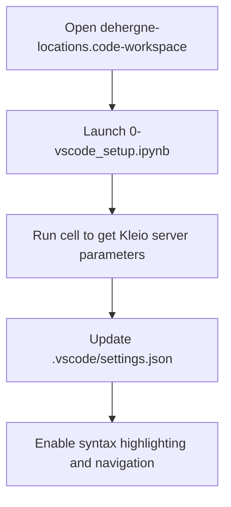
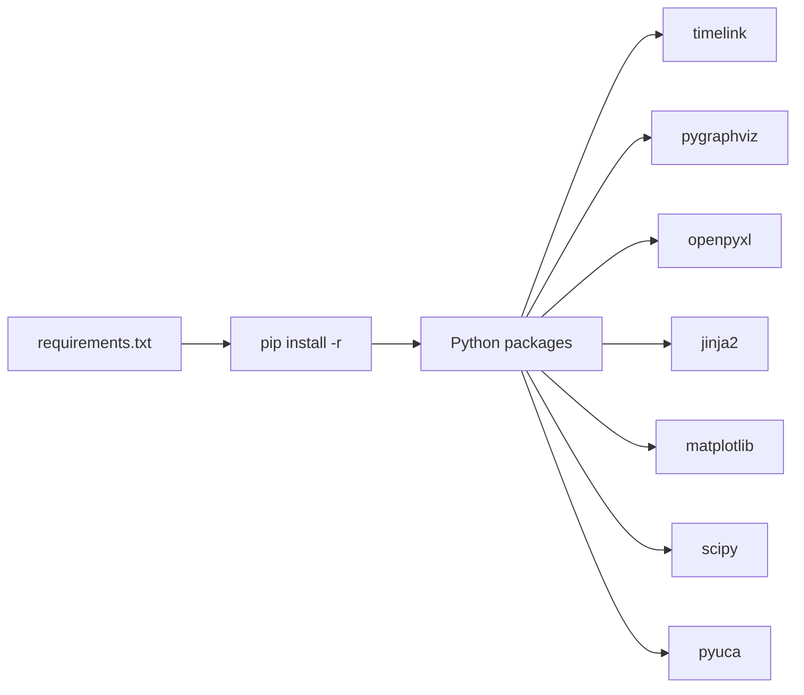

# Development Environment

<cite>
**Referenced Files in This Document**   
- [dehergne-locations.code-workspace](file://dehergne-locations.code-workspace)
- [0-vscode_setup.ipynb](file://notebooks/0-vscode_setup.ipynb)
- [requirements.txt](file://notebooks/requirements.txt)
- [README.md](file://README.md)
- [graphviz_install.md](file://notebooks/graphviz_install.md)
- [throttle.ctrl](file://notebooks/throttle.ctrl)
- [dehergne_util.py](file://notebooks/dehergne_util.py)
</cite>

## Table of Contents
1. [Introduction](#introduction)
2. [Required Tools and Software](#required-tools-and-software)
3. [Workspace Configuration](#workspace-configuration)
4. [Notebook Setup and Kernel Configuration](#notebook-setup-and-kernel-configuration)
5. [Dependency Management](#dependency-management)
6. [Virtual Environment Best Practices](#virtual-environment-best-practices)
7. [Troubleshooting Common Setup Issues](#troubleshooting-common-setup-issues)
8. [Resource Management with throttle.ctrl](#resource-management-with-throttlectrl)
9. [Ensuring Environment Consistency](#ensuring-environment-consistency)

## Introduction
This document provides comprehensive guidance for setting up the development environment for the dehergne project, a Timelink-Kleio based system for transcribing and analyzing historical Jesuit biographies from China (1552–1800). The setup enables researchers and developers to work with Kleio transcription files, Jupyter notebooks, and semantic linking via Wikidata. The environment leverages VS Code with specialized extensions, Python, and Docker-based Kleio server integration to ensure reproducibility and collaborative consistency.

**Section sources**
- [README.md](file://README.md#L1-L87)

## Required Tools and Software
To begin working with the dehergne project, install the following tools:

1. **Python 3.10+**: The project uses Python 3.10.16 as specified in the notebook kernel configuration. Ensure your system has Python installed and accessible via the command line.
2. **Jupyter Notebooks**: Integrated within VS Code, Jupyter enables interactive data analysis and visualization. Install via the Python extension in VS Code.
3. **VS Code**: Download and install from [code.visualstudio.com](https://code.visualstudio.com/download). It serves as the primary IDE for editing Kleio files and running notebooks.
4. **Timelink Bundle Extension**: Install the Timelink VS Code extension from the marketplace: [Timelink VSCode Web](https://marketplace.visualstudio.com/items?itemName=time-link.timelink-vscode-web). This enables Kleio syntax highlighting, project navigation, and server integration.
5. **Docker**: Required to run the Kleio server container. Install from [Docker's official site](https://docs.docker.com/get-docker/).

These tools form the foundation for interacting with the Timelink ecosystem and processing historical data.

**Section sources**
- [README.md](file://README.md#L5-L87)
- [0-vscode_setup.ipynb](file://notebooks/0-vscode_setup.ipynb#L1-L165)
- [README.md](file://notebooks/README.md#L1-L19)

## Workspace Configuration
The dehergne project uses a dedicated VS Code workspace file to standardize editor settings across team members. The `dehergne-locations.code-workspace` file configures the project root and Timelink-specific parameters.

Key settings include:
- `"folders": [{"path": "."}]`: Defines the current directory as the workspace root.
- `timelink.kleio.kleioServerHome`: Path to the Kleio server home directory.
- `timelink.kleio.kleioServerToken`: Authentication token for the Kleio server.
- `timelink.kleio.kleioServerUrl`: URL endpoint for the Kleio server API.

Upon first setup, these values are dynamically populated by running the `0-vscode_setup.ipynb` notebook, which queries the running Kleio server and updates the `.vscode/settings.json` file automatically.



**Diagram sources**
- [dehergne-locations.code-workspace](file://dehergne-locations.code-workspace#L1-L12)
- [0-vscode_setup.ipynb](file://notebooks/0-vscode_setup.ipynb#L45-L135)

**Section sources**
- [dehergne-locations.code-workspace](file://dehergne-locations.code-workspace#L1-L12)
- [0-vscode_setup.ipynb](file://notebooks/0-vscode_setup.ipynb#L45-L135)

## Notebook Setup and Kernel Configuration
The notebooks in the `notebooks/` directory require proper kernel configuration to execute Python code and interface with the Timelink system.

1. Open the project in VS Code using the `dehergne-locations.code-workspace` file.
2. Launch any notebook (e.g., `0-vscode_setup.ipynb`) and select the correct Python interpreter:
   - Use the command palette (`Ctrl+Shift+P`) and choose "Python: Select Interpreter".
   - Choose the interpreter matching Python 3.10.16 or your virtual environment.
3. The kernel specification in `0-vscode_setup.ipynb` indicates:
   ```json
   "kernelspec": {
     "display_name": ".venv",
     "language": "python",
     "name": "python3"
   }
   ```
   This confirms the use of a virtual environment named `.venv`.

After kernel selection, run the initialization cells to connect to the Kleio server and verify the Timelink setup.

**Section sources**
- [0-vscode_setup.ipynb](file://notebooks/0-vscode_setup.ipynb#L143-L164)

## Dependency Management
Dependencies are managed through the `requirements.txt` file located in the `notebooks/` directory. This file lists all Python packages required for data processing, visualization, and network analysis.

Key dependencies include:
- `timelink`: Core library for Kleio file parsing and database interaction.
- `openpyxl`: For reading Excel files (e.g., location metadata).
- `jinja2`: Template engine for generating structured output.
- `matplotlib`: Data visualization.
- `pygraphviz`: For graph visualization using Graphviz.
- `scipy`: Scientific computing.
- `pyuca`: Unicode Collation Algorithm for sorting text.

Install dependencies using:
```bash
pip install -r notebooks/requirements.txt
```

For macOS users installing `pygraphviz`, additional configuration may be required due to header file paths:
```bash
pip install --config-settings="--global-option=build_ext" \
            --config-settings="--global-option=-I$(brew --prefix graphviz)/include/" \
            --config-settings="--global-option=-L$(brew --prefix graphviz)/lib/" \
            pygraphviz
```



**Diagram sources**
- [requirements.txt](file://notebooks/requirements.txt#L1-L9)
- [graphviz_install.md](file://notebooks/graphviz_install.md#L1-L33)

**Section sources**
- [requirements.txt](file://notebooks/requirements.txt#L1-L9)
- [graphviz_install.md](file://notebooks/graphviz_install.md#L1-L33)

## Virtual Environment Best Practices
To ensure reproducibility and avoid package conflicts, use a virtual environment:

1. Create a virtual environment:
   ```bash
   python -m venv .venv
   ```
2. Activate it:
   - On macOS/Linux: `source .venv/bin/activate`
   - On Windows: `.venv\Scripts\activate`
3. Install dependencies:
   ```bash
   pip install -r notebooks/requirements.txt
   ```
4. Upgrade pip first if needed:
   ```bash
   python -m pip install --upgrade pip
   ```

Always commit the `requirements.txt` file after adding new packages using:
```bash
pip freeze > notebooks/requirements.txt
```

This ensures all team members use identical package versions.

**Section sources**
- [requirements.txt](file://notebooks/requirements.txt#L1-L9)

## Troubleshooting Common Setup Issues
Common issues and their solutions:

1. **Missing Timelink Extension**: If Kleio syntax highlighting is not active, ensure the Timelink VS Code extension is installed from the marketplace.
2. **Kleio Server Connection Errors**: Run the setup notebook (`0-vscode_setup.ipynb`) to refresh server parameters. Ensure Docker is running and the Kleio container is active.
3. **Python Kernel Not Found**: Verify the correct interpreter is selected in VS Code. Look for `.venv` in the interpreter list.
4. **Graphviz Installation Failures**: On macOS, use the extended pip install command with `--config-settings` pointing to Homebrew’s Graphviz installation.
5. **Workspace Settings Not Applied**: Confirm that `.vscode/settings.json` is updated by the setup notebook. Manually create the directory if missing.

Regularly refer to the [Timelink GitHub Discussions](https://github.com/time-link/timelink-py) for community support.

**Section sources**
- [0-vscode_setup.ipynb](file://notebooks/0-vscode_setup.ipynb#L35-L135)
- [graphviz_install.md](file://notebooks/graphviz_install.md#L1-L33)

## Resource Management with throttle.ctrl
The `throttle.ctrl` file controls resource usage during batch processing operations, particularly when querying external services like Wikidata.

This file contains directives that limit request rates to prevent overloading APIs. Example content:
```
f9c1 2 1753319433.907797 wikidata:wikidata
```

Each line follows the format:
- Identifier
- Maximum concurrent requests
- Timestamp
- Service target

Modify values only when necessary and with awareness of API rate limits. This ensures ethical and sustainable use of external data sources.

**Section sources**
- [throttle.ctrl](file://notebooks/throttle.ctrl#L1-L2)

## Ensuring Environment Consistency
To maintain consistency across team members:
- Use the same Python version (3.10.16 recommended).
- Share the `requirements.txt` file and update it after any dependency changes.
- Use the `dehergne-locations.code-workspace` file to standardize editor settings.
- Run the `0-vscode_setup.ipynb` notebook on project open to synchronize Kleio server parameters.
- Document any manual configuration steps in the team wiki or README.

This approach ensures that all collaborators work in a uniform environment, minimizing "it works on my machine" issues and enhancing reproducibility.

**Section sources**
- [dehergne-locations.code-workspace](file://dehergne-locations.code-workspace#L1-L12)
- [0-vscode_setup.ipynb](file://notebooks/0-vscode_setup.ipynb#L45-L135)
- [README.md](file://README.md#L1-L87)