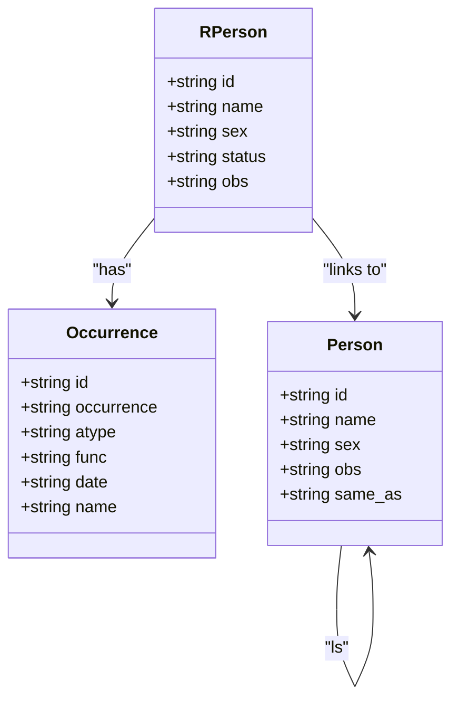
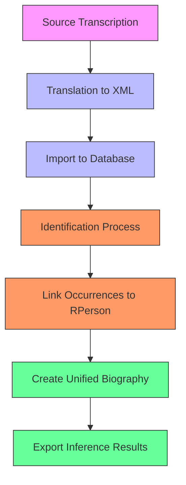
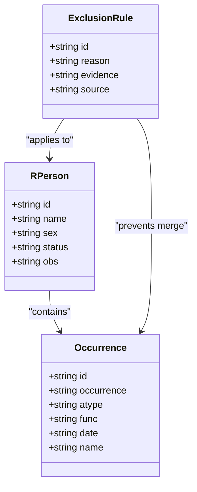
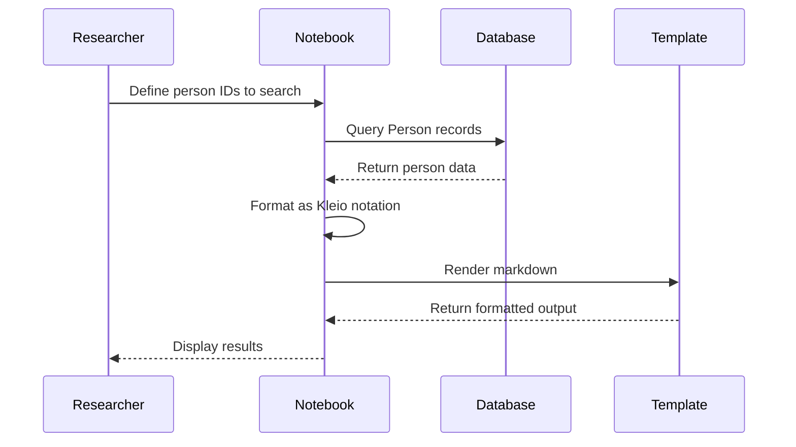
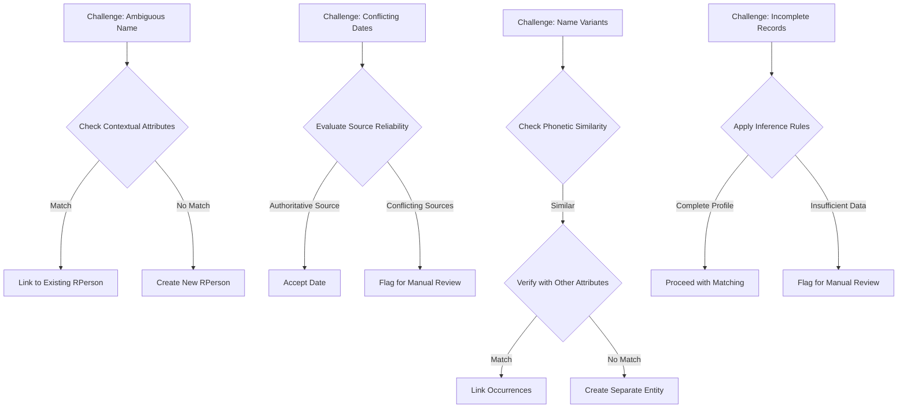
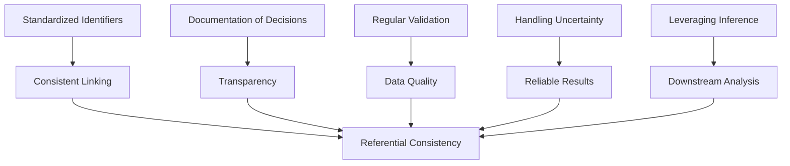

# Identification Phase

<cite>
**Referenced Files in This Document**   
- [jesuita-entrada-Coimbra.md](file://inferences/jesuita-entrada-Coimbra.md)
- [mhk_identification_toliveira.cli.exclude](file://identifications/mhk_identification_toliveira.cli.exclude)
- [people-search-display.ipynb](file://notebooks/people-search-display.ipynb)
- [Concepts.md](file://etc/doc/Concepts.md)
- [sources.str](file://structures/sources.str)
</cite>

## Table of Contents
1. [Introduction](#introduction)
2. [Core Identification Mechanisms](#core-identification-mechanisms)
3. [Reference Dataset Analysis](#reference-dataset-analysis)
4. [Exclusion Rules and Conflict Resolution](#exclusion-rules-and-conflict-resolution)
5. [Querying and Validation Workflows](#querying-and-validation-workflows)
6. [Common Challenges and Resolution Strategies](#common-challenges-and-resolution-strategies)
7. [Best Practices for Referential Consistency](#best-practices-for-referential-consistency)
8. [Conclusion](#conclusion)

## Introduction

The identification phase in the Timelink system is a critical process that links multiple person occurrences across historical transcriptions into unified biographical records. This document details the methodology used to resolve duplicates and establish canonical entries by leveraging identifiers, name variants, and contextual attributes such as birth year and nationality. The process is grounded in a structured framework that ensures referential consistency while allowing for complex entity resolution.

The system operates on a four-phase workflow: transcription, translation, importation, and identification. During the identification phase, researchers make decisions about co-occurring entities across different acts and sources, determining when distinct references pertain to the same individual. These decisions are formalized through real entity records (rperson) that aggregate occurrences (occ) from various transcriptions, enabling the creation of comprehensive biographies and relational networks.

This documentation uses the `jesuita-entrada-Coimbra.md` dataset as a reference to illustrate how the system resolves person identities, particularly within the context of Jesuit entries at Coimbra. It also examines the role of exclusion rules defined in `mhk_identification_toliveira.cli.exclude` to prevent incorrect merges, and demonstrates querying and validation techniques using notebooks like `people-search-display.ipynb`.

**Section sources**
- [Concepts.md](file://etc/doc/Concepts.md#L60-L119)

## Core Identification Mechanisms

The identification system relies on a structured model defined in the `sources.str` file, which establishes the framework for representing persons, their attributes, and relationships. At its core, the system uses unique identifiers to track individuals across multiple transcriptions, ensuring that each occurrence can be linked to a canonical record.

The primary components of the identification mechanism include:

- **Real Entities (rentity)**: These are canonical records that represent a single person or object across multiple sources. Each real entity has a standard name and aggregates all known occurrences.
- **Occurrences (occ)**: These are references to a person in specific historical acts or documents. Each occurrence is linked to a real entity through the identification process.
- **Contextual Attributes**: Birth year, nationality, and other biographical details are used to support identity resolution, especially when names are ambiguous or variant spellings exist.

The system uses a hierarchical structure where each `rperson` (real person) contains multiple `occ` (occurrence) entries, each pointing to a specific instance in the source data. This allows for the consolidation of fragmented information into a unified biographical record.

For example, in the `mhk_identification_toliveira.cli.exclude` file, we see entries like `rperson$rp-46/Agostinho de Barros` which aggregates two occurrences: `deh-joao-de-barros-ref1` and `deh-agostinho-de-barros`. This demonstrates how the system links different name variants to a single canonical identity.

The identification process is supported by inference rules that derive personal attributes and relationships from the co-occurrence of entities in specific acts. For instance, kinship relations can be inferred from baptism records, where the roles of parents and child are explicitly stated.

**Diagram sources **
- [sources.str](file://structures/sources.str#L108-L150)

**Section sources**
- [sources.str](file://structures/sources.str#L79-L150)
- [mhk_identification_toliveira.cli.exclude](file://identifications/mhk_identification_toliveira.cli.exclude#L5-L10)

## Reference Dataset Analysis

The `jesuita-entrada-Coimbra.md` dataset serves as a key reference for understanding how person identities are resolved within the Timelink system. This dataset contains records of Jesuit entries at Coimbra, including personal identifiers, name variants, birth years, and other contextual attributes that are essential for identity resolution.

The dataset is structured as a markdown table with the following key columns:
- **id**: The unique identifier for each person occurrence
- **dehergne**: The Dehergne number, a reference to the biographical dictionary
- **name**: The person's name
- **nascimento.date.year**: Birth year
- **jesuita-entrada.date.year**: Year of Jesuit entry
- **jesuita-entrada**: Location of entry (Coimbra in all cases)
- **age_at_entrada**: Age at entry
- **embarque.date.year**: Year of embarkation
- **morte.date.year**: Year of death
- **morte**: Location of death

This dataset enables the system to link multiple occurrences of the same individual by comparing attributes such as birth year, entry year, and death year. For example, the record for `deh-pedro-de-alcacova` shows a birth year of 1523 and entry year of 1542, resulting in an age at entry of 19. This information can be cross-referenced with other records to confirm identity.

The dataset also includes inferred attributes such as `age_at_embarque` and `mission_time`, which are calculated based on the temporal relationships between events in a person's life. These inferences support the identification process by providing additional contextual data for comparison.

The Coimbra dataset is particularly valuable because it represents a well-documented cohort of individuals with consistent entry records, making it an ideal test case for identity resolution algorithms. The temporal and geographical consistency of the data reduces ambiguity and allows for more confident matching.

**Diagram sources **
- [Concepts.md](file://etc/doc/Concepts.md#L69-L119)

**Section sources**
- [jesuita-entrada-Coimbra.md](file://inferences/jesuita-entrada-Coimbra.md#L1-L63)

## Exclusion Rules and Conflict Resolution

The `mhk_identification_toliveira.cli.exclude` file plays a crucial role in preventing incorrect merges during the identification process. This file contains a set of exclusion rules that explicitly define when certain name variants or occurrences should not be linked to a canonical entity, even if they appear similar.

The exclusion rules are implemented as real entity records (rperson) with multiple occurrences (occ) that are deliberately kept separate despite potential similarities. Each rule includes an observation (obs) field that explains the rationale for the exclusion, often citing historical sources or scholarly references.

Key examples from the exclusion file include:

- **Agostinho de Barros**: The system links `deh-joao-de-barros-ref1` and `deh-agostinho-de-barros` as the same person, despite the name difference, based on contextual evidence.
- **Antonio Ferronus**: The system identifies `deh-antonio-ferronus` and `deh-andre-ferrao` as the same person, noting that both died on the same date according to Dehergne.
- **Gabriel Roussel**: The system distinguishes between `deh-gabriel-roussel` and `deh-gabriel-boussel`, noting a potential confusion between the two names.

The exclusion rules demonstrate several important principles:

1. **Name Variants**: The system recognizes that historical names often have multiple spellings or forms, and uses contextual attributes to determine when variants refer to the same person.
2. **Temporal Consistency**: Dates of birth, entry, and death are critical for resolving ambiguities. When dates conflict, the system may create separate entities.
3. **Scholarly References**: The observation fields frequently cite Dehergne numbers or other authoritative sources to justify identification decisions.
4. **Geographical Context**: Location data, such as place of entry or death, helps distinguish between individuals with similar names.

The exclusion rules also reveal cases where the identifier has expressed uncertainty, using phrases like "suponho que seja o mesmo" (I suppose it is the same) or "Dehergne pensa que será uma confusão" (Dehergne thinks it will be a confusion). These annotations highlight the interpretive nature of the identification process and the importance of transparent documentation.

**Diagram sources **
- [mhk_identification_toliveira.cli.exclude](file://identifications/mhk_identification_toliveira.cli.exclude#L1-L514)

**Section sources**
- [mhk_identification_toliveira.cli.exclude](file://identifications/mhk_identification_toliveira.cli.exclude#L1-L514)

## Querying and Validation Workflows

The `people-search-display.ipynb` notebook provides a practical interface for querying and validating identified entities within the Timelink system. This Jupyter notebook demonstrates how researchers can interact with the database to search for persons, display their records in Kleio notation, and validate identification decisions.

The notebook workflow consists of several key steps:

1. **Initialization**: The notebook imports the Timelink library and establishes a connection to the database.
2. **Person Search**: A list of person identifiers is defined, and the system queries the database for these specific records.
3. **Kleio Output**: The results are displayed in Kleio notation, which shows the structured representation of each person including their attributes, relations, and occurrences.
4. **Template Rendering**: The notebook uses Jinja2 templates to generate markdown output from the person records, facilitating documentation and sharing.

The Kleio notation output includes several important elements:
- **ls (life status)**: Attributes such as nationality, Jesuit status, and Dehergne number
- **rel (relations)**: Relationships with other entities, including professional, social, and familial connections
- **nascimento**: Birth information with location and date
- **jesuita-entrada**: Jesuit entry details
- **embarque**: Embarkation information
- **morte**: Death details

The notebook also demonstrates how to handle real persons (REntity) and acts, showing the full range of entity types that can be queried and displayed. The template system allows for flexible output formats, enabling researchers to generate customized reports and visualizations.

One important feature of the notebook is its ability to detect and report warnings during template rendering, such as invalid dates. This helps identify data quality issues that may affect identification accuracy.

The querying workflow exemplifies best practices for validation by allowing researchers to:
- Review the complete set of attributes for each person
- Examine the evidence supporting identification decisions
- Compare multiple occurrences of the same person
- Verify the consistency of temporal and geographical data

**Diagram sources **
- [people-search-display.ipynb](file://notebooks/people-search-display.ipynb#L1-L800)

**Section sources**
- [people-search-display.ipynb](file://notebooks/people-search-display.ipynb#L1-L800)

## Common Challenges and Resolution Strategies

The identification process faces several common challenges that require careful resolution strategies. These challenges arise from the nature of historical records, which often contain incomplete, ambiguous, or conflicting information.

### Ambiguous Name Matches

One of the most frequent challenges is resolving ambiguous name matches, where multiple individuals share similar or identical names. The system addresses this through:

- **Contextual Attribute Matching**: Comparing birth years, entry years, and death years to distinguish between individuals
- **Geographical Context**: Using locations of entry, embarkation, and death to differentiate persons
- **Temporal Proximity**: Analyzing the sequence of events in a person's life to ensure consistency

For example, the system distinguishes between `deh-antonio-lopes-junior` and `deh-antonio-lopes-senior` based on their different birth years and entry dates, despite the similar names.

### Conflicting Dates

Conflicting dates present another significant challenge, particularly when different sources provide contradictory information about birth, entry, or death years. The resolution strategy involves:

- **Source Hierarchy**: Prioritizing more authoritative sources (e.g., Dehergne numbers)
- **Majority Rule**: When multiple sources agree on a date, that date is preferred
- **Contextual Plausibility**: Rejecting dates that create implausible life timelines (e.g., death before birth)

The exclusion rules file shows several cases where dates are used to resolve conflicts, such as the note for `rp-26/Antonio Ferronus` which states "Dehergne considera que são o mesmo porque ambos morreram na mesma data" (Dehergne considers them the same because both died on the same date).

### Name Variants and Spelling Differences

Historical records often contain multiple variants of the same name due to transcription errors, regional spelling differences, or changes over time. The system handles these through:

- **Phonetic Matching**: Identifying names that sound similar despite different spellings
- **Pattern Recognition**: Recognizing common name transformation patterns
- **Contextual Confirmation**: Requiring additional attributes to confirm matches

The `people-search-display.ipynb` notebook demonstrates this with entries like `deh-andre-pereira` which includes the variant name "Andrew Jackson" and the Chinese name "Siu Meou-Tö Tchouo-Hien".

### Incomplete Records

Many historical records are incomplete, lacking key attributes like birth year or death location. The system addresses this by:

- **Inference Rules**: Deriving missing information from related records
- **Probabilistic Matching**: Assigning confidence scores to potential matches
- **Manual Review**: Flagging uncertain cases for expert evaluation

The resolution workflow emphasizes transparency by documenting the rationale for each identification decision, allowing future researchers to understand the basis for merges and exclusions.

**Diagram sources **
- [mhk_identification_toliveira.cli.exclude](file://identifications/mhk_identification_toliveira.cli.exclude#L1-L514)
- [people-search-display.ipynb](file://notebooks/people-search-display.ipynb#L1-L800)

**Section sources**
- [mhk_identification_toliveira.cli.exclude](file://identifications/mhk_identification_toliveira.cli.exclude#L1-L514)
- [people-search-display.ipynb](file://notebooks/people-search-display.ipynb#L1-L800)

## Best Practices for Referential Consistency

Maintaining referential consistency is essential for ensuring the reliability and usability of the identified records. The following best practices have been established through the Timelink system:

### Use of Standardized Identifiers

Each person occurrence is assigned a unique identifier following the pattern `deh-[name]-[ref]`, where:
- `deh` indicates the Dehergne project
- `[name]` is a standardized form of the person's name
- `[ref]` is an optional reference number for disambiguation

These identifiers are preserved throughout the identification process, ensuring that each occurrence can be traced back to its source.

### Documentation of Identification Decisions

Every identification decision is documented with:
- **Observation Notes**: Explanations for why occurrences are linked or kept separate
- **Source Citations**: References to authoritative sources like Dehergne numbers
- **Confidence Levels**: Indicators of certainty (e.g., "suponho que seja" for uncertain matches)

This documentation is stored in the `obs` field of rperson records and is critical for transparency and reproducibility.

### Regular Validation and Auditing

The system supports regular validation through:
- **Automated Checks**: Scripts that verify the consistency of dates and attributes
- **Manual Review**: Periodic examination of edge cases and uncertain matches
- **Cross-Validation**: Comparing results with independent sources

The `people-search-display.ipynb` notebook exemplifies this by providing tools for systematic review of person records.

### Handling Uncertainty

When identification is uncertain, the system follows these principles:
- **Preserve Distinct Entities**: When in doubt, maintain separate records rather than risk incorrect merges
- **Flag for Review**: Mark uncertain cases with clear annotations
- **Update with New Evidence**: Allow identification decisions to be revised when new information becomes available

### Leveraging Inference Outputs

The inference outputs are used in downstream analysis by:
- **Generating Biographies**: Creating comprehensive life histories from linked occurrences
- **Building Networks**: Constructing relational networks based on co-occurrence in acts
- **Supporting Statistical Analysis**: Providing clean, deduplicated data for quantitative research

The `jesuita-entrada-Coimbra.md` dataset demonstrates how inference outputs can be structured for analysis, with calculated fields like `age_at_entrada` and `mission_time`.

**Diagram sources **
- [jesuita-entrada-Coimbra.md](file://inferences/jesuita-entrada-Coimbra.md#L1-L63)
- [mhk_identification_toliveira.cli.exclude](file://identifications/mhk_identification_toliveira.cli.exclude#L1-L514)

**Section sources**
- [jesuita-entrada-Coimbra.md](file://inferences/jesuita-entrada-Coimbra.md#L1-L63)
- [mhk_identification_toliveira.cli.exclude](file://identifications/mhk_identification_toliveira.cli.exclude#L1-L514)

## Conclusion

The identification phase in the Timelink system represents a sophisticated approach to resolving person identities across historical transcriptions. By combining unique identifiers, name variants, and contextual attributes, the system creates unified biographical records that support comprehensive analysis of historical communities.

The process is grounded in a robust technical framework defined in the `sources.str` file, which structures the representation of persons, their attributes, and relationships. This framework enables the aggregation of multiple occurrences into canonical entities (rperson) while preserving the provenance of each occurrence.

The `jesuita-entrada-Coimbra.md` dataset serves as an excellent reference for understanding how the system operates, demonstrating the resolution of identities through temporal, geographical, and biographical attributes. The exclusion rules in `mhk_identification_toliveira.cli.exclude` highlight the importance of preventing incorrect merges, particularly in cases of ambiguous name matches or conflicting dates.

The `people-search-display.ipynb` notebook provides essential tools for querying and validating identified entities, enabling researchers to systematically review and verify identification decisions. This supports best practices for referential consistency, including standardized identifiers, thorough documentation, regular validation, and careful handling of uncertainty.

The identification process ultimately enables downstream analysis by providing clean, deduplicated data that can be used to generate biographies, construct relational networks, and support statistical research. The system's emphasis on transparency and reproducibility ensures that identification decisions can be understood and verified by future researchers.

As the project continues to evolve, maintaining these best practices will be essential for preserving the integrity and value of the identified records.