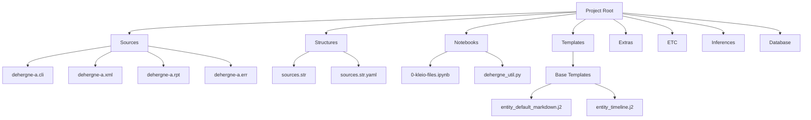
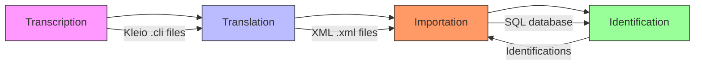
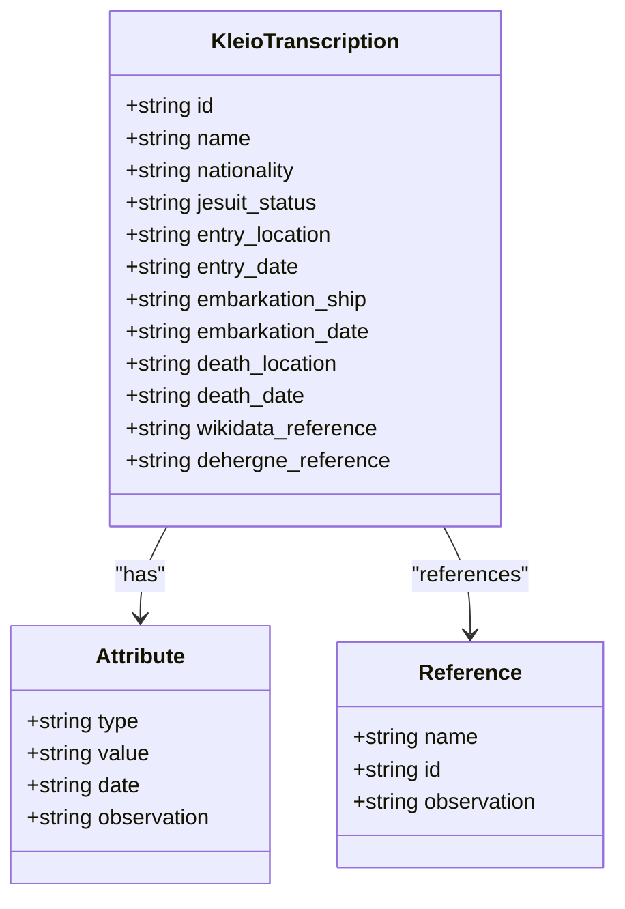
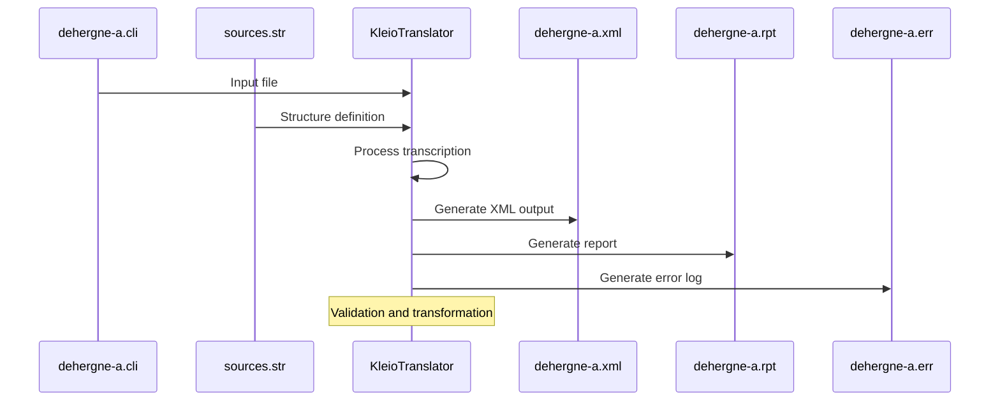
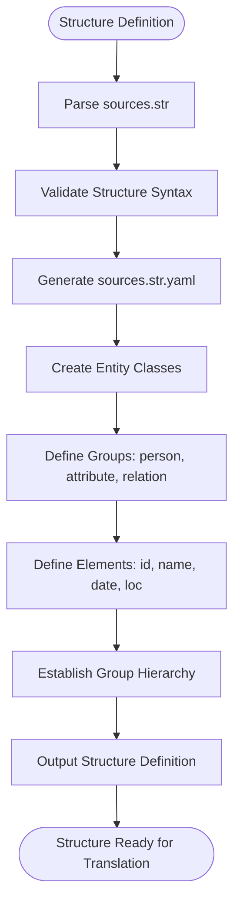
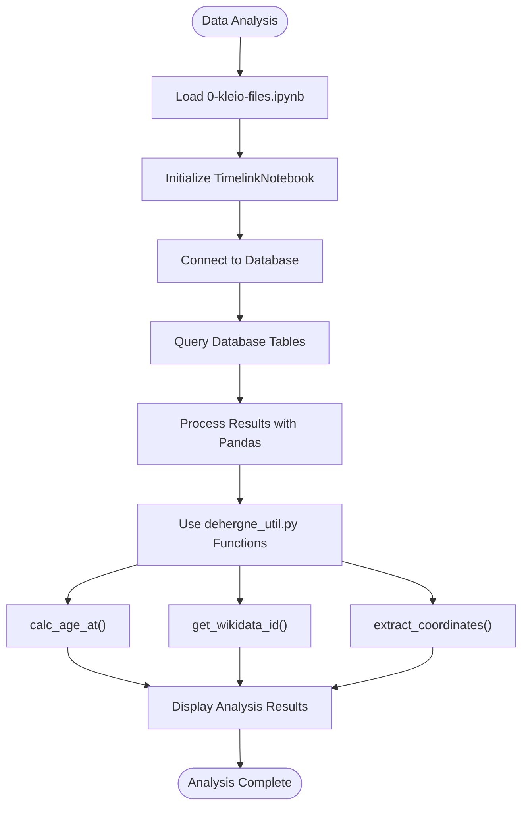
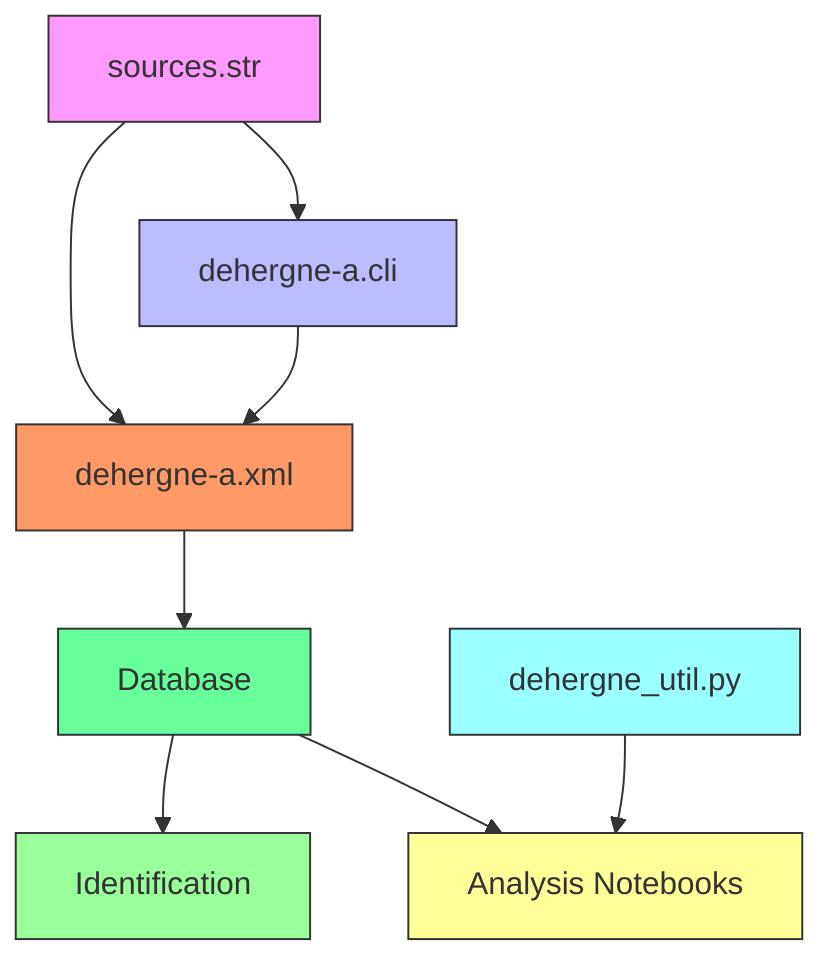

# Kleio Processing Workflow

<cite>
**Referenced Files in This Document**   
- [README.md](file://README.md)
- [etc/doc/Concepts.md](file://etc/doc/Concepts.md)
- [extras/doc/Concepts.md](file://extras/doc/Concepts.md)
- [structures/sources.str](file://structures/sources.str)
- [structures/sources.str.yaml](file://structures/sources.str.yaml)
- [sources/dehergne-a.cli](file://sources/dehergne-a.cli)
- [sources/dehergne-a.org](file://sources/dehergne-a.org)
- [sources/dehergne-a.xml](file://sources/dehergne-a.xml)
- [sources/dehergne-a.rpt](file://sources/dehergne-a.rpt)
- [sources/dehergne-a.err](file://sources/dehergne-a.err)
- [notebooks/0-kleio-files.ipynb](file://notebooks/0-kleio-files.ipynb)
- [notebooks/dehergne_util.py](file://notebooks/dehergne_util.py)
- [templates/markdown/base/entity_default_markdown.j2](file://templates/markdown/base/entity_default_markdown.j2)
- [templates/markdown/base/entity_timeline.j2](file://templates/markdown/base/entity_timeline.j2)
</cite>

## Table of Contents
1. [Introduction](#introduction)
2. [Project Structure](#project-structure)
3. [Core Components](#core-components)
4. [Architecture Overview](#architecture-overview)
5. [Detailed Component Analysis](#detailed-component-analysis)
6. [Dependency Analysis](#dependency-analysis)
7. [Performance Considerations](#performance-considerations)
8. [Troubleshooting Guide](#troubleshooting-guide)
9. [Conclusion](#conclusion)

## Introduction
The Kleio Processing Workflow is a systematic approach to transcribing, translating, importing, and identifying historical sources related to Jesuit missionaries in China, as documented in Joseph Dehergne's "Répertoire des Jésuites de Chine de 1552 à 1800". This workflow leverages the Timelink software framework to transform raw historical data into a searchable, structured database. The process involves multiple stages, each with specific file formats and roles, ensuring data integrity and enabling complex historical analysis through entity identification and network reconstruction.

**Section sources**
- [README.md](file://README.md#L1-L87)
- [etc/doc/Concepts.md](file://etc/doc/Concepts.md#L1-L126)
- [extras/doc/Concepts.md](file://extras/doc/Concepts.md#L1-L144)

## Project Structure
The project is organized into a hierarchical directory structure that separates source data, processing tools, and output artifacts. The root directory contains the main README and configuration files, while subdirectories categorize different types of content. The `sources/` directory holds the primary transcription files in Kleio format (.cli), along with their processed outputs (.xml, .rpt, .err). The `structures/` directory contains the schema definitions (.str, .yaml) that govern how data is structured and interpreted. The `notebooks/` directory includes Jupyter notebooks for data analysis and processing, while `templates/` contains Jinja2 templates for generating human-readable outputs from the database. Additional documentation and scripts are stored in `etc/`, `extras/`, and `inferences/` directories.

**Diagram sources **
- [README.md](file://README.md#L1-L87)

**Section sources**
- [README.md](file://README.md#L1-L87)

## Core Components
The Kleio Processing Workflow consists of several core components that work together to transform historical transcriptions into structured data. These include the source transcription files (.cli), the structure definition files (.str), the translation process that generates XML data, and the supporting notebooks and utilities that facilitate analysis. The workflow is designed to be deterministic in its early stages (transcription and translation) while allowing for interpretive decisions in later stages (identification).

**Section sources**
- [sources/dehergne-a.cli](file://sources/dehergne-a.cli#L1-L200)
- [structures/sources.str](file://structures/sources.str#L1-L800)
- [structures/sources.str.yaml](file://structures/sources.str.yaml#L1-L800)
- [sources/dehergne-a.xml](file://sources/dehergne-a.xml#L1-L200)
- [notebooks/dehergne_util.py](file://notebooks/dehergne_util.py#L1-L152)

## Architecture Overview
The architecture of the Kleio Processing Workflow follows a pipeline model with distinct stages: transcription, translation, importation, and identification. Each stage transforms the data into a more structured and analyzable form. The workflow is built on the Timelink framework, which uses a formal notation (Kleio) for transcriptions, a structure file to define data schema, and automated processes to convert transcriptions into database-ready XML. The final output is a searchable database that supports complex queries and network analysis of historical entities.

**Diagram sources **
- [etc/doc/Concepts.md](file://etc/doc/Concepts.md#L69-L81)
- [extras/doc/Concepts.md](file://extras/doc/Concepts.md#L83-L85)

## Detailed Component Analysis

### Transcription Component
The transcription component involves creating Kleio-formatted files (.cli) that encode historical source data in a structured notation. These files contain entries for individuals (missionaries) with their biographical details, including nationality, dates of entry into the Jesuit order, embarkation dates, and places of death. The transcription format uses a hierarchical structure with specific elements like `n$` for names, `ls$` for attributes, and `referido$` for references to other individuals. Each entry is assigned a unique identifier following the pattern `deh-firstname-lastname`.

#### For Object-Oriented Components:

**Diagram sources **
- [sources/dehergne-a.cli](file://sources/dehergne-a.cli#L1-L200)
- [structures/sources.str](file://structures/sources.str#L1-L800)

**Section sources**
- [sources/dehergne-a.cli](file://sources/dehergne-a.cli#L1-L200)
- [structures/sources.str](file://structures/sources.str#L1-L800)

### Translation Component
The translation component converts Kleio-formatted transcriptions into XML data that can be imported into a database. This process is automated using the KleioTranslator tool, which applies the structure definition from `sources.str` to parse the .cli files and generate corresponding .xml files. The translation process also produces report (.rpt) and error (.err) files that document the processing results. The XML output contains structured data with entities, attributes, and relations that map directly to database tables.

#### For API/Service Components:

**Diagram sources **
- [sources/dehergne-a.cli](file://sources/dehergne-a.cli#L1-L200)
- [structures/sources.str](file://structures/sources.str#L1-L800)
- [sources/dehergne-a.xml](file://sources/dehergne-a.xml#L1-L200)
- [sources/dehergne-a.rpt](file://sources/dehergne-a.rpt#L1-L40)
- [sources/dehergne-a.err](file://sources/dehergne-a.err#L1-L5)

**Section sources**
- [sources/dehergne-a.cli](file://sources/dehergne-a.cli#L1-L200)
- [structures/sources.str](file://structures/sources.str#L1-L800)
- [sources/dehergne-a.xml](file://sources/dehergne-a.xml#L1-L200)
- [sources/dehergne-a.rpt](file://sources/dehergne-a.rpt#L1-L40)
- [sources/dehergne-a.err](file://sources/dehergne-a.err#L1-L5)

### Data Structure Component
The data structure component defines the schema for how historical information is organized and related. The `sources.str` file contains a comprehensive definition of groups, elements, and their relationships, forming a hierarchical model for historical sources, acts, persons, and attributes. This structure enables consistent interpretation of transcriptions and ensures data integrity throughout the processing pipeline. The YAML version (`sources.str.yaml`) provides an alternative representation of the same structure in a more machine-readable format.

#### For Complex Logic Components:

**Diagram sources **
- [structures/sources.str](file://structures/sources.str#L1-L800)
- [structures/sources.str.yaml](file://structures/sources.str.yaml#L1-L800)

**Section sources**
- [structures/sources.str](file://structures/sources.str#L1-L800)
- [structures/sources.str.yaml](file://structures/sources.str.yaml#L1-L800)

### Analysis Component
The analysis component leverages Jupyter notebooks and Python utilities to explore and manipulate the processed data. The `0-kleio-files.ipynb` notebook provides an interface for managing Kleio files and interacting with the Timelink database. The `dehergne_util.py` module contains helper functions for calculating ages, extracting Wikidata identifiers, and parsing geographic coordinates from annotations. These tools enable researchers to perform complex queries and generate insights from the structured historical data.

#### For Complex Logic Components:

**Diagram sources **
- [notebooks/0-kleio-files.ipynb](file://notebooks/0-kleio-files.ipynb#L1-L200)
- [notebooks/dehergne_util.py](file://notebooks/dehergne_util.py#L1-L152)

**Section sources**
- [notebooks/0-kleio-files.ipynb](file://notebooks/0-kleio-files.ipynb#L1-L200)
- [notebooks/dehergne_util.py](file://notebooks/dehergne_util.py#L1-L152)

## Dependency Analysis
The Kleio Processing Workflow has a clear dependency chain where each component relies on the output of the previous stage. The transcription files (.cli) depend on the structure definition (.str) for their format, while the translation process depends on both the transcription and structure files. The importation stage depends on the XML output from translation, and the identification process depends on the imported database. The analysis notebooks depend on the complete database and utility functions. This linear dependency ensures data consistency and traceability throughout the workflow.

**Diagram sources **
- [structures/sources.str](file://structures/sources.str#L1-L800)
- [sources/dehergne-a.cli](file://sources/dehergne-a.cli#L1-L200)
- [sources/dehergne-a.xml](file://sources/dehergne-a.xml#L1-L200)

**Section sources**
- [structures/sources.str](file://structures/sources.str#L1-L800)
- [sources/dehergne-a.cli](file://sources/dehergne-a.cli#L1-L200)
- [sources/dehergne-a.xml](file://sources/dehergne-a.xml#L1-L200)
- [notebooks/dehergne_util.py](file://notebooks/dehergne_util.py#L1-L152)

## Performance Considerations
The Kleio Processing Workflow is designed for accuracy and traceability rather than raw performance. The use of text-based formats (.cli, .xml) ensures human readability and version control compatibility, though at the cost of storage efficiency. The translation process is computationally lightweight, as it primarily involves parsing and transformation rather than complex calculations. Database performance depends on the underlying SQL implementation, with SQLite providing adequate performance for research-scale datasets. The workflow's strength lies in its reproducibility and auditability, with every change traceable through version control.

## Troubleshooting Guide
Common issues in the Kleio Processing Workflow include structure definition errors, transcription syntax errors, and translation failures. The .rpt and .err files provide diagnostic information for troubleshooting. A zero-error report indicates successful processing, while warnings may indicate potential data issues. When errors occur, they should be addressed at the source transcription level, followed by re-translation and re-importation. The immutability of imported data ensures that corrections are properly tracked and documented.

**Section sources**
- [sources/dehergne-a.rpt](file://sources/dehergne-a.rpt#L1-L40)
- [sources/dehergne-a.err](file://sources/dehergne-a.err#L1-L5)

## Conclusion
The Kleio Processing Workflow provides a robust framework for transforming historical biographical data into a structured, searchable database. By following a systematic process of transcription, translation, importation, and identification, researchers can create a rich dataset that supports complex historical analysis. The workflow's reliance on open, text-based formats ensures transparency and reproducibility, while its integration with modern data analysis tools enables sophisticated queries and network visualizations. This approach effectively bridges the gap between traditional historical research and digital humanities methodologies.