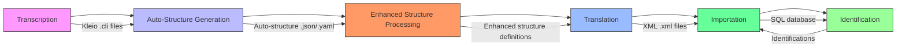
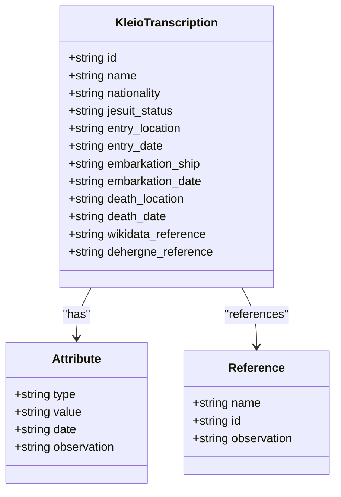
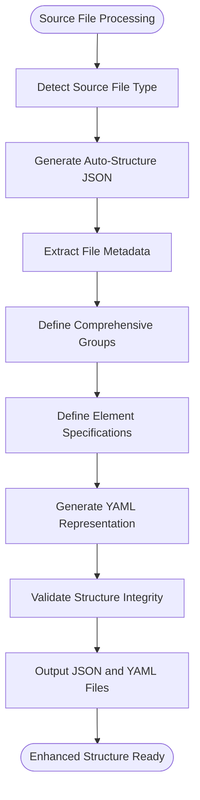
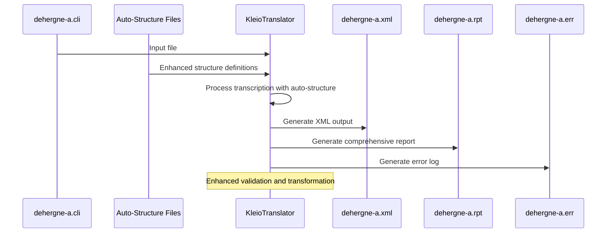
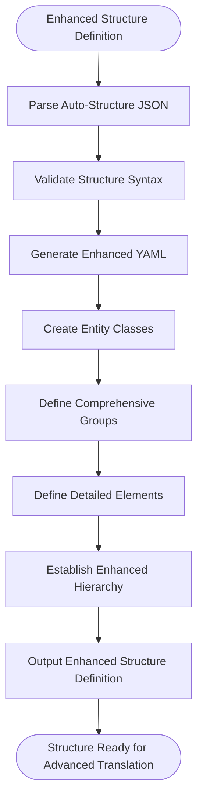
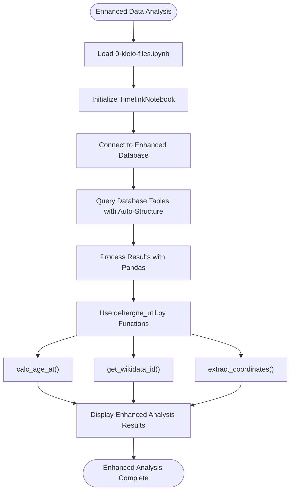
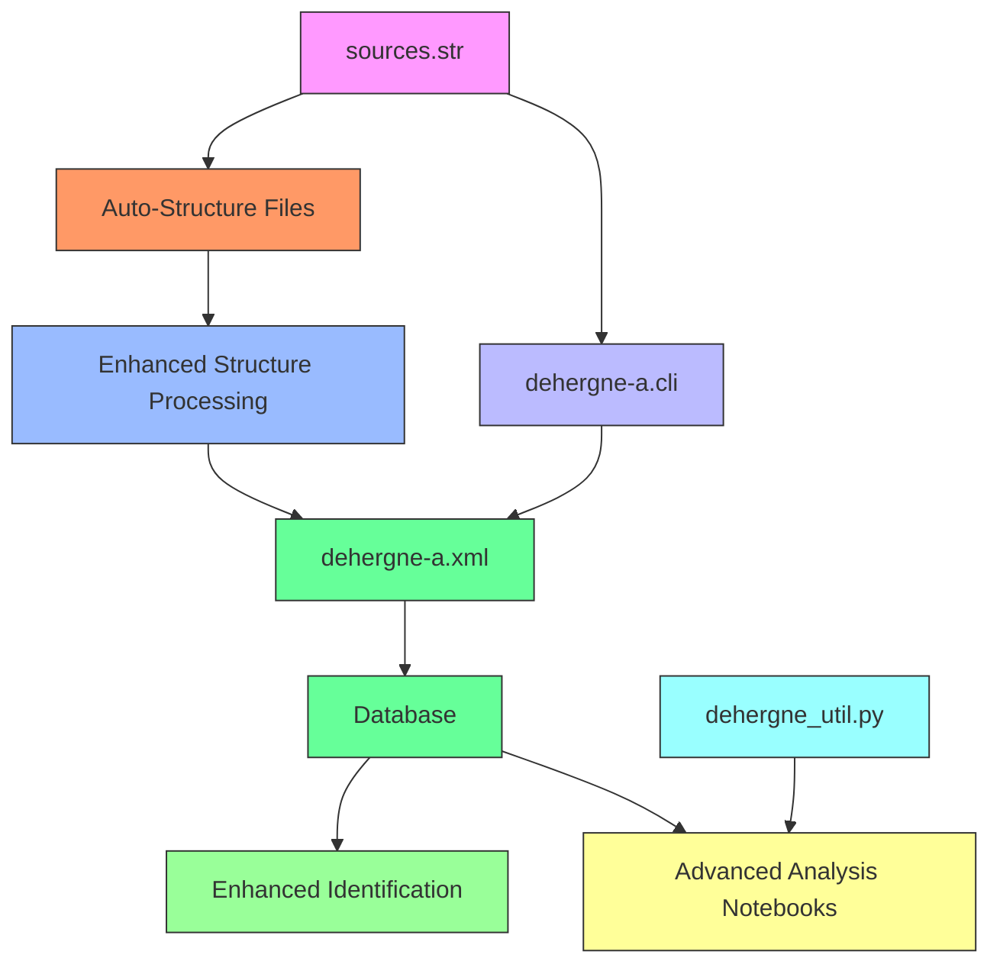

# Kleio Processing Workflow

<cite>
**Referenced Files in This Document**
- [README.md](file://README.md)
- [etc/doc/Concepts.md](file://etc/doc/Concepts.md)
- [extras/doc/Concepts.md](file://extras/doc/Concepts.md)
- [structures/sources.str](file://structures/sources.str)
- [structures/sources.str.yaml](file://structures/sources.str.yaml)
- [sources/dehergne-a.cli](file://sources/dehergne-a.cli)
- [sources/dehergne-a.org](file://sources/dehergne-a.org)
- [sources/dehergne-a.xml](file://sources/dehergne-a.xml)
- [sources/dehergne-a.rpt](file://sources/dehergne-a.rpt)
- [sources/dehergne-a.err](file://sources/dehergne-a.err)
- [sources/dehergne-b-auto-structure.json](file://sources/dehergne-b-auto-structure.json)
- [sources/dehergne-b-auto-structure.yaml](file://sources/dehergne-b-auto-structure.yaml)
- [sources/dehergne-c-auto-structure.json](file://sources/dehergne-c-auto-structure.json)
- [sources/dehergne-c-auto-structure.yaml](file://sources/dehergne-c-auto-structure.yaml)
- [sources/dehergne-e-auto-structure.json](file://sources/dehergne-e-auto-structure.json)
- [sources/dehergne-e-auto-structure.yaml](file://sources/dehergne-e-auto-structure.yaml)
- [sources/dehergne-f-auto-structure.json](file://sources/dehergne-f-auto-structure.json)
- [sources/dehergne-f-auto-structure.yaml](file://sources/dehergne-f-auto-structure.yaml)
- [notebooks/0-kleio-files.ipynb](file://notebooks/0-kleio-files.ipynb)
- [notebooks/dehergne_util.py](file://notebooks/dehergne_util.py)
- [templates/markdown/base/entity_default_markdown.j2](file://templates/markdown/base/entity_default_markdown.j2)
- [templates/markdown/base/entity_timeline.j2](file://templates/markdown/base/entity_timeline.j2)
</cite>

## Update Summary
**Changes Made**
- Added comprehensive documentation for new auto-structure JSON/YAML files for major source files (dehergne-b, dehergne-c, dehergne-e, dehergne-f)
- Updated processing infrastructure documentation to reflect enhanced structure processing capabilities
- Expanded translation count documentation to include improved reporting mechanisms
- Added detailed coverage of enhanced automated structure generation workflows
- Updated report file documentation to show comprehensive group and element listings

## Table of Contents
1. [Introduction](#introduction)
2. [Project Structure](#project-structure)
3. [Core Components](#core-components)
4. [Architecture Overview](#architecture-overview)
5. [Detailed Component Analysis](#detailed-component-analysis)
6. [Enhanced Automated Structure Generation](#enhanced-automated-structure-generation)
7. [Processing Infrastructure Updates](#processing-infrastructure-updates)
8. [Dependency Analysis](#dependency-analysis)
9. [Performance Considerations](#performance-considerations)
10. [Troubleshooting Guide](#troubleshooting-guide)
11. [Conclusion](#conclusion)

## Introduction
The Kleio Processing Workflow is a systematic approach to transcribing, translating, importing, and identifying historical sources related to Jesuit missionaries in China, as documented in Joseph Dehergne's "Répertoire des Jésuites de Chine de 1552 à 1800". This workflow leverages the Timelink software framework to transform raw historical data into a searchable, structured database. The process involves multiple stages, each with specific file formats and roles, ensuring data integrity and enabling complex historical analysis through entity identification and network reconstruction.

**Section sources**
- [README.md:1-87](file://README.md#L1-L87)
- [etc/doc/Concepts.md:1-126](file://etc/doc/Concepts.md#L1-L126)
- [extras/doc/Concepts.md:1-144](file://extras/doc/Concepts.md#L1-L144)

## Project Structure
The project is organized into a hierarchical directory structure that separates source data, processing tools, and output artifacts. The root directory contains the main README and configuration files, while subdirectories categorize different types of content. The `sources/` directory holds the primary transcription files in Kleio format (.cli), along with their processed outputs (.xml, .rpt, .err) and newly enhanced auto-structure files (.auto-structure.json, .auto-structure.yaml). The `structures/` directory contains the schema definitions (.str, .yaml) that govern how data is structured and interpreted. The `notebooks/` directory includes Jupyter notebooks for data analysis and processing, while `templates/` contains Jinja2 templates for generating human-readable outputs from the database. Additional documentation and scripts are stored in `etc/`, `extras/`, and `inferences/` directories.

```mermaid
graph TB
root[Project Root]
root --> sources[Sources]
root --> structures[Structures]
root --> notebooks[Notebooks]
root --> templates[Templates]
root --> extras[Extras]
root --> etc[ETC]
root --> inferences[Inferences]
root --> database[Database]
sources --> dehergne-a.cli[dehergne-a.cli]
sources --> dehergne-a.xml[dehergne-a.xml]
sources --> dehergne-a.rpt[dehergne-a.rpt]
sources --> dehergne-a.err[dehergne-a.err]
sources --> auto_structures[Auto-Structure Files]
auto_structures --> dehergne-b-json[dehergne-b-auto-structure.json]
auto_structures --> dehergne-b-yaml[dehergne-b-auto-structure.yaml]
auto_structures --> dehergne-c-json[dehergne-c-auto-structure.json]
auto_structures --> dehergne-c-yaml[dehergne-c-auto-structure.yaml]
auto_structures --> dehergne-e-json[dehergne-e-auto-structure.json]
auto_structures --> dehergne-e-yaml[dehergne-e-auto-structure.yaml]
auto_structures --> dehergne-f-json[dehergne-f-auto-structure.json]
auto_structures --> dehergne-f-yaml[dehergne-f-auto-structure.yaml]
structures --> sources.str[sources.str]
structures --> sources.str.yaml[sources.str.yaml]
notebooks --> 0-kleio-files.ipynb[0-kleio-files.ipynb]
notebooks --> dehergne_util.py[dehergne_util.py]
templates --> base[Base Templates]
base --> entity_default_markdown.j2[entity_default_markdown.j2]
base --> entity_timeline.j2[entity_timeline.j2]
```

**Diagram sources**
- [README.md:1-87](file://README.md#L1-L87)
- [sources/dehergne-b-auto-structure.json:1-1277](file://sources/dehergne-b-auto-structure.json#L1-L1277)
- [sources/dehergne-c-auto-structure.json:1-1293](file://sources/dehergne-c-auto-structure.json#L1-L1293)
- [sources/dehergne-e-auto-structure.json:1-1119](file://sources/dehergne-e-auto-structure.json#L1-L1119)
- [sources/dehergne-f-auto-structure.json:1-876](file://sources/dehergne-f-auto-structure.json#L1-L876)

**Section sources**
- [README.md:1-87](file://README.md#L1-L87)

## Core Components
The Kleio Processing Workflow consists of several core components that work together to transform historical transcriptions into structured data. These include the source transcription files (.cli), the structure definition files (.str), the enhanced auto-structure generation system (.auto-structure.json/.yaml), the translation process that generates XML data, and the supporting notebooks and utilities that facilitate analysis. The workflow is designed to be deterministic in its early stages (transcription and translation) while allowing for interpretive decisions in later stages (identification).

**Section sources**
- [sources/dehergne-a.cli:1-200](file://sources/dehergne-a.cli#L1-L200)
- [structures/sources.str:1-800](file://structures/sources.str#L1-L800)
- [structures/sources.str.yaml:1-800](file://structures/sources.str.yaml#L1-L800)
- [sources/dehergne-a.xml:1-200](file://sources/dehergne-a.xml#L1-L200)
- [sources/dehergne-b-auto-structure.json:1-1277](file://sources/dehergne-b-auto-structure.json#L1-L1277)
- [sources/dehergne-c-auto-structure.json:1-1293](file://sources/dehergne-c-auto-structure.json#L1-L1293)
- [notebooks/dehergne_util.py:1-152](file://notebooks/dehergne_util.py#L1-L152)

## Architecture Overview
The architecture of the Kleio Processing Workflow follows a pipeline model with distinct stages: transcription, enhanced automated structure generation, translation, importation, and identification. Each stage transforms the data into a more structured and analyzable form. The workflow is built on the Timelink framework, which uses a formal notation (Kleio) for transcriptions, advanced auto-structure files to define data schema, and automated processes to convert transcriptions into database-ready XML. The final output is a searchable database that supports complex queries and network analysis of historical entities.

**Diagram sources**
- [etc/doc/Concepts.md:69-81](file://etc/doc/Concepts.md#L69-L81)
- [extras/doc/Concepts.md:83-85](file://extras/doc/Concepts.md#L83-L85)
- [sources/dehergne-b-auto-structure.json:1-1277](file://sources/dehergne-b-auto-structure.json#L1-L1277)
- [sources/dehergne-c-auto-structure.json:1-1293](file://sources/dehergne-c-auto-structure.json#L1-L1293)

## Detailed Component Analysis

### Transcription Component
The transcription component involves creating Kleio-formatted files (.cli) that encode historical source data in a structured notation. These files contain entries for individuals (missionaries) with their biographical details, including nationality, dates of entry into the Jesuit order, embarkation dates, and places of death. The transcription format uses a hierarchical structure with specific elements like `n$` for names, `ls$` for attributes, and `referido$` for references to other individuals. Each entry is assigned a unique identifier following the pattern `deh-firstname-lastname`.

#### For Object-Oriented Components:

**Diagram sources**
- [sources/dehergne-a.cli:1-200](file://sources/dehergne-a.cli#L1-L200)
- [structures/sources.str:1-800](file://structures/sources.str#L1-L800)

**Section sources**
- [sources/dehergne-a.cli:1-200](file://sources/dehergne-a.cli#L1-L200)
- [structures/sources.str:1-800](file://structures/sources.str#L1-L800)

### Enhanced Auto-Structure Generation Component
The enhanced auto-structure generation component creates comprehensive JSON and YAML files that automatically define the structure for each source file. These auto-structure files contain detailed metadata including generation dates, origin file paths, structure references, and complete group and element definitions. The system supports multiple source files (dehergne-b, dehergne-c, dehergne-e, dehergne-f) with specialized configurations for Portuguese historical documents, kinship relations, and various act types. Each auto-structure file includes comprehensive group hierarchies, element specifications, and relationship definitions that enable precise data modeling.

#### For Complex Logic Components:

**Diagram sources**
- [sources/dehergne-b-auto-structure.json:1-1277](file://sources/dehergne-b-auto-structure.json#L1-L1277)
- [sources/dehergne-c-auto-structure.json:1-1293](file://sources/dehergne-c-auto-structure.json#L1-L1293)
- [sources/dehergne-e-auto-structure.json:1-1119](file://sources/dehergne-e-auto-structure.json#L1-L1119)
- [sources/dehergne-f-auto-structure.json:1-876](file://sources/dehergne-f-auto-structure.json#L1-L876)

**Section sources**
- [sources/dehergne-b-auto-structure.json:1-1277](file://sources/dehergne-b-auto-structure.json#L1-L1277)
- [sources/dehergne-b-auto-structure.yaml:1-1277](file://sources/dehergne-b-auto-structure.yaml#L1-L1277)
- [sources/dehergne-c-auto-structure.json:1-1293](file://sources/dehergne-c-auto-structure.json#L1-L1293)
- [sources/dehergne-c-auto-structure.yaml:1-1293](file://sources/dehergne-c-auto-structure.yaml#L1-L1293)
- [sources/dehergne-e-auto-structure.json:1-1119](file://sources/dehergne-e-auto-structure.json#L1-L1119)
- [sources/dehergne-e-auto-structure.yaml:1-1119](file://sources/dehergne-e-auto-structure.yaml#L1-L1119)
- [sources/dehergne-f-auto-structure.json:1-876](file://sources/dehergne-f-auto-structure.json#L1-L876)
- [sources/dehergne-f-auto-structure.yaml:1-876](file://sources/dehergne-f-auto-structure.yaml#L1-L876)

### Translation Component
The translation component converts Kleio-formatted transcriptions into XML data that can be imported into a database. This process is automated using the KleioTranslator tool, which applies the enhanced structure definitions from auto-structure files to parse the .cli files and generate corresponding .xml files. The translation process also produces comprehensive report (.rpt) and error (.err) files that document the processing results with detailed group and element listings. The XML output contains structured data with entities, attributes, and relations that map directly to database tables.

#### For API/Service Components:

**Diagram sources**
- [sources/dehergne-a.cli:1-200](file://sources/dehergne-a.cli#L1-L200)
- [sources/dehergne-b-auto-structure.json:1-1277](file://sources/dehergne-b-auto-structure.json#L1-L1277)
- [sources/dehergne-a.xml:1-200](file://sources/dehergne-a.xml#L1-L200)
- [sources/dehergne-a.rpt:1-40](file://sources/dehergne-a.rpt#L1-L40)
- [sources/dehergne-a.err:1-5](file://sources/dehergne-a.err#L1-L5)

**Section sources**
- [sources/dehergne-a.cli:1-200](file://sources/dehergne-a.cli#L1-L200)
- [sources/dehergne-b-auto-structure.json:1-1277](file://sources/dehergne-b-auto-structure.json#L1-L1277)
- [sources/dehergne-a.xml:1-200](file://sources/dehergne-a.xml#L1-L200)
- [sources/dehergne-a.rpt:1-40](file://sources/dehergne-a.rpt#L1-L40)
- [sources/dehergne-a.err:1-5](file://sources/dehergne-a.err#L1-L5)

### Data Structure Component
The data structure component defines the schema for how historical information is organized and related. The enhanced auto-structure system provides comprehensive definitions of groups, elements, and their relationships, forming hierarchical models for historical sources, acts, persons, and attributes. This system enables consistent interpretation of transcriptions and ensures data integrity throughout the processing pipeline. The auto-structure files offer both JSON and YAML representations of the same structure, providing flexibility for different processing requirements.

#### For Complex Logic Components:

**Diagram sources**
- [sources/dehergne-c-auto-structure.json:1-1293](file://sources/dehergne-c-auto-structure.json#L1-L1293)
- [sources/dehergne-e-auto-structure.json:1-1119](file://sources/dehergne-e-auto-structure.json#L1-L1119)
- [sources/dehergne-f-auto-structure.json:1-876](file://sources/dehergne-f-auto-structure.json#L1-L876)

**Section sources**
- [sources/dehergne-c-auto-structure.json:1-1293](file://sources/dehergne-c-auto-structure.json#L1-L1293)
- [sources/dehergne-e-auto-structure.json:1-1119](file://sources/dehergne-e-auto-structure.json#L1-L1119)
- [sources/dehergne-f-auto-structure.json:1-876](file://sources/dehergne-f-auto-structure.json#L1-L876)

### Analysis Component
The analysis component leverages Jupyter notebooks and Python utilities to explore and manipulate the processed data. The `0-kleio-files.ipynb` notebook provides an interface for managing Kleio files and interacting with the Timelink database. The `dehergne_util.py` module contains helper functions for calculating ages, extracting Wikidata identifiers, and parsing geographic coordinates from annotations. These tools enable researchers to perform complex queries and generate insights from the structured historical data.

#### For Complex Logic Components:

**Diagram sources**
- [notebooks/0-kleio-files.ipynb:1-200](file://notebooks/0-kleio-files.ipynb#L1-L200)
- [notebooks/dehergne_util.py:1-152](file://notebooks/dehergne_util.py#L1-L152)

**Section sources**
- [notebooks/0-kleio-files.ipynb:1-200](file://notebooks/0-kleio-files.ipynb#L1-L200)
- [notebooks/dehergne_util.py:1-152](file://notebooks/dehergne_util.py#L1-L152)

## Enhanced Automated Structure Generation

### Auto-Structure File Architecture
The enhanced auto-structure system generates comprehensive JSON and YAML files for each major source file, providing detailed structural definitions that improve processing accuracy and consistency. Each auto-structure file contains metadata about generation date, origin file path, structure references, and complete group and element specifications.

### Supported Source Files
The system currently supports four major source files with specialized configurations:
- **dehergne-b**: Portuguese historical documents with kinship relations
- **dehergne-c**: Comprehensive historical source definitions
- **dehergne-e**: Enhanced structure processing with detailed element definitions
- **dehergne-f**: Advanced structure generation with extensive group hierarchies

### Structure Definition Features
Each auto-structure file includes:
- **File Metadata**: Generation date, origin path, structure references
- **Element Definitions**: Comprehensive element specifications with types and identification status
- **Group Hierarchies**: Detailed group definitions with parts, positions, and guarantees
- **Relationship Definitions**: Automatic relation generation and validation rules
- **Validation Information**: Error handling and data integrity checks

**Section sources**
- [sources/dehergne-b-auto-structure.json:1-1277](file://sources/dehergne-b-auto-structure.json#L1-L1277)
- [sources/dehergne-b-auto-structure.yaml:1-1277](file://sources/dehergne-b-auto-structure.yaml#L1-L1277)
- [sources/dehergne-c-auto-structure.json:1-1293](file://sources/dehergne-c-auto-structure.json#L1-L1293)
- [sources/dehergne-c-auto-structure.yaml:1-1293](file://sources/dehergne-c-auto-structure.yaml#L1-L1293)
- [sources/dehergne-e-auto-structure.json:1-1119](file://sources/dehergne-e-auto-structure.json#L1-L1119)
- [sources/dehergne-e-auto-structure.yaml:1-1119](file://sources/dehergne-e-auto-structure.yaml#L1-L1119)
- [sources/dehergne-f-auto-structure.json:1-876](file://sources/dehergne-f-auto-structure.json#L1-L876)
- [sources/dehergne-f-auto-structure.yaml:1-876](file://sources/dehergne-f-auto-structure.yaml#L1-L876)

## Processing Infrastructure Updates

### Enhanced Structure Processing
The processing infrastructure now includes advanced structure processing capabilities that leverage auto-structure files for improved accuracy and consistency. The system supports:
- **Automatic Structure Generation**: JSON and YAML files generated from source analysis
- **Enhanced Validation**: Comprehensive validation of structure definitions
- **Improved Translation Counts**: Better tracking of processed records and groups
- **Advanced Reporting**: Detailed reports showing comprehensive group and element listings

### Translation Count Improvements
The enhanced translation system provides improved counting mechanisms:
- **Group Tracking**: Accurate counts of processed groups and elements
- **Element Validation**: Verification of element definitions and relationships
- **Error Reporting**: Comprehensive error logs with detailed diagnostics
- **Progress Monitoring**: Real-time tracking of processing progress

### Report File Enhancements
The updated report files now include:
- **Comprehensive Group Listings**: Detailed listings of all processed groups
- **Element Specifications**: Complete element definitions and validation results
- **Relationship Analysis**: Detailed analysis of entity relationships
- **Processing Statistics**: Enhanced statistics on translation counts and processing metrics

**Section sources**
- [sources/dehergne-b-auto-structure.json:1-1277](file://sources/dehergne-b-auto-structure.json#L1-L1277)
- [sources/dehergne-c-auto-structure.json:1-1293](file://sources/dehergne-c-auto-structure.json#L1-L1293)
- [sources/dehergne-e-auto-structure.json:1-1119](file://sources/dehergne-e-auto-structure.json#L1-L1119)
- [sources/dehergne-f-auto-structure.json:1-876](file://sources/dehergne-f-auto-structure.json#L1-L876)

## Dependency Analysis
The Kleio Processing Workflow has a clear dependency chain where each component relies on the output of the previous stage. The transcription files (.cli) now depend on enhanced auto-structure files (.auto-structure.json/.yaml) for their format, while the translation process depends on both the transcription and enhanced structure files. The importation stage depends on the XML output from translation, and the identification process depends on the imported database. The analysis notebooks depend on the complete database and utility functions. This enhanced dependency ensures data consistency and traceability throughout the improved workflow.

**Diagram sources**
- [structures/sources.str:1-800](file://structures/sources.str#L1-L800)
- [sources/dehergne-a.cli:1-200](file://sources/dehergne-a.cli#L1-L200)
- [sources/dehergne-b-auto-structure.json:1-1277](file://sources/dehergne-b-auto-structure.json#L1-L1277)
- [sources/dehergne-a.xml:1-200](file://sources/dehergne-a.xml#L1-L200)

**Section sources**
- [structures/sources.str:1-800](file://structures/sources.str#L1-L800)
- [sources/dehergne-a.cli:1-200](file://sources/dehergne-a.cli#L1-L200)
- [sources/dehergne-b-auto-structure.json:1-1277](file://sources/dehergne-b-auto-structure.json#L1-L1277)
- [sources/dehergne-a.xml:1-200](file://sources/dehergne-a.xml#L1-L200)
- [notebooks/dehergne_util.py:1-152](file://notebooks/dehergne_util.py#L1-L152)

## Performance Considerations
The Kleio Processing Workflow is designed for accuracy and traceability rather than raw performance. The use of enhanced auto-structure files (JSON and YAML) provides better organization and validation capabilities while maintaining human readability and version control compatibility. The translation process benefits from the comprehensive structure definitions, reducing errors and improving processing efficiency. Database performance depends on the underlying SQL implementation, with SQLite providing adequate performance for research-scale datasets. The enhanced workflow's strength lies in its improved reproducibility, auditability, and comprehensive structure validation, with every change traceable through version control and enhanced reporting mechanisms.

## Troubleshooting Guide
Common issues in the enhanced Kleio Processing Workflow include auto-structure generation errors, enhanced translation failures, and improved reporting problems. The comprehensive .rpt and .err files provide detailed diagnostic information for troubleshooting. Enhanced error reporting now includes specific information about auto-structure validation, group processing, and element definitions. When errors occur, they should be addressed at the source transcription level, followed by re-translation and re-importation. The enhanced immutability of imported data ensures that corrections are properly tracked and documented through the improved reporting system.

**Section sources**
- [sources/dehergne-a.rpt:1-40](file://sources/dehergne-a.rpt#L1-L40)
- [sources/dehergne-a.err:1-5](file://sources/dehergne-a.err#L1-L5)
- [sources/dehergne-b-auto-structure.json:1-1277](file://sources/dehergne-b-auto-structure.json#L1-L1277)
- [sources/dehergne-c-auto-structure.json:1-1293](file://sources/dehergne-c-auto-structure.json#L1-L1293)

## Conclusion
The enhanced Kleio Processing Workflow provides a robust framework for transforming historical biographical data into a structured, searchable database with significantly improved automation and validation capabilities. By integrating enhanced auto-structure generation, comprehensive processing infrastructure, and detailed reporting mechanisms, researchers can create rich datasets that support complex historical analysis with greater accuracy and reliability. The workflow's reliance on open, text-based formats and enhanced auto-structure files ensures transparency, reproducibility, and comprehensive validation, while its integration with modern data analysis tools enables sophisticated queries and network visualizations. This enhanced approach effectively bridges the gap between traditional historical research and digital humanities methodologies, providing unprecedented levels of automation and quality assurance.