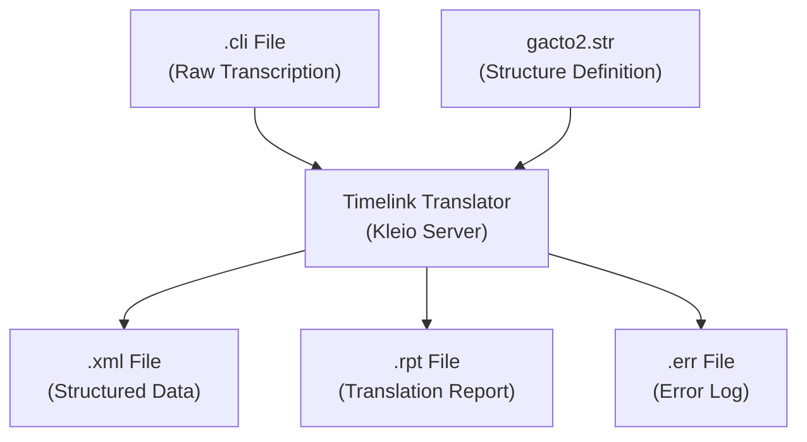
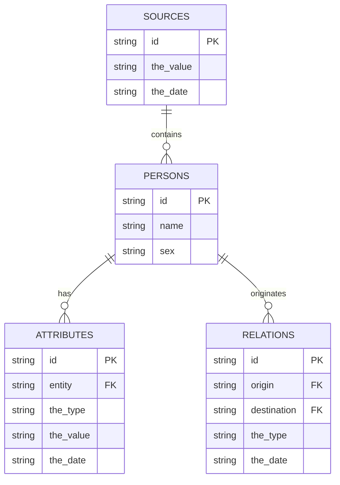
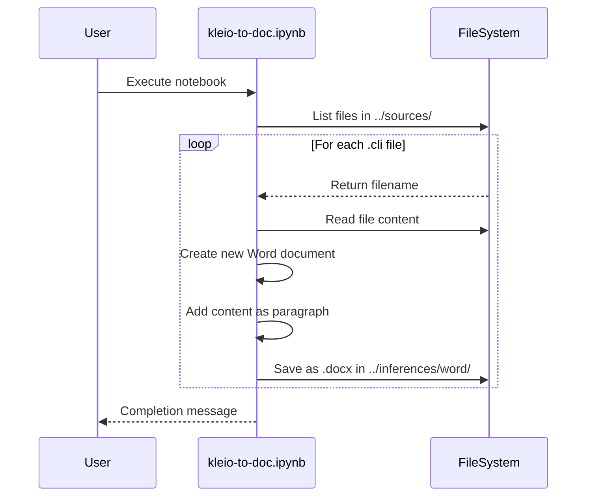

# Processing Pipeline

<cite>
**Referenced Files in This Document**   
- [dehergne-a.cli](file://sources/dehergne-a.cli)
- [dehergne-a.xml](file://sources/dehergne-a.xml)
- [dehergne-a.rpt](file://sources/dehergne-a.rpt)
- [dehergne-a.err](file://sources/dehergne-a.err)
- [dehergne-a.org](file://sources/dehergne-a.org)
- [Dehergne_transcription_format.md](file://extras/doc/Dehergne_transcription_format.md)
- [0-vscode_setup.ipynb](file://notebooks/0-vscode_setup.ipynb)
- [kleio-to-doc.ipynb](file://notebooks/kleio-to-doc.ipynb)
- [README.md](file://identifications/README.md)
</cite>

## Table of Contents
1. [Introduction](#introduction)
2. [Transcription Phase](#transcription-phase)
3. [Translation Phase](#translation-phase)
4. [Importation Phase](#importation-phase)
5. [Identification Phase](#identification-phase)
6. [Auxiliary Files and Metadata](#auxiliary-files-and-metadata)
7. [Automation and Notebooks](#automation-and-notebooks)
8. [Error Handling and Debugging](#error-handling-and-debugging)
9. [Performance Optimization](#performance-optimization)
10. [Conclusion](#conclusion)

## Introduction
The processing pipeline transforms raw biographical transcriptions from Joseph Dehergne's "Répertoire des Jésuites de Chine" into structured, analyzable data. This document details the four-phase pipeline: (1) Transcription of raw text in VS Code using the Timelink Bundle, (2) Translation of `.cli` files into structured `.xml`, `.rpt`, and `.err` files using Timelink tools, (3) Importation of XML data into SQLite with error tracking, and (4) Identification of person occurrences to create unified biographies. The transformation of `dehergne-a.cli` into `dehergne-a.xml` serves as a primary example, illustrating how raw text is systematically encoded, validated, and prepared for database integration and analysis.

## Transcription Phase
The transcription phase involves editing `.cli` files in VS Code with the Timelink Bundle extension. Transcribers input raw biographical data from Dehergne's dictionary using Kleio notation, a structured plain-text format. Each file corresponds to a letter of the alphabet (e.g., `dehergne-a.cli` for names starting with 'A'). The process begins with a standardized header that defines the source and a root "lista" (list) group. Biographical entries are created using the `n$` group for primary individuals and `referido$` for referenced homonyms. Attributes are encoded with the `ls$` prefix followed by a type (e.g., `nascimento` for birth, `morte` for death) and a value. Complex entries, such as that of António de Abreu, include multiple attributes for nationality, Jesuit status, embarkation, and death, along with references to two other individuals with the same name to disambiguate the subject.

**Section sources**
- [dehergne-a.cli](file://sources/dehergne-a.cli#L1-L1599)
- [Dehergne_transcription_format.md](file://extras/doc/Dehergne_transcription_format.md#L1-L575)

## Translation Phase
The translation phase converts the structured `.cli` files into machine-readable formats using Timelink tools. The primary output is an `.xml` file (e.g., `dehergne-a.xml`) that represents the hierarchical structure of the data with XML elements and attributes. This process is governed by a structure file (`gacto2.str`) which defines the schema, including classes like `person`, `attribute`, and `relation`, and their corresponding database tables. The translation generates auxiliary files: a `.rpt` (report) file that logs the translation process, including the number of groups processed and any warnings, and an `.err` (error) file that records any syntax or validation errors. For `dehergne-a.cli`, the translation was successful with 0 errors and 0 warnings, producing a comprehensive XML file with over 39,000 lines of structured data.

**Diagram sources **
- [dehergne-a.cli](file://sources/dehergne-a.cli#L1-L1599)
- [dehergne-a.xml](file://sources/dehergne-a.xml#L1-L39107)
- [dehergne-a.rpt](file://sources/dehergne-a.rpt#L1-L40)
- [dehergne-a.err](file://sources/dehergne-a.err#L1-L5)

**Section sources**
- [dehergne-a.cli](file://sources/dehergne-a.cli#L1-L1599)
- [dehergne-a.xml](file://sources/dehergne-a.xml#L1-L39107)
- [dehergne-a.rpt](file://sources/dehergne-a.rpt#L1-L40)
- [dehergne-a.err](file://sources/dehergne-a.err#L1-L5)

## Importation Phase
The importation phase loads the generated `.xml` files into an SQLite database. The XML structure, defined by the `sources.str` schema, maps directly to database tables such as `persons`, `attributes`, and `relations`. Each XML `<GROUP>` element corresponds to a row in a database table, with `<ELEMENT>`s providing the column values. The import process validates the data against the schema, ensuring referential integrity and correct data types. The `.rpt` and `.err` files are critical for debugging; a clean `.err` file (0 errors) indicates a successful translation, while the `.rpt` file provides a summary of the process, including the number of groups processed and the paths to the original and temporary files. This phase transforms the hierarchical XML data into a relational format suitable for querying and analysis.

**Diagram sources **
- [dehergne-a.xml](file://sources/dehergne-a.xml#L1-L39107)
- [structures/sources.str](file://structures/sources.str)

**Section sources**
- [dehergne-a.xml](file://sources/dehergne-a.xml#L1-L39107)
- [structures/sources.str](file://structures/sources.str)

## Identification Phase
The identification phase links separate person occurrences into unified biographies. This process, known as record linkage, resolves homonyms and aggregates information from multiple sources. The system uses two special attributes: `mesmo_que` for linking occurrences within the same file and `xmesmo_que` for linking across different files. For example, a reference to "K'ang Hi" in `dehergne-m.cli` can be linked to an entry in another file using `xmesmo_que=deh-kang-hi`. The results of this identification process are exported to the `identifications/` directory as a set of files that can be used to restore the links in a new database. This phase is crucial for creating a coherent, unified dataset from the fragmented source material.

**Section sources**
- [identifications/README.md](file://identifications/README.md#L1-L3)
- [Dehergne_transcription_format.md](file://extras/doc/Dehergne_transcription_format.md#L486-L537)

## Auxiliary Files and Metadata
Auxiliary files play a vital role in the pipeline's integrity and traceability. The `.org` file (e.g., `dehergne-a.org`) serves as a lightweight, human-readable version of the `.cli` file, often used for quick reference or version control. The `.rpt` file provides a detailed log of the translation process, including timestamps, the number of translation operations, and paths to related files, which is invaluable for auditing and debugging. The `.err` file is the primary tool for identifying and resolving parsing errors caused by malformed Kleio syntax. Metadata is embedded throughout the process, such as the `kleiofile` attribute in the XML that records the original source, ensuring a complete audit trail from raw text to database record.

**Section sources**
- [dehergne-a.org](file://sources/dehergne-a.org#L1-L27)
- [dehergne-a.rpt](file://sources/dehergne-a.rpt#L1-L40)
- [dehergne-a.err](file://sources/dehergne-a.err#L1-L5)

## Automation and Notebooks
The pipeline is supported by Jupyter notebooks that automate parts of the workflow. The `0-vscode_setup.ipynb` notebook configures the VS Code environment by setting up the Timelink extension with the correct server URL, token, and project home directory, ensuring a consistent development environment. The `kleio-to-doc.ipynb` notebook automates the conversion of `.cli` files into Microsoft Word `.docx` files, making the transcriptions accessible to users without specialized software. This notebook uses the `python-docx` library to read each `.cli` file, create a Word document, add the content as a single paragraph, and save it to an output directory. This automation streamlines the sharing and review of transcriptions.

**Diagram sources **
- [kleio-to-doc.ipynb](file://notebooks/kleio-to-doc.ipynb#L1-L120)
- [0-vscode_setup.ipynb](file://notebooks/0-vscode_setup.ipynb#L1-L165)

**Section sources**
- [kleio-to-doc.ipynb](file://notebooks/kleio-to-doc.ipynb#L1-L120)
- [0-vscode_setup.ipynb](file://notebooks/0-vscode_setup.ipynb#L1-L165)

## Error Handling and Debugging
Effective error handling is central to maintaining data quality. The primary source of debugging information is the `.err` file, which is generated during the translation phase. A successful translation is indicated by "0 errors" and "0 warnings" in this file. When errors occur, they are typically due to malformed Kleio syntax, such as unbalanced quotes or incorrect use of special characters (`$`, `/`, `=`). The `.rpt` file provides context for these errors, including line numbers and a summary of the translation process. Strategies for resolving errors include carefully checking the syntax around the reported line number, ensuring all `obs` (observation) fields with special characters are enclosed in triple quotes (`"""`), and validating the structure against the `gacto2.str` definition. Regular use of the Timelink VS Code extension's validation tools can catch errors before translation.

**Section sources**
- [dehergne-a.err](file://sources/dehergne-a.err#L1-L5)
- [dehergne-a.rpt](file://sources/dehergne-a.rpt#L1-L40)
- [Dehergne_transcription_format.md](file://extras/doc/Dehergne_transcription_format.md#L478-L485)

## Performance Optimization
For batch processing large alphabetic sets of transcriptions, performance can be optimized by leveraging parallel processing and efficient tool usage. The Timelink server can handle multiple translation requests concurrently, allowing `.cli` files for different letters (e.g., `dehergne-a.cli`, `dehergne-b.cli`) to be processed in parallel. Scripts can be written to automate the entire pipeline—transcription, translation, and importation—for a set of files. Using the `kleio-to-doc.ipynb` notebook in batch mode to convert all `.cli` files at once is more efficient than processing them individually. Additionally, ensuring that the database import is performed in a single transaction for a large set of records can significantly improve speed compared to individual inserts.

## Conclusion
The processing pipeline for the Dehergne project is a robust system for transforming historical biographical data into a structured, queryable format. It begins with meticulous transcription in VS Code, proceeds through automated translation into XML with comprehensive error reporting, imports the data into a relational database, and culminates in the identification of person occurrences to create unified biographies. The use of auxiliary files like `.rpt` and `.err` ensures data integrity, while notebooks automate repetitive tasks. By following the documented procedures for handling syntax errors and optimizing batch processing, researchers can efficiently manage the entire lifecycle of the data, from raw text to sophisticated analysis.