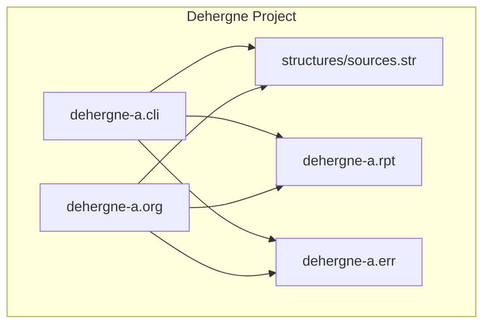
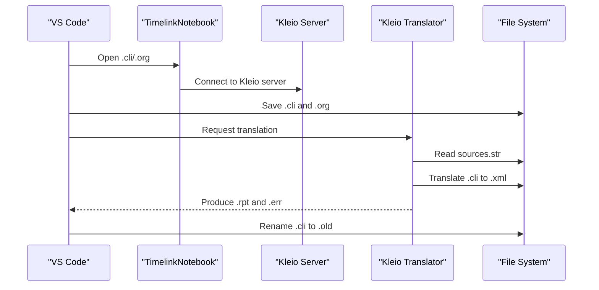
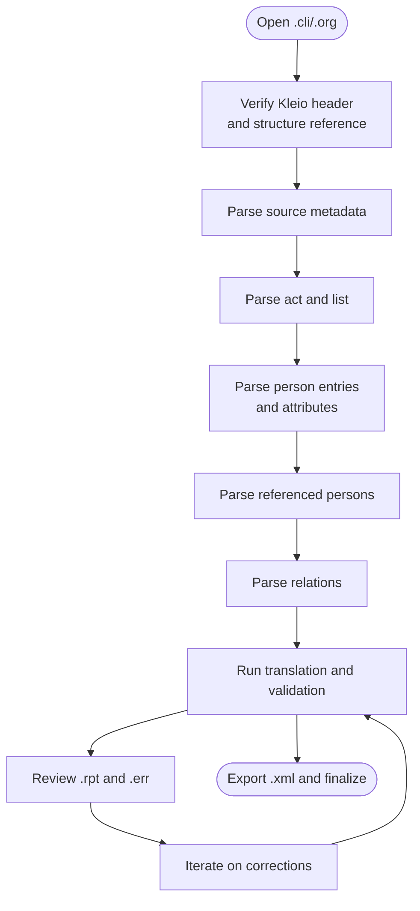
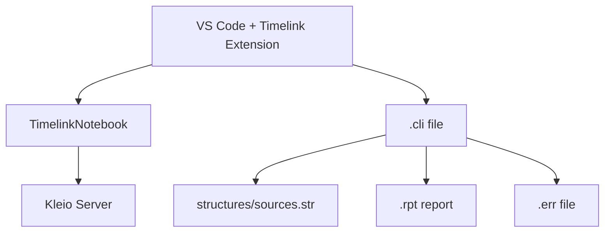

# Transcription Phase

<cite>
**Referenced Files in This Document**
- [dehergne-a.cli](file://sources/dehergne-a.cli)
- [dehergne-a.org](file://sources/dehergne-a.org)
- [dehergne-a.err](file://sources/dehergne-a.err)
- [dehergne-a.rpt](file://sources/dehergne-a.rpt)
- [sources.str](file://structures/sources.str)
- [Dehergne_transcription_format.md](file://extras/doc/Dehergne_transcription_format.md)
- [How_to_transcribe.md](file://extras/doc/How_to_transcribe.md)
- [0-vscode_setup.ipynb](file://notebooks/0-vscode_setup.ipynb)
- [check_version_of_timelink.ipynb](file://notebooks/check_version_of_timelink.ipynb)
- [Concepts.md](file://etc/doc/Concepts.md)
- [sources_overview.md](file://extras/doc/sources_overview.md)
</cite>

## Table of Contents
1. [Introduction](#introduction)
2. [Project Structure](#project-structure)
3. [Core Components](#core-components)
4. [Architecture Overview](#architecture-overview)
5. [Detailed Component Analysis](#detailed-component-analysis)
6. [Dependency Analysis](#dependency-analysis)
7. [Performance Considerations](#performance-considerations)
8. [Troubleshooting Guide](#troubleshooting-guide)
9. [Conclusion](#conclusion)
10. [Appendices](#appendices)

## Introduction
This document explains the transcription phase for creating and editing Kleio (.cli) files using VS Code with the Timelink Bundle. It focuses on the Dehergne transcription format, the structure of a Kleio file, and how to apply standardized attributes for biographical entries. It also covers the role of the .org file for metadata, adherence to the Dehergne format, and common transcription issues with solutions drawn from Timelink validation feedback. Finally, it provides setup guidance from 0-vscode_setup.ipynb to configure VS Code for syntax highlighting and error checking.

## Project Structure
The Dehergne project organizes transcription data by letter of the alphabet, with each letter represented by a dedicated .cli file. Each file begins with a Kleio header, declares a historical source, and contains a single act (a list of biographical notices). The structure is defined by a shared structure file (sources.str), and validation artifacts (.rpt, .err) are produced during translation.

**Diagram sources**
- [dehergne-a.cli](file://sources/dehergne-a.cli#L1-L40)
- [dehergne-a.org](file://sources/dehergne-a.org#L1-L27)
- [sources.str](file://structures/sources.str#L30-L120)
- [dehergne-a.rpt](file://sources/dehergne-a.rpt#L1-L40)
- [dehergne-a.err](file://sources/dehergne-a.err#L1-L5)

**Section sources**
- [dehergne-a.cli](file://sources/dehergne-a.cli#L1-L40)
- [dehergne-a.org](file://sources/dehergne-a.org#L1-L27)
- [sources.str](file://structures/sources.str#L30-L120)

## Core Components
- Kleio header and structure declaration: The file starts with the Kleio directive and references the structure file that defines the source/act/person model and allowed groups/elements.
- Historical source declaration: The source group identifies the source (e.g., Dehergne’s biographical dictionary) and its metadata.
- Act and list: The act group (here a “list”) contains the biographical entries.
- Person entries: Each person entry begins with a person group (n$) and includes attributes (ls$) and relations (rel$).
- Referenced persons: Additional persons related to the main entry are captured with referido$.
- Metadata and original copy: The .org file duplicates the header and first entries for quick reference and provenance.

Key transcription constructs:
- Header and structure: kleio$gacto2.str
- Source: fonte$id/year/type/ref
- List: lista$id/0/0/0
- Person: n$Name/id=unique-id
- Attributes: ls$attribute/value/date
- Relations: rel$type/value/dest-name/dest-id
- Referenced persons: referido$Name/id=unique-id

**Section sources**
- [dehergne-a.cli](file://sources/dehergne-a.cli#L1-L40)
- [dehergne-a.org](file://sources/dehergne-a.org#L1-L27)
- [How_to_transcribe.md](file://extras/doc/How_to_transcribe.md#L63-L100)
- [Dehergne_transcription_format.md](file://extras/doc/Dehergne_transcription_format.md#L17-L40)

## Architecture Overview
The transcription pipeline integrates VS Code with the Timelink bundle to validate and translate Kleio files into structured data. The structure file sources.str defines the allowed groups and elements. During translation, the system produces reports (.rpt) and error counts (.err), and may rename the original .cli to .old for versioning.

**Diagram sources**
- [0-vscode_setup.ipynb](file://notebooks/0-vscode_setup.ipynb#L46-L91)
- [dehergne-a.rpt](file://sources/dehergne-a.rpt#L1-L40)
- [dehergne-a.err](file://sources/dehergne-a.err#L1-L5)

**Section sources**
- [0-vscode_setup.ipynb](file://notebooks/0-vscode_setup.ipynb#L46-L91)
- [dehergne-a.rpt](file://sources/dehergne-a.rpt#L1-L40)
- [dehergne-a.err](file://sources/dehergne-a.err#L1-L5)

## Detailed Component Analysis

### Kleio File Structure and Dehergne Format
- Header and structure: The file begins with the Kleio directive and references the structure file that defines the source/act/person model.
- Source metadata: The source group includes an identifier, year, type, and reference to the source material.
- Act and list: The act group (here a “list”) aggregates biographical notices without a date.
- Person entries: Each person entry uses n$ with a unique id and lists attributes (ls$) and relations (rel$).
- Referenced persons: Additional persons are captured with referido$ and may include their own attributes and relations.
- Original copy: The .org file duplicates the header and first entries for provenance and quick reference.

Example references:
- Header and structure: [dehergne-a.cli](file://sources/dehergne-a.cli#L1-L10)
- Source and list: [dehergne-a.cli](file://sources/dehergne-a.cli#L1-L20)
- Person entry and attributes: [dehergne-a.cli](file://sources/dehergne-a.cli#L20-L60)
- Referenced persons: [dehergne-a.cli](file://sources/dehergne-a.cli#L35-L60)
- Original header and first entries: [dehergne-a.org](file://sources/dehergne-a.org#L1-L27)

**Section sources**
- [dehergne-a.cli](file://sources/dehergne-a.cli#L1-L80)
- [dehergne-a.org](file://sources/dehergne-a.org#L1-L27)
- [Dehergne_transcription_format.md](file://extras/doc/Dehergne_transcription_format.md#L17-L40)

### Standardized Attributes for Biographical Entries
The Dehergne transcription format defines standardized attributes for biographical entries. These include:
- Identity and demographics: ls$nacionalidade, ls$nome, ls$nome-chines, ls$nascimento, ls$morte
- Jesuit status and progression: ls$jesuita-estatuto, ls$jesuita-entrada, ls$jesuita-ordenacao-padre, ls$jesuita-votos, ls$jesuita-votos-local
- Travel and movements: ls$embarque, ls$wicky, ls$wicky-viagem, ls$chegada, ls$partida, ls$estadia
- Roles and tasks: ls$jesuita-cargo, ls$jesuita-tarefa, ls$cargo, ls$tarefa
- Titles and professions: ls$titulo, ls$profissao
- Academic degrees: ls$grau-academico
- Notes and references: ls$dehergne/number/obs

Examples:
- Nationality, status, and entry: [dehergne-a.cli](file://sources/dehergne-a.cli#L20-L40)
- Birth and death: [dehergne-a.cli](file://sources/dehergne-a.cli#L120-L140)
- Jesuit progression: [dehergne-a.cli](file://sources/dehergne-a.cli#L140-L200)
- Embarkation and linked data: [dehergne-a.cli](file://sources/dehergne-a.cli#L230-L260)
- Cargo and task: [dehergne-a.cli](file://sources/dehergne-a.cli#L260-L320)
- Titles and professions: [dehergne-a.cli](file://sources/dehergne-a.cli#L320-L360)
- Academic degree: [dehergne-a.cli](file://sources/dehergne-a.cli#L360-L420)

**Section sources**
- [Dehergne_transcription_format.md](file://extras/doc/Dehergne_transcription_format.md#L72-L140)
- [Dehergne_transcription_format.md](file://extras/doc/Dehergne_transcription_format.md#L141-L210)
- [Dehergne_transcription_format.md](file://extras/doc/Dehergne_transcription_format.md#L209-L320)
- [Dehergne_transcription_format.md](file://extras/doc/Dehergne_transcription_format.md#L315-L360)
- [Dehergne_transcription_format.md](file://extras/doc/Dehergne_transcription_format.md#L360-L420)
- [dehergne-a.cli](file://sources/dehergne-a.cli#L120-L200)

### Relations Between Persons
Relations among people are captured using rel$. The format is rel$type/value/dest-name/dest-id. Types include sociability, professional roles, and family relations. Directionality matters for asymmetric relations (e.g., parent-child).

Example:
- Sociability and travel companions: [dehergne-a.cli](file://sources/dehergne-a.cli#L200-L220)
- Professional relationship: [dehergne-a.cli](file://sources/dehergne-a.cli#L610-L630)

**Section sources**
- [Dehergne_transcription_format.md](file://extras/doc/Dehergne_transcription_format.md#L424-L448)
- [dehergne-a.cli](file://sources/dehergne-a.cli#L200-L220)
- [dehergne-a.cli](file://sources/dehergne-a.cli#L610-L630)

### Referenced Persons and Same-as Semantics
Additional persons related to the main entry are captured with referido$. When multiple occurrences refer to the same person across files, use same-as semantics:
- mesmo_que: internal same-as within the same file
- xmesmo_que: external same-as across files

Examples:
- Referenced persons with attributes: [dehergne-a.cli](file://sources/dehergne-a.cli#L35-L60)
- External same-as note: [dehergne-a.rpt](file://sources/dehergne-a.rpt#L21-L26)

**Section sources**
- [Dehergne_transcription_format.md](file://extras/doc/Dehergne_transcription_format.md#L486-L538)
- [dehergne-a.rpt](file://sources/dehergne-a.rpt#L21-L26)

### Structure Definition and Validation
The structure file sources.str defines the allowed groups and elements for the source/act/person model. It specifies:
- Database and part declarations
- Historical source and act groups
- Person and object base classes
- Attribute and relation groups
- Numerical date elements
- Portuguese-specific act types and elements

Validation artifacts:
- Translation report (.rpt) provides counts and warnings
- Error file (.err) reports number of errors and warnings

Example references:
- Structure definition: [sources.str](file://structures/sources.str#L30-L120)
- Report and error files: [dehergne-a.rpt](file://sources/dehergne-a.rpt#L1-L40), [dehergne-a.err](file://sources/dehergne-a.err#L1-L5)

**Section sources**
- [sources.str](file://structures/sources.str#L30-L120)
- [dehergne-a.rpt](file://sources/dehergne-a.rpt#L1-L40)
- [dehergne-a.err](file://sources/dehergne-a.err#L1-L5)

### Conceptual Overview
The transcription process transforms historical sources into a structured, machine-readable format. The Dehergne project uses a standardized format to capture biographical details consistently, enabling downstream translation and identification workflows.

[No sources needed since this diagram shows conceptual workflow, not actual code structure]

**Section sources**
- [How_to_transcribe.md](file://extras/doc/How_to_transcribe.md#L63-L100)
- [Concepts.md](file://etc/doc/Concepts.md#L60-L126)

## Dependency Analysis
The transcription depends on:
- VS Code with the Timelink extension for editing and validation
- TimelinkNotebook to manage the Kleio server connection and workspace settings
- The structure file sources.str to validate syntax and semantics
- Translation artifacts (.rpt, .err) to guide corrections

**Diagram sources**
- [0-vscode_setup.ipynb](file://notebooks/0-vscode_setup.ipynb#L46-L91)
- [sources.str](file://structures/sources.str#L30-L120)
- [dehergne-a.rpt](file://sources/dehergne-a.rpt#L1-L40)
- [dehergne-a.err](file://sources/dehergne-a.err#L1-L5)

**Section sources**
- [0-vscode_setup.ipynb](file://notebooks/0-vscode_setup.ipynb#L46-L91)
- [sources.str](file://structures/sources.str#L30-L120)
- [dehergne-a.rpt](file://sources/dehergne-a.rpt#L1-L40)
- [dehergne-a.err](file://sources/dehergne-a.err#L1-L5)

## Performance Considerations
- Keep .cli files modular by letter to avoid overly large files.
- Use standardized attributes to minimize redundant transcription and reduce translation overhead.
- Prefer linked data identifiers (e.g., Wikidata) to improve cross-reference resolution and reduce ambiguity.
- Review .rpt and .err regularly to catch issues early and avoid expensive reprocessing.

[No sources needed since this section provides general guidance]

## Troubleshooting Guide
Common issues and solutions derived from Timelink validation feedback:

- Incorrect attribute syntax
  - Symptom: Translation warnings or errors in .rpt
  - Solution: Verify attribute names and values match the structure definition and Dehergne format guidelines. See [sources.str](file://structures/sources.str#L220-L260) and [Dehergne_transcription_format.md](file://extras/doc/Dehergne_transcription_format.md#L141-L210).

- Missing required fields
  - Symptom: Validation warnings indicating missing identifiers or dates
  - Solution: Ensure each person entry has a unique id and required attributes (e.g., nationality, status). See [dehergne-a.rpt](file://sources/dehergne-a.rpt#L21-L26).

- External same-as references
  - Symptom: Warning about external same-as references exported
  - Solution: Confirm the destination id exists in another file before importing. See [dehergne-a.rpt](file://sources/dehergne-a.rpt#L21-L26).

- Triple-quoted observations
  - Symptom: Parsing errors due to special characters in obs
  - Solution: Wrap obs content with triple quotes when it contains special characters. See [Dehergne_transcription_format.md](file://extras/doc/Dehergne_transcription_format.md#L478-L485).

- VS Code setup issues
  - Symptom: Cannot connect to Kleio server or missing syntax highlighting
  - Solution: Install the Timelink VS Code extension and configure workspace settings via the notebook. See [0-vscode_setup.ipynb](file://notebooks/0-vscode_setup.ipynb#L46-L91).

- Version mismatches
  - Symptom: Outdated Timelink version
  - Solution: Upgrade Timelink using the notebook. See [check_version_of_timelink.ipynb](file://notebooks/check_version_of_timelink.ipynb#L1-L67).

**Section sources**
- [sources.str](file://structures/sources.str#L220-L260)
- [Dehergne_transcription_format.md](file://extras/doc/Dehergne_transcription_format.md#L141-L210)
- [Dehergne_transcription_format.md](file://extras/doc/Dehergne_transcription_format.md#L478-L485)
- [dehergne-a.rpt](file://sources/dehergne-a.rpt#L21-L26)
- [0-vscode_setup.ipynb](file://notebooks/0-vscode_setup.ipynb#L46-L91)
- [check_version_of_timelink.ipynb](file://notebooks/check_version_of_timelink.ipynb#L1-L67)

## Conclusion
The transcription phase for the Dehergne project centers on a standardized Kleio format that captures biographical details consistently. By adhering to the Dehergne transcription format, using the structure file for validation, and leveraging Timelink’s translation and reporting tools, transcribers can produce reliable, machine-readable data. Proper VS Code setup ensures efficient editing and validation, while careful attention to same-as semantics and attribute syntax prevents common pitfalls highlighted by .rpt and .err reports.

[No sources needed since this section summarizes without analyzing specific files]

## Appendices

### Appendix A: Dehergne Sources Overview
The Dehergne project references a wide range of primary and secondary sources. Understanding these sources helps contextualize entries and verify attributions.

**Section sources**
- [sources_overview.md](file://extras/doc/sources_overview.md#L1-L9)

### Appendix B: Process Overview
The Timelink workflow includes four phases: transcription, translation, import, and identification. Each phase produces distinct artifacts (.cli, .xml, .sql, .idf) and requires careful management.

**Section sources**
- [Concepts.md](file://etc/doc/Concepts.md#L60-L126)