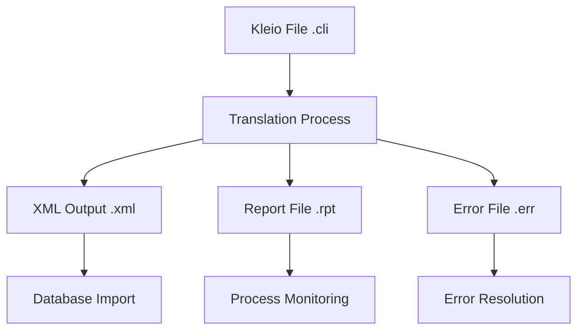
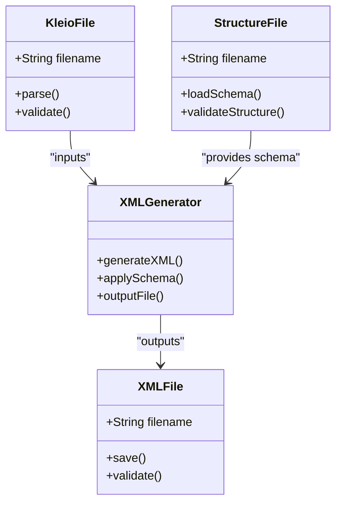
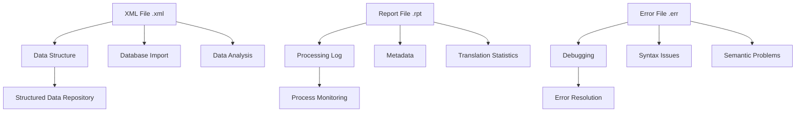
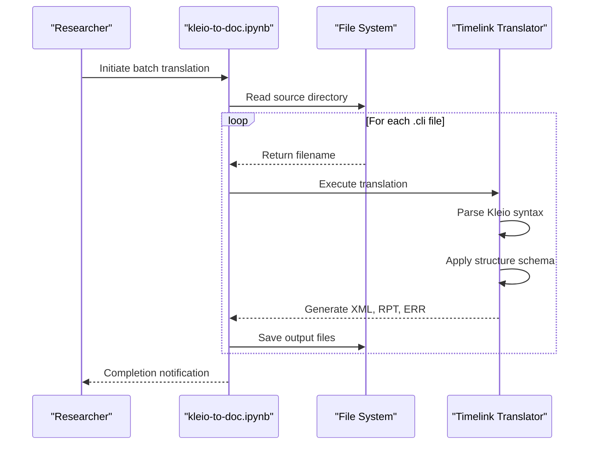
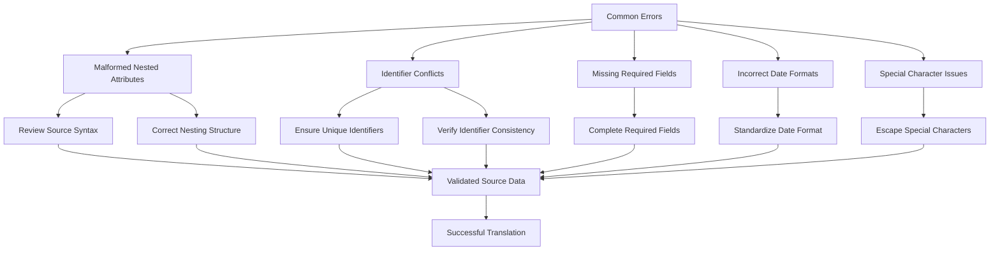
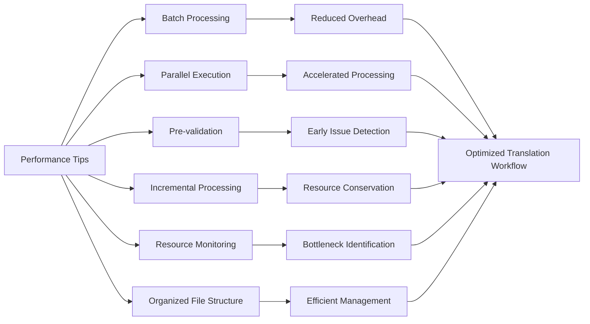

# Translation Phase

<cite>
**Referenced Files in This Document**   
- [dehergne-a.cli](file://sources/dehergne-a.cli)
- [dehergne-a.xml](file://sources/dehergne-a.xml)
- [dehergne-a.rpt](file://sources/dehergne-a.rpt)
- [dehergne-a.err](file://sources/dehergne-a.err)
- [kleio-to-doc.ipynb](file://notebooks/kleio-to-doc.ipynb)
- [dehergne_util.py](file://notebooks/dehergne_util.py)
- [sources.str](file://structures/sources.str)
- [README.md](file://README.md)
</cite>

## Table of Contents
1. [Introduction](#introduction)
2. [Translation Process Overview](#translation-process-overview)
3. [Kleio to XML Transformation](#kleio-to-xml-transformation)
4. [Output Files and Their Utilities](#output-files-and-their-utilities)
5. [Batch Translation with Notebooks](#batch-translation-with-notebooks)
6. [Common Translation Errors and Resolution](#common-translation-errors-and-resolution)
7. [Performance Tips for Large-Scale Translations](#performance-tips-for-large-scale-translations)
8. [Conclusion](#conclusion)

## Introduction
The translation phase in the Timelink system involves converting structured Kleio (.cli) files into multiple output formats including XML (.xml), report (.rpt), and error (.err) files. This process is essential for transforming historical biographical data from Joseph Dehergne's "Répertoire des Jésuites de Chine" into structured, hierarchical XML suitable for database import and further analysis. The Kleio notation system provides a structured way to represent complex historical data, which is then parsed and transformed into XML format using Timelink tools. This document details the transformation process, focusing on the conversion of dehergne-a.cli to dehergne-a.xml as a primary example, and explains the purpose and utility of each output file generated during the translation process.

**Section sources**
- [README.md](file://README.md#L1-L87)

## Translation Process Overview
The translation process converts Kleio (.cli) files into XML (.xml), report (.rpt), and error (.err) outputs using Timelink tools. The process begins with structured Kleio notation files that contain biographical data about Jesuit missionaries in China. These files are processed by the Timelink system, which parses the structured notation and transforms it into hierarchical XML format suitable for database import. The transformation follows a defined structure specified in the sources.str file, which defines the schema for the data model including entities, attributes, and relationships. During translation, the system generates three primary output files: an XML file containing the structured data, a report file documenting the translation process, and an error file capturing any issues encountered. The process is automated and can be executed in batch mode across multiple files, making it efficient for processing large collections of historical data.

**Diagram sources**
- [dehergne-a.cli](file://sources/dehergne-a.cli#L1-L800)
- [dehergne-a.xml](file://sources/dehergne-a.xml#L1-L200)
- [dehergne-a.rpt](file://sources/dehergne-a.rpt#L1-L40)
- [dehergne-a.err](file://sources/dehergne-a.err#L1-L5)

**Section sources**
- [dehergne-a.cli](file://sources/dehergne-a.cli#L1-L800)
- [dehergne-a.xml](file://sources/dehergne-a.xml#L1-L200)
- [dehergne-a.rpt](file://sources/dehergne-a.rpt#L1-L40)
- [dehergne-a.err](file://sources/dehergne-a.err#L1-L5)

## Kleio to XML Transformation
The transformation from Kleio (.cli) format to XML (.xml) involves parsing the structured notation and converting it into a hierarchical XML structure according to the defined schema in sources.str. The Kleio file dehergne-a.cli contains biographical entries for Jesuit missionaries, with each entry structured using specific notation patterns. For example, the entry for António de Abreu includes attributes such as nationality, Jesuit status, entry date, embarkation details, and death information, all formatted using Kleio syntax. During translation, these entries are converted into XML elements with appropriate tags and attributes. The resulting XML file, dehergne-a.xml, maintains the hierarchical structure of the original data, with elements nested according to their relationships. The transformation process preserves all data fields and their values, ensuring that the XML output is a faithful representation of the original Kleio notation. This structured XML format is then suitable for import into databases and further processing.

**Diagram sources**
- [dehergne-a.cli](file://sources/dehergne-a.cli#L1-L800)
- [sources.str](file://structures/sources.str#L1-L800)
- [dehergne-a.xml](file://sources/dehergne-a.xml#L1-L200)

**Section sources**
- [dehergne-a.cli](file://sources/dehergne-a.cli#L1-L800)
- [sources.str](file://structures/sources.str#L1-L800)
- [dehergne-a.xml](file://sources/dehergne-a.xml#L1-L200)

## Output Files and Their Utilities
The translation process generates three primary output files, each serving a distinct purpose in the data processing workflow. The XML file (.xml) contains the structured data in hierarchical format, making it suitable for database import and further analysis. This file represents the primary output of the translation process and contains all the biographical information in a machine-readable format. The report file (.rpt) provides detailed information about the translation process, including metadata about the source file, processing statistics, and any warnings or notes generated during translation. This file serves as a log of the translation process and is useful for monitoring and verifying the integrity of the conversion. The error file (.err) captures any errors or issues encountered during translation, providing essential information for debugging and resolving problems with the source data. Together, these three files provide a comprehensive output set that enables effective data management, quality control, and troubleshooting.

**Diagram sources**
- [dehergne-a.xml](file://sources/dehergne-a.xml#L1-L200)
- [dehergne-a.rpt](file://sources/dehergne-a.rpt#L1-L40)
- [dehergne-a.err](file://sources/dehergne-a.err#L1-L5)

**Section sources**
- [dehergne-a.xml](file://sources/dehergne-a.xml#L1-L200)
- [dehergne-a.rpt](file://sources/dehergne-a.rpt#L1-L40)
- [dehergne-a.err](file://sources/dehergne-a.err#L1-L5)

## Batch Translation with Notebooks
The batch translation process is automated using Jupyter notebooks, specifically the kleio-to-doc.ipynb notebook, which converts multiple Kleio files into their respective output formats. This notebook implements a systematic approach to process all Kleio files in a directory, applying the translation process to each file in sequence. The automation is achieved through Python scripts that leverage the python-docx library to handle file operations and conversions. The notebook defines input and output paths, then iterates through all .cli files in the source directory, applying the translation process to generate corresponding XML, report, and error files. This batch processing capability is essential for handling large collections of historical data efficiently, allowing researchers to process alphabetical sets of files (e.g., dehergne-a.cli through dehergne-z.cli) without manual intervention for each file. The automation ensures consistency across translations and significantly reduces the time required to process large datasets.

**Diagram sources**
- [kleio-to-doc.ipynb](file://notebooks/kleio-to-doc.ipynb#L1-L120)

**Section sources**
- [kleio-to-doc.ipynb](file://notebooks/kleio-to-doc.ipynb#L1-L120)

## Common Translation Errors and Resolution
During the translation process, several common errors may occur that require specific resolution strategies. Malformed nested attributes represent one of the most frequent issues, occurring when the hierarchical structure of the Kleio notation is incorrectly formatted or contains syntax errors. These errors typically manifest in the .err file and can be resolved by carefully reviewing the source .cli file and correcting the attribute nesting according to the structure schema. Identifier conflicts represent another common issue, arising when duplicate or conflicting identifiers are used within the data. This can be addressed by ensuring unique identifiers for each entity and verifying identifier consistency across related entries. Other common issues include missing required fields, incorrect date formats, and improper use of special characters. The .rpt file provides valuable information for identifying these issues, while the .err file offers specific details about syntax and semantic problems that need correction in the source data.

**Diagram sources**
- [dehergne-a.cli](file://sources/dehergne-a.cli#L1-L800)
- [dehergne-a.err](file://sources/dehergne-a.err#L1-L5)
- [dehergne-a.rpt](file://sources/dehergne-a.rpt#L1-L40)

**Section sources**
- [dehergne-a.cli](file://sources/dehergne-a.cli#L1-L800)
- [dehergne-a.err](file://sources/dehergne-a.err#L1-L5)
- [dehergne-a.rpt](file://sources/dehergne-a.rpt#L1-L40)

## Performance Tips for Large-Scale Translations
For efficient handling of large-scale translations, several performance optimization strategies should be implemented. First, processing files in batches rather than individually reduces overhead and improves throughput. Utilizing parallel processing capabilities, when available, can significantly accelerate the translation of multiple files simultaneously. Pre-validating source files before translation helps identify and resolve issues early, preventing repeated processing of problematic files. Implementing incremental processing, where only modified files are re-translated, conserves resources when updating existing datasets. Monitoring system resources during translation ensures optimal performance and helps identify bottlenecks. Additionally, maintaining organized file structures with clear naming conventions facilitates efficient file management and retrieval. These strategies collectively enhance the efficiency and reliability of large-scale translation operations, enabling researchers to process extensive historical datasets effectively.

**Diagram sources**
- [kleio-to-doc.ipynb](file://notebooks/kleio-to-doc.ipynb#L1-L120)
- [dehergne_util.py](file://notebooks/dehergne_util.py#L1-L152)

**Section sources**
- [kleio-to-doc.ipynb](file://notebooks/kleio-to-doc.ipynb#L1-L120)
- [dehergne_util.py](file://notebooks/dehergne_util.py#L1-L152)

## Conclusion
The translation phase of converting Kleio (.cli) files into XML (.xml), report (.rpt), and error (.err) outputs using Timelink tools represents a critical step in transforming historical biographical data into structured, machine-readable formats. The process, exemplified by the conversion of dehergne-a.cli to dehergne-a.xml, demonstrates how structured Kleio notation is parsed and transformed into hierarchical XML suitable for database import. Each output file serves a distinct purpose: XML for data structure and storage, .rpt for processing logs and metadata, and .err for debugging syntax or semantic issues. The automation of batch translation through notebooks like kleio-to-doc.ipynb enables efficient processing of alphabetical sets of files, while understanding common translation errors and implementing performance optimization strategies ensures reliable and scalable data processing. This comprehensive translation framework provides researchers with powerful tools for managing and analyzing extensive historical datasets.