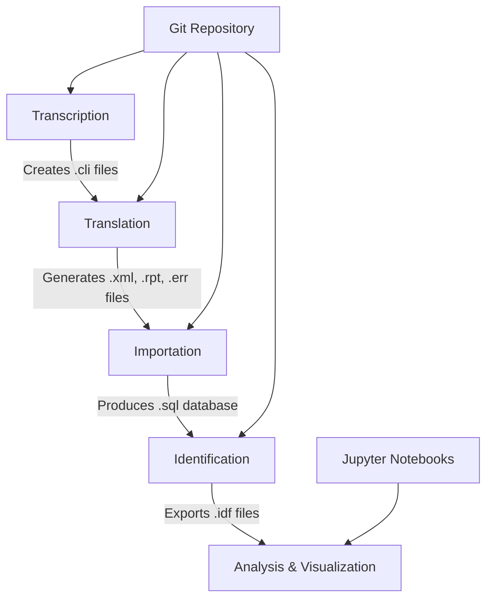

# Project Overview

<cite>
**Referenced Files in This Document**   
- [README.md](file://README.md)
- [etc/doc/Concepts.md](file://etc/doc/Concepts.md)
- [extras/doc/Dehergne_transcription_format.md](file://extras/doc/Dehergne_transcription_format.md)
- [extras/doc/How_to_transcribe.md](file://extras/doc/How_to_transcribe.md)
- [sources/dehergne-a.cli](file://sources/dehergne-a.cli)
- [structures/sources.str](file://structures/sources.str)
- [extras/doc/sources_overview.md](file://extras/doc/sources_overview.md)
- [notebooks/dehergne_util.py](file://notebooks/dehergne_util.py)
- [identifications/README.md](file://identifications/README.md)
</cite>

## Table of Contents
1. [Introduction](#introduction)
2. [Historical Significance of Dehergne's Work](#historical-significance-of-dehergnes-work)
3. [Project Scope and Inclusion Criteria](#project-scope-and-inclusion-criteria)
4. [Data Structure and Transcription Methodology](#data-structure-and-transcription-methodology)
5. [Complementary Sources and Data Enrichment](#complementary-sources-and-data-enrichment)
6. [Timelink Software and Data Processing Workflow](#timelink-software-and-data-processing-workflow)
7. [Licensing and Attribution Model](#licensing-and-attribution-model)
8. [Target Audience and Research Objectives](#target-audience-and-research-objectives)
9. [Practical Examples and User Scenarios](#practical-examples-and-user-scenarios)
10. [Codebase Entry Points and Analysis Tools](#codebase-entry-points-and-analysis-tools)

## Introduction

The dehergne repository represents a digital humanities project dedicated to the systematic transcription, analysis, and digital preservation of Joseph Dehergne's biographical dictionary of Jesuit missionaries in China (1552–1800). This comprehensive digital initiative transforms Dehergne's seminal reference work into a structured, searchable, and analyzable dataset using the Timelink software framework. The project serves as a critical resource for historians, digital humanists, and researchers studying the Jesuit mission in China during the early modern period. By digitizing and enriching Dehergne's biographical entries, the repository enables sophisticated network analysis, temporal studies, and spatial investigations of the Jesuit missionary network in China. The project follows rigorous digital humanities methodologies, ensuring data accuracy, transparency, and reproducibility while adhering to open science principles. The structured data allows for complex queries and analyses that would be impractical with the original printed reference work, facilitating new scholarly insights into the patterns of missionary activity, institutional networks, and cultural exchanges between Europe and China.

**Section sources**
- [README.md](file://README.md#L1-L87)

## Historical Significance of Dehergne's Work

Joseph Dehergne's "Répertoire des Jésuites de Chine de 1552 à 1800" stands as a foundational reference work in the study of Jesuit missionary activity in China. Published in 1973 as volume 37 of the Bibliotheca Instituti Historici S.I, this biographical dictionary has become an indispensable resource for scholars researching the Jesuit mission in China. The work's significance is underscored by its extensive use in major scholarly publications, most notably Liam Matthew Brockey's authoritative "Journey to the East: The Jesuit Mission to China, 1579-1724," where Dehergne's entries serve as the primary reference for names, dates, and bibliographical information. The dictionary provides detailed biographical information on Jesuit missionaries, including their national origins, dates of entry into the Society of Jesus, voyage details to Asia, professional activities in China, and dates of death. Its comprehensive coverage makes it the most complete biographical source on Jesuit missionaries in China during this period. The existence of a Chinese translation published by Zhonghua Book Company in 1995 further enhances its scholarly value, particularly for resolving Chinese names of missionaries and identifying current place names. Dehergne's work synthesizes information from numerous primary and secondary sources, creating a centralized reference that has shaped decades of research on the Jesuit mission in China.

**Section sources**
- [README.md](file://README.md#L3-L15)
- [extras/doc/sources_overview.md](file://extras/doc/sources_overview.md#L1-L9)

## Project Scope and Inclusion Criteria

The dehergne project maintains a clearly defined scope based on Dehergne's original inclusion criteria, which focus on Jesuit missionaries connected to the China mission between 1552 and 1800. The primary inclusion criteria encompass individuals belonging to the vice-province or French mission in China, those who were present in continental China (excluding Macau), and Jesuit superiors, bishops, visitors, vice-provincials, and other superiors even if they never physically entered China. The project also includes procurators responsible for the mission in Macau and Goa, as well as those who died in China while en route to Japan. A distinctive feature of the scope is the inclusion of individuals who were intended for China but died during their journey or were diverted to other missions, along with "macaistes" who did not work in inland China but influenced the China mission in various ways. The main focus remains on French Jesuit missionaries in China, though the project includes all individuals who were present in mainland China during the specified period. Notably, the project excludes those who were merely in transit through Macau to other missions outside of continental China, such as Japan. This careful delineation ensures the dataset remains focused on individuals directly connected to the China mission while acknowledging the complex network of support and administration that sustained missionary activities.

**Section sources**
- [README.md](file://README.md#L17-L29)

## Data Structure and Transcription Methodology

The dehergne project employs a sophisticated data structure and transcription methodology centered on the Kleio notation system within the Timelink framework. The transcription process follows a source-act-person model, where historical sources are structured as collections of acts (events) involving actors (people) and objects. Each biographical entry from Dehergne's dictionary is transcribed as a structured record using Kleio's formal notation, which organizes information into groups, elements, and aspects. The core data structure begins with a `kleio$` header that specifies the transcription model, followed by a `fonte$` (source) declaration that identifies the historical source, and a `lista$` (list) act that contains the biographical entries. Individual Jesuit figures are recorded using the `n$` group for the primary person, with attributes captured through `ls$` (life-story) elements that document nationality, Jesuit status, dates of entry, voyage details, vows, and death information. The transcription format uses standardized prefixes to distinguish different types of information: `E.` for entry into the novitiate, `P.` for priestly ordination, `V.` for vows, `Emb.` for embarkation, and `A.` or `arr.` for arrival or stays. The system also accommodates variant names, relationships to other individuals, and disambiguation of homonyms through the `referido$` group. This structured approach ensures consistency across transcriptions while preserving the nuanced information contained in Dehergne's original entries.

**Section sources**
- [extras/doc/Dehergne_transcription_format.md](file://extras/doc/Dehergne_transcription_format.md#L1-L575)
- [extras/doc/How_to_transcribe.md](file://extras/doc/How_to_transcribe.md#L1-L100)
- [sources/dehergne-a.cli](file://sources/dehergne-a.cli#L1-L200)

## Complementary Sources and Data Enrichment

The dehergne project significantly enhances Dehergne's original biographical data through integration with complementary sources and systematic data enrichment. A key enhancement involves recovering fleet identification information from Josef Wicky's "Liste der Jesuiten-Indienfahrer, 1541-1758," which documents voyages from Lisbon to Goa. While Dehergne only recorded individual missionary numbers from Wicky's list, the project has reconstructed the fleet numbers, enabling researchers to identify which missionaries traveled together on specific voyages. This recovery of fleet information transforms the data from isolated biographical entries into a network of travel companions, revealing social and professional connections formed during the arduous journey to Asia. Another major enrichment effort involves the identification and disambiguation of place names using Wikidata links. The project systematically associates geographical locations mentioned in the biographies with Wikidata identifiers (e.g., `@wikidata:Q1171` for Goa), enabling precise geographical referencing and integration with other linked data sources. Additional information is incorporated from complementary sources such as the "Cartas ânuas" (annual letters) of the Cochinchina mission (1619-1635), which provide details on places of entry into the Jesuits, locations of residence, and specific tasks performed. The project also draws on other reference works including Pfister's "Notices biographiques," Sommervogel's "Bibliothèque de la Compagnie de Jésus," and various scholarly journals and encyclopedias to verify and expand biographical details.

**Section sources**
- [README.md](file://README.md#L32-L68)
- [extras/doc/Dehergne_transcription_format.md](file://extras/doc/Dehergne_transcription_format.md#L210-L252)
- [extras/doc/Dehergne_transcription_format.md](file://extras/doc/Dehergne_transcription_format.md#L386-L392)
- [extras/doc/sources_overview.md](file://extras/doc/sources_overview.md#L1-L9)

## Timelink Software and Data Processing Workflow

The dehergne project is built on the Timelink software framework, which provides a comprehensive system for managing the transcription, processing, and analysis of historical sources. The workflow consists of four distinct phases—transcription, translation, importation, and identification—each with specific roles, file types, and responsibilities. Transcribers create `.cli` files using the Kleio notation, capturing the content of historical sources in a structured format. Translators then process these transcriptions using automated tools that generate `.xml` files for database import, along with `.rpt` (report) and `.err` (error) files to document the translation process. The importation phase incorporates the translated data into a relational database, creating `.sql` export files that preserve the structured information. Finally, identifiers (researchers) make decisions about entity linking, determining when different references in various sources pertain to the same historical individual, with these identifications exported as `.idf` files. The entire workflow is managed through a Git repository, with the `master` branch serving as the authoritative version of all project files. This systematic approach ensures data integrity, version control, and collaborative development. The project also includes Jupyter notebooks that interface with Timelink, enabling advanced data analysis, visualization, and network analysis through Python libraries such as pandas, matplotlib, and pygraphviz.

**Diagram sources **
- [etc/doc/Concepts.md](file://etc/doc/Concepts.md#L6-L126)
- [notebooks/requirements.txt](file://notebooks/requirements.txt#L1-L9)

**Section sources**
- [etc/doc/Concepts.md](file://etc/doc/Concepts.md#L6-L126)
- [structures/sources.str](file://structures/sources.str#L1-L800)
- [notebooks/requirements.txt](file://notebooks/requirements.txt#L1-L9)

## Licensing and Attribution Model

The dehergne project operates under a clear and permissive licensing model that balances open access with proper attribution and non-commercial use. While the Timelink software itself is distributed under the MIT license, which permits commercial use, the transcribed historical content follows a different licensing scheme. All Kleio transcription files in the repository are covered by the Creative Commons Attribution-NonCommercial-ShareAlike 4.0 International (CC BY-NC-SA 4.0) license. This license requires users to provide appropriate attribution to the creators of the transcriptions, specifically Joaquim Carvalho and Macao Polytechnic University, while prohibiting commercial use of the materials. The ShareAlike clause ensures that any derivative works based on the transcriptions must be distributed under the same license terms, preserving the open and collaborative nature of the project. This licensing model supports the principles of open science by allowing free access, use, and adaptation of the data for non-commercial research and educational purposes, while protecting the intellectual contribution of the transcribers and ensuring that the benefits of any improvements flow back to the scholarly community. The copyright notice in each transcription file explicitly states "(c) Joaquim Carvalho, Macao Polytechnic University," establishing clear provenance and ownership of the transcribed content.

**Section sources**
- [README.md](file://README.md#L73-L87)

## Target Audience and Research Objectives

The dehergne project is designed for a specialized audience of historians, digital humanists, and researchers focused on the history of Christian missions, Sino-Western cultural exchange, and early modern global networks. The primary research objectives of the project are multifaceted, aiming to create an accurate and comprehensive digital transcription of Dehergne's biographical dictionary, identify and link entities across multiple sources, enrich the data through integration with external knowledge bases like Wikidata, and enable sophisticated network analysis of the Jesuit missionary community in China. By structuring the biographical data in a machine-readable format, the project facilitates complex queries that can reveal patterns in missionary recruitment, geographical mobility, institutional hierarchies, and professional specializations. The data enrichment process, particularly the linking of place names to Wikidata and the recovery of voyage companions through Wicky's fleet lists, transforms isolated biographical entries into interconnected networks of people and places. This enables researchers to investigate questions about social networks among missionaries, the geographical distribution of missionary activities, and the institutional structures that supported the China mission. The project also supports prosopographical studies, allowing researchers to analyze collective biographies of Jesuit missionaries based on nationality, educational background, or career trajectories.

**Section sources**
- [README.md](file://README.md#L1-L87)
- [etc/doc/Concepts.md](file://etc/doc/Concepts.md#L6-L126)

## Practical Examples and User Scenarios

The dehergne repository provides concrete examples that illustrate the practical applications of its structured data and analysis capabilities. One prominent example is the recovery of fleet identification from Wicky's voyage lists, which allows researchers to determine who traveled together from Lisbon to Goa. For instance, the transcription of Belchior Nunes Barreto includes not only the missionary number (31) from Dehergne but also the reconstructed fleet number (5) from Wicky's list, revealing that he traveled on the same fleet as Cristóvão da Costa (missionary number 37) and Manuel Teixeira (missionary number 34). This information, which was implicit but not explicitly stated in Dehergne's original work, creates valuable social network data about missionary cohorts. Another practical example involves place name disambiguation using Wikidata, where locations like "Goa" are linked to their Wikidata identifier (Q1171), enabling precise geographical referencing and integration with other spatial datasets. The project also demonstrates how ambiguous references are handled, such as distinguishing between multiple individuals named António de Abreu—one who served as Provincial of Portugal (1627-1629) and another who died in a shipwreck off the Malabar coast in 1611. These examples showcase how the structured transcription format supports complex historical research by preserving contextual information, resolving ambiguities, and creating linkages between related individuals and events.

**Section sources**
- [README.md](file://README.md#L32-L57)
- [extras/doc/Dehergne_transcription_format.md](file://extras/doc/Dehergne_transcription_format.md#L236-L252)
- [sources/dehergne-a.cli](file://sources/dehergne-a.cli#L25-L48)

## Codebase Entry Points and Analysis Tools

The dehergne repository provides multiple entry points for users to engage with the data and analysis tools. The primary entry point is the collection of `.cli` files in the `sources/` directory, which contain the structured transcriptions of Dehergne's biographical entries, organized alphabetically (e.g., `dehergne-a.cli`, `dehergne-b.cli`). Researchers can directly examine these files to understand the transcription format and data structure. For data analysis, the `notebooks/` directory contains Jupyter notebooks that serve as interactive interfaces to the dataset, including `dehergne_analysis.ipynb` for general analysis, `location-analysis.ipynb` for geographical studies, and `nacionality_analysis.ipynb` for demographic investigations. The `dehergne_util.py` file provides custom Python functions for processing the data, such as extracting Wikidata identifiers from comments and calculating ages at specific dates. The `structures/` directory contains the `sources.str` file, which defines the data model and schema used in the transcriptions. Users interested in the identification process can examine the files in the `identifications/` directory, which contain exports of entity linking decisions. The `extras/doc/` directory includes comprehensive documentation on transcription guidelines, while the `inferences/wikidata-references/` directory contains CSV files with Wikidata-linked geographical data. This multi-layered structure allows users to engage with the project at different levels of technical expertise, from browsing transcriptions to conducting advanced computational analysis.

**Section sources**
- [notebooks/dehergne_util.py](file://notebooks/dehergne_util.py#L1-L152)
- [identifications/README.md](file://identifications/README.md#L1-L3)
- [structures/sources.str](file://structures/sources.str#L1-L800)