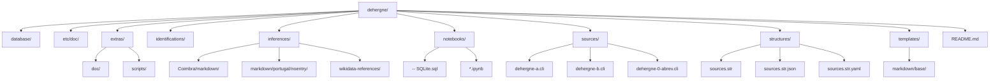
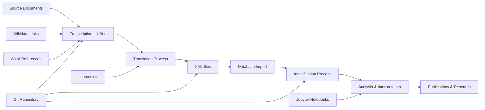
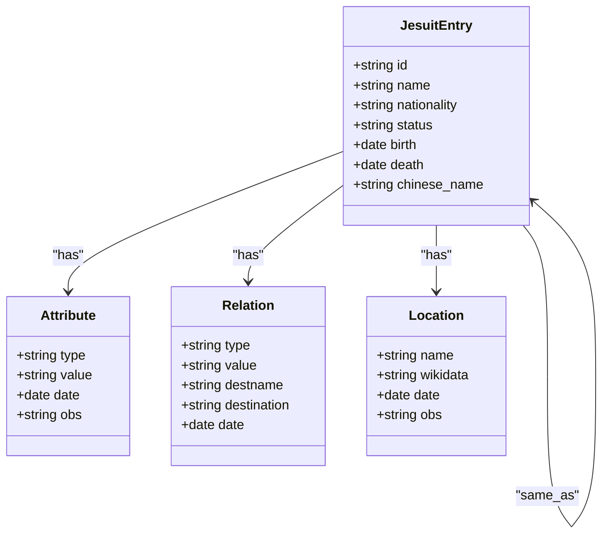
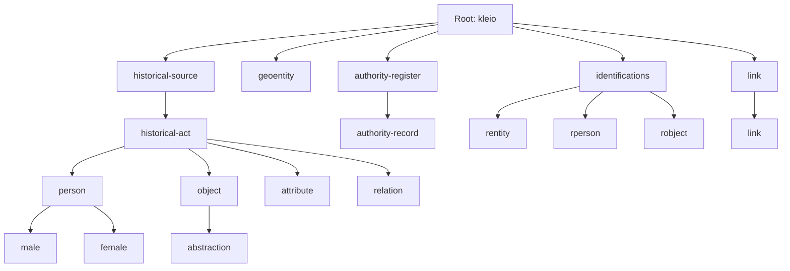
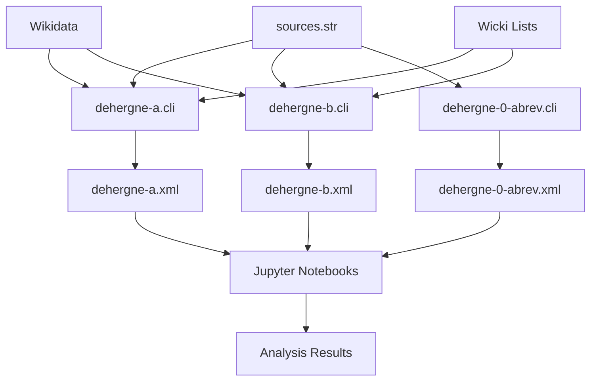

# Source File Restructuring

<cite>
**Referenced Files in This Document**   
- [README.md](file://README.md)
- [structures/sources.str](file://structures/sources.str)
- [structures/sources.str.yaml](file://structures/sources.str.yaml)
- [etc/doc/Concepts.md](file://etc/doc/Concepts.md)
- [extras/doc/Concepts.md](file://extras/doc/Concepts.md)
- [sources/dehergne-a.cli](file://sources/dehergne-a.cli)
- [sources/dehergne-b.cli](file://sources/dehergne-b.cli)
- [sources/dehergne-0-abrev.cli](file://sources/dehergne-0-abrev.cli)
- [templates/markdown/base/entity_default_markdown.j2](file://templates/markdown/base/entity_default_markdown.j2)
- [inferences/wikidata-references/README.md](file://inferences/wikidata-references/README.md)
- [sources/dehergne-a.org](file://sources/dehergne-a.org)
- [sources/dehergne-a.rpt](file://sources/dehergne-a.rpt)
- [sources/dehergne-a.xml](file://sources/dehergne-a.xml)
</cite>

## Table of Contents
1. [Introduction](#introduction)
2. [Project Structure](#project-structure)
3. [Core Components](#core-components)
4. [Architecture Overview](#architecture-overview)
5. [Detailed Component Analysis](#detailed-component-analysis)
6. [Dependency Analysis](#dependency-analysis)
7. [Performance Considerations](#performance-considerations)
8. [Troubleshooting Guide](#troubleshooting-guide)
9. [Conclusion](#conclusion)

## Introduction
This document provides a comprehensive analysis of the source file restructuring for the Dehergne project, which involves the transcription and analysis of biographical data from Joseph Dehergne's "Répertoire des Jésuites de Chine de 1552 à 1800". The project uses the Timelink framework for managing historical source data through a structured process of transcription, translation, importation, and identification. The repository contains transcriptions of Jesuit missionaries' biographies with extensive metadata, including geographical locations linked to Wikidata, voyage information from the Wicki lists, and various analytical components.

## Project Structure
The Dehergne repository follows a well-organized structure designed for managing historical source data through the Timelink methodology. The directory structure separates different types of content including database documentation, configuration files, source transcriptions, analytical notebooks, and template files. The main components include the sources directory containing the primary transcription files in Kleio format (.cli), the structures directory with schema definitions, the inferences directory with analytical data, and the notebooks directory containing Jupyter notebooks for data processing and analysis. Additional documentation is provided in the etc/doc and extras/doc directories, while templates for output generation are stored in the templates directory.

**Diagram sources**
- [README.md](file://README.md)
- [project_structure](file://project_structure)

**Section sources**
- [README.md](file://README.md)

## Core Components
The core components of the Dehergne source file restructuring include the Kleio transcription files (.cli), the structure definition files (.str), and the associated metadata and reference systems. The primary data is stored in the sources directory with individual files for each alphabetical section of the biographical dictionary. Each transcription file follows a structured format defined by the sources.str schema, containing entries for Jesuit missionaries with standardized fields for personal information, career milestones, geographical movements, and references. The structure file defines the hierarchical organization of data elements, including persons, historical acts, geographical entities, and authority records. Additional components include Wikidata linking for geographical locations, Wicki voyage numbers for travel information, and inference rules for data processing.

**Section sources**
- [sources/dehergne-a.cli](file://sources/dehergne-a.cli)
- [sources/dehergne-b.cli](file://sources/dehergne-b.cli)
- [structures/sources.str](file://structures/sources.str)
- [structures/sources.str.yaml](file://structures/sources.str.yaml)

## Architecture Overview
The architecture of the Dehergne source file restructuring follows the Timelink framework's four-phase process: transcription, translation, importation, and identification. The system is built around structured Kleio files (.cli) that contain transcribed biographical data in a formal notation. These files are processed through a translation phase that generates XML files for database import, using the structure definition in sources.str as a schema. The architecture incorporates linked data principles through Wikidata references for geographical locations and uses a Git-based workflow for version control and collaboration. Analytical components include Jupyter notebooks for data exploration and processing, with templates for generating markdown output. The system maintains a clear separation between source data, processed data, and analytical interpretations.

**Diagram sources**
- [README.md](file://README.md)
- [etc/doc/Concepts.md](file://etc/doc/Concepts.md)
- [extras/doc/Concepts.md](file://extras/doc/Concepts.md)

## Detailed Component Analysis

### Kleio Transcription Files
The Kleio transcription files (.cli) represent the primary source data in the Dehergne project, containing structured transcriptions of biographical entries from Joseph Dehergne's dictionary. Each file corresponds to a letter of the alphabet and contains multiple entries for Jesuit missionaries, with each entry following a standardized format that includes personal information, career milestones, geographical movements, and references. The files use a hierarchical structure with specific tags for different types of information, such as ls (list item) for attributes, rel (relation) for relationships between individuals, and referido (reference) for disambiguating individuals with similar names.

**Diagram sources**
- [sources/dehergne-a.cli](file://sources/dehergne-a.cli)
- [sources/dehergne-b.cli](file://sources/dehergne-b.cli)

**Section sources**
- [sources/dehergne-a.cli](file://sources/dehergne-a.cli)
- [sources/dehergne-b.cli](file://sources/dehergne-b.cli)

### Structure Definition Files
The structure definition files (sources.str and sources.str.yaml) provide the schema that governs the organization and validation of the Kleio transcription files. The sources.str file is written in a domain-specific language that defines the hierarchical relationships between different data elements, specifying which fields are required, optional, or repeatable. The sources.str.yaml file provides a YAML representation of the same structure, making it more accessible for programmatic processing. These files define the core data model including persons, historical acts, geographical entities, and authority records, with specific rules for how these elements can be related to each other.

**Diagram sources**
- [structures/sources.str](file://structures/sources.str)
- [structures/sources.str.yaml](file://structures/sources.str.yaml)

**Section sources**
- [structures/sources.str](file://structures/sources.str)
- [structures/sources.str.yaml](file://structures/sources.str.yaml)

### Reference and Abbreviation System
The reference and abbreviation system in the Dehergne project is implemented through the dehergne-0-abrev.cli file, which contains a comprehensive list of abbreviations and acronyms used throughout the biographical dictionary. This file follows the same Kleio format as the main transcription files but serves as a reference document rather than containing biographical entries. The abbreviations cover archival sources, publications, geographical locations, and organizational entities, providing standardized references for citations throughout the transcriptions. This system ensures consistency in referencing external sources and enables automated processing of citation information.

**Section sources**
- [sources/dehergne-0-abrev.cli](file://sources/dehergne-0-abrev.cli)

## Dependency Analysis
The Dehergne source file restructuring has a well-defined dependency structure that supports the processing pipeline from raw transcription to analytical output. The primary dependencies are between the Kleio transcription files (.cli) and the structure definition file (sources.str), which is required for validating and processing the transcriptions. The XML output files (.xml) are generated from the .cli files through a translation process that depends on the structure definition. The Jupyter notebooks in the notebooks directory depend on both the source files and the processed XML files for data analysis. Geographical references depend on external Wikidata entries, creating a linked data dependency that enhances the semantic richness of the dataset.

**Diagram sources**
- [sources/dehergne-a.cli](file://sources/dehergne-a.cli)
- [sources/dehergne-b.cli](file://sources/dehergne-b.cli)
- [sources/dehergne-0-abrev.cli](file://sources/dehergne-0-abrev.cli)
- [structures/sources.str](file://structures/sources.str)

**Section sources**
- [sources/dehergne-a.cli](file://sources/dehergne-a.cli)
- [sources/dehergne-b.cli](file://sources/dehergne-b.cli)
- [sources/dehergne-0-abrev.cli](file://sources/dehergne-0-abrev.cli)
- [structures/sources.str](file://structures/sources.str)

## Performance Considerations
The source file restructuring for the Dehergne project demonstrates good performance characteristics for a digital humanities project of its scale. The use of the Kleio format provides efficient storage and processing of structured textual data, with the hierarchical organization enabling targeted queries and analysis. The separation of transcription, translation, and analysis phases allows for incremental processing and reduces computational overhead. The Git-based version control system enables efficient collaboration and change tracking without significant performance penalties. The linked data approach using Wikidata references enhances data richness without increasing local storage requirements, as the detailed information is retrieved on-demand from external sources.

## Troubleshooting Guide
Common issues in the Dehergne source file restructuring typically relate to schema validation, data consistency, and processing errors. When working with the Kleio files, ensure that the structure definition (sources.str) is properly referenced and that all required fields are present in each entry. Processing errors may occur if there are inconsistencies in date formatting or if Wikidata references are malformed. The translation reports (.rpt files) provide valuable diagnostic information about potential issues in the transcription files. When importing data into the database, verify that external references (such as "same_as" links) exist in the target database to prevent broken references. Regular validation using the provided structure files and careful attention to the hierarchical organization of data elements can prevent most common issues.

**Section sources**
- [sources/dehergne-a.rpt](file://sources/dehergne-a.rpt)
- [sources/dehergne-a.cli](file://sources/dehergne-a.cli)
- [structures/sources.str](file://structures/sources.str)

## Conclusion
The source file restructuring for the Dehergne project represents a sophisticated digital humanities workflow that effectively transforms a printed biographical dictionary into a structured, searchable, and analyzable digital resource. The implementation of the Timelink framework provides a robust foundation for managing historical source data through its four-phase process of transcription, translation, importation, and identification. The use of standardized formats, linked data principles, and reproducible analytical workflows ensures the longevity and reusability of the dataset. This restructuring enables advanced research capabilities, including network analysis of missionary relationships, geographical mapping of movements, and temporal analysis of career trajectories, significantly enhancing the scholarly value of Dehergne's original work.