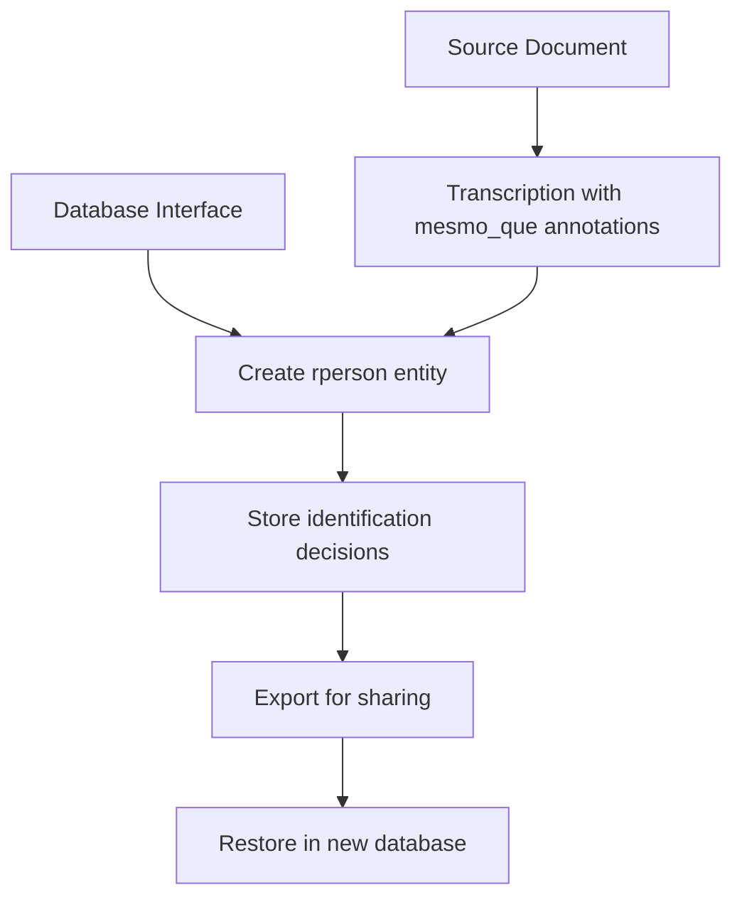
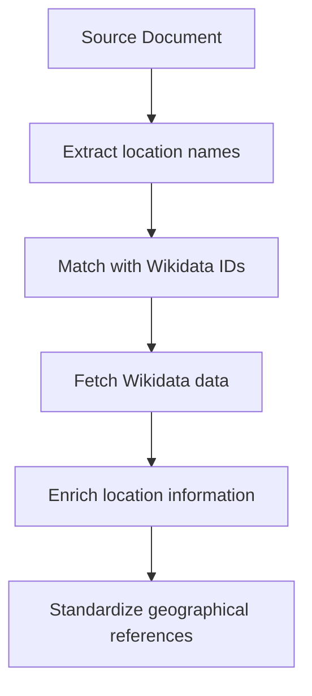

# Identification Phase

<cite>
**Referenced Files in This Document**   
- [mhk_identification_toliveira.cli.exclude](file://identifications/mhk_identification_toliveira.cli.exclude)
- [people-search-display.ipynb](file://notebooks/people-search-display.ipynb)
- [locations_names_wikidata.csv](file://inferences/wikidata-references/locations_names_wikidata.csv)
- [README.md](file://inferences/wikidata-references/README.md)
- [dehergne_util.py](file://notebooks/dehergne_util.py)
</cite>

## Table of Contents
1. [Introduction](#introduction)
2. [Identification Methods](#identification-methods)
3. [Database Storage and Export](#database-storage-and-export)
4. [Exclusion Rules and Examples](#exclusion-rules-and-examples)
5. [Wikidata Integration for Geographical Resolution](#wikidata-integration-for-geographical-resolution)
6. [Identification Workflows](#identification-workflows)
7. [Non-Deterministic Nature of Identification](#non-deterministic-nature-of-identification)

## Introduction
The identification phase in the dehergne system is a critical process that aggregates multiple occurrences of individuals across historical sources into coherent biographical identities. This phase operates on top of the factual transcription foundation, adding an interpretive layer where researchers make linkage decisions based on evidence from various sources. The system supports two primary identification methods: annotating transcriptions with 'mesmo_que' (same_as) elements and linking entities through the database interface. These methods allow researchers to connect disparate mentions of individuals across documents, creating unified biographical records that can be analyzed and shared.

**Section sources**
- [people-search-display.ipynb](file://notebooks/people-search-display.ipynb#L1-L800)

## Identification Methods
The dehergne system employs two complementary methods for identifying and linking individuals across historical sources. The first method involves annotating transcriptions directly with 'mesmo_que' (same_as) elements, which explicitly link different mentions of the same individual within the source documents. This annotation approach allows researchers to make identification decisions at the point of transcription, preserving the context of their reasoning. The second method utilizes the database interface to create links between entities, providing a more structured approach to identification. This database-driven method enables researchers to establish connections between individuals across different documents and sources, creating a comprehensive network of biographical information. Both methods contribute to the creation of real person entities (rperson) that aggregate multiple occurrences of individuals.

**Section sources**
- [people-search-display.ipynb](file://notebooks/people-search-display.ipynb#L1-L800)
- [mhk_identification_toliveira.cli.exclude](file://identifications/mhk_identification_toliveira.cli.exclude#L1-L514)

## Database Storage and Export
Identification decisions in the dehergne system are stored in the database as real person entities (rperson), which serve as containers for multiple occurrences (occ) of individuals across sources. Each rperson entity contains metadata about the identification decision, including status and observations, while the occ elements reference specific mentions in the source documents. This structure allows the system to maintain both the aggregated biographical identity and the individual source references. The identification data can be exported from the database for sharing and backup purposes, ensuring that the interpretive work of identification is preserved and can be restored when needed. The export functionality is particularly important for collaborative research, enabling teams to share identification decisions and build upon each other's work.

**Diagram sources **
- [mhk_identification_toliveira.cli.exclude](file://identifications/mhk_identification_toliveira.cli.exclude#L1-L514)
- [people-search-display.ipynb](file://notebooks/people-search-display.ipynb#L1-L800)

**Section sources**
- [mhk_identification_toliveira.cli.exclude](file://identifications/mhk_identification_toliveira.cli.exclude#L1-L514)
- [people-search-display.ipynb](file://notebooks/people-search-display.ipynb#L1-L800)

## Exclusion Rules and Examples
The dehergne system incorporates exclusion rules to prevent incorrect identifications, particularly in cases where names might be similar but refer to different individuals. These rules are implemented through the identification exclusion files, such as `mhk_identification_toliveira.cli.exclude`, which contain records of individuals who should not be linked despite apparent similarities. For example, the file shows cases where researchers have determined that individuals with similar names or birth dates are actually distinct persons based on contextual evidence. These exclusion rules are crucial for maintaining the accuracy of the identification process, preventing the conflation of different individuals. The system allows researchers to document their reasoning for exclusions in the observation (obs) fields, providing transparency and enabling future researchers to understand the basis for these decisions.

**Section sources**
- [mhk_identification_toliveira.cli.exclude](file://identifications/mhk_identification_toliveira.cli.exclude#L1-L514)

## Wikidata Integration for Geographical Resolution
The dehergne system integrates with Wikidata to support geographical entity resolution, enhancing the accuracy and consistency of location data across historical sources. This integration is facilitated through CSV files in the `inferences/wikidata-references/` directory, which contain Wikidata identifiers for geographical locations mentioned in the sources. The system uses these identifiers to fetch additional information about locations, including coordinates, administrative hierarchies, and multilingual labels. This process is automated through notebooks like `wikidata-linked-data.ipynb`, which fetch data from Wikidata and update local files with the results. The integration with Wikidata ensures that geographical references are standardized and enriched with authoritative data, improving the quality of spatial analysis and visualization in the system.

**Diagram sources **
- [locations_names_wikidata.csv](file://inferences/wikidata-references/locations_names_wikidata.csv#L1-L800)
- [README.md](file://inferences/wikidata-references/README.md#L1-L5)
- [dehergne_util.py](file://notebooks/dehergne_util.py#L1-L152)

**Section sources**
- [locations_names_wikidata.csv](file://inferences/wikidata-references/locations_names_wikidata.csv#L1-L800)
- [README.md](file://inferences/wikidata-references/README.md#L1-L5)
- [dehergne_util.py](file://notebooks/dehergne_util.py#L1-L152)

## Identification Workflows
The identification workflow in the dehergne system is demonstrated through the `people-search-display.ipynb` notebook, which provides a practical interface for exploring and verifying person records. Researchers can search for individuals by name or identifier, view their aggregated biographical information, and examine the individual occurrences that contribute to the identification. The notebook allows researchers to verify the accuracy of identifications by reviewing the source evidence and making adjustments as needed. This workflow supports both the creation of new identifications and the validation of existing ones, ensuring the quality and reliability of the biographical data. The integration of visualization tools and data export functionality further enhances the identification process, enabling researchers to analyze patterns and share their findings with collaborators.

**Section sources**
- [people-search-display.ipynb](file://notebooks/people-search-display.ipynb#L1-L800)

## Non-Deterministic Nature of Identification
The identification process in the dehergne system is inherently non-deterministic, reflecting the interpretive nature of historical research. Different researchers may make different linkage decisions based on their interpretation of the evidence, leading to multiple valid identifications for the same set of source mentions. This non-deterministic aspect is acknowledged and supported by the system, which allows for the documentation of alternative identifications and the reasoning behind them. The system's design recognizes that identification is not a purely mechanical process but an interpretive one that requires scholarly judgment. This approach preserves the complexity of historical research while providing tools to manage and document the interpretive decisions that underlie biographical aggregation.

**Section sources**
- [people-search-display.ipynb](file://notebooks/people-search-display.ipynb#L1-L800)
- [mhk_identification_toliveira.cli.exclude](file://identifications/mhk_identification_toliveira.cli.exclude#L1-L514)