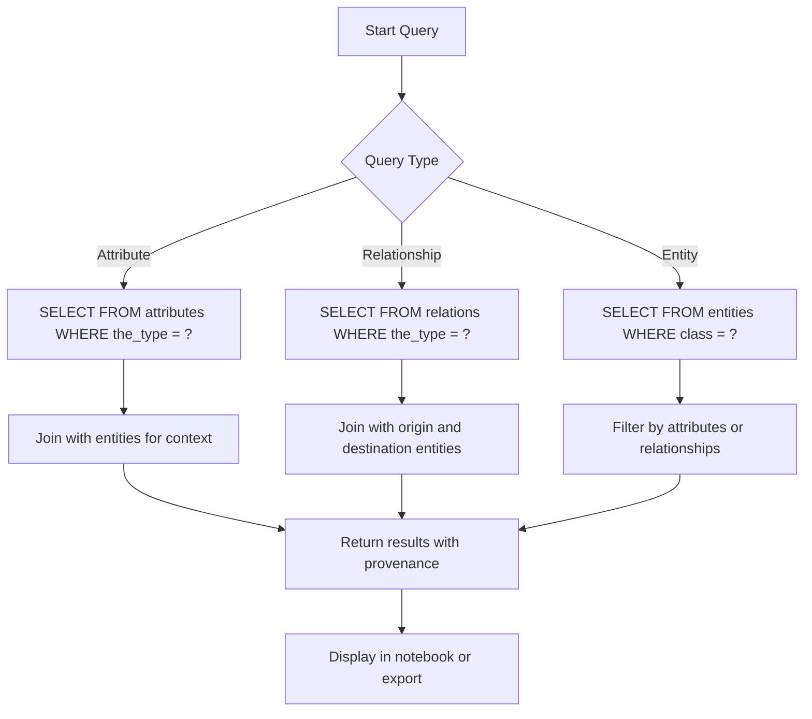

# Importation Phase

<cite>
**Referenced Files in This Document**   
- [database-overview.ipynb](file://notebooks/database-overview.ipynb)
- [01-background-importer.ipynb](file://notebooks/01-background-importer.ipynb)
- [dehergne-a.xml](file://sources/dehergne-a.xml)
- [dehergne-0-abrev.xml](file://sources/dehergne-0-abrev.xml)
- [sources.str](file://structures/sources.str)
- [dehergne-a.rpt](file://sources/dehergne-a.rpt)
- [dehergne-a.err](file://sources/dehergne-a.err)
- [dehergne-locations-1644.xml](file://sources/dehergne-locations-1644.xml)
</cite>

## Table of Contents
1. [Introduction](#introduction)
2. [Importation Workflow](#importation-workflow)
3. [Database Schema Design](#database-schema-design)
4. [Data Immutability Principle](#data-immutability-principle)
5. [Import Reports and Error Logs](#import-reports-and-error-logs)
6. [Querying Biographical Data](#querying-biographical-data)
7. [Practical Examples and Common Issues](#practical-examples-and-common-issues)
8. [Conclusion](#conclusion)

## Introduction
The importation phase of the dehergne system is a critical process that transforms XML output from the translation phase into a structured SQLite database using the Timelink importer. This phase ensures that biographical data, attributes, and relationships are accurately loaded into the database, enabling efficient data access for analysis while preserving provenance. The database schema is designed to support complex queries on biographical information, including personal attributes, geographical locations, and historical relationships. A key principle of this system is data immutability, which requires that corrections be made through re-transcription and re-import rather than direct database modification. This documentation provides a comprehensive overview of the importation process, database structure, and practical considerations for maintaining data integrity.

## Importation Workflow
The importation workflow begins with XML files generated from the translation of Kleio source files (.cli). These XML files contain structured data that is loaded into a SQLite database using the Timelink importer. The process is automated through Jupyter notebooks such as `01-background-importer.ipynb`, which monitors the source directory for changes and triggers the import process when new or modified files are detected. The workflow involves several key steps: first, the XML file is validated against the structure defined in `sources.str`, which specifies the schema for entities, attributes, and relationships. Next, the Timelink importer parses the XML and creates corresponding database records in tables such as `entities`, `attributes`, `relations`, and `persons`. During import, the system checks for existing records to prevent duplication, using unique identifiers to maintain referential integrity. The process is designed to be incremental, importing only changed or new files since the last import, which optimizes performance and reduces processing time. This workflow ensures that the database is kept up-to-date with the latest transcriptions while maintaining a complete history of changes through the importation of new versions rather than direct modifications.

**Section sources**
- [01-background-importer.ipynb](file://notebooks/01-background-importer.ipynb#L1-L236)
- [dehergne-a.xml](file://sources/dehergne-a.xml#L1-L200)
- [sources.str](file://structures/sources.str#L1-L800)

## Database Schema Design
The database schema is designed to support flexible and efficient querying of biographical data, attributes, and relationships. It follows a normalized structure with several core tables that represent different types of entities and their properties. The `entities` table serves as the base table for all entities, containing common fields such as `id`, `class`, `inside`, `the_source`, and `updated`. Specialized tables extend this base to store specific types of information: the `persons` table stores biographical information with fields for `name` and `sex`; the `attributes` table stores key-value pairs of attributes with columns for `the_type`, `the_value`, and `the_date`; and the `relations` table captures relationships between entities with `origin`, `destination`, and `the_type` fields. The schema also includes specialized tables for geographical entities (`geoentities`) and sources (`sources`), allowing for rich contextual information to be associated with each record. This design enables complex queries that can traverse relationships, filter by attribute types, and aggregate information across multiple entities. The use of foreign keys and indexed fields ensures data integrity and query performance, making it possible to efficiently analyze large datasets of historical biographical information.

```mermaid
erDiagram
entities {
varchar id PK
varchar class
varchar inside FK
varchar the_source
integer the_order
integer the_level
integer the_line
varchar groupname
json extra_info
datetime updated
datetime indexed
}
persons {
varchar id PK FK
varchar name
char sex
varchar obs
}
attributes {
varchar id PK FK
varchar entity FK
varchar the_type
varchar the_value
varchar the_date
varchar obs
}
relations {
varchar id PK
varchar origin FK
varchar destination FK
varchar the_type
varchar the_value
varchar obs
varchar the_date
}
geoentities {
varchar id PK FK
varchar name
varchar type
varchar obs
}
sources {
varchar id PK
varchar the_date
varchar the_type
varchar the_value
varchar loc
varchar ref
varchar kleiofile
varchar obs
varchar replaces
}
entities ||--o{ persons : "is"
entities ||--o{ attributes : "has"
entities ||--o{ relations : "originates"
entities ||--o{ geoentities : "is"
entities }o--|| sources : "belongs to"
```

**Diagram sources**
- [database-overview.ipynb](file://notebooks/database-overview.ipynb#L1-L1303)
- [sources.str](file://structures/sources.str#L1-L800)

## Data Immutability Principle
The dehergne system adheres to a strict principle of data immutability, which means that once data is imported into the database, it cannot be directly modified. This principle ensures data integrity and preserves the provenance of information by maintaining a complete history of all transcriptions. When corrections or updates are needed, they must be made at the source level by re-transcribing the original Kleio files and then re-importing the updated XML into the database. This approach creates a new version of the data rather than altering existing records, allowing researchers to track changes over time and understand the evolution of transcriptions. The immutability principle is enforced through the database design, which treats each import as an append-only operation. This means that new imports add records to the database without modifying or deleting existing ones, effectively creating a timeline of data versions. This approach supports reproducible research by ensuring that any analysis can be traced back to a specific version of the data, and it enables the system to maintain a complete audit trail of all changes. While this may seem less efficient than direct database modifications, it provides significant benefits in terms of data integrity, version control, and scholarly accountability.

**Section sources**
- [database-overview.ipynb](file://notebooks/database-overview.ipynb#L1-L1303)
- [01-background-importer.ipynb](file://notebooks/01-background-importer.ipynb#L1-L236)

## Import Reports and Error Logs
The importation process generates two important types of files that help verify data integrity: import reports (.rpt) and error logs (.err). The import report, such as `dehergne-a.rpt`, provides a detailed summary of the import process, including information about the source file, translation statistics, and any warnings or special conditions encountered during import. For example, the report may indicate when "SAME AS" references to external entities are exported, which requires verification before importing to ensure referential integrity. The error log, such as `dehergne-a.err`, records any errors or warnings that occurred during the import process, allowing users to identify and address issues with the source data. These logs are essential for maintaining data quality, as they provide immediate feedback on the success of the import and highlight potential problems that need to be resolved. The presence of zero errors and warnings in the error log indicates a successful import, while any issues must be addressed by correcting the source files and re-importing. Together, these files form a critical part of the quality assurance process, ensuring that only valid and consistent data is loaded into the database. They also serve as documentation of the import process, providing a record that can be consulted for troubleshooting or auditing purposes.

**Section sources**
- [dehergne-a.rpt](file://sources/dehergne-a.rpt#L1-L40)
- [dehergne-a.err](file://sources/dehergne-a.err#L1-L5)

## Querying Biographical Data
The database structure enables efficient querying of biographical data through a combination of direct table access and relationship traversal. The `database-overview.ipynb` notebook demonstrates how to connect to the database and retrieve information about the available tables and their row counts, providing an overview of the data landscape. Queries can be constructed to retrieve specific types of information, such as all attributes of a particular type (e.g., "nome" for names or "nascimento" for birth dates) or all relationships of a certain kind (e.g., "jesuita-entrada" for Jesuit entries). The system supports complex queries that combine multiple criteria, such as filtering attributes by type and date, or joining entities with their attributes and relationships. The use of standardized attribute types, including those with Wikidata references (e.g., "nome@wikidata"), enables integration with external knowledge bases and facilitates data linking. The database also supports temporal queries, allowing researchers to analyze how information about individuals or locations changed over time. This querying capability is essential for historical research, enabling scholars to extract meaningful patterns and insights from the biographical data while maintaining the context and provenance of each piece of information.



**Diagram sources**
- [database-overview.ipynb](file://notebooks/database-overview.ipynb#L1-L1303)

## Practical Examples and Common Issues
Practical import workflows typically involve preparing Kleio source files, translating them to XML, and importing the results into the database. A common workflow begins with editing a .cli file to correct transcription errors or add new information, followed by running the translation process to generate an updated .xml file. The import process is then triggered, either manually or automatically through the monitoring system in `01-background-importer.ipynb`. One common issue encountered during database population is the presence of "SAME AS" references to external entities, which require verification to ensure that the referenced entities exist in the database before import. Another issue is schema validation errors, which can occur if the XML structure does not conform to the definitions in `sources.str`. These errors are typically caught during the import process and recorded in the error log, requiring the source files to be corrected and re-translated. Performance can also be a concern when importing large files, as the process may take several minutes to complete. To mitigate this, the system uses incremental imports that only process changed files, reducing the overall processing time. Regular monitoring of import reports and error logs is essential for identifying and resolving these issues, ensuring that the database remains accurate and up-to-date.

**Section sources**
- [01-background-importer.ipynb](file://notebooks/01-background-importer.ipynb#L1-L236)
- [dehergne-a.rpt](file://sources/dehergne-a.rpt#L1-L40)
- [dehergne-a.err](file://sources/dehergne-a.err#L1-L5)

## Conclusion
The importation phase of the dehergne system plays a crucial role in transforming raw transcription data into a structured, queryable database that supports historical research. By using the Timelink importer to load XML output into a SQLite database, the system creates a robust foundation for analyzing biographical data, attributes, and relationships. The database schema is thoughtfully designed to support complex queries while maintaining data integrity through normalization and referential constraints. The principle of data immutability ensures that all changes are properly documented and traceable, preserving the provenance of information and enabling reproducible research. Import reports and error logs provide essential feedback on the import process, helping to maintain data quality and identify issues that need to be addressed. Together, these components create a reliable and efficient system for managing historical biographical data, enabling researchers to explore complex relationships and patterns while maintaining confidence in the accuracy and integrity of the information.