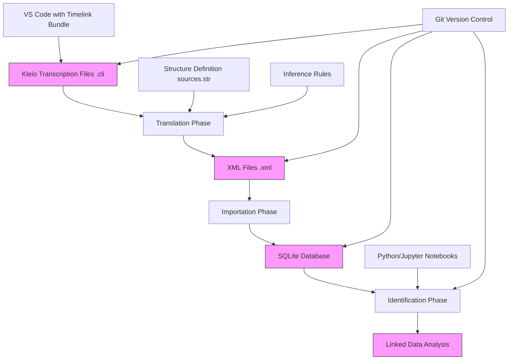
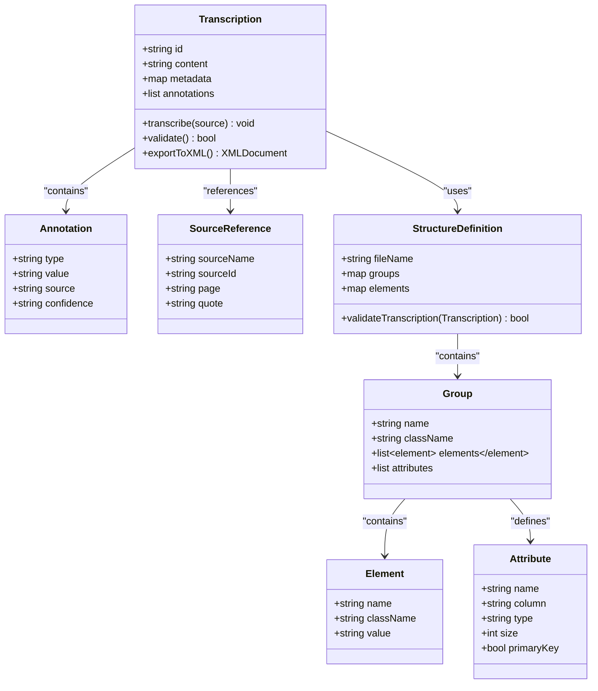
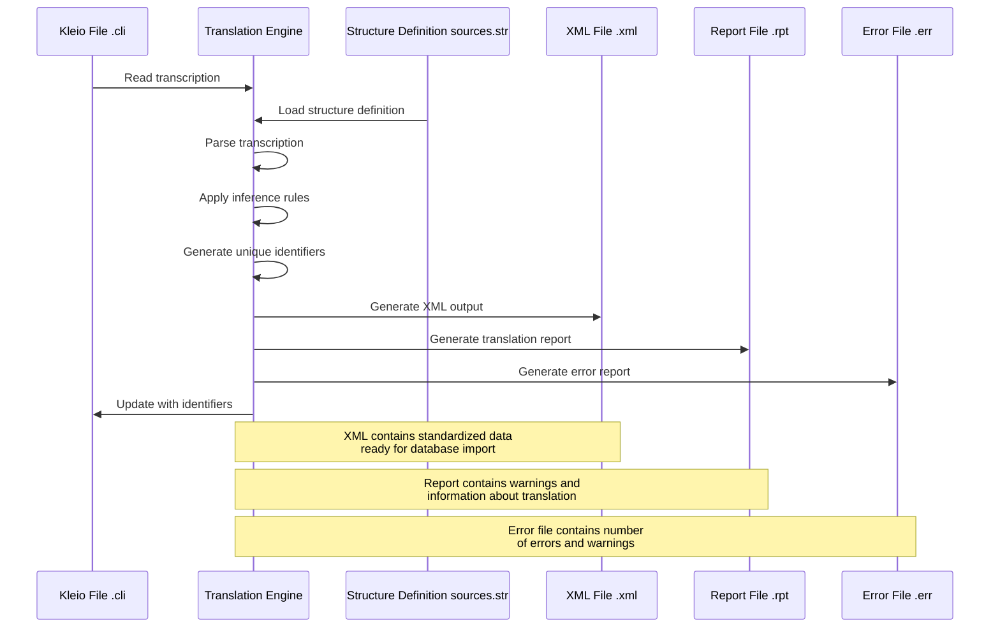
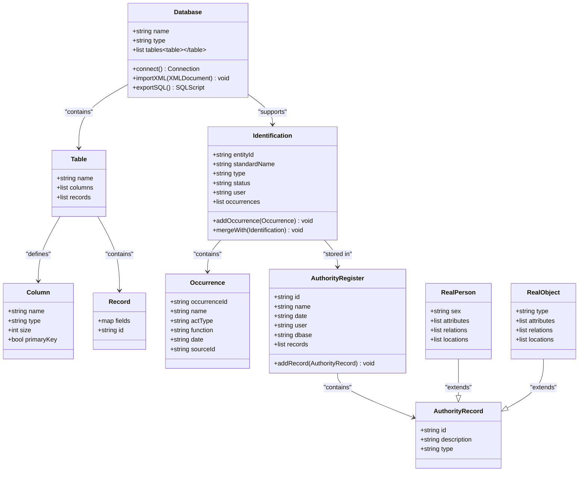
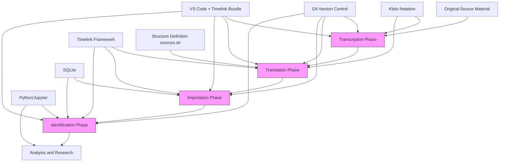

# Technical Architecture

<cite>
**Referenced Files in This Document**   
- [README.md](file://README.md)
- [etc/doc/Concepts.md](file://etc/doc/Concepts.md)
- [structures/sources.str](file://structures/sources.str)
- [sources/dehergne-a.cli](file://sources/dehergne-a.cli)
- [sources/dehergne-a.xml](file://sources/dehergne-a.xml)
- [notebooks/dehergne_analysis.ipynb](file://notebooks/dehergne_analysis.ipynb)
- [notebooks/01-background-importer.ipynb](file://notebooks/01-background-importer.ipynb)
- [notebooks/dehergne_util.py](file://notebooks/dehergne_util.py)
</cite>

## Table of Contents
1. [Introduction](#introduction)
2. [Project Structure](#project-structure)
3. [Core Components](#core-components)
4. [Architecture Overview](#architecture-overview)
5. [Detailed Component Analysis](#detailed-component-analysis)
6. [Dependency Analysis](#dependency-analysis)
7. [Performance Considerations](#performance-considerations)
8. [Troubleshooting Guide](#troubleshooting-guide)
9. [Conclusion](#conclusion)

## Introduction

The dehergne system is a digital humanities project focused on transcribing and analyzing Joseph Dehergne's biographical dictionary of Jesuit missionaries in China from 1552 to 1800. Built on the Timelink framework, the system implements a four-phase pipeline—transcription, translation, importation, and identification—to transform historical source material into a structured, queryable database. The architecture emphasizes data immutability, reproducibility, and traceability, with all changes tracked through Git version control. The system uses Kleio notation for source transcription, Python/Jupyter for analysis, SQLite for storage, and VS Code with the Timelink Bundle for development. This documentation provides a comprehensive overview of the system's technical architecture, highlighting its key components, data flow, and architectural patterns.

**Section sources**
- [README.md](file://README.md#L1-L87)
- [etc/doc/Concepts.md](file://etc/doc/Concepts.md#L1-L126)

## Project Structure

The dehergne repository follows a structured organization that supports the four-phase pipeline of the Timelink framework. The root directory contains core configuration files and documentation, while subdirectories organize different types of content. The `sources/` directory contains Kleio transcription files (`.cli`) that represent the primary source material. The `structures/` directory houses the `sources.str` file, which defines the data model and structure for the transcriptions. The `inferences/` directory contains markdown files with additional information and analysis. The `notebooks/` directory includes Jupyter notebooks for data analysis and processing, while the `database/` directory stores database backups. The `identifications/` directory contains identification files, and the `extras/` directory includes supplementary documentation and scripts. This organization supports a clear separation of concerns and facilitates collaboration among different roles in the transcription and analysis process.

```mermaid
graph TB
subgraph "Root Directory"
README[README.md]
Git[.gitignore]
Workspace[dehergne-locations.code-workspace]
end
subgraph "Sources"
Sources[sources/]
Sources --> CLI[*.cli files]
end
subgraph "Structures"
Structures[structures/]
Structures --> STR[sources.str]
Structures --> JSON[sources.str.json]
Structures --> YAML[sources.str.yaml]
end
subgraph "Inferences"
Inferences[inferences/]
Inferences --> Markdown[*.md files]
Inferences --> Wikidata[wikidata-references/]
end
subgraph "Notebooks"
Notebooks[notebooks/]
Notebooks --> IPYNB[*.ipynb files]
Notebooks --> SQL[-- SQLite.sql]
Notebooks --> PY[dehergne_util.py]
Notebooks --> Requirements[requirements.txt]
end
subgraph "Database"
Database[database/]
Database --> README_DB[README.md]
end
subgraph "Identifications"
Identifications[identifications/]
Identifications --> README_ID[README.md]
Identifications --> EXCLUDE[*.cli.exclude]
end
subgraph "Extras"
Extras[extras/]
Extras --> Doc[doc/]
Extras --> Scripts[scripts/]
end
subgraph "Etc"
Etc[etc/]
Etc --> Doc[doc/]
Etc --> Doc --> Concepts[Concepts.md]
end
README --> Sources
README --> Structures
README --> Inferences
README --> Notebooks
README --> Database
README --> Identifications
README --> Extras
Etc --> Doc
```

**Diagram sources **
- [README.md](file://README.md#L1-L87)
- [structures/sources.str](file://structures/sources.str#L1-L2878)

**Section sources**
- [README.md](file://README.md#L1-L87)
- [structures/sources.str](file://structures/sources.str#L1-L2878)

## Core Components

The dehergne system's core components implement the four-phase pipeline of the Timelink framework. The transcription phase uses Kleio notation to capture source material in `.cli` files, preserving the original text while adding structured metadata. The translation phase processes these transcriptions into XML format using the structure definition in `sources.str`, applying inference rules to extract and standardize information. The importation phase loads the XML data into a SQLite database, creating a queryable repository of historical information. The identification phase links related entities across different sources, enabling complex queries and analysis. These components work together to transform unstructured historical text into a structured, interconnected dataset that supports advanced research and analysis.

**Section sources**
- [etc/doc/Concepts.md](file://etc/doc/Concepts.md#L1-L126)
- [sources/dehergne-a.cli](file://sources/dehergne-a.cli#L1-L200)
- [sources/dehergne-a.xml](file://sources/dehergne-a.xml#L1-L200)

## Architecture Overview

The dehergne system architecture follows a pipeline processing model with four distinct phases: transcription, translation, importation, and identification. The system begins with Kleio transcription files (`.cli`) that capture the original source material in a structured format. These files are processed by the translation phase, which uses the structure definition in `sources.str` to generate XML files (`.xml`) that represent the data in a standardized format. The importation phase loads these XML files into a SQLite database, creating a persistent, queryable repository. The identification phase adds links between related entities, enabling complex queries and analysis. Throughout this process, Git version control ensures reproducibility and traceability, with the `master` branch serving as the reference version. The architecture emphasizes data immutability, with all changes tracked through the version control system rather than direct database modifications.



**Diagram sources **
- [etc/doc/Concepts.md](file://etc/doc/Concepts.md#L1-L126)
- [sources/dehergne-a.cli](file://sources/dehergne-a.cli#L1-L200)
- [sources/dehergne-a.xml](file://sources/dehergne-a.xml#L1-L200)
- [structures/sources.str](file://structures/sources.str#L1-L2878)

## Detailed Component Analysis

### Transcription Component Analysis

The transcription component captures the original source material using Kleio notation, a formal language designed for historical source transcription. Each `.cli` file represents a portion of Joseph Dehergne's biographical dictionary, with structured entries for individual Jesuit missionaries. The transcription process preserves the original text while adding structured metadata through Kleio groups and elements. For example, the `n$` group marks a person entry, while `ls$` elements capture specific attributes like nationality, dates, and locations. The system uses unique identifiers (IDs) to ensure traceability from database records back to the original transcription. These IDs are preserved across re-imports, maintaining consistency in the data model. The transcription component also supports annotations and references to external sources, such as Wikidata, through special syntax like `@wikidata:Q1171`.



**Diagram sources **
- [sources/dehergne-a.cli](file://sources/dehergne-a.cli#L1-L200)
- [structures/sources.str](file://structures/sources.str#L1-L2878)

**Section sources**
- [sources/dehergne-a.cli](file://sources/dehergne-a.cli#L1-L200)
- [structures/sources.str](file://structures/sources.str#L1-L2878)

### Translation Component Analysis

The translation component processes Kleio transcription files into XML format using the structure definition in `sources.str`. This phase applies inference rules to extract and standardize information from the transcriptions. The translation process begins by parsing the `.cli` file according to the structure definition, identifying groups and elements based on their names and hierarchy. It then generates an XML document that represents the data in a standardized format suitable for database import. During translation, the system generates unique identifiers for each entity mentioned in the source, which are necessary for later identification of co-occurrences across different sources. The translator can be configured with parameters that regulate identifier generation, such as which elements should have IDs generated automatically and whether IDs should be prefixed with a specific character sequence. The translation process also produces error and report files (`.err` and `.rpt`) to help identify issues in the transcription.



**Diagram sources **
- [sources/dehergne-a.cli](file://sources/dehergne-a.cli#L1-L200)
- [sources/dehergne-a.xml](file://sources/dehergne-a.xml#L1-L200)
- [structures/sources.str](file://structures/sources.str#L1-L2878)

**Section sources**
- [sources/dehergne-a.cli](file://sources/dehergne-a.cli#L1-L200)
- [sources/dehergne-a.xml](file://sources/dehergne-a.xml#L1-L200)
- [structures/sources.str](file://structures/sources.str#L1-L2878)

### Importation Component Analysis

The importation component loads XML files into a SQLite database, creating a persistent, queryable repository of historical information. This phase transforms the standardized XML data into database records while preserving the hierarchical structure of the original transcription. The import process creates tables for different entity types (persons, attributes, relations, etc.) and establishes relationships between them based on the XML structure. The system ensures data immutability by not allowing direct modification of imported records through the database interface. When errors are detected, corrections must be made to the original transcription, which is then re-translated and re-imported. This principle guarantees transparency and traceability of all data in the project. The importation process also handles postponed relations, storing them for later resolution when all referenced entities are available in the database.

```mermaid
flowchart TD
A[XML File .xml] --> B[Importation Engine]
B --> C[Parse XML Structure]
C --> D[Create Database Records]
D --> E[Persons Table]
D --> F[Attributes Table]
D --> G[Relations Table]
D --> H[Sources Table]
D --> I[Acts Table]
D --> J[GeoEntities Table]
B --> K[Handle Postponed Relations]
K --> L[Store for Later Resolution]
B --> M[Generate Import Report .xrpt]
B --> N[Generate Error Log .xerr]
E --> O[SQLite Database]
F --> O
G --> O
H --> O
I --> O
J --> O
L --> O
M --> P[Import Reports]
N --> Q[Error Logs]
style O fill:#f9f,stroke:#333
style P fill:#ccf,stroke:#333
style Q fill:#fcc,stroke:#333
Note over B: Importation preserves data immutability<br/>No direct database modifications allowed
Note over K: Postponed relations handled<br/>for incomplete references
```

**Diagram sources **
- [sources/dehergne-a.xml](file://sources/dehergne-a.xml#L1-L200)
- [notebooks/dehergne_analysis.ipynb](file://notebooks/dehergne_analysis.ipynb#L1-L200)

**Section sources**
- [sources/dehergne-a.xml](file://sources/dehergne-a.xml#L1-L200)
- [notebooks/dehergne_analysis.ipynb](file://notebooks/dehergne_analysis.ipynb#L1-L200)

### Identification Component Analysis

The identification component enables researchers to make decisions about entity co-occurrence across different sources, linking references to the same person or entity. This phase operates on the imported database, allowing investigators to assert that different references in different acts pertain to the same real-world entity. These identification decisions are stored in special tables within the database and can be exported in JSON format for exchange with other applications. The identification process is crucial for generating derived representations like biographies, networks, and other interpretive constructs that support complex analysis of the community. The system uses authority registers for identifications, containing real-entity records that aggregate occurrences from the source material. Each real entity has a standard name and a collection of occurrences (in `occ` subgroups) that link back to the original source records.



**Diagram sources **
- [etc/doc/Concepts.md](file://etc/doc/Concepts.md#L1-L126)
- [structures/sources.str](file://structures/sources.str#L1-L2878)
- [notebooks/dehergne_analysis.ipynb](file://notebooks/dehergne_analysis.ipynb#L1-L200)

**Section sources**
- [etc/doc/Concepts.md](file://etc/doc/Concepts.md#L1-L126)
- [structures/sources.str](file://structures/sources.str#L1-L2878)
- [notebooks/dehergne_analysis.ipynb](file://notebooks/dehergne_analysis.ipynb#L1-L200)

## Dependency Analysis

The dehergne system components have a clear dependency hierarchy that follows the four-phase pipeline. The transcription phase produces the input for the translation phase, which in turn generates the input for the importation phase. The identification phase operates on the output of the importation phase, creating links between entities in the database. The entire process is coordinated through Git version control, with the `master` branch serving as the reference version. The system also depends on external tools and libraries, including the Timelink framework for processing, Kleio notation for transcription, Python/Jupyter for analysis, and SQLite for storage. The VS Code editor with the Timelink Bundle provides an integrated development environment for working with the system. These dependencies work together to support the source-oriented modeling approach, where all data transformations are traceable back to the original transcriptions.



**Diagram sources **
- [README.md](file://README.md#L1-L87)
- [etc/doc/Concepts.md](file://etc/doc/Concepts.md#L1-L126)
- [structures/sources.str](file://structures/sources.str#L1-L2878)

**Section sources**
- [README.md](file://README.md#L1-L87)
- [etc/doc/Concepts.md](file://etc/doc/Concepts.md#L1-L126)
- [structures/sources.str](file://structures/sources.str#L1-L2878)

## Performance Considerations

The dehergne system architecture prioritizes data integrity, reproducibility, and traceability over raw performance. The use of immutable data and version control ensures that all changes are tracked and can be reproduced, but this approach can impact performance for large-scale updates. The pipeline processing model allows for incremental updates, where only changed files are re-processed, improving efficiency for ongoing transcription work. The system uses SQLite for storage, which provides adequate performance for the current dataset size while maintaining simplicity and portability. For larger datasets, performance could be improved by optimizing database indexes, implementing caching strategies, or migrating to a more scalable database system. The Jupyter notebook environment supports interactive analysis but may require optimization for complex queries on large datasets. Overall, the system is designed to balance performance with the requirements of scholarly research, where accuracy and reproducibility are paramount.

**Section sources**
- [notebooks/dehergne_analysis.ipynb](file://notebooks/dehergne_analysis.ipynb#L1-L200)
- [notebooks/01-background-importer.ipynb](file://notebooks/01-background-importer.ipynb#L1-L200)

## Troubleshooting Guide

Common issues in the dehergne system typically relate to the four-phase pipeline and can be addressed through systematic troubleshooting. For transcription issues, verify that the Kleio syntax is correct and that all required fields are present. Translation errors can often be resolved by checking the structure definition in `sources.str` and ensuring it matches the transcription format. Importation problems may indicate issues with the XML structure or database schema, which can be diagnosed by examining the import reports (`.xrpt`) and error logs (`.xerr`). Identification challenges often arise from incomplete or inconsistent data, which can be addressed by reviewing the original transcriptions and ensuring consistent use of identifiers. When issues persist, the version control history in Git can be used to trace changes and identify when problems were introduced. Regular validation of data at each pipeline stage helps prevent issues from propagating to later phases.

**Section sources**
- [etc/doc/Concepts.md](file://etc/doc/Concepts.md#L1-L126)
- [sources/dehergne-a.cli](file://sources/dehergne-a.cli#L1-L200)
- [sources/dehergne-a.xml](file://sources/dehergne-a.xml#L1-L200)
- [notebooks/01-background-importer.ipynb](file://notebooks/01-background-importer.ipynb#L1-L200)

## Conclusion

The dehergne system implements a robust architectural framework for transforming historical source material into a structured, queryable database. By following the Timelink framework's four-phase pipeline—transcription, translation, importation, and identification—the system ensures data integrity, reproducibility, and traceability. The architecture emphasizes source-oriented modeling, with all data transformations traceable back to the original Kleio transcriptions. Git version control provides a collaborative environment where the `master` branch serves as the reference version, while supporting multiple contributors and reproducible research. The system's use of standardized formats (Kleio, XML, SQL) and open technologies (Python, Jupyter, SQLite) ensures accessibility and longevity. This architectural approach enables sophisticated analysis of historical data while maintaining scholarly rigor and transparency.