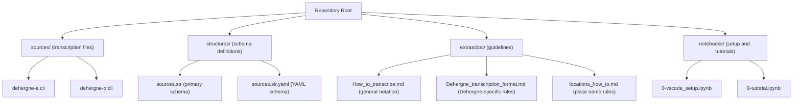
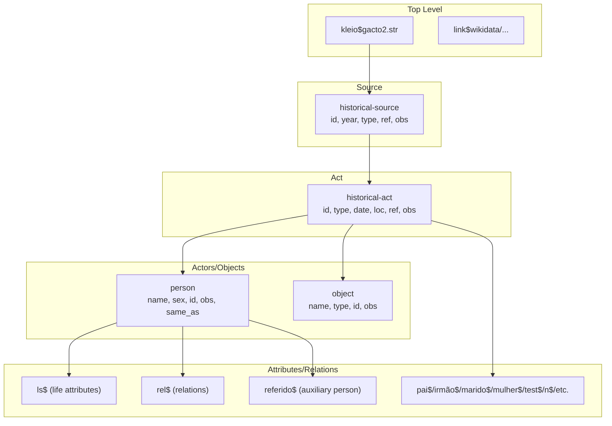
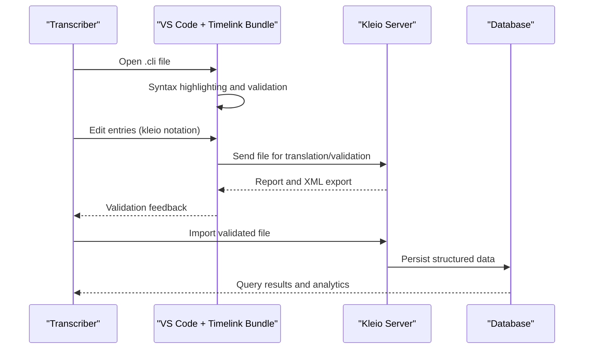
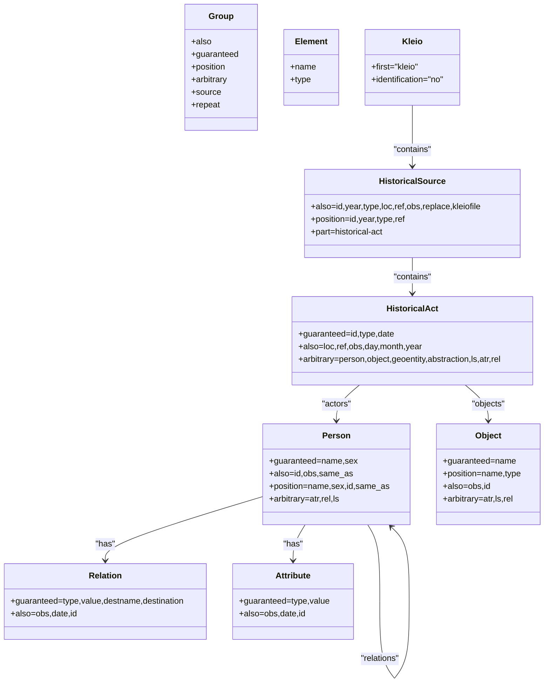
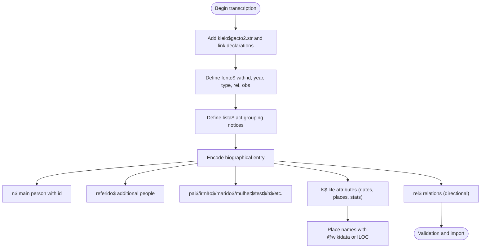
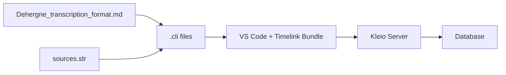

# Transcription Phase

<cite>
**Referenced Files in This Document**
- [README.md](file://README.md)
- [How_to_transcribe.md](file://extras/doc/How_to_transcribe.md)
- [Dehergne_transcription_format.md](file://extras/doc/Dehergne_transcription_format.md)
- [locations_how_to.md](file://extras/doc/locations_how_to.md)
- [sources.str](file://structures/sources.str)
- [sources.str.yaml](file://structures/sources.str.yaml)
- [dehergne-a.cli](file://sources/dehergne-a.cli)
- [dehergne-b.cli](file://sources/dehergne-b.cli)
- [0-vscode_setup.ipynb](file://notebooks/0-vscode_setup.ipynb)
- [9-tutorial.ipynb](file://notebooks/9-tutorial.ipynb)
</cite>

## Table of Contents
1. [Introduction](#introduction)
2. [Project Structure](#project-structure)
3. [Core Components](#core-components)
4. [Architecture Overview](#architecture-overview)
5. [Detailed Component Analysis](#detailed-component-analysis)
6. [Dependency Analysis](#dependency-analysis)
7. [Performance Considerations](#performance-considerations)
8. [Troubleshooting Guide](#troubleshooting-guide)
9. [Conclusion](#conclusion)
10. [Appendices](#appendices)

## Introduction
This document describes the transcription phase of the dehergne system, focusing on how raw historical biographical entries from Joseph Dehergne’s Répertoire des Jésuites de Chine are encoded into formal Kleio notation (.cli files). It explains how the sources.str structure definition file governs the schema and syntax of transcriptions, how Visual Studio Code with the Timelink Bundle extension is used for editing and syntax highlighting, and how the hierarchical source/act/actor-object model represents biographical entries. It also provides concrete examples from actual .cli files, outlines how transcription decisions are guided by the transcription documentation, and details best practices for consistency, ambiguity handling, and paleographic accuracy. Finally, it explains how this phase establishes the immutable factual foundation for subsequent processing stages.

## Project Structure
The dehergne repository organizes transcription artifacts around:
- sources.str: the authoritative structure definition that governs Kleio notation for historical sources.
- sources/: the corpus of .cli files, one per letter of the alphabet, encoding biographical entries.
- extras/doc/: transcription guidelines and best practices.
- structures/: structure definitions and YAML equivalents.
- notebooks/: optional tooling for development and setup (e.g., VS Code extension configuration).

**Diagram sources**
- [README.md](file://README.md#L1-L87)
- [sources.str](file://structures/sources.str#L1-L120)
- [sources.str.yaml](file://structures/sources.str.yaml#L1-L120)
- [How_to_transcribe.md](file://extras/doc/How_to_transcribe.md#L1-L100)
- [Dehergne_transcription_format.md](file://extras/doc/Dehergne_transcription_format.md#L1-L120)
- [locations_how_to.md](file://extras/doc/locations_how_to.md#L1-L66)
- [dehergne-a.cli](file://sources/dehergne-a.cli#L1-L60)
- [dehergne-b.cli](file://sources/dehergne-b.cli#L1-L60)
- [0-vscode_setup.ipynb](file://notebooks/0-vscode_setup.ipynb#L1-L165)
- [9-tutorial.ipynb](file://notebooks/9-tutorial.ipynb#L1-L120)

**Section sources**
- [README.md](file://README.md#L1-L87)

## Core Components
- sources.str: Defines the Kleio schema for historical sources, including groups (e.g., historical-source, historical-act, person, object, relation, attribute), elements (e.g., id, name, sex, date, loc, ref), and act types (e.g., bap, cas, obito). It also declares the Portuguese-language extensions used in Dehergne transcription.
- Dehergne transcription documentation: Provides specific rules for encoding biographical entries from Dehergne’s Répertoire, including how to handle names, dates, places, journeys, and linked data identifiers.
- VS Code with Timelink Bundle: Used for editing .cli files with syntax highlighting and integration with the Kleio server for validation and translation.
- Actual .cli files: Concrete examples of encoded biographical entries, including life-stories (ls$), relations (rel$), and auxiliary groups (referido$, pai$, irmão$, etc.).

**Section sources**
- [sources.str](file://structures/sources.str#L1-L200)
- [Dehergne_transcription_format.md](file://extras/doc/Dehergne_transcription_format.md#L1-L120)
- [0-vscode_setup.ipynb](file://notebooks/0-vscode_setup.ipynb#L1-L165)
- [dehergne-a.cli](file://sources/dehergne-a.cli#L1-L120)
- [dehergne-b.cli](file://sources/dehergne-b.cli#L1-L120)

## Architecture Overview
The transcription phase transforms textual biographical entries into a structured, machine-processable format using Kleio notation. The process follows a source-oriented model:
- Top-level: kleio$ header and link declarations.
- Source: historical-source with metadata (id, year, type, ref).
- Acts: historical-act instances grouped by act type (e.g., bap$, cas$, obito$).
- Actors and objects: person and object groups with attributes and relations.
- Life story and relations: ls$ (life attributes) and rel$ (relationships).
- Auxiliary groups: referido$ (additional people), pai$/irmão$ (roles), and others.

**Diagram sources**
- [How_to_transcribe.md](file://extras/doc/How_to_transcribe.md#L35-L100)
- [sources.str](file://structures/sources.str#L150-L320)
- [dehergne-a.cli](file://sources/dehergne-a.cli#L1-L120)

## Detailed Component Analysis

### Kleio Notation and Hierarchical Model
- General notation: groups, elements, and aspects (core, comment, original) define the syntax and semantics of Kleio entries.
- Source-oriented model: source contains acts; acts contain actors and objects; actors and objects carry attributes and relations.
- Header and structure: files start with kleio$gacto2.str and may include link declarations for external identifiers.

**Diagram sources**
- [How_to_transcribe.md](file://extras/doc/How_to_transcribe.md#L1-L100)
- [0-vscode_setup.ipynb](file://notebooks/0-vscode_setup.ipynb#L1-L165)
- [9-tutorial.ipynb](file://notebooks/9-tutorial.ipynb#L1-L120)

**Section sources**
- [How_to_transcribe.md](file://extras/doc/How_to_transcribe.md#L1-L100)

### Structure Definition: sources.str
- System-level groups: kleio, historical-source, historical-act, person, object, relation, attribute, end, group-element, relation-type.
- Element definitions: id, name, sex, date, loc, ref, pages, value, origin, destination, entity, same_as, xsame_as, summary, description, replace, inside, class, level, line, groupname, kleiofile.
- Portuguese-language extensions: fonte, pt-acto, acto, item, and numerous act types (e.g., bap, cas, obito, ar, proc, po, hab, benfício, chanc, encarte, arrolamento, capela, termo, pauta, eleicao, juramento, vereacao, devassa, denuncia, nom, lcc, integr, acao).
- Positioning and guarantees: ensures deterministic ordering and mandatory fields for robust parsing.

**Diagram sources**
- [sources.str](file://structures/sources.str#L1-L320)
- [sources.str.yaml](file://structures/sources.str.yaml#L1-L200)

**Section sources**
- [sources.str](file://structures/sources.str#L1-L320)
- [sources.str.yaml](file://structures/sources.str.yaml#L1-L200)

### Dehergne-Specific Transcription Rules
- File organization: one .cli file per letter; each file starts with kleio$gacto2.str, a link declaration, a fonte$ header, and a lista$ act grouping notices.
- Entry structure: n$ for the main person, ls$ for life attributes (e.g., nacionalidade, jesuita-estatuto, jesuita-entrada, embarque, wicky, wicky-viagem, jesuita-votos, jesuita-votos-local, morte, dehergne), and optional referido$ for additional people.
- Roles and auxiliary groups: pai$, irmão$, marido$, mulher$, test$, n$, etc., to capture family and act roles.
- Relations: rel$ with directional semantics (e.g., parent-child, companionship).
- Place names: standardized formatting and linked data identifiers (e.g., @wikidata:Qnnnn).
- Dates: YYYYMMDD with zeros for unknown parts; when unavailable, defaults to source year.
- Ambiguities and corrections: comments and original forms; linked data clarifies place identities; same_as/xsame_as tie occurrences to canonical identities.

**Diagram sources**
- [Dehergne_transcription_format.md](file://extras/doc/Dehergne_transcription_format.md#L1-L200)
- [dehergne-a.cli](file://sources/dehergne-a.cli#L1-L120)
- [dehergne-b.cli](file://sources/dehergne-b.cli#L1-L120)

**Section sources**
- [Dehergne_transcription_format.md](file://extras/doc/Dehergne_transcription_format.md#L1-L200)
- [dehergne-a.cli](file://sources/dehergne-a.cli#L1-L120)
- [dehergne-b.cli](file://sources/dehergne-b.cli#L1-L120)

### Concrete Examples from .cli Files
- Example 1: A main entry with ls$ attributes for nationality, status, entry, embarkation, voyages, vows, and death, plus linked data identifiers and observations.
- Example 2: Additional people (referido$) with ls$ attributes and rel$ relations; auxiliary roles (pai$, irmão$) and directional relations (rel$).
- Example 3: Place name normalization and linked data usage; handling of ambiguous or unknown locations with ILOC.

These examples demonstrate:
- Consistent use of ls$ for life attributes.
- Directional rel$ relations.
- Role-based auxiliary groups (pai$, irmão$, marido$, mulher$).
- Linked data identifiers for places and corrections.

**Section sources**
- [dehergne-a.cli](file://sources/dehergne-a.cli#L1-L200)
- [dehergne-b.cli](file://sources/dehergne-b.cli#L1-L200)

### Best Practices for Consistency, Ambiguities, and Paleographic Accuracy
- Consistency:
  - Use standardized place name formatting and linked data identifiers.
  - Apply consistent date formats (YYYYMMDD) and attribute prefixes (e.g., jesuita-).
  - Maintain deterministic ordering of elements as defined by sources.str.
- Handling ambiguities:
  - Use comments (#) for clarifications and original forms (%).
  - Use ILOC for unidentifiable places; prefer @wikidata for canonical identification.
  - Use same_as/xsame_as to link occurrences across files.
- Paleographic accuracy:
  - Preserve original orthography with % when relevant.
  - Add observations with context and sources.
  - Prefer primary sources and cross-reference secondary sources with obs.

**Section sources**
- [locations_how_to.md](file://extras/doc/locations_how_to.md#L1-L66)
- [Dehergne_transcription_format.md](file://extras/doc/Dehergne_transcription_format.md#L350-L575)

### Establishing the Immutable Factual Foundation
- The transcription phase creates a formal, schema-driven representation of biographical facts.
- sources.str enforces a strict schema that enables reliable translation into structured data.
- Linked data and identifiers anchor places and entities to authoritative sources.
- Validation and import pipelines ensure that transcription errors are caught early and corrected before downstream processing.

**Section sources**
- [sources.str](file://structures/sources.str#L1-L200)
- [0-vscode_setup.ipynb](file://notebooks/0-vscode_setup.ipynb#L1-L165)
- [9-tutorial.ipynb](file://notebooks/9-tutorial.ipynb#L1-L120)

## Dependency Analysis
The transcription pipeline depends on:
- sources.str: defines the schema and act types used in .cli files.
- Dehergne documentation: prescribes how to encode biographical entries.
- VS Code + Timelink Bundle: provides editing and validation.
- Kleio server: translates .cli files into structured data and exports reports/XML.

**Diagram sources**
- [Dehergne_transcription_format.md](file://extras/doc/Dehergne_transcription_format.md#L1-L120)
- [sources.str](file://structures/sources.str#L1-L200)
- [0-vscode_setup.ipynb](file://notebooks/0-vscode_setup.ipynb#L1-L165)
- [9-tutorial.ipynb](file://notebooks/9-tutorial.ipynb#L1-L120)

**Section sources**
- [Dehergne_transcription_format.md](file://extras/doc/Dehergne_transcription_format.md#L1-L120)
- [sources.str](file://structures/sources.str#L1-L200)
- [0-vscode_setup.ipynb](file://notebooks/0-vscode_setup.ipynb#L1-L165)
- [9-tutorial.ipynb](file://notebooks/9-tutorial.ipynb#L1-L120)

## Performance Considerations
- Keep .cli files modular (one per letter) to avoid overly large files.
- Use linked data identifiers to reduce duplication and improve query performance.
- Validate early and often using the VS Code + Timelink setup to minimize rework.
- Batch imports and leverage the Kleio server’s reporting to identify and resolve issues efficiently.

[No sources needed since this section provides general guidance]

## Troubleshooting Guide
Common issues and resolutions during transcription:
- Schema violations: Ensure elements follow the positions and guarantees defined in sources.str.
- Place identification problems: Use @wikidata for canonical places; fallback to ILOC for ambiguous locations.
- Ambiguous dates: Use YYYYMMDD with zeros; add observations for alternative dates.
- Cross-file identity mismatches: Use xsame_as carefully and ensure the target id exists; validate import order if necessary.
- VS Code setup: Configure workspace settings for the Kleio server URL, token, and home directory.

**Section sources**
- [sources.str](file://structures/sources.str#L1-L200)
- [locations_how_to.md](file://extras/doc/locations_how_to.md#L1-L66)
- [0-vscode_setup.ipynb](file://notebooks/0-vscode_setup.ipynb#L1-L165)

## Conclusion
The transcription phase of the dehergne system transforms Dehergne’s biographical dictionary into a rigorous, schema-driven Kleio dataset. The sources.str structure definition governs syntax and semantics, while the Dehergne transcription documentation provides practical guidance for encoding entries consistently and accurately. Visual Studio Code with the Timelink Bundle streamlines editing and validation, and the resulting .cli files establish an immutable factual foundation for subsequent processing and analysis.

[No sources needed since this section summarizes without analyzing specific files]

## Appendices
- VS Code setup: Configure workspace settings for the Kleio server to enable seamless validation and translation.
- Tutorial: Explore the notebooks for database status, available files, and import workflows.

**Section sources**
- [0-vscode_setup.ipynb](file://notebooks/0-vscode_setup.ipynb#L1-L165)
- [9-tutorial.ipynb](file://notebooks/9-tutorial.ipynb#L1-L120)