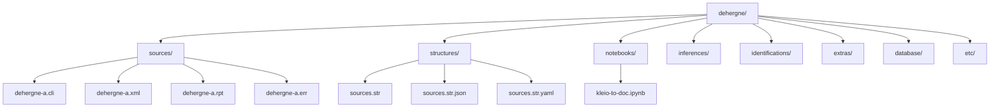
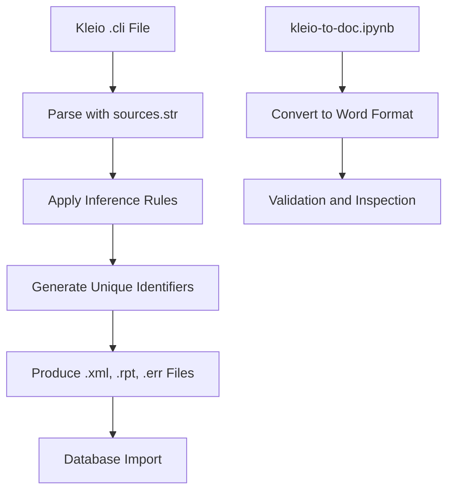
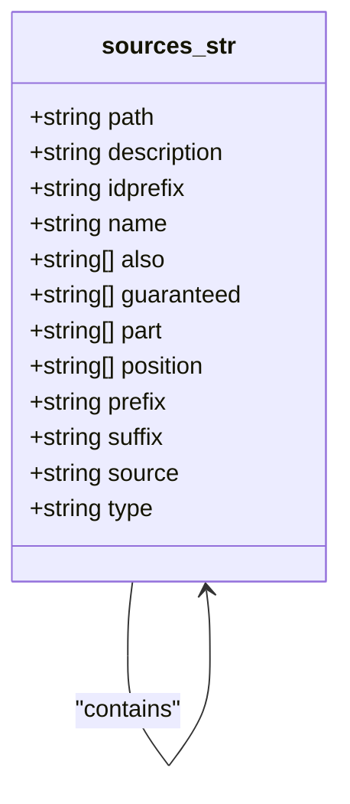
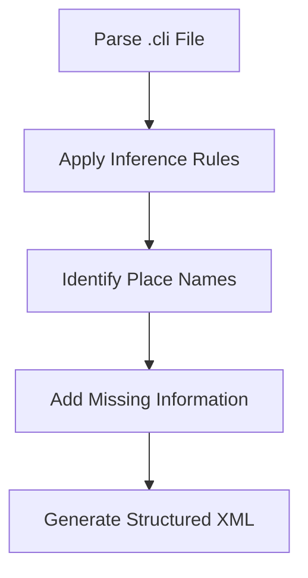
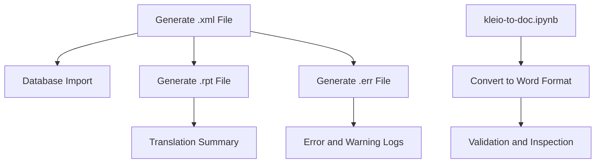
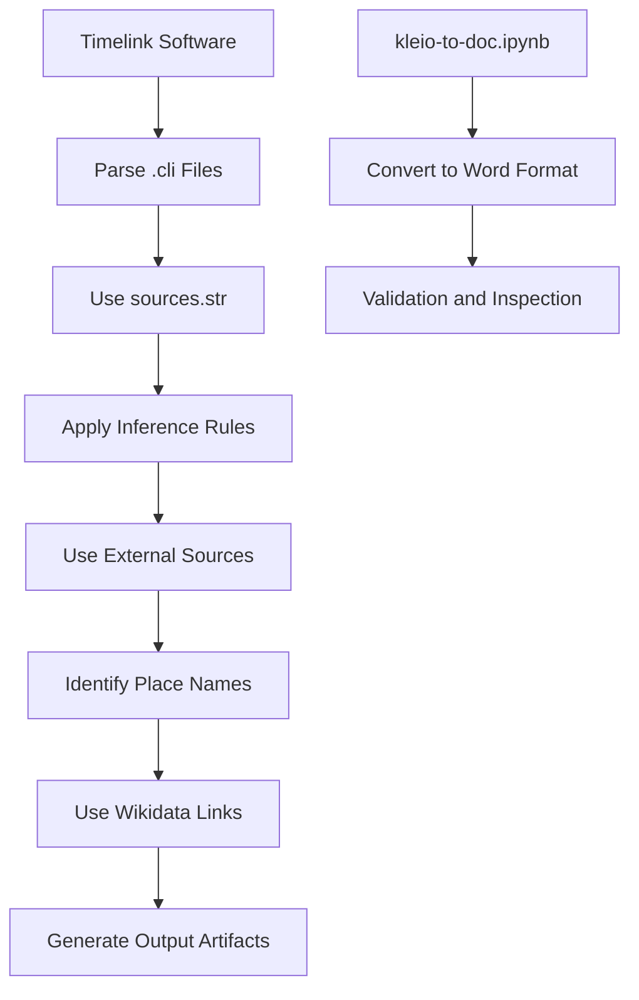

# Translation Phase

<cite>
**Referenced Files in This Document**   
- [dehergne-a.cli](file://sources/dehergne-a.cli)
- [dehergne-a.xml](file://sources/dehergne-a.xml)
- [dehergne-a.rpt](file://sources/dehergne-a.rpt)
- [dehergne-a.err](file://sources/dehergne-a.err)
- [sources.str](file://structures/sources.str)
- [sources.str.json](file://structures/sources.str.json)
- [sources.str.yaml](file://structures/sources.str.yaml)
- [kleio-to-doc.ipynb](file://notebooks/kleio-to-doc.ipynb)
- [README.md](file://README.md)
- [dehergne-a.org](file://sources/dehergne-a.org)
- [dehergne-a.files.json](file://sources/dehergne-a.files.json)
</cite>

## Table of Contents
1. [Introduction](#introduction)
2. [Project Structure](#project-structure)
3. [Core Components](#core-components)
4. [Architecture Overview](#architecture-overview)
5. [Detailed Component Analysis](#detailed-component-analysis)
6. [Dependency Analysis](#dependency-analysis)
7. [Performance Considerations](#performance-considerations)
8. [Troubleshooting Guide](#troubleshooting-guide)
9. [Conclusion](#conclusion)

## Introduction
The translation phase of the dehergne system processes Kleio `.cli` transcription files into structured XML data suitable for database import. This document details the transformation pipeline that parses transcriptions according to the `sources.str` structure definition, applies inference rules, and generates unique identifiers for entities. The output artifacts include `.xml` files containing structured data, `.rpt` reports summarizing translation results, and `.err` files logging errors and warnings. Examples from actual `dehergne-a.xml` and `dehergne-a.rpt` files illustrate the data transformation process. The documentation explains how identifier generation ensures traceability from database records back to original transcriptions and discusses the role of Jupyter notebooks like `kleio-to-doc.ipynb` in validating and inspecting translation outputs. Common translation issues and troubleshooting strategies are also addressed.

**Section sources**
- [README.md](file://README.md#L1-L87)

## Project Structure
The dehergne repository contains several key directories and files that support the translation process. The `sources/` directory holds the Kleio transcription files (`.cli`), their original versions (`.org`), and the generated output files (`.xml`, `.rpt`, `.err`). The `structures/` directory contains the `sources.str` file, which defines the structure for parsing the transcriptions, along with its JSON and YAML representations. The `notebooks/` directory includes Jupyter notebooks like `kleio-to-doc.ipynb` for converting Kleio files to other formats. Additional directories such as `inferences/`, `identifications/`, and `extras/` contain supplementary data and documentation.

**Diagram sources **
- [README.md](file://README.md#L1-L87)

**Section sources**
- [README.md](file://README.md#L1-L87)

## Core Components
The core components of the translation phase include the Timelink software, which uses the `sources.str` structure file to parse Kleio `.cli` files. The process generates structured XML data, reports, and error logs. The `kleio-to-doc.ipynb` notebook facilitates the conversion of Kleio files to Microsoft Word format for easier inspection and validation.

**Section sources**
- [dehergne-a.cli](file://sources/dehergne-a.cli#L1-L1599)
- [dehergne-a.xml](file://sources/dehergne-a.xml#L1-L39107)
- [dehergne-a.rpt](file://sources/dehergne-a.rpt#L1-L40)
- [dehergne-a.err](file://sources/dehergne-a.err#L1-L5)
- [sources.str](file://structures/sources.str#L1-L2878)
- [kleio-to-doc.ipynb](file://notebooks/kleio-to-doc.ipynb#L1-L120)

## Architecture Overview
The architecture of the translation phase involves several key steps: parsing the Kleio `.cli` files using the `sources.str` structure definition, applying inference rules to enrich the data, generating unique identifiers for entities, and producing output artifacts. The process is driven by the Timelink software, which ensures that the structured XML data is suitable for database import. The Jupyter notebook `kleio-to-doc.ipynb` plays a crucial role in validating and inspecting the translation outputs.

**Diagram sources **
- [dehergne-a.cli](file://sources/dehergne-a.cli#L1-L1599)
- [dehergne-a.xml](file://sources/dehergne-a.xml#L1-L39107)
- [dehergne-a.rpt](file://sources/dehergne-a.rpt#L1-L40)
- [kleio-to-doc.ipynb](file://notebooks/kleio-to-doc.ipynb#L1-L120)

## Detailed Component Analysis

### Parsing and Structure Definition
The parsing process begins with the `sources.str` file, which defines the structure for the Kleio transcriptions. This file includes definitions for various groups and elements, such as `fonte`, `n`, `ls`, and `referido`, which are used to organize the data. The structure file also specifies the relationships between different entities and the attributes associated with them.

**Diagram sources **
- [sources.str](file://structures/sources.str#L1-L2878)

**Section sources**
- [sources.str](file://structures/sources.str#L1-L2878)

### Data Transformation and Inference
The data transformation process involves applying inference rules to enrich the parsed data. These rules are derived from additional sources such as the `Cartas ânuas` and modern editions. The process includes identifying place names using Wikidata links and adding missing information such as places of entry in the Jesuits, places of stay, and tasks.

**Diagram sources **
- [dehergne-a.cli](file://sources/dehergne-a.cli#L1-L1599)
- [dehergne-a.xml](file://sources/dehergne-a.xml#L1-L39107)

**Section sources**
- [dehergne-a.cli](file://sources/dehergne-a.cli#L1-L1599)
- [dehergne-a.xml](file://sources/dehergne-a.xml#L1-L39107)

### Output Artifacts Generation
The final step in the translation phase is the generation of output artifacts. The `.xml` files contain the structured data suitable for database import, while the `.rpt` files summarize the translation results. The `.err` files log any errors or warnings encountered during the process. The `kleio-to-doc.ipynb` notebook converts the Kleio files to Microsoft Word format for easier inspection and validation.

**Diagram sources **
- [dehergne-a.xml](file://sources/dehergne-a.xml#L1-L39107)
- [dehergne-a.rpt](file://sources/dehergne-a.rpt#L1-L40)
- [dehergne-a.err](file://sources/dehergne-a.err#L1-L5)
- [kleio-to-doc.ipynb](file://notebooks/kleio-to-doc.ipynb#L1-L120)

**Section sources**
- [dehergne-a.xml](file://sources/dehergne-a.xml#L1-L39107)
- [dehergne-a.rpt](file://sources/dehergne-a.rpt#L1-L40)
- [dehergne-a.err](file://sources/dehergne-a.err#L1-L5)
- [kleio-to-doc.ipynb](file://notebooks/kleio-to-doc.ipynb#L1-L120)

## Dependency Analysis
The translation phase relies on several dependencies, including the Timelink software, the `sources.str` structure file, and the Jupyter notebook `kleio-to-doc.ipynb`. The process also depends on external sources such as the `Cartas ânuas` and modern editions for enriching the data. The use of Wikidata links for identifying place names adds another layer of dependency.

**Diagram sources **
- [dehergne-a.cli](file://sources/dehergne-a.cli#L1-L1599)
- [dehergne-a.xml](file://sources/dehergne-a.xml#L1-L39107)
- [kleio-to-doc.ipynb](file://notebooks/kleio-to-doc.ipynb#L1-L120)

**Section sources**
- [dehergne-a.cli](file://sources/dehergne-a.cli#L1-L1599)
- [dehergne-a.xml](file://sources/dehergne-a.xml#L1-L39107)
- [kleio-to-doc.ipynb](file://notebooks/kleio-to-doc.ipynb#L1-L120)

## Performance Considerations
The performance of the translation phase is influenced by the size and complexity of the Kleio `.cli` files, the efficiency of the parsing and inference rules, and the speed of the Timelink software. Optimizing the structure file and inference rules can improve performance. Additionally, the use of efficient data processing techniques and parallel processing can help reduce the overall processing time.

## Troubleshooting Guide
Common issues in the translation phase include errors in the structure file, missing or incorrect data in the Kleio files, and problems with the inference rules. The `.err` files provide detailed logs of any errors or warnings encountered during the process. The `kleio-to-doc.ipynb` notebook can be used to validate and inspect the translation outputs, helping to identify and resolve issues.

**Section sources**
- [dehergne-a.err](file://sources/dehergne-a.err#L1-L5)
- [kleio-to-doc.ipynb](file://notebooks/kleio-to-doc.ipynb#L1-L120)

## Conclusion
The translation phase of the dehergne system effectively processes Kleio `.cli` transcription files into structured XML data suitable for database import. The use of the `sources.str` structure file, inference rules, and unique identifier generation ensures that the data is accurate and traceable. The output artifacts, including `.xml`, `.rpt`, and `.err` files, provide comprehensive information for database import and troubleshooting. The Jupyter notebook `kleio-to-doc.ipynb` plays a crucial role in validating and inspecting the translation outputs, ensuring the quality and reliability of the data.