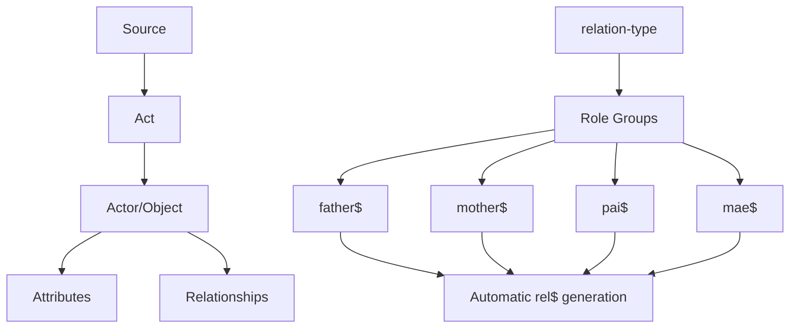

# Relationship Modeling

<cite>
**Referenced Files in This Document**   
- [dehergne-a.cli](file://sources/dehergne-a.cli)
- [Dehergne_transcription_format.md](file://extras/doc/Dehergne_transcription_format.md)
- [sources.str](file://structures/sources.str)
</cite>

## Table of Contents
1. [Introduction](#introduction)
2. [Relationship Syntax and Semantics](#relationship-syntax-and-semantics)
3. [Function-Based Actor Groups](#function-based-actor-groups)
4. [Directional Nature of Relationships](#directional-nature-of-relationships)
5. [Source/Act/Actor-Object Model](#sourceactactor-object-model)
6. [Modeling Complex Relationships](#modeling-complex-relationships)
7. [Troubleshooting Common Issues](#troubleshooting-common-issues)
8. [Conclusion](#conclusion)

## Introduction
The Kleio transcription system provides a sophisticated framework for modeling relationships within historical sources, particularly in the context of Jesuit missionaries in China as documented in the Dehergne corpus. This document explains the syntax and semantics of relationship modeling, focusing on the `rel$` attribute for explicit relationships and function-based actor groups (e.g., `father$`, `mother$`) that automatically generate relationships. The system is built upon the source/act/actor-object model defined in the `sources.str` structure file, which provides the foundation for representing complex historical data. By understanding the relationship modeling system, researchers can accurately represent familial, professional, and social connections between individuals in the transcription files, enabling sophisticated network analysis and historical inquiry.

**Section sources**
- [dehergne-a.cli](file://sources/dehergne-a.cli#L1-L1599)
- [Dehergne_transcription_format.md](file://extras/doc/Dehergne_transcription_format.md#L1-L575)
- [sources.str](file://structures/sources.str#L1-L2878)

## Relationship Syntax and Semantics
The Kleio system uses the `rel$` attribute to explicitly define relationships between individuals in the transcription files. The general syntax for relationships follows the pattern `rel$TYPE/VALUE/DESTINATION_NAME/DESTINATION_ID`, where TYPE specifies the category of relationship (e.g., parentesco, profissional, sociabilidade), VALUE specifies the specific relationship within that category (e.g., primo afastado, empregado de, Companheiro), and DESTINATION_NAME/DESTINATION_ID identify the target individual. For example, the relationship `rel$parentesco/primo afastado/João da Silva/teste-joao-da-silva` establishes that an individual is a distant cousin of João da Silva, with the destination ID providing a unique reference to that person in the database. Relationships can include optional date parameters using the `data=` syntax to specify when the relationship existed or was documented, as seen in examples like `rel$sociabilidade/Companheiro/Adam Algenler/deh-adam-algenler/data=16730315`, which indicates that the companionship relationship dates to March 15, 1673. The system also supports optional observations using the `/obs=` parameter to provide additional context about the relationship, such as source references or explanatory notes.

**Section sources**
- [dehergne-a.cli](file://sources/dehergne-a.cli#L207-L207)
- [Dehergne_transcription_format.md](file://extras/doc/Dehergne_transcription_format.md#L427-L475)

## Function-Based Actor Groups
The Kleio system automatically generates relationships through function-based actor groups that denote specific roles within historical acts. These groups, such as `father$`, `mother$`, `pai$`, and `mae$`, serve as syntactic sugar that automatically creates corresponding relationship entries during the translation process. When a person is designated with one of these role-based groups in an act, the system automatically generates the appropriate `rel$` entries to establish the familial relationship. For example, using `pai$` (father) for Gaspar do Amaral automatically creates a parent-child relationship with his son, eliminating the need for manual relationship entry. This approach streamlines the transcription process while ensuring consistent relationship modeling across the dataset. The system recognizes various familial role groups including `pai$` (father), `mae$` (mother), `marido$` (husband), and `mulher$` (wife), each of which triggers the automatic creation of corresponding relationship entries with appropriate directional semantics. This automated relationship generation is particularly valuable for large-scale transcription projects, reducing the potential for human error and ensuring uniformity in relationship representation.

**Section sources**
- [dehergne-a.cli](file://sources/dehergne-a.cli#L823-L825)
- [Dehergne_transcription_format.md](file://extras/doc/Dehergne_transcription_format.md#L446-L447)

## Directional Nature of Relationships
Relationships in the Kleio system are inherently directional, flowing from the subject (origin) to the object (destination) of the relationship. This directionality is crucial for accurately representing asymmetric relationships such as parent-child or employer-employee connections. For example, the relationship `rel$profissional/Empregado de/Duarte da Gama/deh-luis-de-almeida-ref1/data=15550000` explicitly indicates that Luís de Almeida was employed by Duarte da Gama, with the direction flowing from the employee to the employer. The system distinguishes between symmetric relationships (e.g., 'primo' for cousin) that have the same meaning in both directions and asymmetric relationships (e.g., 'pai' for father) that require careful attention to direction. In asymmetric relationships, the relationship must be recorded from the perspective of the origin individual, ensuring that "father of" relationships originate from the father and point to the child, not vice versa. This directional approach enables precise network analysis and prevents ambiguity in relationship interpretation, particularly important when reconstructing complex family trees or organizational hierarchies from historical sources.

**Section sources**
- [dehergne-a.cli](file://sources/dehergne-a.cli#L611-L624)
- [Dehergne_transcription_format.md](file://extras/doc/Dehergne_transcription_format.md#L442-L445)

## Source/Act/Actor-Object Model
The relationship modeling system is built upon the source/act/actor-object model defined in the `sources.str` structure file, which provides the foundational architecture for representing historical information. This hierarchical model organizes data into sources (historical documents), acts (specific events or records), and actors/objects (individuals or entities involved in the acts). The `relation-type` pseudo-group in `sources.str` serves as the foundation for actor-introducing groups, allowing the system to recognize role-based designations like `father$` or `mother$` and automatically generate corresponding relationships. The model supports arbitrary attributes and relations through the `arbitrary=ls,atr,rel` declaration in the `historical-act` definition, enabling flexible relationship modeling across different types of historical records. This architecture ensures that relationships are contextualized within specific historical acts and sources, preserving the provenance of relational information. The model also supports the inclusion of dates, locations, and observations for both acts and relationships, providing rich contextual information that enhances the analytical value of the transcribed data.

**Diagram sources **
- [sources.str](file://structures/sources.str#L260-L263)
- [sources.str](file://structures/sources.str#L160-L165)

**Section sources**
- [sources.str](file://structures/sources.str#L1-L2878)

## Modeling Complex Relationships
The Kleio system supports the modeling of complex relationships beyond simple familial connections, including professional associations, mentorship, and voyages. The relationship taxonomy includes categories such as `profissional` for employment relationships, `institucional` for organizational roles, `eclesiastica` for ecclesiastical appointments, and `sociabilidade` for social interactions. For example, the relationship `rel$institucional/Substitui/João Pereira/deh-miguel-do-amaral-ref3/data=17190000` documents a substitution relationship in an institutional context, while `rel$eclesiastica/Ordena/Luís de Almeida/deh-luis-de-almeida/data=15800000` records an ecclesiastical ordination. The system also supports voyage-related relationships through the `sociabilidade` category with values like `Companheiro` (companion) to document individuals who traveled together, as seen in `rel$sociabilidade/Companheiro/Adam Algenler/deh-adam-algenler/data=16730315`. For mentorship relationships, the system can use `professor$` or similar role-based groups that automatically generate appropriate relationships. When modeling voyages, the system can link individuals through shared embarkation records and Wicky voyage numbers, creating a network of travel companions that can be analyzed for patterns of missionary deployment and movement.

**Section sources**
- [dehergne-a.cli](file://sources/dehergne-a.cli#L891-L892)
- [dehergne-a.cli](file://sources/dehergne-a.cli#L627-L627)
- [dehergne-a.cli](file://sources/dehergne-a.cli#L207-L207)

## Troubleshooting Common Issues
Common issues in relationship modeling include incorrect ID references, misapplied relationship types, and inconsistent date formatting. To avoid incorrect ID references, ensure that destination IDs in `rel$` attributes exactly match the IDs assigned to individuals in the transcription files, paying attention to the `ref-N` suffix pattern used for disambiguating homonyms. When encountering misapplied relationship types, consult the documentation to select the appropriate category and value combination, such as using `profissional` instead of `economico` for employment relationships. Date formatting issues can be prevented by consistently using the YYYYMMDD format with zeros for unknown components (e.g., 16730315 for March 15, 1673). Another common issue is the failure to recognize when a relationship should be symmetric versus asymmetric; verify that directional relationships like parent-child are correctly oriented from parent to child. When working with function-based actor groups, ensure that the appropriate group (e.g., `pai$` vs. `mae$`) is used to trigger the correct automatic relationship generation. Finally, always include source observations (`/obs=`) when there is uncertainty about a relationship to provide transparency for future researchers.

**Section sources**
- [dehergne-a.cli](file://sources/dehergne-a.cli#L446-L446)
- [Dehergne_transcription_format.md](file://extras/doc/Dehergne_transcription_format.md#L422-L424)

## Conclusion
The relationship modeling system in the Kleio transcription files provides a comprehensive framework for representing complex interpersonal connections in historical sources. By combining explicit `rel$` attributes with function-based actor groups that automatically generate relationships, the system enables both precise and efficient modeling of familial, professional, and social networks. The directional nature of relationships ensures accurate representation of asymmetric connections, while the source/act/actor-object model provides a robust architectural foundation for contextualizing relational data. This sophisticated approach to relationship modeling supports advanced network analysis and historical inquiry, allowing researchers to reconstruct intricate webs of connection among Jesuit missionaries and other historical figures. By following best practices for modeling complex relationships and troubleshooting common issues, transcribers can ensure the accuracy and consistency of relational data, creating a valuable resource for scholarly research on the history of missionary activity in China.