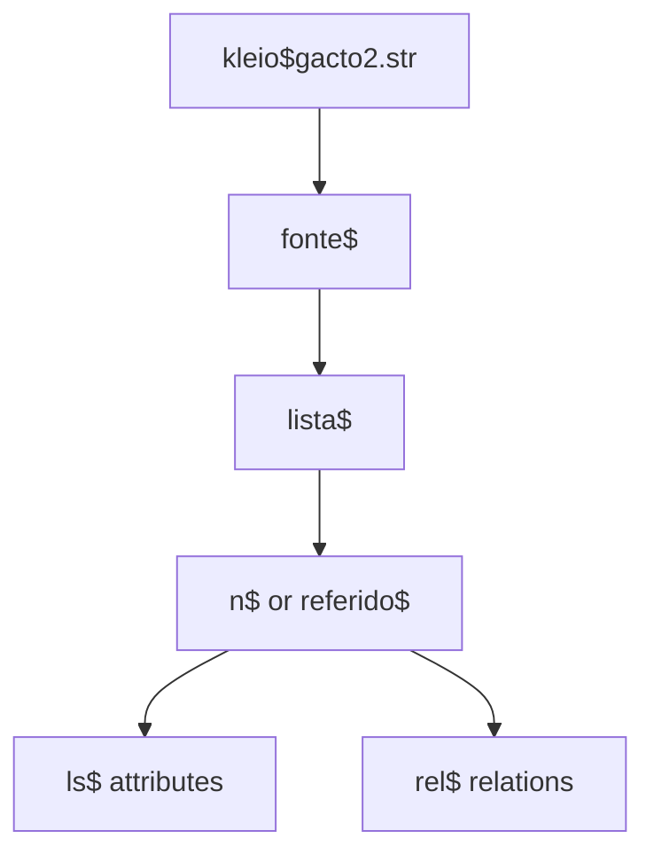

# Transcription System

<cite>
**Referenced Files in This Document**   
- [dehergne-a.cli](file://sources/dehergne-a.cli)
- [dehergne-b.cli](file://sources/dehergne-b.cli)
- [dehergne-c.cli](file://sources/dehergne-c.cli)
- [dehergne-d.cli](file://sources/dehergne-d.cli)
- [dehergne-e.cli](file://sources/dehergne-e.cli)
- [dehergne-f.cli](file://sources/dehergne-f.cli)
- [dehergne-g.cli](file://sources/dehergne-g.cli)
- [dehergne-h.cli](file://sources/dehergne-h.cli)
- [dehergne-i.cli](file://sources/dehergne-i.cli)
- [dehergne-j.cli](file://sources/dehergne-j.cli)
- [dehergne-k.cli](file://sources/dehergne-k.cli)
- [dehergne-l.cli](file://sources/dehergne-l.cli)
- [dehergne-m.cli](file://sources/dehergne-m.cli)
- [dehergne-n.cli](file://sources/dehergne-n.cli)
- [dehergne-o.cli](file://sources/dehergne-o.cli)
- [dehergne-p.cli](file://sources/dehergne-p.cli)
- [dehergne-q.cli](file://sources/dehergne-q.cli)
- [dehergne-r.cli](file://sources/dehergne-r.cli)
- [dehergne-s.cli](file://sources/dehergne-s.cli)
- [dehergne-t.cli](file://sources/dehergne-t.cli)
- [dehergne-u.cli](file://sources/dehergne-u.cli)
- [dehergne-v.cli](file://sources/dehergne-v.cli)
- [dehergne-w.cli](file://sources/dehergne-w.cli)
- [dehergne-x.cli](file://sources/dehergne-x.cli)
- [dehergne-y.cli](file://sources/dehergne-y.cli)
- [dehergne-z.cli](file://sources/dehergne-z.cli)
- [dehergne-0-abrev.cli](file://sources/dehergne-0-abrev.cli)
- [sources.str](file://structures/sources.str)
- [Dehergne_transcription_format.md](file://extras/doc/Dehergne_transcription_format.md)
- [How_to_transcribe.md](file://extras/doc/How_to_transcribe.md)
- [Concepts.md](file://etc/doc/Concepts.md)
</cite>

## Table of Contents
1. [Introduction](#introduction)
2. [Kleio Formal Notation Overview](#kleio-formal-notation-overview)
3. [Biographical Entry Structure](#biographical-entry-structure)
4. [Attribute Notation](#attribute-notation)
5. [Relationship Encoding](#relationship-encoding)
6. [Special Cases and Edge Cases](#special-cases-and-edge-cases)
7. [Schema Definition and Structure File](#schema-definition-and-structure-file)
8. [Abbreviation Handling](#abbreviation-handling)
9. [Transcription Best Practices](#transcription-best-practices)
10. [Troubleshooting and Validation](#troubleshooting-and-validation)
11. [Conclusion](#conclusion)

## Introduction

The dehergne project utilizes the Kleio formal notation system to transcribe biographical entries from Joseph Dehergne's "Répertoire des Jésuites de Chine, de 1542 à 1800." This documentation provides a comprehensive guide to the transcription system, focusing on the syntax and semantics of Kleio `.cli` files. The system structures biographical data using acts, actors, attributes, and relations, with a specific focus on Jesuit missionaries in China. The transcription process involves interpreting Dehergne's original entries, which contain numerous abbreviations and conventions, and encoding this information in a structured Kleio format. This document explains the core components of the notation, including attribute notation for dates, nationality, and status; relationship encoding for mentorship, voyages, and other connections; and special cases such as name variants and uncertain identifications. It also details the role of the `sources.str` structure file in defining the schema for valid attributes and relationships, and how abbreviations are handled via the `dehergne-0-abrev.cli` file. The guide is illustrated with concrete examples from actual `.cli` files, such as `dehergne-a.cli`, and provides best practices for maintaining consistency, handling edge cases, and integrating complementary source data.

**Section sources**
- [Dehergne_transcription_format.md](file://extras/doc/Dehergne_transcription_format.md)
- [How_to_transcribe.md](file://extras/doc/How_to_transcribe.md)

## Kleio Formal Notation Overview

The Kleio formal notation is a structured language used to transcribe historical sources, particularly biographical dictionaries like Dehergne's. It is based on a hierarchical model of source/act/actor-object/attributes-relations. Each transcription file, with the `.cli` extension, represents a source and begins with a header that identifies the structure file (`gacto2.str`) used to define the model. The primary group in a dehergne `.cli` file is `fonte`, which represents the historical source (e.g., "Dehergne, Joseph, Répertoire des Jésuites de Chine"). This `fonte` group contains a single `lista` act, which in turn contains multiple biographical entries for individual Jesuits. Each entry is a `n$` (for a main entry) or `referido$` (for a referenced person) group, which acts as an actor in the biographical act. These actor groups contain `ls$` (life-story) attributes and `rel$` (relation) groups to describe the person's characteristics and connections. The notation uses a simple syntax where groups are declared with a name followed by a dollar sign (e.g., `n$`), and elements (attributes) are declared with a name followed by a slash and their value (e.g., `ls$nacionalidade/Portugal`). Aspects such as comments and original wording are denoted with the `#` and `%` symbols, respectively. This system allows for a rich, structured representation of biographical data that can be processed and analyzed.

**Diagram sources**
- [sources.str](file://structures/sources.str#L30-L42)
- [dehergne-a.cli](file://sources/dehergne-a.cli#L1-L26)

**Section sources**
- [sources.str](file://structures/sources.str#L30-L42)
- [dehergne-a.cli](file://sources/dehergne-a.cli#L1-L26)
- [How_to_transcribe.md](file://extras/doc/How_to_transcribe.md#L65-L74)

## Biographical Entry Structure

A biographical entry in the dehergne transcription system is structured as a hierarchical set of groups and elements. The top-level group for a main entry is `n$`, followed by the person's name in natural order (first name, then surname) and an `id` attribute. The `id` follows the pattern `deh-` followed by the name in lowercase with hyphens replacing spaces (e.g., `deh-antonio-de-abreu`). For homonyms, a numeric suffix is added (e.g., `deh-jose-de-almeida-i`). The entry then contains a series of `ls$` (life-story) elements that capture the person's attributes, such as nationality, status, dates of events, and locations. The entry concludes with an `ls$dehergne` element that contains the full text of the original Dehergne entry as an observation (`obs`), preserving the source material. For example, the entry for António de Abreu begins with `n$António de Abreu/id=deh-antonio-de-abreu` and includes attributes like `ls$nacionalidade/Portugal` and `ls$jesuita-entrada/Goa/15791200`. The structure ensures that all information is systematically organized and linked to a unique identifier.

**Section sources**
- [dehergne-a.cli](file://sources/dehergne-a.cli#L25-L36)
- [Dehergne_transcription_format.md](file://extras/doc/Dehergne_transcription_format.md#L76-L87)

## Attribute Notation

Attributes in the Kleio notation are encoded using the `ls$` prefix followed by a descriptive type and a value. The value often includes a location and a date. Dates are encoded in the `YYYYMMDD` format, with zeros used for unknown months or days (e.g., `15791200` for December 1579). Locations are recorded in the language of the country, often as provided by Dehergne, and can be enhanced with Wikidata identifiers using the `@wikidata:QXXXXX` syntax. Key attribute types include:

- **Personal Information**: `ls$nascimento` (birth), `ls$morte` (death), `ls$nome` (name variants), `ls$nome-chines` (Chinese name).
- **Jesuit Status**: `ls$jesuita-estatuto` (status, e.g., Padre), `ls$jesuita-entrada` (novitiate entry), `ls$jesuita-ordenacao-padre` (priestly ordination), `ls$jesuita-votos` (vows, e.g., 4V for the four vows).
- **Travel and Residence**: `ls$embarque` (embarkation), `ls$estadia` (residence), `ls$chegada` (arrival), `ls$partida` (departure).
- **Professional and Academic**: `ls$profissao` (profession), `ls$cargo` (position), `ls$titulo` (title), `ls$grau-academico` (academic degree).

For example, the attribute `ls$embarque/S. Valentim/16020325` records that a person embarked on the ship "S. Valentim" on March 25, 1602. The system also uses `ls$wicky` and `ls$wicky-viagem` to record the Wicky number and voyage number for embarkations, providing a link to external source data.

**Section sources**
- [dehergne-a.cli](file://sources/dehergne-a.cli#L26-L35)
- [Dehergne_transcription_format.md](file://extras/doc/Dehergne_transcription_format.md#L113-L134)

## Relationship Encoding

Relationships between individuals are encoded using the `rel$` group. A relationship is defined by its type, value, the name of the destination person, and their `id`. The general syntax is `rel$TIPO/VALOR/NOME DESTINO/ID DESTINO`. The `TIPO` (type) can be `parentesco` (kinship), `profissional` (professional), `economica` (economic), or `sociabilidade` (sociability). The `VALOR` specifies the nature of the relationship, such as "Companheiro" (companion) or "irmão" (brother). Relationships are directional, originating from the person in whose entry they are recorded and pointing to the destination person. For example, the relationship `rel$sociabilidade/Companheiro/Adam Algenler/deh-adam-algenler/data=16730315` indicates that Prospero Intorcetta was a companion of Adam Algenler on March 15, 1673. The `data` parameter specifies the date of the relationship. This system allows for the reconstruction of complex social and professional networks among the Jesuits.

**Section sources**
- [dehergne-a.cli](file://sources/dehergne-a.cli#L207-L209)
- [Dehergne_transcription_format.md](file://extras/doc/Dehergne_transcription_format.md#L436-L445)

## Special Cases and Edge Cases

The transcription system handles several special cases to ensure accuracy and completeness. **Name variants** are recorded using multiple `ls$nome` attributes within a single entry. For example, Adam Algenler has variants like `ls$nome/Adam Agenler` and `ls$nome/Adam Aingenier`. **Uncertain identifications** are managed through the `referido$` group, which creates a separate entry for a potentially different person. This is used when Dehergne notes a homonym, such as another António de Abreu who was a Provincial of Portugal. The `mesmo_que` and `xmesmo_que` attributes are used to assert that two entries refer to the same real person. `mesmo_que` is used within the same file, while `xmesmo_que` links to an `id` in a different file. **Dates with uncertainty** are handled by recording the most likely date and adding alternatives in a comment (e.g., `ls$nascimento/Penela, diocese de Coimbra/17280918#ou 17280115`). **Missing information** is indicated with a question mark (e.g., `ls$jesuita-entrada/?/16730000`). These conventions allow the system to represent ambiguity and incomplete data without losing critical context.

**Section sources**
- [dehergne-a.cli](file://sources/dehergne-a.cli#L164-L168)
- [dehergne-a.cli](file://sources/dehergne-a.cli#L37-L43)
- [Dehergne_transcription_format.md](file://extras/doc/Dehergne_transcription_format.md#L135-L140)

## Schema Definition and Structure File

The `sources.str` file is the structure definition file that acts as a schema for the Kleio transcription. It defines the valid groups, elements, and their relationships, ensuring data consistency. The file begins with system definitions for the `kleio` database and the `historical-source` and `historical-act` groups. It then defines base classes for `person`, `object`, `attribute`, and `relation`. The user-defined section includes the `fonte` group, which is the main source group for the dehergne project, and the `lista` group, which contains the biographical entries. The `n` and `referido` groups are defined as types of `person`, and the `ls` and `rel` groups are defined as types of `attribute` and `relation`, respectively. This structure file enforces the data model, ensuring that only valid attributes and relationships can be used in the `.cli` files. It is a critical component that guarantees the integrity and interoperability of the transcribed data.

**Section sources**
- [sources.str](file://structures/sources.str#L30-L42)
- [sources.str](file://structures/sources.str#L816-L820)

## Abbreviation Handling

The `dehergne-0-abrev.cli` file is a dedicated source file that defines the abbreviations and acronyms used throughout the Dehergne dictionary. This file is structured as a `fonte` containing a `lista` of abbreviation definitions. Each definition uses the `ls$` attribute to map an abbreviation to its full meaning. For example, `ls$emb./embarqué` defines "emb." as "embarqué" (embarked). This file serves as a reference for transcribers to correctly interpret the original text. It includes abbreviations for sources (e.g., `AHU` for `Arquivo Historico Ultramarino`), locations (e.g., `Arr.` for `arrived`), and Jesuit-specific terms (e.g., `ct. ou c. temp.` for `coadjuteur temporel`). By centralizing these definitions, the system ensures consistent interpretation and transcription of the source material, reducing ambiguity and errors.

**Section sources**
- [dehergne-0-abrev.cli](file://sources/dehergne-0-abrev.cli#L1-L271)

## Transcription Best Practices

Best practices for transcription in the dehergne project emphasize accuracy, consistency, and transparency. Transcribers should **faithfully represent the source material**, avoiding corrections or interpretations unless absolutely necessary, and noting any such changes in an `obs` comment. **Consistency in formatting** is crucial; dates should always be in `YYYYMMDD` format, and locations should be recorded as they appear in Dehergne, with Wikidata links added where possible. **Handling ambiguity** is key: when Dehergne provides conflicting information (e.g., two possible birth dates), the most likely date should be recorded as the primary value, with alternatives noted in a comment. **Leveraging external sources** like Wicky's list of Jesuit travelers is encouraged to enrich the data (e.g., adding `wicky-viagem` numbers), but these additions must be clearly marked as such. Finally, **using `referido$` entries** for homonyms and uncertain identifications helps maintain a clean and accurate main dataset while preserving all relevant information.

**Section sources**
- [Dehergne_transcription_format.md](file://extras/doc/Dehergne_transcription_format.md#L257-L270)
- [Dehergne_transcription_format.md](file://extras/doc/Dehergne_transcription_format.md#L486-L494)

## Troubleshooting and Validation

Common transcription errors include incorrect `id` generation, misinterpretation of abbreviations, and inconsistent date formatting. To troubleshoot, transcribers should first **verify the `id`** by ensuring it follows the `deh-firstname-lastname` pattern and is unique. **Abbreviations should be cross-referenced** with the `dehergne-0-abrev.cli` file. **Dates must be validated** for the correct `YYYYMMDD` format, with zeros for missing components. The system can be validated by checking that all `referido$` entries with `xmesmo_que` point to valid `id`s in other files, and that all `rel$` destinations have corresponding entries. The presence of the full original text in the `ls$dehergne/obs` field allows for easy verification against the source. Regular review of the `.rpt` (report) and `.err` (error) files generated during the translation process can also help identify and correct issues before final import into the database.

**Section sources**
- [dehergne-a.cli](file://sources/dehergne-a.cli#L36-L37)
- [Dehergne_transcription_format.md](file://extras/doc/Dehergne_transcription_format.md#L475-L485)

## Conclusion

The transcription system for the dehergne project, built on the Kleio formal notation, provides a robust and structured framework for encoding biographical data from Joseph Dehergne's dictionary. By systematically organizing information into acts, actors, attributes, and relations, the system captures the complex lives and networks of Jesuit missionaries in China. The use of a formal schema (`sources.str`), a dedicated abbreviation file (`dehergne-0-abrev.cli`), and clear conventions for handling special cases ensures data consistency and accuracy. This comprehensive guide has detailed the syntax and semantics of the notation, providing best practices and troubleshooting tips to support high-quality transcription. The resulting structured data is invaluable for historical research, enabling sophisticated analysis of the Jesuit mission in China.