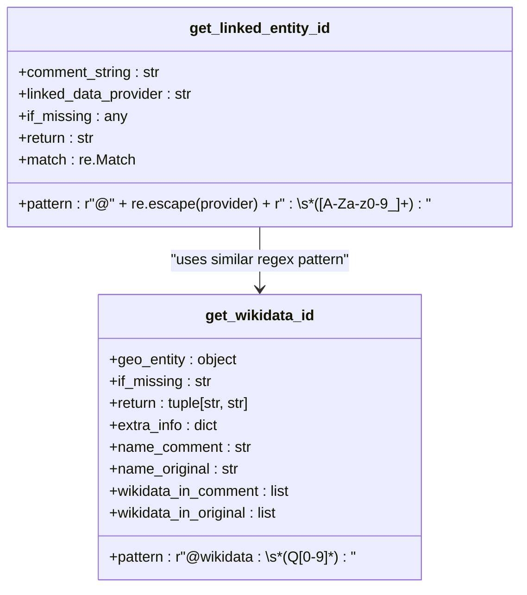
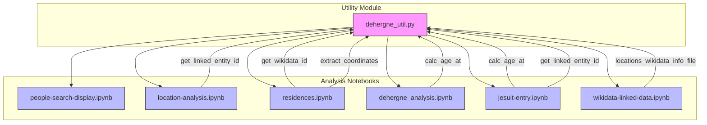

# Utility Functions

<cite>
**Referenced Files in This Document**   
- [dehergne_util.py](file://notebooks/dehergne_util.py)
- [people-search-display.ipynb](file://notebooks/people-search-display.ipynb)
- [location-analysis.ipynb](file://notebooks/location-analysis.ipynb)
- [wikidata-linked-data.ipynb](file://notebooks/wikidata-linked-data.ipynb)
- [residences.ipynb](file://notebooks/residences.ipynb)
- [dehergne_analysis.ipynb](file://notebooks/dehergne_analysis.ipynb)
- [jesuit-entry.ipynb](file://notebooks/jesuit-entry.ipynb)
</cite>

## Table of Contents
1. [Introduction](#introduction)
2. [Core Utility Functions](#core-utility-functions)
3. [Age Calculation Function](#age-calculation-function)
4. [Coordinate Extraction Function](#coordinate-extraction-function)
5. [Linked Data Parsing Functions](#linked-data-parsing-functions)
6. [Usage in Jupyter Notebooks](#usage-in-jupyter-notebooks)
7. [Dependencies and Error Handling](#dependencies-and-error-handling)
8. [Performance Considerations](#performance-considerations)
9. [Troubleshooting Guide](#troubleshooting-guide)
10. [Extension Opportunities](#extension-opportunities)

## Introduction
The dehergne project utilizes a collection of utility functions defined in `dehergne_util.py` to support data processing and analysis across various Jupyter notebooks. These utilities provide essential functionality for calculating ages from historical dates, extracting geographic coordinates from textual descriptions, and parsing linked data from Wikidata. The functions are designed to work with the Timelink data model and are imported and used in multiple analysis notebooks to facilitate consistent data processing. This documentation provides a comprehensive overview of these utility functions, their implementation details, usage patterns, and integration with the broader analysis workflow.

## Core Utility Functions
The `dehergne_util.py` module contains several key utility functions that support data processing across the dehergne project. These functions are designed to handle specific data transformation tasks required for analyzing historical records of Jesuit missionaries. The core utilities include age calculation from birth and death dates, coordinate extraction from location strings, and parsing of linked data identifiers from Wikidata references. These functions are implemented with robust error handling to manage missing or malformed data commonly found in historical records. The utilities are designed to be imported into Jupyter notebooks where they are applied to data frames and other data structures during analysis workflows. The module also defines a file path constant for accessing Wikidata reference information, ensuring consistent data access across different analysis contexts.

**Section sources**
- [dehergne_util.py](file://notebooks/dehergne_util.py#L1-L152)

## Age Calculation Function
The `calc_age_at` function computes the number of years between two dates, typically used to calculate a person's age at a specific point in time. The function accepts two date parameters: `date_birth` and `today`, both of which can be either datetime objects or Timelink-formatted date strings. It first checks for null values and returns None if either date is missing. The function then ensures both dates are converted to datetime objects using the `convert_timelink_date` utility from the timelink.kleio.utilities module. After conversion, it calculates the difference in years by dividing the total number of days between the dates by 365.25 (accounting for leap years) and returns the integer result. This function is particularly useful for calculating ages at significant life events such as entry into the Jesuit order, ordination, or death.

**Diagram sources **
- [dehergne_util.py](file://notebooks/dehergne_util.py#L12-L28)

**Section sources**
- [dehergne_util.py](file://notebooks/dehergne_util.py#L12-L28)
- [dehergne_analysis.ipynb](file://notebooks/dehergne_analysis.ipynb#L6350-L6352)
- [jesuit-entry.ipynb](file://notebooks/jesuit-entry.ipynb#L4351-L4368)

## Coordinate Extraction Function
The `extract_coordinates` function parses various coordinate formats from text comments and returns a tuple containing latitude and longitude values. It supports four primary coordinate formats: explicit coordinate tags with directional indicators (N/S, E/W), labeled decimal degrees, signed decimal degrees with +/- signs, and degrees-minutes-seconds (DMS) format. The function first validates that the input comment contains relevant coordinate keywords before attempting to parse. For each supported format, it uses regular expressions to extract the numerical values and applies appropriate sign conversions based on directional indicators. The DMS format is converted to decimal degrees using an internal helper function. If no valid coordinate pattern is found, the function raises a ValueError with the original comment text to aid in debugging.

**Diagram sources **
- [dehergne_util.py](file://notebooks/dehergne_util.py#L85-L151)

**Section sources**
- [dehergne_util.py](file://notebooks/dehergne_util.py#L85-L151)
- [residences.ipynb](file://notebooks/residences.ipynb#L4378-L4386)

## Linked Data Parsing Functions
The utility module provides two functions for parsing linked data identifiers from text: `get_linked_entity_id` and `get_wikidata_id`. The `get_linked_entity_id` function extracts identifiers from comment strings using the format `@<provider>: <id>`, where provider is the linked data source (e.g., 'wikidata') and id is the entity identifier. It uses regular expressions to match the pattern and returns the extracted ID or a specified default value if no match is found. The `get_wikidata_id` function is specialized for Wikidata links, searching for patterns like `@wikidata: Q1234567` in both the comment and original name fields of a geographic entity. It returns a tuple containing the cleaned comment text (with Wikidata references removed) and the extracted Wikidata ID, handling cases where the ID might appear in either field.

**Diagram sources **
- [dehergne_util.py](file://notebooks/dehergne_util.py#L31-L81)
- [dehergne_util.py](file://notebooks/dehergne_util.py#L63-L81)

**Section sources**
- [dehergne_util.py](file://notebooks/dehergne_util.py#L31-L81)
- [location-analysis.ipynb](file://notebooks/location-analysis.ipynb#L549-L550)
- [jesuit-entry.ipynb](file://notebooks/jesuit-entry.ipynb#L712-L714)
- [residences.ipynb](file://notebooks/residences.ipynb#L102-L134)

## Usage in Jupyter Notebooks
The utility functions are imported and used across multiple Jupyter notebooks in the dehergne project. In `people-search-display.ipynb`, the functions support person data retrieval and display, though specific utility usage is not detailed in the provided context. The `location-analysis.ipynb` notebook extensively uses `get_linked_entity_id` to extract Wikidata identifiers from location comments, applying the function to a pandas DataFrame column to populate a 'wikidata_id' field. The `residences.ipynb` notebook imports both `get_wikidata_id` and `extract_coordinates` functions, using them to process geographic data and extract coordinates from comment fields. The `dehergne_analysis.ipynb` and `jesuit-entry.ipynb` notebooks use `calc_age_at` to calculate ages at various life events, applying the function through pandas DataFrame operations with lambda functions to compute age differences between birth, entry, embarkation, and death dates.

**Diagram sources **
- [dehergne_util.py](file://notebooks/dehergne_util.py)
- [people-search-display.ipynb](file://notebooks/people-search-display.ipynb)
- [location-analysis.ipynb](file://notebooks/location-analysis.ipynb)
- [residences.ipynb](file://notebooks/residences.ipynb)
- [dehergne_analysis.ipynb](file://notebooks/dehergne_analysis.ipynb)
- [jesuit-entry.ipynb](file://notebooks/jesuit-entry.ipynb)
- [wikidata-linked-data.ipynb](file://notebooks/wikidata-linked-data.ipynb)

**Section sources**
- [people-search-display.ipynb](file://notebooks/people-search-display.ipynb)
- [location-analysis.ipynb](file://notebooks/location-analysis.ipynb#L501-L550)
- [residences.ipynb](file://notebooks/residences.ipynb#L92-L14573)
- [dehergne_analysis.ipynb](file://notebooks/dehergne_analysis.ipynb#L704-L6352)
- [jesuit-entry.ipynb](file://notebooks/jesuit-entry.ipynb#L676-L4368)

## Dependencies and Error Handling
The utility functions depend on several standard Python libraries and project-specific modules. The `re` module provides regular expression functionality for pattern matching in text parsing, while `datetime` handles date operations. The functions import `convert_timelink_date` from `timelink.kleio.utilities` to handle date format conversions specific to the Timelink data model. Error handling is implemented through defensive programming practices, including null checks at function entry points and exception handling for parsing operations. The `calc_age_at` function gracefully handles None inputs by returning None, while `extract_coordinates` raises a ValueError with contextual information when parsing fails. The linked data parsing functions include default return values to handle missing data cases, allowing downstream code to manage missing identifiers appropriately. These error handling mechanisms ensure robust operation even with incomplete or malformed historical data.

**Section sources**
- [dehergne_util.py](file://notebooks/dehergne_util.py#L3-L5)
- [dehergne_util.py](file://notebooks/dehergne_util.py#L14-L16)
- [dehergne_util.py](file://notebooks/dehergne_util.py#L96-L97)
- [dehergne_util.py](file://notebooks/dehergne_util.py#L151-L152)
- [requirements.txt](file://notebooks/requirements.txt)

## Performance Considerations
The utility functions are designed for efficient batch processing of historical data, with performance considerations for both memory usage and computational efficiency. When applied to large datasets through pandas DataFrame operations, the functions are typically called using the `apply` method with lambda functions, which can be optimized by vectorized operations where possible. The regular expression patterns used for parsing are compiled implicitly by Python and cached for reuse, reducing overhead in repeated calls. For coordinate extraction, the function processes each format sequentially and returns immediately upon successful parsing, minimizing unnecessary computations. Memory usage is optimized by processing data in-place where possible and avoiding the creation of intermediate data structures. When processing large numbers of records, it is recommended to use pandas' vectorized string operations in conjunction with these utilities to maximize performance.

**Section sources**
- [dehergne_analysis.ipynb](file://notebooks/dehergne_analysis.ipynb#L6350-L6352)
- [jesuit-entry.ipynb](file://notebooks/jesuit-entry.ipynb#L4351-L4368)
- [location-analysis.ipynb](file://notebooks/location-analysis.ipynb#L549-L550)

## Troubleshooting Guide
Common issues when using the utility functions include malformed date strings, invalid coordinate formats, and missing linked data references. For date-related issues, ensure that input dates are either valid datetime objects or properly formatted Timelink date strings, as the `convert_timelink_date` function may fail with unrecognized formats. Coordinate parsing errors typically occur when the comment text contains coordinate information in an unsupported format or with non-standard syntax; in such cases, verify that the text matches one of the four supported formats exactly. When linked data identifiers are not being extracted, check that the comment text follows the `@provider: ID` format with proper spacing and that the provider name matches exactly (case-sensitive). For batch processing issues, verify that pandas DataFrames have the expected column names and that missing values are handled appropriately with fillna() or similar methods before applying the utility functions.

**Section sources**
- [dehergne_util.py](file://notebooks/dehergne_util.py#L96-L103)
- [dehergne_util.py](file://notebooks/dehergne_util.py#L151-L152)
- [dehergne_util.py](file://notebooks/dehergne_util.py#L54-L60)

## Extension Opportunities
The utility library presents several opportunities for extension to enhance its functionality. Additional coordinate formats could be supported, such as UTM (Universal Transverse Mercator) or other geographic referencing systems. The linked data parsing functionality could be generalized to handle multiple providers simultaneously or to validate identifiers against known patterns. Date handling could be extended with timezone awareness and more sophisticated date inference capabilities for partial dates commonly found in historical records. Performance could be improved by implementing caching mechanisms for frequently accessed Wikidata information or by adding batch processing methods that operate directly on DataFrames. Additional utility functions could be added for common text processing tasks, such as normalizing historical name variations or extracting structured information from complex comment fields using natural language processing techniques.

**Section sources**
- [dehergne_util.py](file://notebooks/dehergne_util.py)