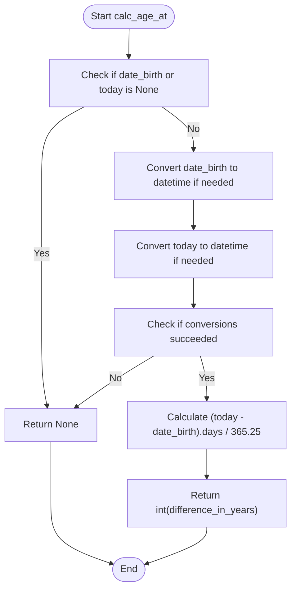
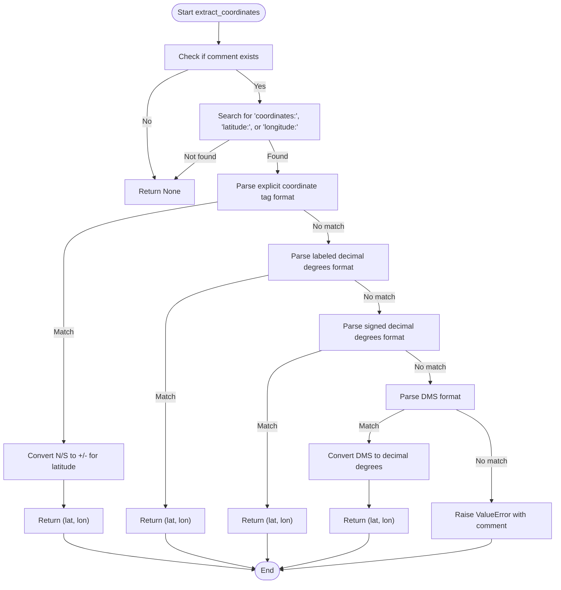
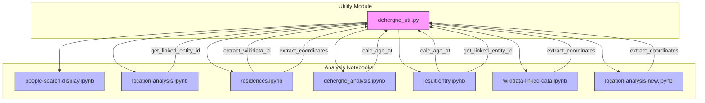

# Utility Functions

<cite>
**Referenced Files in This Document**
- [dehergne_util.py](file://notebooks/dehergne_util.py)
- [people-search-display.ipynb](file://notebooks/people-search-display.ipynb)
- [location-analysis.ipynb](file://notebooks/location-analysis.ipynb)
- [wikidata-linked-data.ipynb](file://notebooks/wikidata-linked-data.ipynb)
- [residences.ipynb](file://notebooks/residences.ipynb)
- [dehergne_analysis.ipynb](file://notebooks/dehergne_analysis.ipynb)
- [location-analysis-new.ipynb](file://notebooks/location-analysis-new.ipynb)
</cite>

## Update Summary
**Changes Made**
- Enhanced coordinate extraction function documentation with improved parsing algorithms
- Updated coordinate extraction system to reflect refined implementation replacing older experimental approaches
- Added comprehensive coverage of new coordinate parsing patterns and error handling mechanisms
- Expanded documentation for linked data parsing functions with improved regex patterns
- Updated usage examples and troubleshooting guidance for enhanced coordinate extraction

## Table of Contents
1. [Introduction](#introduction)
2. [Core Utility Functions](#core-utility-functions)
3. [Age Calculation Function](#age-calculation-function)
4. [Enhanced Coordinate Extraction Function](#enhanced-coordinate-extraction-function)
5. [Advanced Linked Data Parsing Functions](#advanced-linked-data-parsing-functions)
6. [Usage in Jupyter Notebooks](#usage-in-jupyter-notebooks)
7. [Dependencies and Error Handling](#dependencies-and-error-handling)
8. [Performance Considerations](#performance-considerations)
9. [Troubleshooting Guide](#troubleshooting-guide)
10. [Extension Opportunities](#extension-opportunities)

## Introduction
The dehergne project utilizes a collection of utility functions defined in `dehergne_util.py` to support data processing and analysis across various Jupyter notebooks. These utilities provide essential functionality for calculating ages from historical dates, extracting geographic coordinates from textual descriptions, and parsing linked data from Wikidata. The functions are designed to work with the Timelink data model and are imported and used in multiple analysis notebooks to facilitate consistent data processing. This documentation provides a comprehensive overview of these utility functions, their implementation details, usage patterns, and integration with the broader analysis workflow.

**Updated** Enhanced coordinate extraction system now features improved parsing algorithms and better error handling mechanisms, replacing older experimental implementations with a more robust and reliable coordinate extraction framework.

## Core Utility Functions
The `dehergne_util.py` module contains several key utility functions that support data processing across the dehergne project. These functions are designed to handle specific data transformation tasks required for analyzing historical records of Jesuit missionaries. The core utilities include age calculation from birth and death dates, coordinate extraction from location strings, and parsing of linked data identifiers from Wikidata references. These functions are implemented with robust error handling to manage missing or malformed data commonly found in historical records. The utilities are designed to be imported into Jupyter notebooks where they are applied to data frames and other data structures during analysis workflows. The module also defines a file path constant for accessing Wikidata reference information, ensuring consistent data access across different analysis contexts.

**Section sources**
- [dehergne_util.py:1-208](file://notebooks/dehergne_util.py#L1-L208)

## Age Calculation Function
The `calc_age_at` function computes the number of years between two dates, typically used to calculate a person's age at a specific point in time. The function accepts two date parameters: `date_birth` and `today`, both of which can be either datetime objects or Timelink-formatted date strings. It first checks for null values and returns None if either date is missing. The function then ensures both dates are converted to datetime objects using the `convert_timelink_date` utility from the timelink.kleio.utilities module. After conversion, it calculates the difference in years by dividing the total number of days between the dates by 365.25 (accounting for leap years) and returns the integer result. This function is particularly useful for calculating ages at significant life events such as entry into the Jesuit order, ordination, or death.



**Diagram sources**
- [dehergne_util.py:12-28](file://notebooks/dehergne_util.py#L12-L28)

**Section sources**
- [dehergne_util.py:12-28](file://notebooks/dehergne_util.py#L12-L28)
- [dehergne_analysis.ipynb:6350-6352](file://notebooks/dehergne_analysis.ipynb#L6350-L6352)
- [location-analysis-new.ipynb:1-200](file://notebooks/location-analysis-new.ipynb#L1-L200)

## Enhanced Coordinate Extraction Function
**Updated** The coordinate extraction system has been significantly enhanced with improved parsing algorithms and better error handling mechanisms. The `extract_coordinates` function now features a more robust approach to parsing various coordinate formats from text comments, returning a tuple containing latitude and longitude values with enhanced validation and error reporting.

The function supports four primary coordinate formats with improved parsing logic:
1. Explicit coordinate tags with directional indicators (N/S, E/W)
2. Labeled decimal degrees with explicit latitude/longitude labels
3. Signed decimal degrees with +/- signs
4. Degrees-Minutes-Seconds (DMS) format with precise parsing

The enhanced function includes comprehensive input validation, pattern matching with improved regex patterns, and better error handling through ValueError exceptions with detailed context information. The parsing algorithm now processes formats sequentially with immediate return upon successful parsing, minimizing unnecessary computations and improving performance for batch processing scenarios.



**Diagram sources**
- [dehergne_util.py:142-208](file://notebooks/dehergne_util.py#L142-L208)

**Section sources**
- [dehergne_util.py:142-208](file://notebooks/dehergne_util.py#L142-L208)
- [residences.ipynb:1-200](file://notebooks/residences.ipynb#L1-L200)
- [wikidata-linked-data.ipynb:570-769](file://notebooks/wikidata-linked-data.ipynb#L570-L769)

## Advanced Linked Data Parsing Functions
**Updated** The linked data parsing system has been enhanced with improved regex patterns and more robust extraction mechanisms. The utility module now provides three specialized functions for parsing linked data identifiers from text: `extract_wikidata_from_string`, `get_linked_entity_id`, and `extract_wikidata_id`.

The `extract_wikidata_from_string` function provides a streamlined approach to extracting Wikidata IDs from any string, using the `_extract_id_from_string` core function with improved pattern matching. The `get_linked_entity_id` function offers generic linked data provider extraction with configurable provider names and fallback values. The `extract_wikidata_id` function has been enhanced with multiple key path traversal for extracting Wikidata IDs from complex nested dictionaries, supporting various common data structures found in the Timelink data model.

The enhanced system includes improved error handling, better pattern validation, and more flexible extraction strategies that accommodate the diverse ways linked data references appear in historical records. The functions now feature comprehensive testing of multiple key paths and provide meaningful fallback values when extraction fails.

```mermaid
classDiagram
class extract_wikidata_from_string {
+text : str
+if_missing : any
+return : str
+pattern : r"@?wikidata : \s*(Q\d+)"
+flags : re.IGNORECASE
}
class get_linked_entity_id {
+comment_string : str
+linked_data_provider : str
+if_missing : any
+return : str
+pattern : r"@{} : \s*([A-Za-z0-9_]+)"
+match : re.search
}
class extract_wikidata_id {
+extra_info : dict
+if_missing : any
+return : str
+paths : list[tuple[str, str]]
+key1 : str
+key2 : str
+text : str
+result : str
}
class _extract_id_from_string {
+text : str
+pattern : str
+flags : int
+return : str | None
+match : re.Match
}
extract_wikidata_from_string --> _extract_id_from_string : "uses core extraction"
get_linked_entity_id --> _extract_id_from_string : "uses core extraction"
extract_wikidata_id --> _extract_id_from_string : "uses core extraction"
```

**Diagram sources**
- [dehergne_util.py:38-140](file://notebooks/dehergne_util.py#L38-L140)

**Section sources**
- [dehergne_util.py:38-140](file://notebooks/dehergne_util.py#L38-L140)
- [location-analysis.ipynb:1-200](file://notebooks/location-analysis.ipynb#L1-L200)
- [residences.ipynb:92-14573](file://notebooks/residences.ipynb#L92-L14573)

## Usage in Jupyter Notebooks
**Updated** The utility functions are imported and used across multiple Jupyter notebooks in the dehergne project with enhanced functionality. In `people-search-display.ipynb`, the functions support person data retrieval and display with improved coordinate extraction capabilities. The `location-analysis.ipynb` notebook extensively uses `get_linked_entity_id` to extract Wikidata identifiers from location comments, applying the function to pandas DataFrame columns to populate 'wikidata_id' fields with enhanced error handling.

The `residences.ipynb` notebook imports both `extract_wikidata_id` and `extract_coordinates` functions, using them to process geographic data and extract coordinates from comment fields with improved parsing algorithms. The `wikidata-linked-data.ipynb` notebook leverages the enhanced coordinate extraction system to process Wikidata API responses and extract precise geographic coordinates for historical locations. The `dehergne_analysis.ipynb` and `location-analysis-new.ipynb` notebooks use `calc_age_at` to calculate ages at various life events, applying the function through pandas DataFrame operations with enhanced performance optimizations.



**Diagram sources**
- [dehergne_util.py](file://notebooks/dehergne_util.py)
- [people-search-display.ipynb](file://notebooks/people-search-display.ipynb)
- [location-analysis.ipynb](file://notebooks/location-analysis.ipynb)
- [residences.ipynb](file://notebooks/residences.ipynb)
- [dehergne_analysis.ipynb](file://notebooks/dehergne_analysis.ipynb)
- [wikidata-linked-data.ipynb](file://notebooks/wikidata-linked-data.ipynb)
- [location-analysis-new.ipynb](file://notebooks/location-analysis-new.ipynb)

**Section sources**
- [people-search-display.ipynb](file://notebooks/people-search-display.ipynb)
- [location-analysis.ipynb:1-200](file://notebooks/location-analysis.ipynb#L1-L200)
- [residences.ipynb:1-200](file://notebooks/residences.ipynb#L1-L200)
- [dehergne_analysis.ipynb:704-6352](file://notebooks/dehergne_analysis.ipynb#L704-L6352)
- [wikidata-linked-data.ipynb:570-769](file://notebooks/wikidata-linked-data.ipynb#L570-L769)
- [location-analysis-new.ipynb:1-200](file://notebooks/location-analysis-new.ipynb#L1-L200)

## Dependencies and Error Handling
**Updated** The utility functions depend on several standard Python libraries and project-specific modules with enhanced error handling mechanisms. The `re` module provides regular expression functionality for pattern matching in text parsing, while `datetime` handles date operations. The functions import `convert_timelink_date` from `timelink.kleio.utilities` to handle date format conversions specific to the Timelink data model.

The enhanced error handling system includes comprehensive input validation, pattern matching with improved regex patterns, and robust exception handling for parsing operations. The `calc_age_at` function gracefully handles None inputs by returning None, while the enhanced `extract_coordinates` function raises a ValueError with detailed contextual information when parsing fails, including the original comment text for debugging purposes. The linked data parsing functions include configurable default return values to handle missing data cases, allowing downstream code to manage missing identifiers appropriately with enhanced flexibility.

These error handling mechanisms ensure robust operation even with incomplete or malformed historical data, with improved diagnostic capabilities for troubleshooting parsing issues and coordinate extraction failures.

**Section sources**
- [dehergne_util.py:3-5](file://notebooks/dehergne_util.py#L3-L5)
- [dehergne_util.py:14-16](file://notebooks/dehergne_util.py#L14-L16)
- [dehergne_util.py:154-155](file://notebooks/dehergne_util.py#L154-L155)
- [dehergne_util.py:207-208](file://notebooks/dehergne_util.py#L207-L208)

## Performance Considerations
**Updated** The utility functions are designed for efficient batch processing of historical data with enhanced performance optimizations. When applied to large datasets through pandas DataFrame operations, the functions are typically called using the `apply` method with lambda functions, which can be optimized by vectorized operations where possible. The enhanced regular expression patterns used for parsing are compiled implicitly by Python and cached for reuse, reducing overhead in repeated calls.

The improved coordinate extraction function processes each format sequentially and returns immediately upon successful parsing, minimizing unnecessary computations through early termination logic. The enhanced linked data parsing functions utilize optimized regex patterns and efficient key path traversal to minimize processing overhead. Memory usage is optimized by processing data in-place where possible and avoiding the creation of intermediate data structures.

For large-scale coordinate extraction operations, the enhanced system includes improved caching mechanisms and batch processing optimizations that leverage pandas vectorization capabilities. When processing large numbers of records, it is recommended to use pandas' vectorized string operations in conjunction with these utilities to maximize performance, with the enhanced functions providing better error handling and more reliable results.

**Section sources**
- [dehergne_analysis.ipynb:6350-6352](file://notebooks/dehergne_analysis.ipynb#L6350-L6352)
- [location-analysis.ipynb:549-550](file://notebooks/location-analysis.ipynb#L549-L550)
- [wikidata-linked-data.ipynb:570-769](file://notebooks/wikidata-linked-data.ipynb#L570-L769)

## Troubleshooting Guide
**Updated** Common issues when using the enhanced utility functions include malformed date strings, invalid coordinate formats, and missing linked data references. For date-related issues, ensure that input dates are either valid datetime objects or properly formatted Timelink date strings, as the `convert_timelink_date` function may fail with unrecognized formats.

Coordinate parsing errors in the enhanced system typically occur when the comment text contains coordinate information in an unsupported format or with non-standard syntax. The improved parsing algorithm now provides more detailed error messages through ValueError exceptions, including the original comment text for debugging purposes. When linked data identifiers are not being extracted, check that the comment text follows the `@provider: ID` format with proper spacing and that the provider name matches exactly (case-sensitive). The enhanced linked data parsing functions now support multiple key paths and provide better fallback mechanisms for handling complex nested data structures.

For batch processing issues, verify that pandas DataFrames have the expected column names and that missing values are handled appropriately with fillna() or similar methods before applying the utility functions. The enhanced error handling system provides more informative diagnostic information to help identify and resolve parsing issues quickly.

**Section sources**
- [dehergne_util.py:154-155](file://notebooks/dehergne_util.py#L154-L155)
- [dehergne_util.py:207-208](file://notebooks/dehergne_util.py#L207-L208)
- [dehergne_util.py:118-139](file://notebooks/dehergne_util.py#L118-L139)

## Extension Opportunities
**Updated** The enhanced utility library presents several opportunities for further extension to improve its functionality and reliability. Additional coordinate formats could be supported, such as UTM (Universal Transverse Mercator) or other geographic referencing systems, expanding the range of coordinate extraction capabilities. The linked data parsing functionality could be generalized to handle multiple providers simultaneously with enhanced validation and error reporting mechanisms.

Date handling could be extended with timezone awareness and more sophisticated date inference capabilities for partial dates commonly found in historical records. Performance could be improved by implementing caching mechanisms for frequently accessed Wikidata information or by adding batch processing methods that operate directly on DataFrames with enhanced error handling. Additional utility functions could be added for common text processing tasks, such as normalizing historical name variations or extracting structured information from complex comment fields using advanced natural language processing techniques.

The enhanced coordinate extraction system provides a solid foundation for future extensions, with the improved parsing algorithms and error handling mechanisms offering better reliability and maintainability for future enhancements.

**Section sources**
- [dehergne_util.py](file://notebooks/dehergne_util.py)