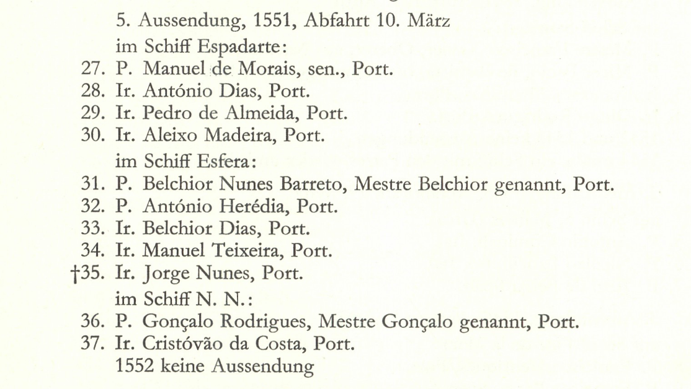

### Dehergne transcription format ###

## Versão em Português ###

### Ficheiros ###

Produz-se um ficheiro por cada letra, para evitar ficheiros demasiados grandes. 

Os ficheiros têm os nomes dehergne-a.cli, dehergne-b.cli, dehergne-c.cli, etc...

Cada ficheiro inclui uma fonte com `id` dehergne-A, dehergne-B, dehergne-C, etc...

Cada "fonte" inclui um único "acto", do tipo `lista$` com `id` dehergne-notices-a,  dehergne-notices-b, dehergne-notices-c, etc... e sem data.

O cabeçalho de cada ficheiro é assim:

    kleio$gacto2.str
        fonte$dehergne-A/1973/Dicionário Biográfico
            /Online archive.org:details:bhsi37
            /obs=Dehergne, Joseph, Répertoire des
             Jésuites de Chine, 
             de 1542 à 1800, 1973

          lista$dehergne-notices-a/0/0/0

Seguem-se as fichas biográficas.

Em cada ficheiro o cabeçalho apenas varia na letra do id do grupo `fonte$` e do grupo `lista$`,

### Fichas biográficas ###

A transcrição das entradas biográficas envolve duas operações: a interpretação da entrada, que contém muitas abreviaturas e convenções gráficas e, num segundo momento lógico, a transcrição na notação Kleio da informação.

Exemplo de entrada:

    Abreu, Antonio de (port.) P.                    1
    E. Goa, déc. 1579 (DI XII, 612 n. 54).
    Emb. non prêtre, le 25 mars 1602, sur le S. Valentim ( W 486).
    V. « Negapatami » (Négapatam), 6 janv. 1604, pr. (Lus. 3, 82). 
    Il signe Antonius Dabreu.
    M. dans la rivière de « Chincheo », = Changchow (Tchang-tcheou),
    ou peut-être Chuanchow (Ts'iuen-tcheou), au Fou-kien, en 1611, 
    en route vers le Japon (Schûtte 343; HS 43, 57 dit 1612).
    Pf. 125. (Distinct du Provincial de Portugal de ce nom, 
    1627-1629 N. Lisbonne 1561, E. à Coïmbre 1576 
    (Lus. 43 II, 509v). 
    Un P. de ce nom meurt dans un naufrage le 31 oct. 1611, mais à Coulam, 
    sur la côte malabare (Goa 24 II). HS 43a, 2v parle, semble-t-il, de ce 
    dernier qu'il reporte à l'an 1612.

Transcrição da informação biográfica

    n$António de Abreu/id=deh-antonio-de-abreu
        ls$nacionalidade/Portugal
        ls$jesuita-estatuto/Padre
        ls$jesuita-entrada/Goa/15791200
        ls$embarcado/S. Valentim/16020325
        ls$jesuita-votos/4V/16040106
        ls$jesuita-votos-local/Negaptattinam%Negapatami (Négapatam)/16040106
        ls$morte/Changchow#no rio, a caminho do Japão/16110000
        ls$dehergne/1

O desdobramento das abreviaturas vem detalhado na p. XIII da obra e é recapitulado de forma breve na página imediatamente anterior ao início da entradas (p.1). 

As secções seguintes detalham a transcrição dos principais atributos das entradas da obra, nem todos presentes no exemplo acima. 

#### Nome, nacionalidade, posição na hierarquia jesuíta, número de ordem e identificador na base de dados ####

    Abreu, Antonio de (port.) P.                    1   

Cada entrada é introduzida pelo grupo `n$` seguido do nome por ordem natural (primeiro nome, partículas, apelidos) e um `id` que irá identificar univocamente esta referência na base de dados. 

O `id` usa o prefixo "deh-" seguido do nome em minúsculas com hífenes no lugar dos espaços (os identificadores de pessoas não podem ter espaços). O `id` tem de ser único para cada pessoa, de modo que em caso de homonomia tem se produzir ids diferentes, adicionando dígitos (por exemplo, se fosse necessário: `deh-antonio-de-abreu-2`.

    n$António de Abreu/id=deh-antonio-de-abreu

Seguem-se a nacionalidade, grau dentro da hierarquia jesuíta e número de ordem no repertório.

    n$António de Abreu/id=deh-antonio-de-abreu
        ls$nacionalidade/Portugal
        ls$jesuita-estatuto/Padre
        ls$dehergne/1

### Variantes ao nome ###

Por vezes a obra indica nomes alternativos pelos quais a pessoa é conhecida e em alguns casos o nome chinês (este em forma romanizada).

Nesse caso criam-se atributos adicionais com o grupo `ls$` 

    n$Gil de Abreu/id=deh-gil-de-abreu
        ls$nome/Gil d'Abreu
        ls$nome/Gil Dabreu
            

    n$Lodovico António Adorno id=deh-ludovico-antonio-adorno
        ls$nome/Adurnus
        ls$nome-chines/Lou Lei-Sseu
        ls$nome-chines/Sié

### N. M. Nascimento e Morte ###

#### N.,  M. ####
Nascimento e Morte. Incluem normalmente a data e o lugar. Nem todas as entradas têm.

São registadas sob a forma 

    ls$nascimento/LOCAL/Data
    ls$morte/LOCAL/DATA

Em que LOCAL deve ser registado na medida do possível na língua do país. Como o autor trabalha com fontes em Latim nem sempre tem capacidade de registar a localidade corretamente. Por exemplo, regista Scalabis (nota em João de Abreu), em vez de Santarém. Em geral, salvo os casos evidentes, registar como na obra.

A data atualmente tem de ser registada na forma AAAAMMDD com zeros quando não existe informação de mês ou dia.

    Adorno, Lodovico Antonio Luca (ital.) P.     5 
    ...
    N. 28 août 1655, Gênes -E. 2 déc. 1680, Gênes (JS 26, 45v).
    ...
    M. 20 déc. 1699, Goa (JS 25, 229 et 166, 419). HS 51, 229 ...

    n$Lodovico António Adorno/id=deh-ludovico-antonio-adorno
        ...
        ls$nascimento/Génova/16550828
        ...
        ls$morte/Goa/16991220

Se acontecer que o autor fornece mais que uma data (o que acontece quando há desacordo entre as fontes que usou), regista-se a primeira data ou aquele que a entrada indica como mais provável, e outras em comentário:

         n$José Bernardo de Almeida/id=deh-jose-bernardo-de-almeida
            ...
            ls$nascimento/Penela, diocese de Coimbra/17280918#ou 17280115

### E. P. V. Atributos referentes ao percurso na Companhia de Jesus  ###

Distinguimos os atributos específicos do percurso na Companhia de Jesus, dos atributos comuns a outras pessoas fora da ordem, prefixando os primeiros com "jesuita-". Isso aplica-se à entrada para o noviciado, aos diferentes votos feitos ao longo da progressão na ordem, e aos cargos específicos exercidos dentro da ordem.

#### E. ####
 Data, local (cidade) e por vezes província jesuíta onde o missionário fez o noviciado.

    Abreu, Antonio de (port.) P.                    1
    E. Goa, déc. 1579 (DI XII, 612 n. 54).

    n$António de Abreu/id=deh-antonio-de-abreu
        ...
        ls$jesuita-entrada/Goa/15791200

Neste exemplo o dia é desconhecido.

Há casos de dupla entrada (provavelemente por nao completarem o noviciado a primeira vez). Nesse caso regista-se as sucessivas entradas:

         n$Pedro de Alcáçova/id=deh-pedro-de-alcacova
            ...
            ls$jesuita-entrada/Coimbra/15420000%sorti#saiu
            ls$jesuita-entrada/Goa/15480502

#### P. ####

Data e local da obtenção de ordens sacras.

Notar que este P. aparece no corpo de algumas entradas quando o autor tem informação adicional sobre a ordenação sacerdotal. É por isso diferente do P. que aparece a seguir ao nome, introduzindo informação complementar. Exemplo:

    Abreu, Joâo de (port.) P. <-----             4
    N. 1635, « Elvensis », Elvas -E. 1648 (Lus. 45, 61v).
    Emb. 30 mars 1656 sur le Bom Jésus do Carmo (W 1014); 
    en 1660 était à Goa, mais sujet de la vice-province de Chine (JS 134, 344). 
    P. avant le 30 mars 1656.  <-----
    M. 24 juin 1663, Macao (JS 134, 346 et 352; AHU ms 1659, 108).
    ....

    n$João de Abreu/id=deh-joao-de-abreu
        ls$nacionalidade/Portugal
        ls$nascimento/Elvas%elvensis/16350000
        ...
        ls$jesuita-ordenacao-padre/?/16900408/obs=antes de

O P. no corpo da entrada é registado como `ls$jesuita-ordenacao-padre/LOCAL/DATA` 

* Como dito acima o P. associado ao nome no cabeçalho da entrada fica registado como `ls$jesuita-estatuto/padre`. É sempre registado. Tal como na obra, uma entrada com dois P. fica com dois `ls$` um para o estatuto outro para a informação de ordenação.

Se o local é desconhecido coloca-se "?". A data na forma AAAMMDD com zeros nos elementos desconhecidos.

#### V. ####

Votos jesuítas. Segundo o autor, na p. XV existem as seguintes variantes possíveis de valores a seguir a "V.":

* pr.  -> Professo dos quatro votos
* pr. 3 V -> Professo dos três votos sem o quarto voto de obediência ao Papa para o envio em missão.
* c.spir. -> Coadjutores espirituais
* c.temp. -> Coadjutores temporais (que não são padres mas fazem os mesmos 3 votos dos padres).

Usamos a forma `ls$jesuita-votos/VOTO/DATA` para registar em que VOTO com os seguintes desdobramentos para as abreviaturas:

    ls$jesuita-votos/4V (para pr.)
    ls$jesuita-votos/3V (para pr. 3 V)
    ls$jesuita-votos/coadjutor espiritual
    ls$jesuita-votos/coadjutor temporal

Quando a entrada contém também o local dos votos acrescenta-se o grupo `ls$jesuita-votos-local/LOCAL/DATA` 

### Emb. A. arr. Viagens, partidas, chegadas e estadias ###

#### Emb. ####

Embarque para a China, nome do navio e data de embarque. O autor recolhe esta informação da obra de Josef Wicky, _Liste der Jesuiten-Indienfahrer 1541-1758,_ que lista todas as armadas que partiram para a Índia com missionários Jesuítas.
Wicky atribui um número sequencial a cada armada e outro número, sequencial, a cada missionário. 

Dehergne regista apenas o número atribuído ao missionário, o que impede de reconstruir quem viajou com quem.

No exemplo acima __Manuel Teixeira (34)__ viajou na mesma armada e no mesmo barco com __Belchior Nunes Barreto (31)__.
Na mesma armada, mas em barco diferente, viajou __Cristovão
da Costa (37)__.

Para não perder essa informação a informação
fornecida por Dehergne foi completada com a consulta
da obra de Wicky, para acrescentar o número da 
armada.

Assim, a informação original de Dehergne é registada
 na forma `ls$embarque/NAVIO/DATA` seguido de `ls$wicky/NUMERO`.

 A informação complementar do número da armada, é
 adicionada na forma `ls$wicky-viagem/ARMADA/DATA`

 Exemplo:

         n$Belchior Nunes Barreto/id=deh-belchior-nunes-barreto
            ...
            ls$embarque/Esfera/15510310
            ls$wicky/31/15510310
            ls$wicky-viagem/5/15510310

        n$Cristóvão da Costa/id=deh-cristovao-da-costa
            ls$embarque/?/15510310
            ls$wicky/37/15510310
            ls$wicky-viagem/5/15510310

        n$Manuel Teixeira/id=deh-manuel-teixeira
            ...
            ls$embarque/Esfera/15510310#não padre
            ls$wicky/34/15510310
            ls$wicky-viagem/5/15510310

__Nota__:

>11/05/2021 Devo corrigir Dehergne quando ele se engana na informação? Não tem acontecido muito, principalmente tenho acrescentado, além do número da viagem, o nome dos navios, que Dehergne, por alguma razão, nem sempre colocou nalguns casos em que Wicky os menciona. Não me pareceu que isso fosse muito problemático porque são casos em que até se deduziria dos dados dados por Dehergne (por exemplo, com Prospero Intorcetta, Dehergne não colocou o número da sua viagem de regresso da Europa, mas consegue-se deduzir que era aquela, mesmo sem ver Wicky, porque ele aparece como companheiro de uma série de outros jesuítas que embarcaram ao mesmo tempo). Mas há um ou outro caso em que uma data não bate certo ou o nome do navio (no caso uma Santa Maria que segundo Wicky é Santa Marta)...

Resposta:
>É importante ser muito claro no que toca à origem de informação, porque fazemos isto dentro da ideologia da "Ciência Aberta”.

>Quem mais tarde veja os dados tem de confiar que está a ver uma transcrição do Dehergne. 

>Nos casos em que completámos ou corrigimos, isso tem que ficar claro num comentário ou no campos de observações. 

>De outro modo quem mais tarde comparasse a transcrição com o original impresso não entenderia de onde veio certa informação, o que tiraria confiança no nosso trabalho.

>Assim pode fazer por exemplo 

	ls$embarque/Santa Marta% Dehergne tem "Santa Maria”, corrigido a partir de Wicky

#### A. ou arr. ####

Segundo o autor estas abreviaturas indicariam a chegada à China. 
Mas na verdade a utilização é inconstante e muitas vezes 
o que fica registado é uma sequência de locais onde o missionário
esteve depois da chegada ao Oriente.  Outras vezes ainda são registadas datas de "partida" de viagens terrestres

Usamos a forma `ls$estadia/LOCAL/DATA`, para registar as referências a permanências em locais.

Adicionalmente, quando existirem informações de "chegadas" ou "partidas" (diferentes do "embarque" em Lisboa para a Índia) usar `ls$partida/DESTINO/ADATA`  e `ls$chegada/LOCAL/DATA`. 

É possível que a redação da entrada pelo autor resulte do tipo de informação a que teve acesso. Por vezes tem apenas notícia que alguém estava em determinado local numa determinada data. Nesses casos usamos `ls$estadia`. 

Outras vezes a informação original deve explicitar que "chegou" a determinado local, ou "partiu" para determinado local. Neses casos usam `ls$chegada`  e `ls$partida` .

Exemplos: 

    Adorno, Lodovico Antonio Luca (ital.) P.               5 
        .....
        -------
        Emb. 8 avril 1690 (W 1283) pour la Chine (JS 134, 372); 
        Kanchow, Kan-tcheou (celui du Kiangsi); au bout de quelques 
        mois, rentre malade à Macao, puis à Goa. Borg. Lat. 523, 59 
        le dit arr. 1694 et retourné à Goa en 1695; 
        il fit pourtant ses voeux à Kanchow,
        en 1697, v. ci-après.
        -------
    
    n$Lodovico António Adorno/id=deh-ludovico-antonio-adorno
        ...
        ls$embarque/... para a China/16900408
        ls$wicky/1283/16900408
        ls$estadia/Kanchow%Kan-tcheou (o de Kiangsi)
        ls$chegada/Macau#doente/16940000
        ls$chegada/Goa/16950000

Nem sempre é fácil reconstruir as datas do texto sintético da entrada. Exemplo mais complexo em Alessandro Valignano (861)

#### Viagens sucessivas entre Europa e o Oriente ####

Pergunta: "Quando um jesuíta regressa à Europa por um tempo e volta a embarcar, como acontece com Miguel do Amaral (33), repetem-se os campos de embarque e Wicky (quando mencionado) sem mais nada? Ou deve haver alguma especificação, uma vez que se trata de um segundo embarque?"

Resposta: "Repetem-se os registos. Nesses casos deve haver uma entrada do tipo "estadia" ou entradas de "partida" e "chegada" relativas à ida à Europa que ajudarão a entender a sequência. Assim não é necessário uma observação."

### Cargos e tarefas ligados à ordem ###

Os diferentes cargos exercidos dentro da Companhia de Jesus são registados na forma `ls$jesuita-cargo/CARGO/DATA`. Os cargos são funções institucionais nos quais diferentes pessoas se sucedem ao longo do tempo (provicial, superior, mestre dos noviços, visitador). 

Adicionalmente aos cargos pode acontecer que seja referida a execução de uma "tarefa" ou missão específica, que não corresponde a um cargo institucional permanente. Exemplos: construir uma igreja, organizar uma comunidade, escrever um catecismo. Estes casos registam-se como `ls$jesuita-tarefa/DESCRICAO/DATA` 

### Cargos não ligados à ordem ###

Por vezes os missionários exercem cargos exteriores à ordem, quer na hierarquia eclesiástica geral, quer na burocracia chinesa. Nesse caso usa-se a forma usual de `ls$cargo/CARGO/DATA`. Do mesmo modo podem-se registar "tarefas" não internas à Companhia, como negociar tratados, representar o Rei ou o Imperador, etc... No mesmo espírito registamos `ls$tarefa/DESCRIÇÃO/DATA.

### Outros atributos genéricos ###

Os principais atributos genéricos, utilizados nas mais variadas fontes, são:

	ls$profissao/PROFISSAO	
	ls$cargo/CARGO
	ls$titulo/TITULO
	ls$residencia/LOCAL
	ls$ec/ESTADO CIVIL (s,c,v)
	ls$idade/NUMERO/DATA

A profissão é a área de atividade da pessoa, no sentido atual. Pode exercer ou não, não há normalmente limite para o número de pessoas que exercem a mesma profissão.
	 
Um cargo é um lugar dentro de uma determinada estrutura funcional, que normalmente é exercido em sucessão por diferentes pessoas (ver acima).

Um título é uma expressão que denota um certo estatuto socio-profissional, mas que não determina necessariamente a profissão, podendo depender de formação académica ou estatuto social (nobreza, por exemplo).

Assim, a informação "O Doutor João da Silva, médico cardiologista e director do hospital de Goa" contém:

	ls$titulo/Doutor
	ls$profissao/Médico Cardiologista
	ls$cargo/Director do Hospital de Goa.

Quanto à residência é normalmente usada no sentido de "residência habitual", o que no caso destes missionários raramente se aplica, porque estão sempre a mudar de local, com breves estadias.

Em todos estes atributos devem-se indicar as datas, se disponíveis, na forma genérica, com zero na data quando é desconhecida. 

	ls$ATRIBUTO/VALOR/DATA

Como estamos a tratar com uma fonte secundária, datada de 1973, quando um atributo não tem uma data explicitamente registada na forma acima, assume a data da "fonte", ou seja 1973, o que não é desejável na maior parte dos casos. 

#### Grau académico ###

Nesta fonte o autor está a registar com aparente cuidado a formação académica, procurando frisar que os missionários tinham, alguns, atingido um nível académico elevado. Ver uma nota sobre isso na p. XVI. relativa aos Mestres em Artes.

Assim usamos `grau-academico` como atributo

    ls$grau-academico/Mestre em Artes

Noutras fontes o grau é usado de forma genérica (sem especificar curso, ou áres) como forma de distinção social, um pouco como hoje, em Portugal, se usa "dr." ou "drª". Por exemplo: "O licenciado João da Silva". Nesse caso usamos `ls$titulo/licenciado`. 

### Forma de registo de locais ###

Vários atributos implicam o registo de locais. Convém ter alguma forma de uniformização na forma de registo, sobretudo quando o local é referido com algum contexto regional ou nacional.

Assim usamos vírgulas para separar diferentes níveis na indicação de um lugar, à semelhança do que se usa modernamente nos endereços postais, ordenando do particular para o geral. Por exemplo:

    ls$residencia/soure, diocese de Coimbra, Portugal

Nem sempre faz sentido colocar todos os níveis, isso depende do contexto específico da fonte e do projeto. Por exemplo, num estudo sobre a paróquia de Soure não é necessário especificar a cada entrada a dicoese e o país, e, em princípio, a própria fonte não o faria.

Noutros casos a fonte pode incluir uma informação mais específica de localização, usando uma expressão de proximidade ou referindo um edifício específico. Nesse caso adicionamos a especificiação entre parentesis. Por exemplo:

    ls$residencia/soure (junto aos moinhos da comenda)

Nem sempre será óbvia a forma mais adequada. O objetivo deve ser conseguir que listas alfabéticas de lugares mantenham próximas variações do mesmo lugar e não separem entradas de forma a ser difícil visualizar todas as variantes de um mesmo lugar.

### Pessoas referidas ###

Algumas entradas incluem informação sobre pessoas adicionais, normalmente homónimos da pessoa tratada. Essa informação é relevante quando, numa fase posterior, se cruzar estes dados com outros oriundos de outras fontes.

A forma de registar essas pessoas é igual ao da pessoa principal, simplesmente o nome é introduzido pelo grupo `referido$` em vez de `n$` e na atribuição de `id`. Um exemplo explica como proceder:

    Abreu, Antonio de (port.) P.            1
    E. Goa, déc. 1579 (DI XII, 612 n. 54).
    ...
    Pf. 125. (Distinct du Provincial de Portugal de ce nom, 1627-1629 
    N. Lisbonne 1561, E. à Coïmbre 1576 (Lus. 43 II, 509v). 
    Un P. de ce nom meurt dans un naufrage le 31 oct. 1611, 
    mais à Coulam, sur la côte malabare (Goa 24 II). 
    HS 43a, 2v parle, semble-t-il, de ce dernier qu'il reporte à l'an 1612.

As últimas linhas incluem referência a duas pessoas adicionais. que foram registadas da seguinte maneira:

    referido$António de Abreu/id=deh-antonio-de-abreu-ref1
        ls$nacionalidade/Portugal
        ls$jesuita-cargo/Provincial de Portugal/16270000
        ls$jesuita-cargo/Provincial de Portugal/16290000
        ls$nascimento/Lisboa/15610000
        ls$jesuita-entrada/Coimbra/15760000/obs=Lus. 43. II 509v

    referido$António de Abreu/id=deh-antonio-de-abreu-ref2
        ls$nacionalidade/Portugal
        ls$morto/Coulam, Malabar#Naufrágio/16111031

Notar que o `id` destas pessoas adicionais é construído como os das entradas principais com o sufixo ref-N, em que N é um número sequencial dentro dos referidos associados a uma entrada principal.

### Relações arbitrárias entre pessoas ###

Existe uma forma geral de registar relações, introduzindo a pessoa relacionada com referido$ e registando a relação com rel$:

	n$João da Silva/id=teste-joao-da-silva
    ....
	referido$António da Silva
		rel$parentesco/primo afastado/João da Silva/teste-joao-da-silva

A forma geral de registar as relações é:

    rel$TIPO/VALOR/NOME DESTINO/ID DESTINO

Em que `TIPO` pode ser "parentesco", "profissional" (empregado de, criado de, patrão de), "economica" (emprestar dinheiro, comprar propriedade ou objeto) "sociabilidade" (usa-se para interações sociais pouco formais, como convívios, conversas, etc...).

O `VALOR` especifica dentro do tipo: "cunhado", "cunhada", "patrão", "empregado", etc....

As relações são "direcionais", ou seja, experimem uma relação com origem na pessoa dentro da qual são registadas e com destino na pessoa referida na relação.

No exemplo acima a relação tem como origem António da Silva e como destino João da Silva.  Em algumas relações é indiferente a direção, porque a relação tem o mesmo significado em ambos os sentidos, como é o caso de "primo" (Se A é primo de B então B é primo de A), ou "sócio". Mas muitas relações são assimétricas, como é o caso da maior parte das relações de parentesco: "pai", "mãe", "filho", "filha". Nesses casos a relação deve ser registada a seguir à pessoa que corresponde à origem da mesma.

O vocabulário de registo permite o registo de pessoas com uma função que produz automaticamente uma relação. É o caso de pessoas registadas com a função "pai", "mae", "marido", "mulher", etc... Durante o processo de tradução as relações são geradas automaticamente na forma acima, e aparecem nas fichas biográficas dessa forma.

### Registo do texto integral da referência em obs ###

A entradas incluem para cada item de informação uma série de anotações sobre a fonte utilizada. Normalmente essas informações seriam adicionadas como observações em cada atributo, mas isso iria tornar o registo demasiado moroso. Como a fonte está disponível em texto integral, é mais prático simplesmente copiar o texto integral da entrada como observação ao atributo `ls$dehergne` 

Assim na primeira entrada, de António de Abreu ficaria:

       n$António de Abreu/id=deh-antonio-de-abreu
            ls$nacionalidade/Portugal
            ls$jesuita-estatuto/Padre
            ls$jesuita-entrada/Goa/15791200
            ls$embarcado/S. Valentim/16020325
            ls$wicky/486/16020325
            ls$jesuita-votos/Negaptattinam%Negapatami (Négapatam)/16040106
            ls$morte/Changchow#no rio, a caminho do Japão/16110000/obs=Talvez 漳州 (Zhangzhou) Fujian
            ls$dehergne/1/obs=E. Goa, déc. 1579 (DI XII, 612 n. 54). 
            Emb. non prêtre, le 25 mars 1602, sur le S. Valentim 
            (W 486) | V. « Negapatami » (Négapatam), 6 janv. 1604, 
            pr. (Lus. 3, 82). Il signe Antonius Dabreu. M. dans la 
            rivière de « Chincheo »,m.q. Changchow (Tchang-tcheou),
            ou peut-être Chuanchow (Ts'iuen-tcheou), au Fou-kien, 
            en 1611, en route vers le Japon (Schûtte 343; HS 43, 57 
            dit 1612). Pf. 125. (Distinct du Provincial de Portugal 
            de ce nom, 1627-1629 N. Lisbonne 1561, E. à Coïmbre 1576
            (Lus. 43 II, 509v). Un P. de ce nom meurt dans un naufrage 
            le 31 oct. 1611, mais à Coulam, sur la côte malabare 
            (Goa 24 II). HS 43a, 2v parle, semble-t-il, 
            de ce dernier qu'il reporte à l'an 1612.

Importante: Para não interferir com a notação kleio é necessário verificar que a entrada copiada para o elemento `obs` não contenha os carateres especiais seguintes: $/=#%; . No caso desses caracters ocorrerem (= e ; ocorrerem com alguma frequência no texto devem ser substituídos. Por exemplo "=" por "--" e ";" por ".,"

### Assinalar que dois registos dizem respeito à mesma pessoa ###

Acontece que informações referentes à mesma pessoa aparecem em pontos diferentes das fontes. Nesses casos são feitos diferentes registos, no mesmo ficheiro, ou em ficheiros separados, de informação sobre a mesma pessoa histórica.  Na terminologia do Timelink dizemos que a mesma _pessoa real_  têm várias _ocorrências_ na(s) fonte(s).

Embora seja possível registar no interface da base de dados que duas ou mais _ocorrências_ dizem respeito à mesma pessoa, agregando as informações na biografia da _pessoa real_, também é possível fazer essa identificação no momento do registo da fonte, usando o atributo `mesmo_que` ou `xmesmo_que` no registo da pessoa. Em ambas variantes o valor do atributo é o `id` da pessoa que se pretende identificar como sendo a mesma. 

A primeira forma é usada para assinalar que uma ocorrência corresponde à mesma pessoa que outra _no mesmo ficheiro_, enquanto a segunda forma serve para assinalar uma identificação entre duas ocorrências em ficheiros diferentes. 

Exemplo de duas ocorrências referentes à mesma pessao em ficheiros diferentes:

    No ficheiro dehergne-m.cli

    referido$K'ang Hi/id=deh-kang-hi-ref4
        /obs=imperador Kangxi ofereceu epitáfio a Magalhães
        ls$titulo/Imperador da China

    No ficheiro dehergne.cli também há uma referência a Kangxi

    referido$K'Ang Hi/id=deh-kang-hi-ref2
        /obs=imperador Kangxi
        ls$titulo/Imperador da China

Podemos assinalar que ambas as referências dizem respeito à mesma pessoa do seguinte modo:

    No ficheiro dehergne.cli mantemos o id, mas numa forma mais fácil de recordar para o caso de mais tarde aparecer outra referência

    referido$K'Ang Hi/id=deh-kang-hi
        /obs=imperador Kangxi
        ls$titulo/Imperador da China

    No ficheiro dehergne-m.cli usamos o atributo xmesmo_que em vez de id

    referido$K'ang Hi/xmesmo_que=deh-kangxi
        /obs=imperador Kangxi ofereceu epitáfio a Magalhães
        ls$titulo/Imperador da China

Assim o significado de `xmesmo_que=deh-kangxi` é: "esta pessoa é a mesma que noutro ficheiro aparece com o id `deh-kangxi`" 

Como dito acima sem em vez de `xmesmo_que` tivessemos escrito `mesmo_que` o tradutor tentaria verificar se no mesmo ficheiro existia de facto uma pessoa com id `deh-kangxi` e assinalaria erro se não a encontrasse.

Notas importantes sobre a utilização de `mesmo_que`e `xmesmo_que`

* Não é de forma nenhuma requerido que todas as ocorrências da mesma pessoa sejam identificadas deste modo. Esta é uma notação opcional. A razão disso é que na maior parte das aplicações do `TimeLink` só é possível saber quem é quem _depois_ de recolher muitas informações, e por isso não é pratico tentar identificar durante o registo.

* Quando se usa `xmesmo_que`tem de se ter o cuidado de registar corretamente o id destino, porque o tradutor não tem modo de verificar se ele existe ou não. Se não existir será um gerado um erro durante a importação do ficheiro para a base de dados, porque o sistema tentará agregar as informações biográficas de uma ocorrência inexistente.

* Por outro lado, mesmo que se registe corretamente o id destino, pode acontecer que um erro seja gerado na primeira importação dos ficheiros com essa informação, se o ficheiro com o `xmesmo_que`for importado antes da primeira importação do ficheiro que tem a ocorrência com o id destino. Esse erro já não ocorrerá em importações posteriores, mas causa por vezes confusão quando aparece.

* Por estas razões normalmente só se usa `xmesmo_que` para anotar re-ocorrências de pessoas relevantes, cujo id seja fácil de memorizar e que apareçam várias vezes (é o caso do Imperador Kangxi, potencialmente). O id fica registado num ficheiro que tem um estatuto preferencial, por exemplo um ficheiro de VIPs. E os outros ficheiros remetem para o id nesse com `xmesmo_que`.

* A variante `mesmo_que` normalmente é usada quando a mesma pessoa aparece mais que uma vez numa fonte, normalmente em pontos próximos. Uma utilização típica é em batismos de gémeos, em que se registam dois batismos cujos pais são os mesmos. Não são normalmente pessoas importantes, mas é util registar nesse momento que são as mesmas pessoas porque mais tarde pode não ser claro. 

### Configurações e atalhos úteis no Visual Studio Code ###

#### Comandos do teclado ###

`Option+Z` Ligar/desligar quebra automática de linha ("word-wrap"): faz com que linhas demasiado longas para caberem na largura da janela de trabalho sejam automaticamente quebradas para manter a totalidade do texto visível.

`Option+SHIFT+setas cima ou baixo` mover a linha corrente para cima ou para baixo no texto (útil para reordenar linhas).

## Nota sobre os nomes chineses

Na tradução chinesa de 1995 o tradução explica na introdução como lidou com os nomes chineses.

    The Jesuits who enter China generally have Chinese names, but except for those who have been in the Chinese Palace and those who have lived in the court and have written books and commentators (especially those who write in Chinese), the Chinese names of the fellows are not easy to find. Therefore, we fully respect the original author’s point of view, and we will use the same names for those foreign Jesuits whose Chinese names are unknown to the author.Transliteration is adopted instead of imitating Chinese names (but sometimes Mr. Feng Chengjun [Pfister?] is also used in the practice of imitation in *The Biography of the Jesuits in China*), put the original name in brackets. Within the number. The transliterated name is for reference only, and the original name should be used accurately [Google translation, editada].
    入 华的耶稣会士们 一般均有汉名，但除那些曾在中国宫廷生活过和曾著书立说者（尤其是以汉文写书者）之外，其他 会士的汉名 则 不大容易査到，所以，我们完全尊重原 作者的 观点，对于作者不知其汉名的那些外国耶稣会士的名字一律 采取音译的办法，不再仿造汉名（但有时也沿用了冯承钧先生 在*入华耶稣会士列传*中仿造的作法），将名字的原文放在括号内。音译名字仅供参考，使用时应以原名为准. p.5
