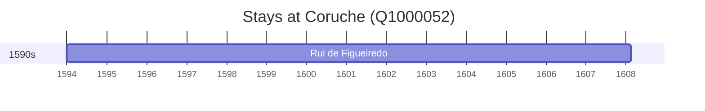

# Coruche (Q1000052)

*municipality of Portugal*

Wikidata: [Q1000052](https://www.wikidata.org/wiki/Q1000052)

1 occurrence(s) across 1 transcribed value(s), 1 person(s).

**Transcribed variants:**

- `Coruche, diocese de Évora` (1×, 1594–1594)

| Date | Variant | Person | Type | Entity id | Real entity |
|------|---------|--------|------|-----------|-------------|
| 1594 | Coruche, diocese de Évora | Rui de Figueiredo | nascimento | [deh-rui-de-figueiredo](deh-rui-de-figueiredo) | — |

