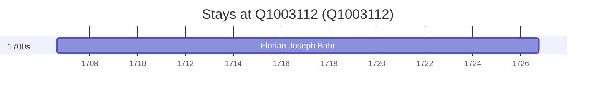

# Q1003112

*(fetch error: HTTP Error 429: Too Many Requests)*

Wikidata: [Q1003112](https://www.wikidata.org/wiki/Q1003112)

1 occurrence(s) across 1 transcribed value(s), 1 person(s).

**Transcribed variants:**

- `Falkenberg, Silésia` (1×, 1706–1706)

| Date | Variant | Person | Type | Entity id | Real entity |
|------|---------|--------|------|-----------|-------------|
| 1706-08-14 | Falkenberg, Silésia | Florian Joseph Bahr | nascimento | [deh-florian-joseph-bahr](deh-florian-joseph-bahr) | — |

