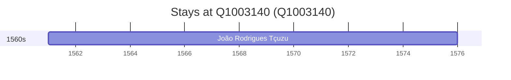

# Q1003140

*(fetch error: HTTP Error 429: Too Many Requests)*

Wikidata: [Q1003140](https://www.wikidata.org/wiki/Q1003140)

1 occurrence(s) across 1 transcribed value(s), 1 person(s).

**Transcribed variants:**

- `Sernancelhe, diocese de Lamego` (1×, 1561–1561)

| Date | Variant | Person | Type | Entity id | Real entity |
|------|---------|--------|------|-----------|-------------|
| 1561 | Sernancelhe, diocese de Lamego | João Rodrigues Tçuzu | nascimento | [deh-joao-rodrigues-tcuzu](deh-joao-rodrigues-tcuzu) | — |

