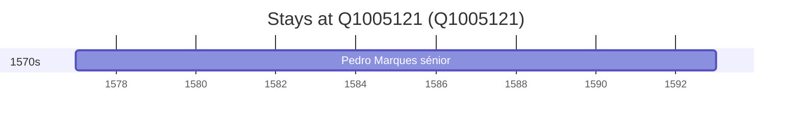

# Q1005121

*(fetch error: HTTP Error 429: Too Many Requests)*

Wikidata: [Q1005121](https://www.wikidata.org/wiki/Q1005121)

1 occurrence(s) across 1 transcribed value(s), 1 person(s).

**Transcribed variants:**

- `Mourão, diocese de Évora` (1×, 1577–1577)

| Date | Variant | Person | Type | Entity id | Real entity |
|------|---------|--------|------|-----------|-------------|
| 1577 | Mourão, diocese de Évora | Pedro Marques, sénior | nascimento | [deh-pedro-marques-senior](deh-pedro-marques-senior) | — |

