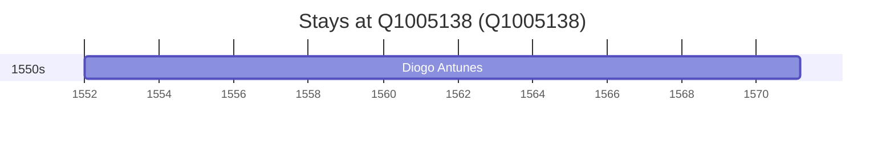

# Q1005138

*(fetch error: HTTP Error 429: Too Many Requests)*

Wikidata: [Q1005138](https://www.wikidata.org/wiki/Q1005138)

1 occurrence(s) across 1 transcribed value(s), 1 person(s).

**Transcribed variants:**

- `Crato` (1×, 1552–1552)

| Date | Variant | Person | Type | Entity id | Real entity |
|------|---------|--------|------|-----------|-------------|
| 1552 | Crato | Diogo Antunes | nascimento | [deh-diogo-antunes](deh-diogo-antunes) | — |

