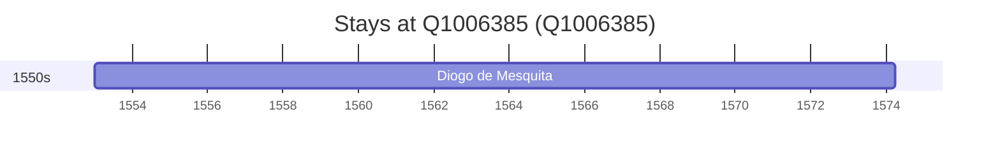

# Q1006385

*(fetch error: HTTP Error 429: Too Many Requests)*

Wikidata: [Q1006385](https://www.wikidata.org/wiki/Q1006385)

1 occurrence(s) across 1 transcribed value(s), 1 person(s).

**Transcribed variants:**

- `Mesão Frio, diocese do Porto` (1×, 1553–1553)

| Date | Variant | Person | Type | Entity id | Real entity |
|------|---------|--------|------|-----------|-------------|
| 1553 | Mesão Frio, diocese do Porto | Diogo de Mesquita | nascimento | [deh-diogo-de-mesquita](deh-diogo-de-mesquita) | — |

