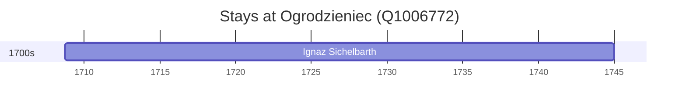

# Ogrodzieniec (Q1006772)

*city in the Lesser Poland part of the Silesian Voivodeship, Poland*

Wikidata: [Q1006772](https://www.wikidata.org/wiki/Q1006772)

1 occurrence(s) across 1 transcribed value(s), 1 person(s).

**Transcribed variants:**

- `Neudeck, Boémia` (1×, 1708–1708)

| Date | Variant | Person | Type | Entity id | Real entity |
|------|---------|--------|------|-----------|-------------|
| 1708-09-26 | Neudeck, Boémia | Ignaz Sichelbarth | nascimento | [deh-ignaz-sichelbarth](deh-ignaz-sichelbarth) | — |

