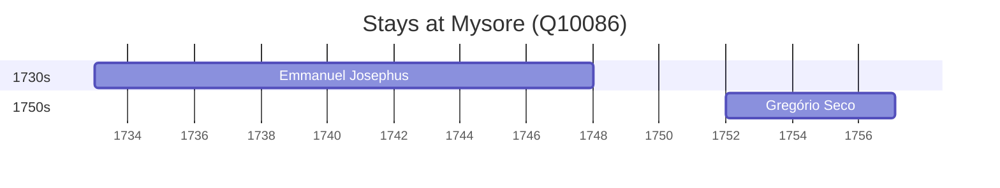

# Mysore (Q10086)

*city in the state of Karnataka, India*

Wikidata: [Q10086](https://www.wikidata.org/wiki/Q10086)

7 occurrence(s) across 2 transcribed value(s), 6 person(s).

**Transcribed variants:**

- `Mysore` (5×, 1733–1754)
- `Mysure` (2×, undated)

| Date | Variant | Person | Type | Entity id | Real entity |
|------|---------|--------|------|-----------|-------------|
| — | Mysure | Francesco Leonardo Cinamo | estadia | [deh-francesco-leonardo-cinamo](deh-francesco-leonardo-cinamo) | — |
| — | Mysore | Giacinto Serra | estadia | [deh-giacinto-serra](deh-giacinto-serra) | — |
| — | Mysore | Manuel Rodrigues | estadia | [deh-manuel-rodrigues-ii](deh-manuel-rodrigues-ii) | — |
| — | Mysure | Simão Martins | estadia | [deh-simao-martins](deh-simao-martins) | — |
| 1733 | Mysore | Emmanuel Josephus | estadia | [deh-manuel-jose-ref2](deh-manuel-jose-ref2) | — |
| 1752 | Mysore | Gregório Seco | estadia | [deh-gregorio-seco](deh-gregorio-seco) | — |
| 1754 | Mysore | Gregório Seco | estadia | [deh-gregorio-seco](deh-gregorio-seco) | — |

