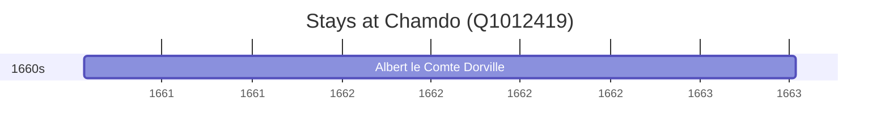

# Chamdo (Q1012419)

*prefecture-level city in Tibet Autonomous Region of China*

Wikidata: [Q1012419](https://www.wikidata.org/wiki/Q1012419)

1 occurrence(s) across 1 transcribed value(s), 1 person(s).

**Transcribed variants:**

- `Chamo` (1×, undated)

| Date | Variant | Person | Type | Entity id | Real entity |
|------|---------|--------|------|-----------|-------------|
| >1661-04-13 | Chamo | Albert le Comte Dorville | estadia | [deh-albert-le-comte-dorville](deh-albert-le-comte-dorville) | — |

