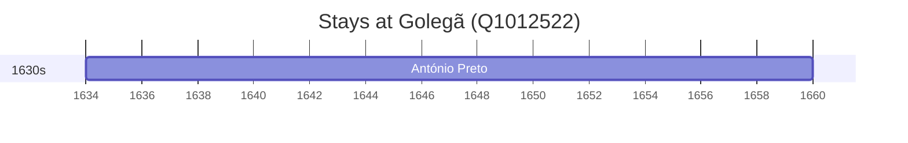

# Golegã (Q1012522)

*municipality of Portugal*

Wikidata: [Q1012522](https://www.wikidata.org/wiki/Q1012522)

1 occurrence(s) across 1 transcribed value(s), 1 person(s).

**Transcribed variants:**

- `Golegã` (1×, 1634–1634)

| Date | Variant | Person | Type | Entity id | Real entity |
|------|---------|--------|------|-----------|-------------|
| 1634 | Golegã | António Preto | nascimento | [deh-antonio-preto](deh-antonio-preto) | — |

