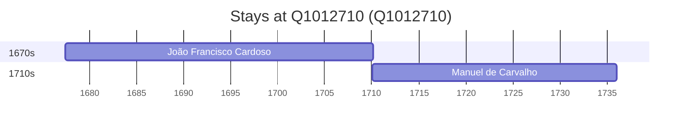

# Q1012710

*(fetch error: HTTP Error 429: Too Many Requests)*

Wikidata: [Q1012710](https://www.wikidata.org/wiki/Q1012710)

2 occurrence(s) across 1 transcribed value(s), 2 person(s).

**Transcribed variants:**

- `Porto de Mós, diocese de Leiria` (2×, 1677–1710)

| Date | Variant | Person | Type | Entity id | Real entity |
|------|---------|--------|------|-----------|-------------|
| 1677-06-13 | Porto de Mós, diocese de Leiria | João Francisco Cardoso | nascimento | [deh-joao-francisco-cardoso](deh-joao-francisco-cardoso) | — |
| 1710-01-14 | Porto de Mós, diocese de Leiria | Manuel de Carvalho | nascimento | [deh-manuel-de-carvalho](deh-manuel-de-carvalho) | — |

### Co-presence

These persons were plausibly at this place during overlapping periods (interval estimation from stay dates; rough — see method note below).

| Period | Persons |
|--------|---------|
| 1710s | [João Francisco Cardoso](deh-joao-francisco-cardoso), [Manuel de Carvalho](deh-manuel-de-carvalho) |

*1 overlapping pair(s) involving 2 person(s). Method: interval start = stay event date; end = next embarque/partida/different-place event, or death, or +15yr cap.*

