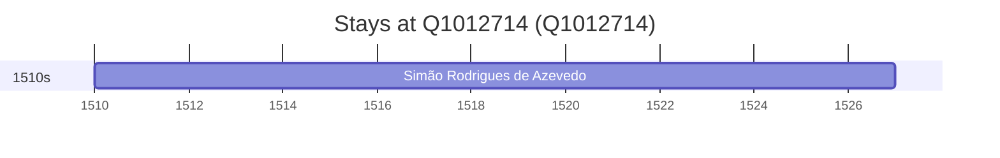

# Q1012714

*(fetch error: HTTP Error 429: Too Many Requests)*

Wikidata: [Q1012714](https://www.wikidata.org/wiki/Q1012714)

1 occurrence(s) across 1 transcribed value(s), 1 person(s).

**Transcribed variants:**

- `Vouzela, diocese de Viseu` (1×, 1510–1510)

| Date | Variant | Person | Type | Entity id | Real entity |
|------|---------|--------|------|-----------|-------------|
| 1510 | Vouzela, diocese de Viseu | Simão Rodrigues de Azevedo | nascimento | [deh-simao-rodrigues-de-azevedo](deh-simao-rodrigues-de-azevedo) | — |

